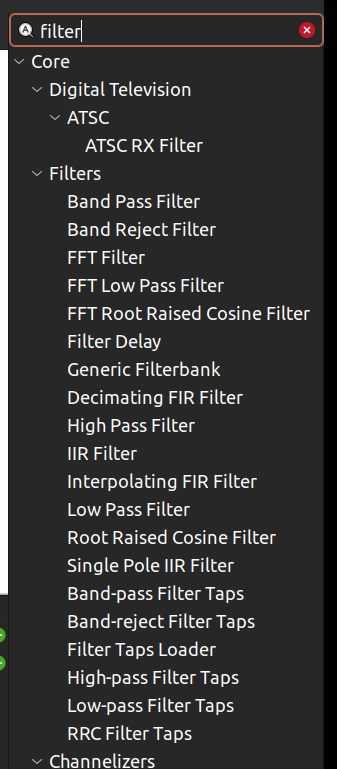
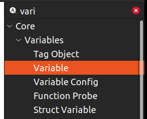
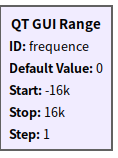
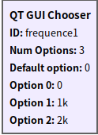
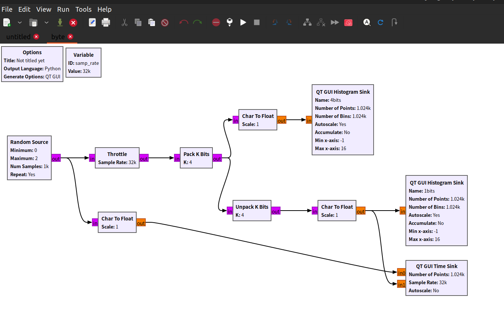
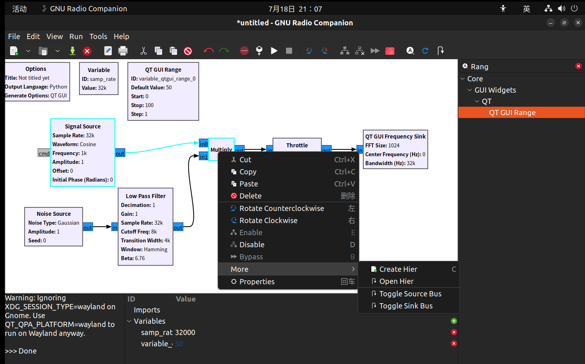
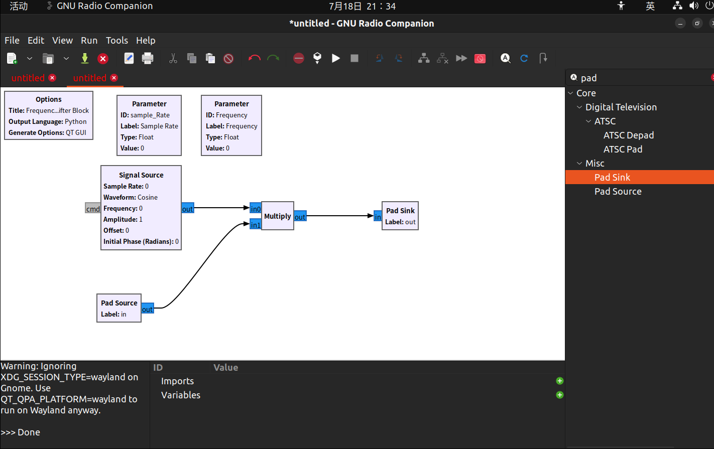
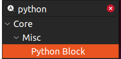
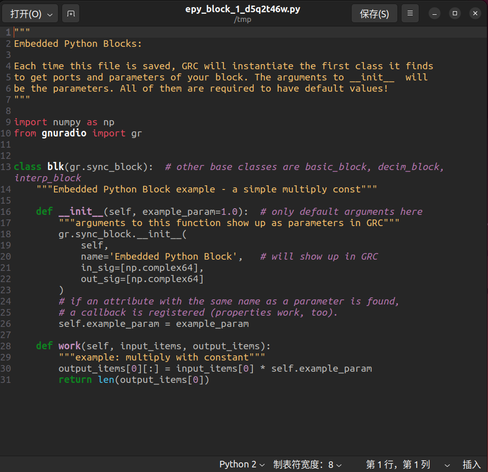
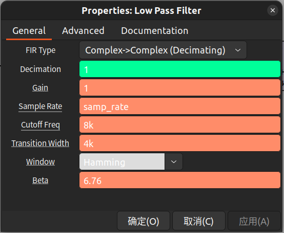

# GNU radio Companion入门

### 下载

### 绘制框图

按下ctrl+f或者点击，就可以在软件右边的资源栏里搜索我们需要的模块了

例如搜索滤波器filter

将需要的模块拖入白色的面板中，这里的操作和simulink是差不多的

然后点击我们创建好的模块，就可以修改其参数，点击各模块的接口也可以将这些模块输入输出口连接起来

### 变量使用

每个框图中的参数可以设置为变量

代表变量的组件是Variable

QT GUI Range是一个滑动的变量条

QT GUI Chooser是一个可选择的变量，设定选项，就可以在生成的代码中进行数据选择了

### 比特的打包与解包

打包使用Pack K Bits组件

需要设置字节数，接收方需要根据包的字节大小选择接收的数据类型，4bits对应char型和float型，8bits对应int型，16bits对应double型

解包使用Unpack K Bits组件

### 流和向量

流stream表示标量数据，

向量vector表示单个时间内的一个数组

将流打包为向量stream to vector

将向量解析为流vector to stream

多个流转化为单个向量/多个向量

多个向量转化为单个流/多个流

### 基于层创建自己的块

可以将几个块包装为一个层（就是如果几个块组合实现了一个概念，就可以将这些块打包为一个盒子）

选中需要的几个块，如何右键->more->create Hier

建立新的块后，可以通过Options中修改命名，然后就能在资源栏中搜索到

如果这些块在建立新块前使用了变量，那么需要重新创建新的变量，然后替换掉先前使用的变量

缺少的输入口可以使用pad sink模块替代

缺少的输出口可以使用pad source模块替代

所有步骤做完，且没有报错后，就可以点击将新块保存到自己指定的一个文件夹了

保存完后gnuradio会自动将这个块加入资源库中，点击刷新后，就可以在搜索栏中找到我们创建的块了

### 创建python块

拖入python块

点开python块后，会弹出一份python代码

python的默认内容有两个函数

$__$init$__$和work函数，输入输出变量都是使用数组来表示的

$__$init$__$中

name指的是模块名称，in_sig规定有几个输入变量，out_sig规定有几个输出变量

work函数中

写入对输入变量的处理代码

然后返回输出变量

所有步骤做完，且没有报错后，就可以点击将新块保存到自己指定的一个文件夹了
保存完后gnuradio会自动将这个块加入资源库中，点击刷新后，就可以在搜索栏中找到我们创建的块了

### python块的消息传递

消息是在块之间发送信息的异步方式。消息善于传递控制数据，在块之间保持一致状态，并向流程图中的块提供某种形式的非数据反馈

消息的属性

* 没有以采样时钟为保证的消息何时到达
* 消息不像 tag 那样，与特定的采样相关
* 消息的输入输出端口不必被连接在GRC中消息端口使用多态类型(PMT)
* 消息端口在gnuradio中用灰色表示，其连接用虚线区分

主要是用于块与块之间的联系，例如：某个块收到1000个数据后就会发送一个消息给发送数据的块，发送数据的块可以在收到这个消息时做出一些行为，比如停止发送

使用python代码的message

### gnu radio中的标签

message是用来在块之间同步信息的，和采样时钟没有关系

gnu radio中的tag可以在时间轴上对采样数据打标签，方便下游获取打tag时的时间戳和附属信息

### 滤波器

低通滤波器：允许低频信号输入，减弱/减少高于截止频率的信号，理想低通滤波器能完全剔除高于截止频率的信号

高通滤波器

带通滤波器

以低通滤波器为例子，搜索

### ZMQ块

| SINK | SOURCE | 特征                                         |
| ---- | ------ | -------------------------------------------- |
| PUB  | SUB    | 广播，1对多                                  |
| PUSH | PULL   | 点播，点对点对等网络                         |
| REQ  | REP    | 点对点链路，一个请求一个回复，类似客户服务端 |
