# Matlab基本知识

## 界面


文件夹：当前打开的文件管理

命令行：运行代码的地方，就是终端

工作区：存放所有的变量

新建脚本或者打开已有的文件，打开编辑器才能编写代码


## 变量

### 命名规则


### 变量类型

#### 1.数字

```matlab
加+
减-
乘*
除/
```

#### 2.字符与字符串

```matlab
定义字符串
str = "hello"
输出字符串的ASCII码
abs(字符串)
输出ASCII对应的字符
char(ASCII码)
计算长度,空格也计入长度
length(字符串)
```

#### 3.矩阵

```matlab
定义矩阵使用方括号 []，行内元素用空格或逗号分隔，换行用分号 ;
A = [1  2  3  4;
     5  6  7  8;
     9 10 11 12;
     13 14 15 16];

定义特殊矩阵
全零矩阵
Z = zeros(m,n);(m行n列)
全一矩阵
O = ones(4,4);
单位矩阵
I = eye(4);
随机矩阵(范围是0~1开区间)
R = rand(4,4);
伪随机整数矩阵
R = randi（[min,max],m,n）
幻方（不管从哪个方向上相加和都相等的矩阵）
M = magic(4);（4阶幻方）

取元素
a = A(2,2);将A矩阵的第2行第2列的元素赋值给a
a2 = A(2,[1,2,3]);将A矩阵的第2行第1列、第2列、第3列的元素赋值给a，这样出来的a是一个1x3的矩阵
a3 = A(2,1：10);将A矩阵的第2行第1列到第10列的元素赋值给a，这样出来的a是一个1x10的矩阵
a4 = A(2,:);将A矩阵的第2行所有列的元素赋值给a，这样出来的a是一个1xn的矩阵
```

补充：rand函数的用法


#### 4.元胞数组

matlab中的数组的一种，类似于c语言中的结构体、c++中的对象

同一个数组中可以存储不同类型、不同大小的数据

```matlab
创建一个m*n的空元胞数组,所有元胞初始化为空 
C = cell(m, n);  
使用花括号 {} 定义元胞内容,创建一个 1x3 的元胞数组，包含数值、字符串和矩阵
C = {10, 'Hello', [1 2; 3 4]};
```

元胞数组有两种索引方式

() 索引：获取元胞的容器（返回的是元胞，内容仍需用 {} 访问）。

{} 索引：直接获取元胞的内容。

```matlab
C = {42, 'text', [1 2 3]};

% 获取第1个元胞的容器（类型是 cell）
cell_container = C(1);  % 返回 {42}

% 获取第1个元胞的内容（类型是 double）
content = C{1};         % 返回 42

% 获取第3个元胞中的矩阵的第2个元素
value = C{3}(2);        % 返回 2
```

#### 5.结构体

相当于python中的字典,有两种定义方式

通过点符号.直接赋值字段

```matlab
% 创建单个结构体
student.name = 'Alice';
student.age = 22;
student.grades = [85, 90, 78];
student.info = struct('id', 'S001', 'department', 'CS');

disp(student)
% 输出：
%     name: 'Alice'
%      age: 22
%   grades: [85 90 78]
%     info: [1×1 struct]
```

使用struct一次创建

```matlab
% 直接定义字段和值
teacher = struct(...
    'name', 'Bob', ...
    'courses', {'Math', 'Physics'}, ...  % 元胞数组存储多值
    'office', 'Room 301' ...
);
```

通过访问结构体中的元素

```matlab
% 创建 1×2 的结构体数组
patients(1).name = 'John';
patients(1).age = 35;
patients(1).test_results = [120, 80];

patients(2).name = 'Mary';
patients(2).age = 28;
patients(2).test_results = [115, 75];
% 获取第2个患者的姓名
name = patients(2).name;  % 'Mary'

% 获取所有患者的年龄
ages = [patients.age];    % [35, 28]

% 获取第1个患者的第2个检测结果
result = patients(1).test_results(2); % 80
```

### 矩阵操作

#### 矩阵构造

冒号运算符生成序列(等差数列)

```matlab
Row = 1:5;          % 生成 [1 2 3 4 5]
Col = 1:2:9;        % 生成 [1 3 5 7 9]（行向量）
Matrix = reshape(1:9, 3, 3).'; % 生成3×3矩阵
```

网格生成函数

```matlab
meshgrid
x = 1:3;
y = 1:2;
[X, Y] = meshgrid(x, y); 
% X = [1 2 3; 1 2 3], Y = [1 1 1; 2 2 2]
ndgrid高维扩展
[X, Y, Z] = ndgrid(1:2, 3:4, 5:6);
```

#### 矩阵四则运算

按照线性代数的规则进行

矩阵加减（+）

```matlab
C=A+B;
C=A-B;
```

* 矩阵加减可以加减常数
  ```
  C=A+2;
  ```

矩阵乘法（*）

```matlab
C = A * B；
```

逐元素乘法（.*）

```matlab
C = A .* B;
```

矩阵除法（\）

```matlab
C = A \ B；
```

逐元素除法（./）

```matlab
C = A ./ B；
```

矩阵幂（^）

```matlab
A_squared = A^2;
```

矩阵转置(')

```matlab
C=A';
```

转置（.'）：行列互换

```matlab
A_transpose = A.';
```

共轭转置（'）：转置并取复共轭

```matlab
A_conj_transpose = A'; 
```

逆矩阵inv

```matlab
A_inv = inv(A);
```

行列式

```matlab
det_A = det(A);
```

迹

```matlab
trace_A = trace(A); 
```

#### 矩阵下标

## 程序

### 打印数据

fprintf

```matlab
fprintf('hello,world');
```

### 注释

matlab中的注释使用符号%

```matlab
A=[1,2,3];%这是一个矩阵
```

### Matlab代码特性

不同的代码共享同一个工作区和命令窗口

如果脚本1中存在一个变量a=1，运行脚本1之后，脚本2中没有任何对a的定义，但是仍然可以对a进行操作，而且a的值就是1

为了避免这个问题，我们可以在每一份脚本前加上三个命令（如果需要在脚本之间传递变量，那么就没必要加了）

```matlab
clc;清空命令行窗口
clear;清空工作区的变量
close all;结束所有打开的程序、图表
```

### 循环结构

逻辑与流程控制主要就是四种结构


#### for循环

```matlab
基本格式
for 循环变量 = 初值;步长;终值
    执行语句1
    ...
    执行语句n
end
```

#### while循环

```matlab
while 循环条件
    执行语句1
    ...
    执行语句n
end
```

### break和continue

在matlab中的循环结构中，也存在break和continue的用法

### 分支结构

#### if语句

```matlab
if 条件语句1
	执行语句
end
```

### if...else..end语句

```matlab
if 条件语句
	执行语句
else
	执行语句
end
```

### switch

```matlab
switch 变量
	case 数值1
		语句1;
	...
	case 数值n-1
		语句n-1;
	otherwise
		语句体n;
end
```

### 函数

一个.m文件定义一份函数（函数名与文件名一致）

函数定义的.m文件中必须有这几个语句

```matlab
function [output1, output2, ...] = functionName(input1, input2, ...)
    % FUNCTIONNAME 这里是函数的简要说明
    %   这里是详细说明，解释函数的功能、输入输出参数的含义等。
  
    % 函数体：执行计算和操作的代码
  
    output1 = ... % 计算结果赋值给输出参数
    output2 = ...
    ...
end
```

* function:  **关键字** ，表明这是一个函数文件的开端。 **必须要有** 。
* [output1, output2, ...]:  **输出参数列表** ，用方括号 [] 括起来。如果只有一个输出，可以省略方括号（例如 function y = myFunc(x)）。如果没有输出，可以完全省略（例如 function myFunc(x)）或使用空的方括号（例如 function [] = myFunc(x)）。
* =: 连接输出和函数名。
* functionName:  **函数名称** 。必须是一个有效的 MATLAB 变量名（以字母开头，仅包含字母、数字和下划线）。
* (input1, input2, ...):  **输入参数列表** ，用圆括号 () 括起来。如果没有输入参数，也需要保留空括号（例如 function y = myFunc()）。

例子：

在add.m中写入一个加法函数

```matlab
function [y]=add(x1,x2)
    y=x1+x2
end
```

在另一份代码中（同一个文件夹目录下）调用函数

```matlab
clc;clear;close all;
A=add(1,2);
first=3;
second=4;
B=add(first,second);
```

## 绘图

### 二维平面绘图

参考python的matplotlib函数库使用

```matlab
figure   $创建一个幕布
plot(x,y)$x和y都是变量
其他的设定,如标题、行列标签都是和python一样的:
title(xxxx)
xlabel(xxx)
ylabel(xxx)

建立多条曲线
plotyy(x1,y1,x2,y2,'plot')
```

### 三维平面绘图

三维曲面图surf

```matlab
% 生成数据
[X, Y] = meshgrid(-2:0.1:2, -2:0.1:2);
Z = X .* exp(-X.^2 - Y.^2);  % 示例函数

% 绘制曲面图
figure;
surf(X, Y, Z);
title('3D Surface Plot');
xlabel('X');
ylabel('Y');
zlabel('Z');
colormap('jet');  % 设置颜色映射
colorbar;         % 显示颜色条
```

三维线图plot3

```matlab
% 生成螺旋线数据
t = 0:0.1:10*pi;
x = sin(t);
y = cos(t);
z = t;

% 绘制三维线图
figure;
plot3(x, y, z, 'r-', 'LineWidth', 2);
title('3D Line Plot (Helix)');
xlabel('X');
ylabel('Y');
zlabel('Z');
grid on;
```

三维散点图scatter3

```matlab
% 生成随机数据
rng(0);  % 固定随机种子
n = 100;
x = rand(n, 1);
y = rand(n, 1);
z = rand(n, 1);
color = z;  % 颜色与z值关联

% 绘制三维散点图
figure;
scatter3(x, y, z, 50, color, 'filled');
title('3D Scatter Plot');
xlabel('X');
ylabel('Y');
zlabel('Z');
colormap('parula');
colorbar;
```

等高线图：contour3(X, Y, Z, n）n为等高线条数

瀑布图：waterfall(X, Y, Z)

柱状图：bar3(Z)

极坐标三维图：使用 pol2cart 转换极坐标为笛卡尔坐标后绘图。

### Matlab的调试方法

需要调试时，在运行按钮的展开项中，打开“出现错误时暂停”
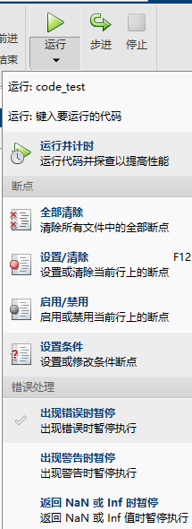

打断点的方式是直接点击代码行标，变红了就代表在这里打了一个断点
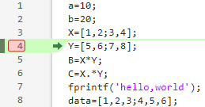

在断点处停下后，可以继续操作

* 步进：一行一行地往下执行，布进一次运行一条代码
* 步入：如果停止的那一行代码中使用了一个方法、函数，就会进入这个函数执行
* 步出：如果一个函数运行到了末尾，就跳转到主代码中进入函数的位置，继续向下运行


## 文件

### 文件结构


### 文件操作


# Simulink基本知识

Simulink是用于动态系统和嵌入式系统的多领域仿真和基于模型的设计工具。matlab中自带simulink这一工具。

Simulink 包含以下基本库：

1. 常用模块：Simulink模型的基本构建模块，例如**输入、输出、示波器、常数输出、加减运算、乘除运算**等。
2. 连续函数模块：主要用于控制系统的拉氏变换中，主要为 **积分环节** 、传递函数、抗饱和积分、延迟环节等。
3. 非连续函数模块：主要为死区、信号的一阶导数Rate Limiter模块、阶梯状输出模块Quantizer模块、约定信号的输出的上下界Saturation以及Relay环节等。
4. 离散模块：主要将拉氏变换后的传递函数经 Z 变换离散化，从而实现传递函数的离散化建模，离散化系统容易进行程序移植，因此广泛应用在各种控制器仿真设计中，具体的离散模块库包括 **延时Delay环节** 、导数Difference、离散零极点配置Discrete Zero-Pole，离散时间积分环节等。
5. 逻辑控制器：主要逻辑位运算，用得少。
6. 数学模块：主要为绝对值计算Abs、加减运算Add、放大缩小倍数运算Gain、乘除运算Product等。
7. 数据输出显示库：包含有输出端Out1、示波器Scope、数据显示Display等模块，方便用户查看。

简单的操作：

1. 放置模块：从库当中拖入、双击空白的地方搜索（熟悉一些常见的模块：integrator、delay、gain、sum、product、abs、add、subtract、constant、scope、display等）
2. 连线：拖箭头到另一个箭头引入的地方；把模块放入到连线中间；一根线中间可以右键引出线

simulink中提供了很多可以自定义的模块，可以根据需要嵌入代码、编写所需函数

## 显示

想要知道我们仿真路径的输出结果，可以通过连接out模块、示波器来进行

### 示波器

如果遇到数据显示不全的情况，就点一下扩展图标，将会显示整个图形
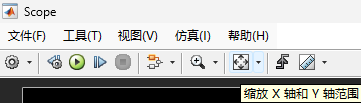
使用放大镜可以放大特定区域
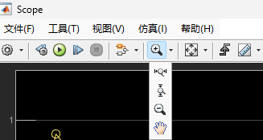
直尺可以显示准确地某一个点的值，可以通过输入某一点的坐标，显示准确值
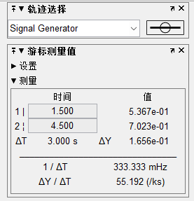

示波器中文件选项中可以修改输入端口数
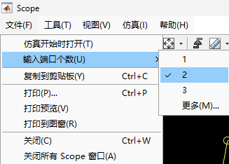
文件中还可以复制图像到剪贴板、写文章时需要图片特别有用
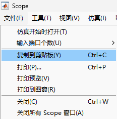

随后在视图→布局中可以修改每个输入量的显示布局
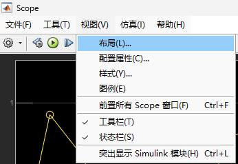

视图→配置属性中可以更改每个输入视图的基本属性，图例显示、x和y轴的范围限制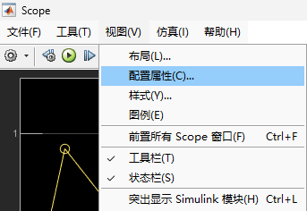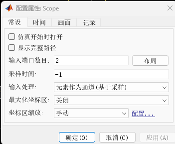

样式中可以修改颜色、背景这些
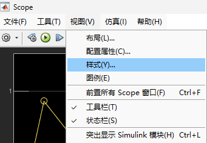
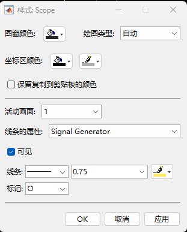

## 结合visio

在文件中将图像打印到新图窗口
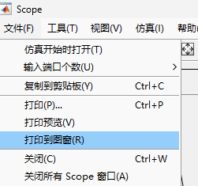

在新打开的图窗中再将图片文件另存为jpg、png等格式
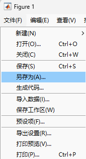

然后就可以在visio中打开进行编辑操作了
