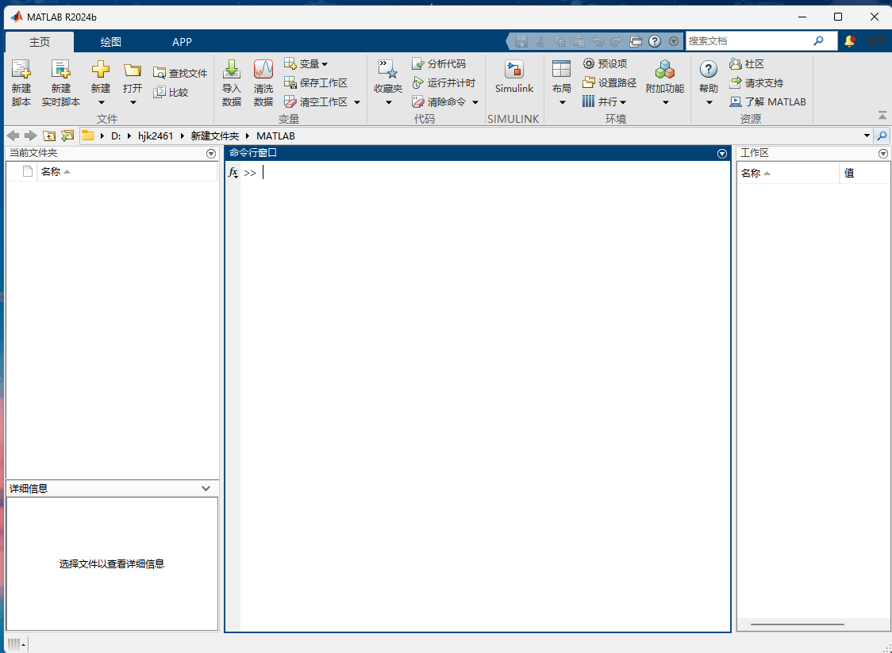
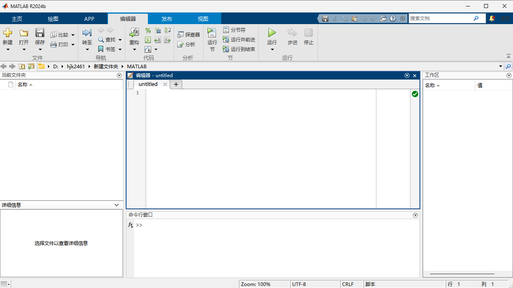
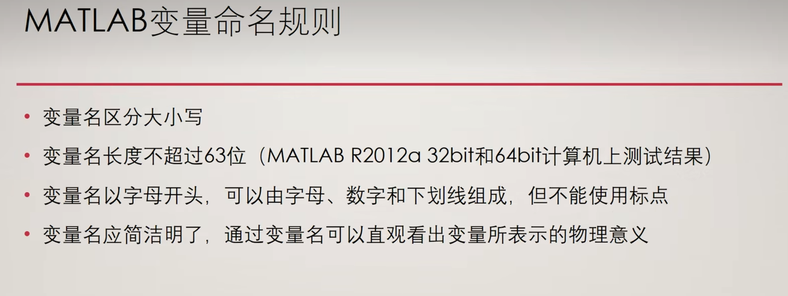
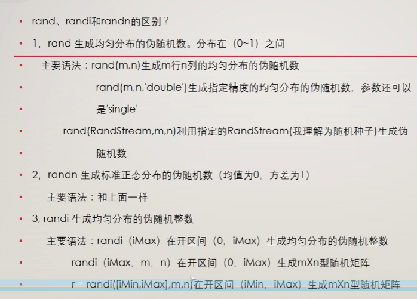
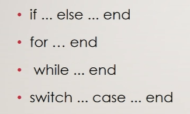

# 基本知识

## 界面



文件夹：当前打开的文件管理

命令行：运行代码的地方，就是终端

工作区：存放所有的变量

新建脚本或者打开已有的文件，打开编辑器才能编写代码



## 变量

### 命名规则



### 变量类型

#### 1.数字

```matlab
加+
减-
乘*
除/
```

#### 2.字符与字符串

```matlab
定义字符串
str = "hello"
输出字符串的ASCII码
abs(字符串)
输出ASCII对应的字符
char(ASCII码)
计算长度,空格也计入长度
length(字符串)
```

#### 3.矩阵

```matlab
定义矩阵使用方括号 []，行内元素用空格或逗号分隔，换行用分号 ;
A = [1  2  3  4;
     5  6  7  8;
     9 10 11 12;
     13 14 15 16];


定义特殊矩阵
全零矩阵
Z = zeros(m,n);(m行n列)
全一矩阵
O = ones(4,4);
单位矩阵
I = eye(4);
随机矩阵(范围是0~1开区间)
R = rand(4,4);
伪随机整数矩阵
R = randi（[min,max],m,n）
幻方（不管从哪个方向上相加和都相等的矩阵）
M = magic(4);（4阶幻方）
```

补充：rand函数的用法



#### 4.元胞数组

matlab中的数组的一种，类似于c语言中的结构体、c++中的对象

同一个数组中可以存储不同类型、不同大小的数据

```matlab
创建一个m*n的空元胞数组,所有元胞初始化为空 
C = cell(m, n);  
使用花括号 {} 定义元胞内容,创建一个 1x3 的元胞数组，包含数值、字符串和矩阵
C = {10, 'Hello', [1 2; 3 4]};
```

元胞数组有两种索引方式

() 索引：获取元胞的容器（返回的是元胞，内容仍需用 {} 访问）。

{} 索引：直接获取元胞的内容。

```matlab
C = {42, 'text', [1 2 3]};

% 获取第1个元胞的容器（类型是 cell）
cell_container = C(1);  % 返回 {42}

% 获取第1个元胞的内容（类型是 double）
content = C{1};         % 返回 42

% 获取第3个元胞中的矩阵的第2个元素
value = C{3}(2);        % 返回 2
```

#### 5.结构体

相当于python中的字典,有两种定义方式

通过点符号.直接赋值字段

```matlab
% 创建单个结构体
student.name = 'Alice';
student.age = 22;
student.grades = [85, 90, 78];
student.info = struct('id', 'S001', 'department', 'CS');

disp(student)
% 输出：
%     name: 'Alice'
%      age: 22
%   grades: [85 90 78]
%     info: [1×1 struct]
```

使用struct一次创建

```matlab
% 直接定义字段和值
teacher = struct(...
    'name', 'Bob', ...
    'courses', {'Math', 'Physics'}, ...  % 元胞数组存储多值
    'office', 'Room 301' ...
);
```

通过访问结构体中的元素

```matlab
% 创建 1×2 的结构体数组
patients(1).name = 'John';
patients(1).age = 35;
patients(1).test_results = [120, 80];

patients(2).name = 'Mary';
patients(2).age = 28;
patients(2).test_results = [115, 75];
% 获取第2个患者的姓名
name = patients(2).name;  % 'Mary'

% 获取所有患者的年龄
ages = [patients.age];    % [35, 28]

% 获取第1个患者的第2个检测结果
result = patients(1).test_results(2); % 80
```

### 矩阵操作

#### 矩阵构造

冒号运算符生成序列(等差数列)

```matlab
Row = 1:5;          % 生成 [1 2 3 4 5]
Col = 1:2:9;        % 生成 [1 3 5 7 9]（行向量）
Matrix = reshape(1:9, 3, 3).'; % 生成3×3矩阵
```

网格生成函数

```matlab
meshgrid
x = 1:3;
y = 1:2;
[X, Y] = meshgrid(x, y); 
% X = [1 2 3; 1 2 3], Y = [1 1 1; 2 2 2]
ndgrid高维扩展
[X, Y, Z] = ndgrid(1:2, 3:4, 5:6);
```

#### 矩阵四则运算

按照线性代数的规则进行

矩阵乘法（*）

```matlab
C = A * B；
```

逐元素乘法（.*）

```matlab
C = A .* B;
```

矩阵除法（\）

```matlab
C = A \ B；
```

逐元素除法（./）

```matlab
C = A ./ B；
```

矩阵幂（^）

```matlab
A_squared = A^2;
```

转置（.'）：行列互换

```matlab
A_transpose = A.';
```

共轭转置（'）：转置并取复共轭

```matlab
A_conj_transpose = A'; 
```

逆矩阵inv

```matlab
A_inv = inv(A);
```

行列式

```matlab
det_A = det(A);
```

迹

```matlab
trace_A = trace(A); 
```

#### 矩阵下标

## 程序结构

逻辑与流程控制主要就是四种结构



### 循环结构

#### for循环

```matlab
基本格式
for 循环变量 = 初值;步长;终值
    执行语句1
    ...
    执行语句n
end
```

#### while循环

```matlab
while 循环条件
    执行语句1
    ...
    执行语句n
end
```

### 分支结构

#### if语句

```matlab
if 条件语句1
	执行语句
end
```

### if...else..end语句

```matlab
if 条件语句
	执行语句
else
	执行语句
end
```

### switch

```matlab
switch 变量
	case 数值1
		语句1;
	...
	case 数值n-1
		语句n-1;
	otherwise
		语句体n;
end
```

## 绘图

### 二维平面绘图

参考python的matplotlib函数库使用

```matlab
figure   $创建一个幕布
plot(x,y)$x和y都是变量
其他的设定,如标题、行列标签都是和python一样的:
title(xxxx)
xlabel(xxx)
ylabel(xxx)

建立多条曲线
plotyy(x1,y1,x2,y2,'plot')
```

### 三维平面绘图

三维曲面图surf

```matlab
% 生成数据
[X, Y] = meshgrid(-2:0.1:2, -2:0.1:2);
Z = X .* exp(-X.^2 - Y.^2);  % 示例函数

% 绘制曲面图
figure;
surf(X, Y, Z);
title('3D Surface Plot');
xlabel('X');
ylabel('Y');
zlabel('Z');
colormap('jet');  % 设置颜色映射
colorbar;         % 显示颜色条
```

三维线图plot3

```matlab
% 生成螺旋线数据
t = 0:0.1:10*pi;
x = sin(t);
y = cos(t);
z = t;

% 绘制三维线图
figure;
plot3(x, y, z, 'r-', 'LineWidth', 2);
title('3D Line Plot (Helix)');
xlabel('X');
ylabel('Y');
zlabel('Z');
grid on;
```

三维散点图scatter3

```matlab
% 生成随机数据
rng(0);  % 固定随机种子
n = 100;
x = rand(n, 1);
y = rand(n, 1);
z = rand(n, 1);
color = z;  % 颜色与z值关联

% 绘制三维散点图
figure;
scatter3(x, y, z, 50, color, 'filled');
title('3D Scatter Plot');
xlabel('X');
ylabel('Y');
zlabel('Z');
colormap('parula');
colorbar;
```

等高线图：contour3(X, Y, Z, n）n为等高线条数

瀑布图：waterfall(X, Y, Z)

柱状图：bar3(Z)

极坐标三维图：使用 pol2cart 转换极坐标为笛卡尔坐标后绘图。
