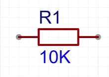
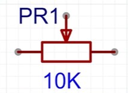
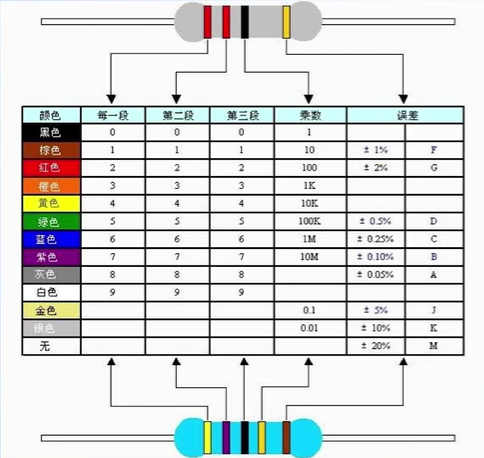
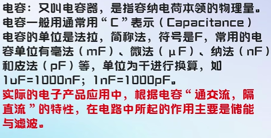
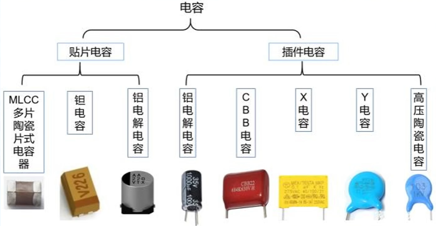
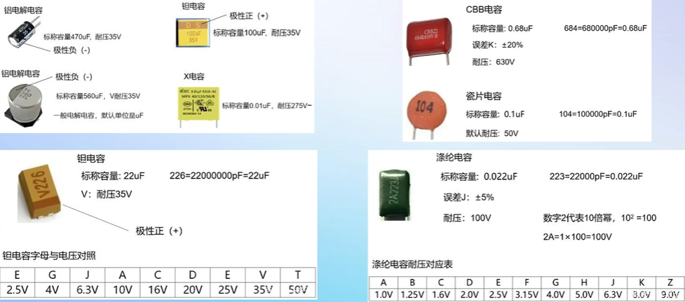
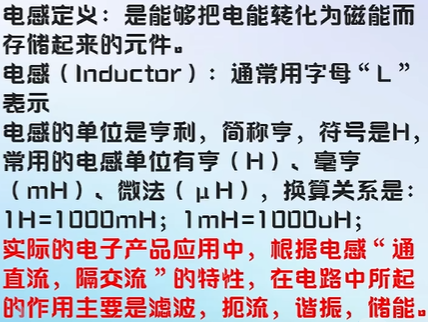
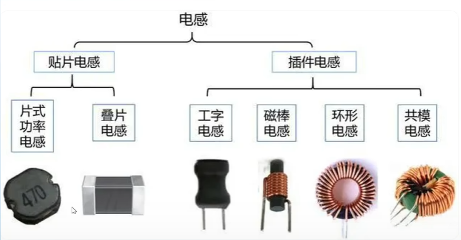
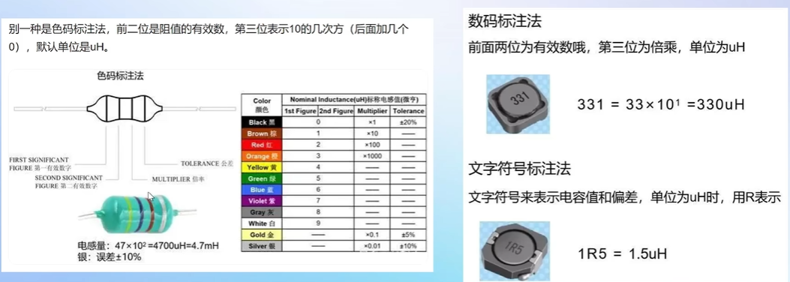

# 入门

## 电路分析基础

PCB设计中电路图就是原理图，原理图四要素：元件符号、连接线、结点、注释

### 基本元器件

#### 电阻：*u=Ri*

普通电阻

可变电阻（滑动变阻器）

封装方式有插件、贴片，不同封装的额定功率不同

电阻色环读数方法：平常使用的色环电阻可以分为四环和五环，通常用四环。其中四环电阻前二环为数字，第三环表示阻值倍乘的数，最后一环为误差；五环电阻前三环为数字，第四环表示阻值倍乘的数，最后一环为误差。误差通常也是金、银和棕三种颜色，金的误差为 5%，银的误差为 10%，棕色的误差为 1%，无色的误差为 20%，另外偶尔还有以绿色代表误差的，绿色的误差为 0.5%。

贴片电阻读数方法：

3位读数，前两位为有效数字，第三位表示10的幂次，精度为正负5%

4位读数，前三位为有效数字，第四位表示10的幂次，精度为正负1%

阻值小于10的电阻会在两个数之间插入字母R表示小数点

#### 电容：$u=\frac {1}{C} $ $\int i \,dx$

封装也是分贴片和插件

不同封装的性能不同，瓷片电容用的比较多

#### 电感：$u=L $ $\frac {di}{dt} \,$

封装分贴片和插件

读值方法

#### 二极管

#### 三极管

#### 场效应管

## PCB设计基础

# 强化

## 立创EDA软件

# 大师
