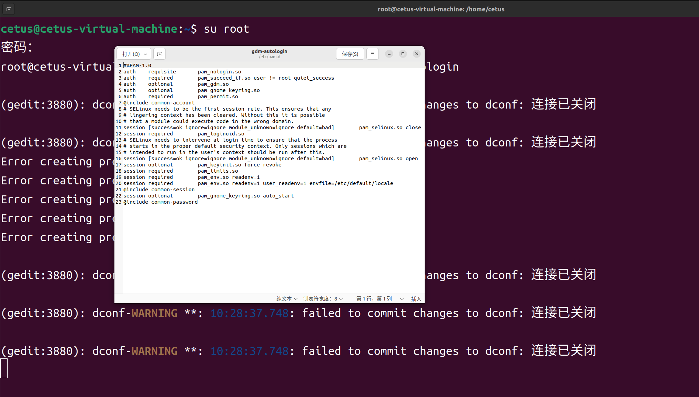
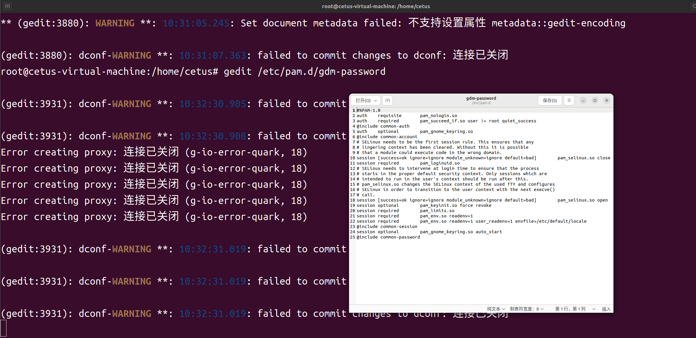
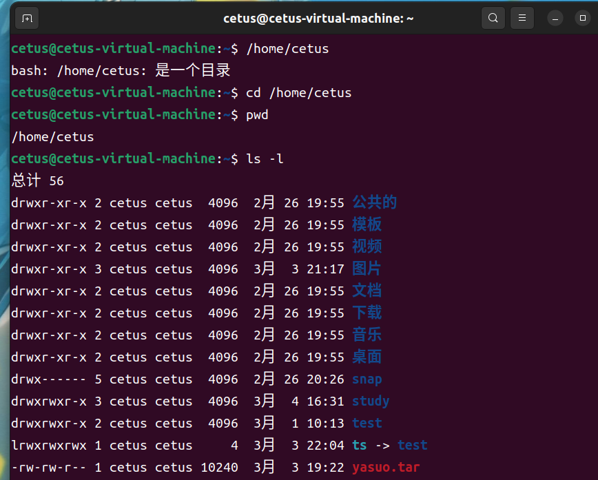
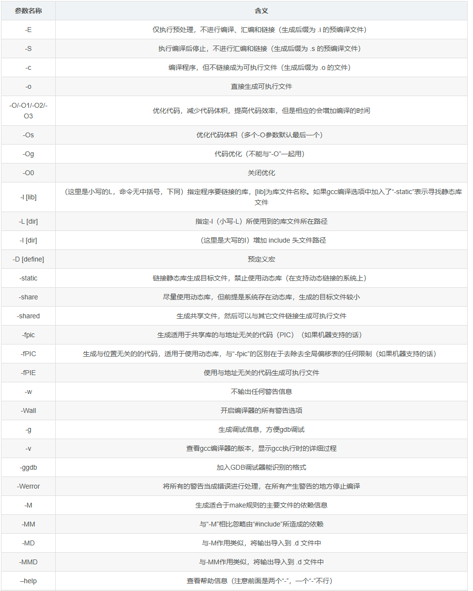

# VMware虚拟机操作

## 启动和关机

在vmware中选中安装的虚拟机，然后正常启动就行

关闭ubuntu：

1.系统内关机

linux中右上角有电源按钮，点power off就行

2.强制关机

vmware边框操作中的电源键，关闭就是强制关机（类似于直接拔电源，不推荐）

## 挂起和恢复

点vmware中的电源键，下面会有一个挂起选项，vmware会将这个系统冻结，各种状态都保存起来，之后在使用，再点继续允许就行

## 修改运行参数

在vmware中先关机后修改配置文件就行，记住一定要先关机

在linux系统中右下角同样会有一排状态栏显示硬件状态

## 全屏显示

同样在vmware边框里有全屏显示，点一下就会进入全屏模式，移动鼠标到上方就会自动显示常用的命令栏

## 快照和系统恢复

系统玩崩了，在虚拟机中可以重装系统，也可以使用系统快照

### 系统快照

在工具栏中有快照功能，相对于游戏里的存档功能，可以为系统记录一个还原点

快照文件比较大（一个就有几个g），不要存太多

# Linux系统初步认识

## 桌面

类似于安卓系统，上方是电源、音量、日期时间这些

右上角活动可以看到目前运行的程序有哪些

Linux主要是用于服务器环境，很多软件都用不到

## 收藏夹

收藏夹就是边栏中类似windows任务栏一样的地方，常用程序可以放在这里：文件管理器、命令行终端、文本编辑器

## 文件系统

Linux系统使用统一的目录树结构，没有windows系统的c盘，d盘这样的地方，而是类似于安卓系统中的子目录分级，在主目录—其他位置—计算机，就可以看到系统的所有文件,home

是根目录

windows中的文件路径：C:\桌面\123.txt

Linux中的文件格式：/home/用户名/123.txt

## 用户目录

在home目录下就会存在一个用户目录，每个用户都会有一个目录，和windows系统是一样的


存在一个特例，超级用户root用户，在根目录下会有一个root文件，这个文件正常情况是没有权限打开的，root用户是没有限制的，可以任意操作任意文件和目录

## 创建目录和文件

在/home/用户名/下右键创建，打开文本编辑器，按ctrl+s或者直接点保存就可以保存了，和windows是一样的操作，Linux中的文件不需要加后缀名，系统会自动识别文件类型

## Linux下的常用命令

### 文件列表ls

查看当前目录的所有文件，输入ls会自动列出当前目录下的所有文件

ls也可以指定打开目录，这要在ls后空格加上文件路径就行了

”ls / “就是打开根目录的文件

-l是详细信息

```shell
ls -l /home/目录
ls -a 显示所有文件，a是all的意思，以.开头的文件为隐藏文件
```

### 切换目录

pwd查看当前目录，可以得到当前的目录地址

cd切换目录，cd是切换到主目录（用户目录），如果和苦闷加空格和具体地址，就可以切换到具体地址

```
几个特殊的目录
cd ~ 切换到主目录
cd ~/example 切换到主目录下的example
cd ../www 切换到上级目录,再到www子目录
一般来说
..就代表上级目录
.代表当前目录
~就代表用户主目录
```

### 目录操作

#### mkdir创建目录

全称make directory

-p参数,用于创建不存在的中间目录

#### 删除目录

rmdir删除目录,只能删除空目录

rm删除文件或目录 -rf参数强制删除,并且子项目一并删除

**使用rm -rf时一定要小心,不要把重要文件删了**

#### 复制文件

cp复制文件或目录

参数-rf，递归复制，会将该目录下的子文件、子目录一同复制

```
cp -rf 被复制文件名 新复制的文件名 
```

如果新目录已经存在了,那么会将被复制文件的子内容合并到指定文件内

#### 移动目录

mv移动目录

```
mv 被移动目录 移动到的目录
```

对文件来说rm/cp/mv这三个命令都是通用的

#### 归档压缩（tar包使用）

##### 归档

tar档案打包(tape achive),将文件打包

参数cvf

c 表示create创建档案

v 表示verbose显示详情

f 表示file

```
创建档案包 
tar -cvf 档案包名.tar 文件1 文件2 文件3 ...
```

打包之后原文件不会消失,使用tar -cvf只是归档并没有压缩,所以文件还是很大,并没有缩小

##### 还原

参数xvf

x代表还原

```
tar -xvf -C 路径
```

参数-C 表示解压到指定目录

##### 归档并压缩

参数-zcvf

```
tar -zcvf 档案包名.tar.gz 文件1 文件2 文件3 ...
```

##### 解压缩

参数-xzvf

```
tar -xzvf 档案包名.tar.gz -C 路径
```

#### 软链接

软链接就是linux中的快捷方式,本质是其实是指针

使用ln指令来创建链接,添加-s参数来创建软链接,

```
ln -s 原文件 链接名称
```

特点

1.删除软连接,对源文件无影响

2.删除源文件后,软链接无效

除了软链接,还有硬链接

### 用户管理

命令sudo,使用管理员身份执行

#### 添加用户useradd

```
sudo useradd -m 用户名
```

#### 修改用户密码passwd

```
sudo passwd 用户名
```

在终端输入密码时,linux是不会显示密码输入的

新用户第一次进入linux都是需要几分钟进行初始化

#### 删除用户userdel

```
sudo userdel 用户名
上面这条命令不会删除用户目录
加上-r参数会连同用户目录也一并删除
sudo userdel -r 用户名
```

在登录用户时,默认是不以root用户登录的

在linux系统下,只有特殊的用户才能使用管理员权限,在linux中能执行sudo命令的用户叫sudoer

#### 切换用户su

使用su命令切换用户,switch user

#### 超级用户(root用户)

类似于windows下的administrator用户

切换到root用户可以获得所有权限

首次使用root用户时,需要设置密码

```
sudo passwd root
```

切换超级用户

```
su root
```

使用完了之后，输入exit命令退出

使用su root切换为超级用户之后，只是对当前的终端里有效s

#### 用户组

可以通过组来对多个用户进行管理

```
创建组
groupadd 组名

创建用户的同时将其添加进一个组
useradd -m -g 组名 用户名

修改现有的用户到组
usermod -g 组名 用户名

查看用户和组
cat /etc/group
cat /etc/passwd
```

cat是一个常用命令,用于查看一个文件

一般用不到用户组这个东西

默认地,在创建一个用户时,系统会默认的为它创建一个同名的组,这个组里只有它一个人

#### 以root权限登录

默认是不允许使用root用户登录的，需要进行一些额外的设置操作，才能直接以root用户登录，

第一步

```
运行配置命令,打开系统配置
gedit /etc/pam.d/gdm-autologin
```



找到"auto required pam_succeed_if.so user != root quiet_success"这一行,在前面加上#注释掉这行配置

第二步

```
输入命令
gedit /etc/pam.d/gdm-password
```



同样地,在"auth required pam_succeed_if.so user != root quiet_success"前加上#注释掉代码

重启系统之后可以在登录界面,选"未列出"选项,手动输入root用户名和密码就可以以root用户登录了

### 文件权限

#### 文件权限

```
-owner 文件拥有者
-r 只读
-w 可写
-x 可执行
```

ls -l会显示文件作者和权限



```
第一个字符表示文件类型
d表示文件夹
l表示软连接
-表示文件
后续九个字符都表示权限,分为三组:自己|同组|别人
r w x | r - x | r - x
```

#### 修改文件权限

o是other别人，a是所有人，u是用户自己

添加权限chmod 用户+权限 文件名

```
chmod o/a/u+r/w/x 123.txt
chmod o/a/u-r/w/x 123.txt
```

其他写法

```
省略
chmod + r/w/x 123.txt
chmod - r/w/x 123.txt
```

#### 修改文件属主

修改拥有者chown(即change owner),只有文件拥有者和root用户才能修改

参数-R表示递归,如果有子目录,则一并修改

```
chown -R 用户名 文件
chown -R cetus 123.txt
```

# 变量

## 系统变量

shell脚本很麻烦,而且只能在linux中使用,不建议学习,学python就行

### shell中的变量

shell可以定义变量

```
定义变量
变量名=value  等号左右两边不要多加空格
使用变量 ${变量名}
```

### 环境变量

定义环境变量

```
export OUTDIR=/opt/
```

显示环境变量

```
echo ${OUTDIR}
```

查看所有环境变量

```
printenv
```

在命令行中定义的环境变量只对当前的对话有效，关闭终端会让环境变量消失

### 用户环境变量

用户在终端定义的环境变量都是定义在profile中的,profile文件一般位于用户目录下

使用命令行打开profile文件

```
gedit命令用于打开文件
gefit .profile
```

添加环境变量直接添加在profile文件最下方就行了

环境变量添加格式

```
export 变量=路径
```

保存好之后,需要注销一下才能生效

实际上每次打开终端,都会将profile中的变量都添加到运行环境里

每个用户设置的变量都只对当前用户起作用,比如用户a设置了一个变量path,那么用户ua每次使用都可以使用这个变量,但是用户b就用不了

### 系统环境变量

系统环境变量就是对所有用户都会生效的变量

系统配置文件都是在/etc/profile中的,系统环境变量也在其中

profile文件只有root用户可以修改

```
su root
gedit /etc/profile
```

官方推荐的自定义配置方法是在/etc/profile.d/这个文件夹里添加一些shell脚本配置文件

使用gedit就可以添加脚本了,文件名怎么写都行,但是必须以.sh结尾

```
gedit /etc/profile.d/myprofile.sh
```

### PATH环境变量

PATH是最常用的环境变量,当执行程序的时候系统会从PATH变量下先搜索有无需要执行的程序

系统默认会从以下目录搜索可执行程序

```
/urs/bin
/urs/sbin
/urs/local/bin
/urs/local/sbin
```

bin是所有用户都可以执行的程序,bin是只有root用户才能执行的程序

修改PATH变量

在自定义的环境变量文件里修改就可以了

```
export PATH=$PATH:路径
```

$PATH的意思是把PATH重新取出来,重定义

# 网络

## VMware虚拟机网络

虚拟机中也是可以上网,正常虚拟机的火狐浏览器都是可以用的(如果外部环境可以上网的话)

### 前置准备

#### 1.虚拟网络编辑器

在编辑菜单中找到，可以找到子网地址

#### 2.检查虚拟网卡

.控制面板->网络共享中心->更改适配器设置,一般会看到VMnet1和VMnet2

#### 3.检查虚拟机设置

选择NAT类型


### 虚拟机联网

ubuntu系统设置->网络设置,一般默认都是已连接

检查是否可以联网,使用命令ping加任意一个网址

```
ping www.baidu.com
```

如果一个包都没有收到,那么就是不可以连接外网

### 与宿主机互联

需要知道虚拟机和宿主机的地址

虚拟机和宿主机的关系就是手机和家庭路由器的关系

### 手动配置网络

ifconfig调出所有网卡状态

```
ifconfig
开启网络(xxx是网口名字,类似于ens10)
sudo ifconfig xxx up
禁用网络
sudo ifconfig xxx down
```

## 服务器

### FTP服务器搭建

把文件从虚拟机拷贝到宿主机上,可以通过u盘物理传递,也可以通过网络协议进行传输

需要使用一些服务器软件

#### 一.使用apt下载vsftpd

```
apt install vsftpd
```

安装后会自动启动服务,也就是自动搭建好了一个服务器
通过以下命令查看vsftpd进程

```
sudo netstat -anop | grep vsftpd
```

#### 二.配置ftp

打开配置文件,配置文件在/etc目录下
文件路径是/etc/vsftpd/vsftpd.conf
使用vim编辑配置文件

```
vim /etc/vsftpd.conf
```

会看到很多的配置文件

初步配置需要找到传输文件的权限

```
找到
anon_mkdir_write_enable=YES(文件创建和读写权限)
anon_upload_enable=YES(文件上传权限)
这两行的注释去掉
```

在最后三行文件前空出一些位置,创建一个根目录

```
anon_root=文件l
```

#### .启停服务

```
启动服务器
sudo service vsftpd start
停止服务器
sudo service vsftpd stop
重启服务器
sudo service vsftpd restart
重新加载配置文件
sudo service vsftpd reload
服务状态查看
sudo service vsftpd status
```

### SSH服务器

先下载官方提供的ssh安装包,ssh是客户端,sshd是服务端

```
apt install sshd
启动服务器
service sshd start
配置文件位置
/etc/ssh/sshd.conf
```

### Tomcat服务器

Tomcat的版本选择和java的jdk版本有关

在官网中下载tar.gz包

解压缩

```
tar -zxvf apache-tomcat-9.0.102.tar.gz
```

启动服务

```
tomcat/bin/start.sh
```

控制脚本

目录中还有一个名为catalina.sh的文件,只要加上参数就和startup.sh、shutdown.sh这两个脚本效果一样

```
启动服务器
tomcat/bin/catalina.sh start
关闭服务器
tomcat/bin/catalina.sh stop
前台运行tomcat(用于调试)
tomcat/bin/catalina.sh run
```

实际上startup.sh、shutdown.sh内部都是调用了catalina.sh这个脚本-

#### 检查服务器状态

1.进程查询

```
ps -ef|grep java
```

能够看待tomcat的进程号

2.查看端口

```
netstat -anp|grep 端口号
```

连接外界时应该关闭防火墙

#### 访问网站

```
http://网络地址:端口号
```

关闭tomcat

```
tomcat/bin/shutup.sh
```

#### 配置tomcat

```
配置文件位置
/tomcat/conf/server.xml

vim /tomcat/conf/server.xml
```

打开后进行一些配置操作

1.修改端口号,一般网站服务都是用80端口

```
<Connector port="8080" protocol="HTTP/1.1"
               connectionTimeout="20000"
               redirectPort="8443"
               maxParameterCount="1000"
将8080改为80
```

2.修改服务器目录为网站存放的目录

```
<Host name="localhost"  appBase="webapps"
            unpackWARs="true" autoDeploy="true">
找到host这几行代码,将appbase后面的内容改为网站存放的位置
<Host name="localhost"  appBase="opt/www/ROOT"
            unpackWARs="true" autoDeploy="true">
```

3.重启tomcat服务器

先关闭再启动

#### 启动日志

检查是否修改或者启动成功,可以查看tomcat的启动日志

```
cat tomcat/logs/Catalina.out
```

### Redis服务器

### MySQL服务器

# 代码

## 脚本

### 可执行脚本

脚本script,一种解释执行的程序

Linux有三种常见的脚本

```
shell脚本 *.sh

perl脚本 *.pl

Python脚本 *.py
```

脚本从本质上是一个文本文件

1.它是一个文本文件

2.它具有可执行权限

执行脚本./

```
./脚本文件
```

所有脚本都有对应的解释器

```
shell解释器位置/bin/sh
perl脚本解释器:bin/perl
python脚本解释器:/bin/python3
```

执行脚本时以下两种方式等价

```
/bin/python3 hello.py
./hello.py
```

### shell脚本

shell脚本是按shell语法写出来的脚本,是linux自带的脚本语言

类似于windows系统下的dos批处理文件

默认创建的shell脚本是没有执行权限的，需要手动添加-x权限

第一个shell程序

使用记事本编辑内容

```
#!/bin/sh
echo "hello,wolrd"
echo "bye"
```

保存后,在终端中添加x权限

执行程序

使用./或者详细的路径都是可以执行的

```
./文件名
或
/home/cetus/123.sh
```

执行时一定要加路径,不加路径是无法执行的

要点:

1.shell脚本中,第一行都是#!/bin/sh

也就是井号#感叹号!再加上对应脚本类型的解释器位置

### python脚本

编辑一个python脚本

第一行写上解释器路径,其他就是按照python的语法写

运行前添加一个x权限，就可执行了

### gcc编译

使用gcc可以编译c语言脚本

```Linux
安装命令
sudo apt install build-essential
版本查看
gcc --version
```

g++是特定的gcc组件，用来编译c++语言

```
sudo apt install g++
```

基本语法

```
gcc [options] [filenames]

```



一般编译指令

```
gcc hello.c -o hello
./hello
```

直接生成可执行文件hello.out

out后缀的文件是linux系统特有的文件类型,类似于windows下的bat和exe文件

## 调试程序

### GDB调试c/c++程序

安装

```
apt install gdb
```

#### 调试指令

```
加载文件开始调试
gdb 文件名.out

查看源码
(gdb)l

加断点
(gdb)b 行数或函数名
例:
(gdb)b 10
(gdb)b main

删除断点
删除特定地方断点
(gdb)delete 行数/函数名
(gdb)clear 行数/函数名
删除所有断点
(gdb)d all

程序运行
r 表示调试的程序开始运行
(gdb)r

打印值
(gdb)p 地址/$变量名/$寄存器
从变量地址开始打印
(gdb)x /nfu ptr
ptr是打印开始的地址,bfu是参数,参数列表如下:
    f表示显示方式, 可取如下值
    x 按十六进制格式显示变量。
    d 按十进制格式显示变量。
    u 按十进制格式显示无符号整型。
    o 按八进制格式显示变量。
    t 按二进制格式显示变量。
    a 按十六进制格式显示变量。
    i 指令地址格式
    c 按字符格式显示变量。
    f 按浮点数格式显示变量。

    u表示一个地址单元的长度
    b表示单字节，
    h表示双字节，
    w表示四字节，
    g表示八字节

调试
 n表示过程调试, 到下一步.不管子过程如何都不进入.直接一次跳过
(gdb)n
s表示单步调试,遇到子函数,会进入函数内部调试.
(gdb)s
ni和s效果相同
(gdb)ni
```

#### 查看指令

```
layout加入tui模式，查看反汇编、寄存器信息
（gdb）layout
在tui模式使用以下指令
（gdb）layout asm（显示反汇编窗口）
（gdb）layout split（分屏显示源代码和汇编）
（gdb）regs（显示寄存器）
（gdb）refresh（刷新屏幕）

```

### EDB软件

安装

## 文本编辑器vi

vi/vim是终端中的文本编辑器

在服务器环境中无法使用gedit编辑文件,只能使用vim进行编辑

```
打开编辑文件
vim 文件名
切换模式
编辑模式:i键
命令模式:esc键
退出编辑:在命令模式下
:wq保存退出
:q!强制退出
:q退出(不保存)
```

### vi/vim其他用法

vim效率太低,不值得深入学习

编辑文本可以直接在windows上编辑然后传到linux上就行

## 文本文件上传

使用服务器传输文件,传输文件后别忘了添加x权限

不同系统换行符不同

windows:\r\n

linux:\n

在编辑python和shell文件时需要注意转换文本

## JAVA

### 安装java

检测安装

```
java
javac(检测java的jdk)
```

java有多个版本,openjdk是免费的,选择第8版本,之后的版本都是收费的

```
安装
sudo apt install openjdk-8-jre-headless
sudo apt install openjdk-8-jdk-headless
```

### java环境配置

java是存放在/usr/bin下的，不需要额外设置PATH

如果存放在看自定义位置，这需要添加path

```
export PATH $PATH:文件路径
```

### 运行程序

windows下调试好，传到linux中

代码运行

```
java -jar 文件名.jar
```

如果代码运行不成功，可能是权限不足或者服务器的设置有问题

可以直接运行jar包，也可以通过shell脚本运行jar包

使用run_java.sh模板

# 进程

程序program:是一个可执行的文件实体

进程process:操作系统内部运行程序时,用来描述和控制它的记录

进程号PID是随机的

多次打开同一个程序会创建多个进程

## 查看进程

列出所有进程

```
ps -ef
```

搜索并列出所有有关xxx的进程

```
ps -ef | grep xxx
```

|是管道,意味着同时运行两条命令

查看端口对应的进程

```
netstat -anp|grep 端口号
```

## 进程管理

top命令打开Linux中的任务管理器

```
top
```

退出top界面.按q或ctrl+c

根据PID查看特定进程

```
top -p pid
```

kill强制结束进程

```
kill -9 pid
```

## 前台进程和后台进程

前台运行:终端可以看到运行状态,输出在当前终端

后台运行:无控制台,看不到输出,只能通过一些命令间接观测，无法用ctrl+c杀死

父进程、子进程

前台运行父进程关闭，子进程也会被关闭

后台运行父进程关闭，子进程不会被关闭

总结进程管理命令

```
ps -ef
ps -ef | grep xxx
top
top -p pid
kill -9 pid
ctrl+c中止当前进程
```

# 技巧

## 命令行技巧

### 自动补全

在终端中输入命令行时,使用tab可以自动补全命令

### 查看输入历史

使用↑↓键可以调用输入的历史命令,↑就是上一条命令,↓就是下一行命令

### 粘贴

VMware可以实现windows和虚拟机的沟通,在windows中复制的内容也是可以在虚拟机中粘贴的

### ctrl+c中断操作

### 安装命令

使用软件包管理器apt,安装软件需要管理员权限

```
下载软件
apt install 软件包名称 
搜索软件
apt search 软件包名称 

apt 
```
