# 基本认识

## unity介绍与安装

unity有不同的版本，做开发的话尽量使用同一个版本

以下各种操作使用的都是2019.4.39版本

安装unity需要安装一个unity hub，用于版本管理，hub里能够下载各种不同的版本，也能管理不同工程文件

[unity官方文档](https://docs.unity.cn/cn/tuanjiemanual/Manual/)

## unity界面

### 窗口布局

布局是可以修改的，通过使用预设，或者拖拽自定义窗口然后保存预设

布局修改可以在工具栏window中找到

虽然可以使用中文界面，但是一般建议使用英文界面

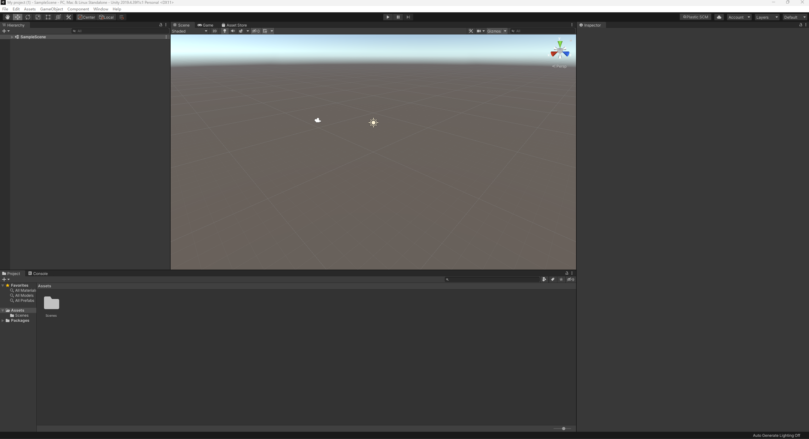

最上面是基本的菜单栏和工具栏


hierarchy层级窗口

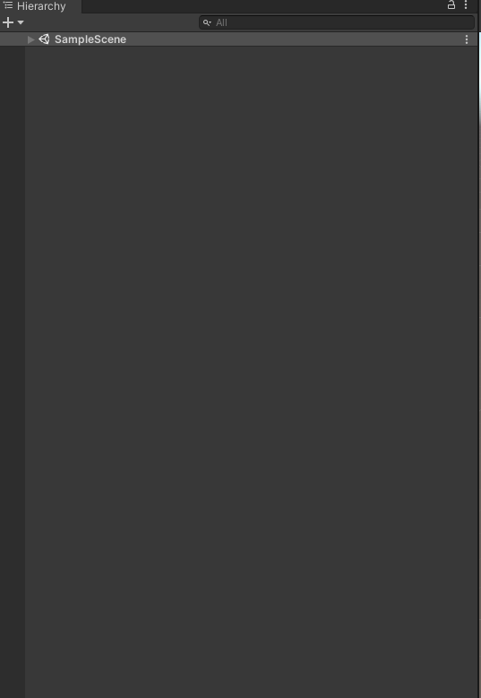

scene场景窗口

game游戏播放窗口

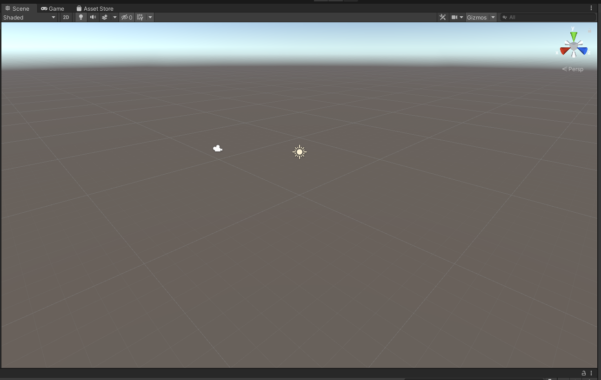

inspector检查器窗口，属性窗口

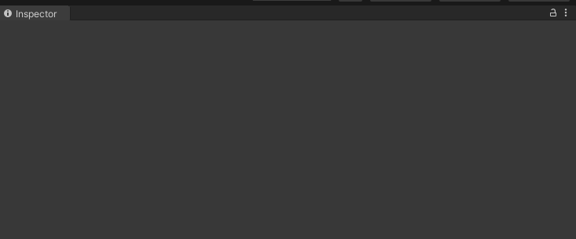

project项目窗口

console控制台窗口

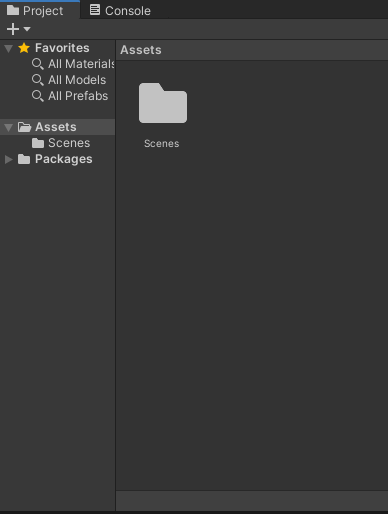

project项目窗口下的文件都是资源文件，常见的资源文件：模型文件.fbx 图片文件.jpg/png/psd/tif 音频文件.mp3/wav/aiff 脚本文件.cs 材质文件.mat 场景文件.unity

右键show in Explorer，就可以在资源管理器里打开文件了（资源管理器中可能还存在.meta文件，这是unity自己的一类文件，记录了资源文件信息）

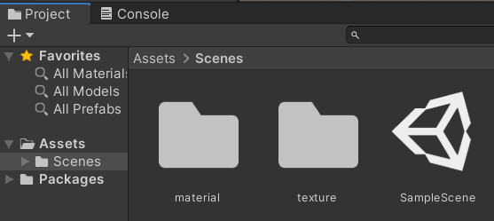

复制可以用ctrl+d也可以使用ctrl+c、ctrl+v

选中需要的文件，右键export package就可以实现打包，导出一个资源包文件

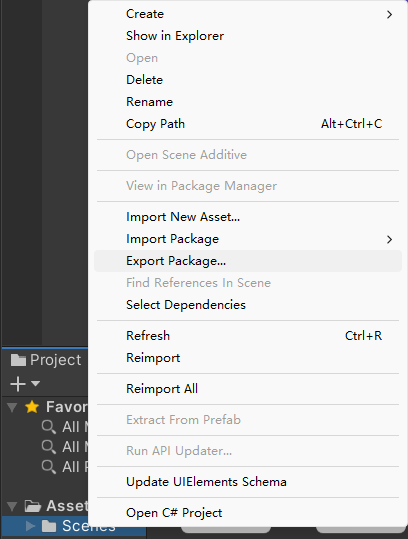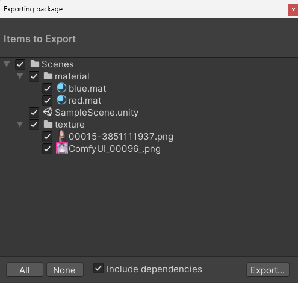

可以选择要不要将依赖的文件一块打包

其他人想要使用这些资源文件，就只需要将资源包拖入unity就行

### 场景

创建项目后unity会默认创建一个场景，含有基本的摄像头和光源

场景文件是存放所有已经使用的资源文件

一个场景其实就是一个关卡，可以创建多个场景

### 游戏物体

也叫game project

在hierarchy右键，3D|Cube，就可以添加一个立方体

选中物体后

在hierarchy中可以使用右键，rename重命名（中英文都可以）、delete删除物体

inspector中右很多的组件，transform组件可以观察到物体的坐标

拖动三轴可以让物体在三个坐标轴方向上移动

### 3D视图

#### 导航器Gizmo

表示世界坐标方向

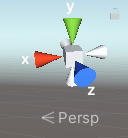

#### 栅格Grid

表示XZ坐标平面

地面上灰色的格子就是栅格

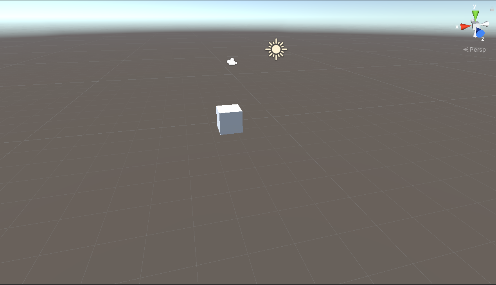

在scene界面中右栅格的调整选项，调整透明度和显示坐标平面

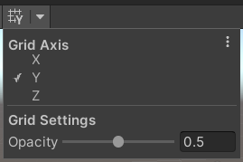

#### 天空盒Skybox

表示游戏世界的背景

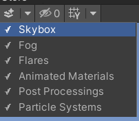

## 坐标系

unity中使用的是左手系

物体坐标由（x，y，z）进行定义

点击最上方工具栏旁边的local/global就可以切换到对应的坐标系

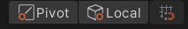

世界坐标系global：Y轴代表上下，X/Z轴代表东西南北

本地坐标系local：Y轴代表上下，X/Z代表前后左右

y轴up

z轴forward

x轴right

## 视野中心

视野中心也就是旋转时围绕的点

使用中键点击物体，视野中心会自动移动到该物体

或者点击物体，然后按f键

添加新物体时，物体会被放在视野中心

## 透视与正交

透视视图：近大远小

正交视图：没有近大远小效果，物体该有多大就是多大

使用正交视图，切换顶视图、右视图、前视图，就可以在每个方向上对齐物体、进行物体的布局，这样可以减少误差

除了对齐会用到正交，其他时候都是使用透视视图

在scene中可以看到广角设置，默认是60度，这个值越大，近大远小的效果会越明显，透视扭曲会越明显

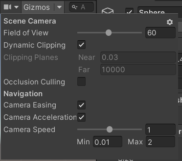

## unity中自带的基本模型

Cube 立方体

Sphere 球体

Capsuke 胶囊体

Cylinder 圆柱体

Plane 平面（平面是没有厚度的，正面可见，背面不可见的模型）

unity中一块栅格的边长就是一个单位长度，unity约定一个单位长度就是1米

unity不是专业建模软件，一般是在其他软件建好模，然后导入到unity进行使用

## 网格

Mesh网格，存储了模型的形状

模型内部都是中空，外面的那层壳就是Mesh网格

Mesh中记录了面、面的法向、顶点坐标

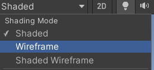

scene中可以切换网格的查看方式

面数越多越精细，渲染所需的GPU要求越高

## 材质

材质就是物体面上渲染的图形

在project项目窗口中，可以新建材质资源

右键create中选择material就行

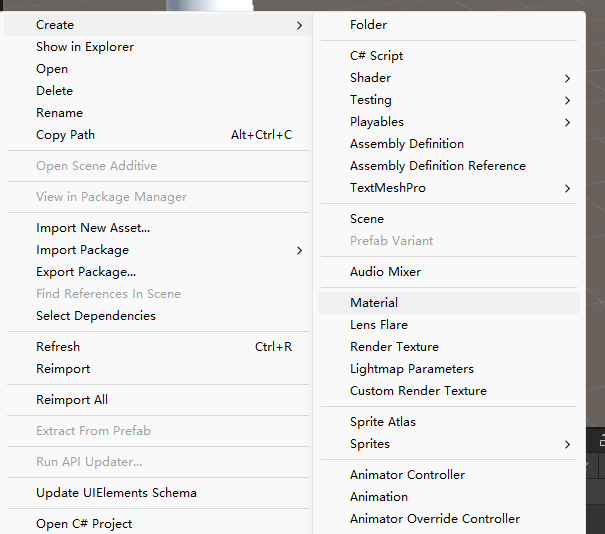

选择材质资源，然后inspector中就可以看到很多组件，包括了颜色、光影、色泽等等

将配置好的材质文件拖动到对应的物体上就可以应用材质（应用材质后inspector中Mesh Renderer组件的Meterials字段会发生改变）

直接将材质文件拖动到inspector中Mesh Renderer组件的Meterials也是可以的

添加物体时，会有一个默认材质

## 纹理

纹理Texture，也叫贴图，用一张图定义物体的表面颜色

纹理应该是建模师完成的工作，也是在建模软件中完成的

## 轴心

轴心是一个物体的操作基准点，就是物体坐标所在的点

默认物体的轴心点都在它们的几何中心

移动缩放的时候都是围绕这个点进行，建模软件中可以修改这个点，unity里修改不了

在最上方的工具栏里可以切换center几何中心/pivot轴心


一般使用轴心模式就够用了

## 父子关系

在Hierarchy界面里，将一个物体拖到另一个物体的下方

就能构成父子关系

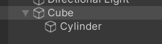

当移动、旋转、删除时，子物体会跟随父物体一起变化

**所有子物体的坐标都是相对坐标**，坐标参数是相对于父物体而言的

## 空物体

右键菜单中create empty就可以创建一个空物体

其实就是创建一个点，

* 空物体会用来管理节点和组织节点（作父节点使用）
* 标记空间位置

## 组件

组件在inspector中可以看到，每个组件代表一个功能

transform就是控制物体位置

Mesh Renderer就是对控制物体的材质

Mesh Filter能加载网格数据

组件是可以添加的，需要什么功能就添加什么功能


删除组件就是在菜单中选择remove conponent

### AudioSource组件

添加组件Audio/Audio Source

将音乐添加到组件的AudioClip就可以

点击scene中的按钮就可以播放音乐

### Transform组件


所有物体都会有这个组件，包括空物体，是不能被删除的

Position位置

Rotation角度

Scale缩放

## 摄像机

Hierachy中的一个对象


用来显示玩家视角

摄像机z轴方向的视角，就是拍摄的视角，game窗口的视角就是摄像机的视角

摄像机调制方法

1.手动调制

2.与3D视图对齐，在3D视图里摆好位置，然后执行Align with View，此选项在菜单栏GameObject中找到

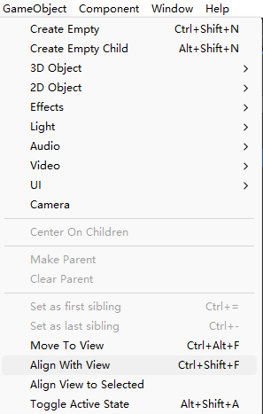

# 基本操作

## 3D视图

旋转：ALT+鼠标右键

缩放视图：鼠标滚轮\ALT+鼠标左键

平移视图：鼠标中键

导航器相关操作

按shift点击导航器中间小方块，恢复方向；点Y轴，顶视图；点X轴，右视图；点Z轴，前视图

## 物体的移动

选中移动工具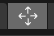

* 沿坐标轴移动，直接拖拽三个方向上的坐标轴
* 在坐标平面内移动，按住物体内的三个面拖动，按住哪个面，哪一个面就是锁定的

transform中可以重置物体的位置

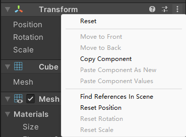

### 旋转和缩放

transform中rotation指的是旋转角度，可以直接修改值来实现旋转

选择旋转工具，物体上会出现旋转的方向，拖动就可以旋转

按下ctrl实现增量旋转，旋转会有参考

选择缩放工具，物体xyz三个方向上都会出现方向轴，拖动每个方向，就可以实现每个方向上的伸缩变换

拖动、移动、选择、缩放分别对应（Q\W\E\R）

### 轴心与坐标系切换

### 多选

按住ctrl或者shift键

鼠标拉框

### 复制（克隆）

ctrl+d实现克隆，新克隆的物体会重叠，使用移动功能拉开

### 聚焦

按f键、双击物体、中建点击物体度可以实现（就是将视野中心移动到需要的物体上）

### 隐藏/激活Active

在inspector中将

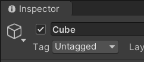

### 对齐

直接改坐标就可以

## 外部模型FBX的使用

一般就是创建一个模型的文件目录

然后将需要的fbx文件（包含网格、材质、贴图Texture），拖到文件夹中，就可以使用了

拖到层级串口中，创建物体，如果贴图与模型在同一个文件夹下，是能够自动识别出来的

### 材质替换

fbx模型中，材质可能是只读的，没法进行修改，对模型文件进行选择，在Materials/Element 0中选择材质，然后材质的inspector界面进行修改，也就是Remap这一栏，选择需要修改的材质，然后Revert再Apply应用一下就行

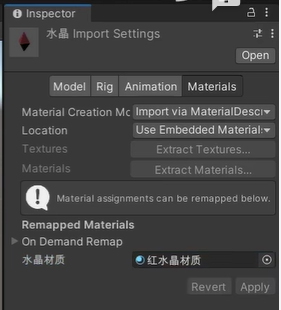

### 外部材质

在材质中的Location选项中，打开use external materials legacy

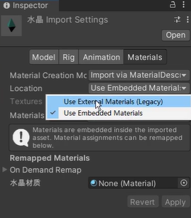

然后模型文件目录下就会生成一个material文件，直接修改里面的材质文件就可以

### 分解重组

将fbx里的网格mesh文件拖入场景，就可以像修改unity内置文件一样，修改模型材质了

## 运动

# 脚本Script

unity的脚本类名需要与c#文件名一致

## 挂载脚本

选择需要的物体，然后添加scripts组件，选择脚本

或者直接拖动脚本文件到物体

脚本添加到物体后，就点击运行图标，就会执行脚本

## 脚本编程基本思路

找到物体，inspector中点击脚本组件，就可以使用编辑器打开脚本

打印当前物体的坐标和名字代码

```c#
void Start()
    {
        Debug.Log("Hello, World!");

        GameObject cube = this.gameObject;
        string name = cube.name;
        Debug.Log("**物体的名称: " + name);

        Transform cubeTransform = this.transform;
        Vector3 position = cubeTransform.position;
        Debug.Log("**物体的位置: " + position.ToString("F4"));
    }
```

## 物体坐标

transform.position 世界坐标

transform.localPosition 本地坐标

因为坐标是一个三维向量,所以需要使用vector3来存储

```c#
Vector3 position = cubeTransform.position;
```

设置物体坐标

```c#
this.transform.localPosition=new Vector(xf,yf,zf)
```

## 编辑\播放模式

正常情况下,能对物体进行各种修改,也就是编辑模式

打开播放按钮,就会进入播放模式,播放模式也是可以进行一些调整,但是操作会是临时的,只要重新进入编辑模式,就会归位

游戏运行时,不可以保存游戏

## 帧更新

Frame帧更新

FrameRate帧率/刷新率

FPS 每秒更新多少帧

c#脚本中存在一个帧更新函数void Update()

将代码写在update函数内，能够让游戏运行时每一帧都执行这些代码

Time.time能够得到游戏时间

Time.deltaTime得到距上次更新的时间

帧率不固定的，unity会尽量快地更新

在初始化函数中使用Application.targetRate =xx

unity就会尽量以xx帧率更新

## 物体运动

 设定速度，然后每一帧都让localposition增加

需要中间变量distance

```c
void Update()
    {
        Debug.Log("**每帧更新一次: " + Time.time);

        float speed = 3.0f;
        float distance = speed * Time.deltaTime;
        Vector3 position = this.transform.localPosition;
        position.x += distance;
        this.transform.localPosition = position;
    }
```

### Translate方法

一般使用transform.Translate(dx,dy,dz)

```c#
void Update()
    {
        Debug.Log("**每帧更新一次: " + Time.time);

        float speed = 3.0f;
        float distance = speed * Time.deltaTime;
        this.transform.Translate(0,0,distance);
    }
```

#### 相对移动

Translate方法中除了dxdydz参数,还有设定移动方式的参数

Translate方法有6个重载

第四个参数为space.world,则运动会以世界坐标系为参考

为space.Self,则会以本地坐标系为参考

self更为常用(rpg游戏里按W，角色永远朝着面向的方向移动)

#### 运动方向

```c#
GameObject flag = GameObject.Find(xxx)获取目标物体xxx

transform.LookAt(flag.transform)转向flag

void Update()//朝目标以3单位每秒速度运动
    {
        float speed = 3.0f;
        float distance = speed * Time.deltaTime;
        this.transform.Translate(0,0,distance);
    }
```

直接使用LookAt朝向物体可能存在一些问题,当目标物体漂浮在空中,则物体就飞起来了

可以使用一个z为0的间接变量,将LookAt取得的方向传入其中间接变量就可以了

## 物体旋转

旋转角度表示有两种:1.四元数 2.欧拉角

直接使用欧拉角操作

```c#
//欧拉角,y轴正转45度
transform.localEulerAngles=new Vector3(0, 45, 0);
```

转动和移动也是一样的原理,使用中间变量,然后将时间乘上速度作为中间变量的值,将物体的角度,每次增加中间变量的值

```c#
float rotateSpeed = 10.0f;

Vector3 euler = transform.localEulerAngles;
euler.y += rotateSpeed* Time.deltaTime;
this.transform.localEulerAngles = euler;
```

### 相对旋转

this.translate.rotate(dx,dy,dz,Space.Self/Space.World)

translate中也有旋转角度的方法

```c#
void Update()
    {
        float rotateSpeed = 10.0f;
        this.transform.Rotate(0, rotateSpeed * Time.deltaTime, 0, Space.Self);
    }
```

### 自转与公转

自传就是将旋转坐标系设置为Space.Self

公转使用父子关系实现,将两个物体设置为父子关系,父物体旋转时,子物体绕父物体进行旋转

```c#
void Update()
    {
        float rotatespeed = 30.0f; // 每秒旋转30度
        Transform parent = this.transform.parent; // 获取父物体的Transform
        parent.Rotate(0, rotatespeed * Time.deltaTime,0, Space.World); // 绕Y轴旋转
    }
```

可以将空物体作为父物体,这样就能达到绕点旋转的效果

在父物体下再套一层以空物体为父的父子关系,就能分别调节父物体和子物体的转速，这样更方便操作

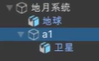

## 脚本运行

### 脚本运行过程

就是把c#文件拖入相应物体，物体就会运行脚本

脚本运行过程：

1. 创建节点GameObject node = new GameObject()
2. 示例化组件MeshRenderer comp=new MeshRenderer()
3. 示例化脚本组件SimpleLogic script1 = new SimpleLogic()
4. 调用事件函数start(),update()

unity基本运行其实就是各种类之间基本的层级关系、相互关联的各种类之间的调用

同一个脚本是可以应用到不同物体的

### 消息函数（回调函数）

MonoBehaviour是一个最基本的类，所有的脚本都继承于这个类

消息函数，也叫事件函数、回调函数、生命周期函数

这个函数的作用是当某个事件发生时，就会调用这个函数

Start和update都是消息函数

常见消息函数

* Awake 初始化，仅执行一次
* Start 初始化，仅执行一次
* Update  帧更新，每帧调用一次
* OnEnable 每当组件启用时调用
* OnDisable 每当组件禁止时调用

Awake函数和Start函数都是初始化，但是存在一些区别，当脚本组件被关闭后，Start函数就不会再执行了，但是Awake函数还是能够执行一次

其他回调函数可以在官方文档找到

#### 消息函数的调用顺序

第一阶段：初始化，执行一遍每个物体的Awake()函数

第二阶段：初始化，执行一遍每个物体的Start()函数

第三阶段：帧更新，执行一遍每个物体的Update()函数

如果不指定优先级的话，每一阶段的执行顺序都是不确定的，例如第一阶段所有物体的Awake函数的执行顺序每一次都是随机的

在每个脚本的Inspector中，就能找到优先级设置选项，打开后点击加号就能看到所有的脚本函数

值越小，优先级越高，直接拖动各种函数的位置也会自动设置优先级

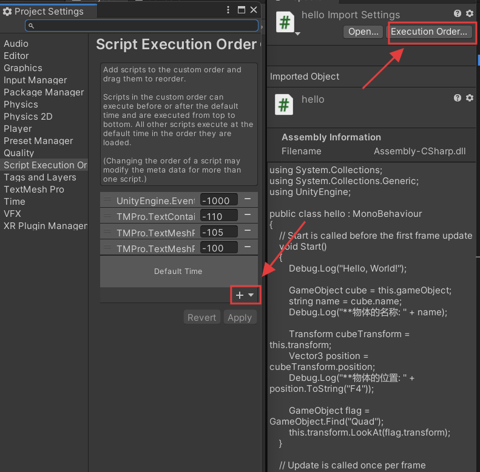

### 主控脚本

会一个脚本作为游戏控制的主要脚本，这个脚本会实现全局性的设置（例如帧率）其余脚本实现

全局性逻辑都放到主控脚本里，这样方便日后的维护与更新

主控脚本的优先级也可以设置的高一些

### 脚本参数

transform里面有x，y，z以及角度等参数，方便我们直接调节

脚本组件里也是可以添加调节参数的，这样就能直接在unity里调整，而不是每次都使用代码编辑器

在脚本中使用public修饰参数，就可以在组件中看到对应的参数了

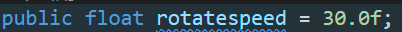

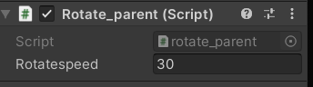

脚本内设置的值就会是这个参数的默认值,在unity组件里修改参数后,使用reset重置就会恢复为脚本里设定的值

添加注解（特性）

```c#
中括号内,名称为Tooltip,然后在()里写上需要的注释内容

[Tooltip("这个是Y轴旋转的角速度")]
```

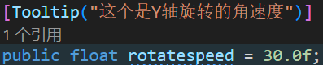

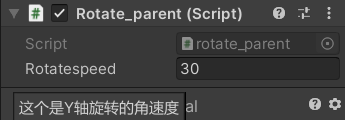

### 参数赋值

如果同一个参数

在Awake、Start、unity组件中都赋了值，那么最终赋值结果取决于代码执行顺序（update>satrt>unity组件>awake>默认值）

### 值类型

基本：整型、浮点、字符串、布尔类型

还有其他unity自带的类型：Vector3、Color

结构体struct、class类，和c/c++一致的

### 引用类型

脚本内的参数也可以是一个应用类型（节点、组件、资源、数组类型）

使用内置的类对象GameObject就可以了

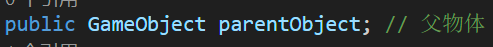

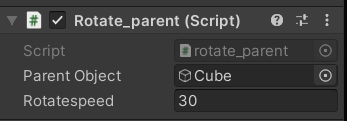

在unity组件里，能够看到这个引用类型，我们可以直接将需要的物体拖到上面，就能完成对这个引用的修改

### 运行时调试

在游戏运行时，也是可以调节各种参数（比如速度、位置）

保存参数的办法：

Copycomponent然后再paste
在运行过程中，如果调节好了参数，就可以暂停一下游戏，然后选择组件菜单里的copy

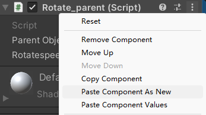

结束运行之后，再去组件菜单里选择psate

# 输入输出

查看输入设备是否连接

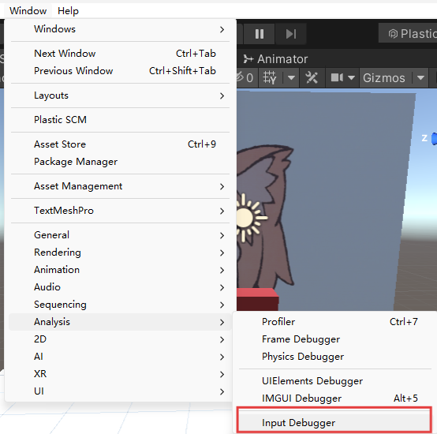

查看Input Debugger里有没有显示设备连接

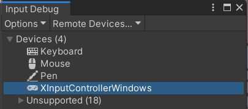

## 鼠标键盘

Input.GetKey("key")

## 手柄

创建Input Actions资源


## 屏幕输入

# 组件操作

## 组件调用

需要在代码中操作组件，主要是调用API

首先要获取组件使用GetComponent

以音乐播放组件为例

```c#
GetComponent<AudioSource>();
```

<>表示泛型,即获取 `<AudioSource>`类型的组件

```c#
void Update()
    {
        if (Input.GetMouseButtonDown(0))
        {
            Playmusic();
        }
    }
    void Playmusic()
    {
        AudioSource audio = this.GetComponent<AudioSource>();
        audio.Play();
    }
```

## 组件参数

获取了组件之后,使用.符号就可以访问它的参数,有些组件参数是布尔型,有的是数值型,要根据具体情况进行赋值

以Audio Source为例

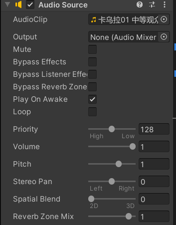

组件参数有Mute、Output等等,Mute代表是否静音

Paly on Awake是设置是否在游戏一开始就播放音乐

Mute是一个布尔型(打勾打叉),以下代码能实现对Mute的操作

```c#
AudioSource audio = this.GetComponent<AudioSource>();
if (Input.GetMouseButtonDown(0)){
	audio.Mute=true;}//如果鼠标点击就静音
```

## 引用别的组件

方法1:

写上一个GameObject变量

```c#
public GameObject bgmcube;

    // Start is called before the first frame update
    void Start()
    {
        AudioSource audio = bgmcube.GetComponent<AudioSource>();
        audio.Play();
    }
```

然后在unity组件里将需要的物体添加到组件参数里即可

方法2:

直接定义相应的组件变量

例如在主控里定义Audio Source组件

```c#
public AudioSource bgm;
```

然后在unity组件参数里直接把对应组件拖过来,然后进行操作就好

## 引用脚本组件

方法1:

在一个物体的脚本里(例如主控函数里),引用另一个物体的脚本组件.(例如旋转脚本里的转速)

引用时使用GetComponet<>获取组件,需要一个GameObject变量来配合\

sphere物体中的代码,代码名称为"rotate_parent"

```c#
public class rotate_parent : MonoBehaviour
{
    [Tooltip("这个是Y轴旋转的角速度")]
    public GameObject parentObject; // 父物体
    public float rotatespeed = 30.0f; 
    void Start()
    {
        Debug.Log("Rotate Parent script has started.");
    }
    void Update()
    {
        // 每秒旋转30度
        Transform parent = this.transform.parent; // 获取父物体的Transform
        parent.Rotate(0, rotatespeed * Time.deltaTime,0, Space.World); // 绕Y轴旋转
    }
}
```

可以知道phere里存在一个rotatrspeed的组件参数

在main主控函数里操作这个参数,main主控函数里的代码

```c#
public GameObject sphereNode;
void Start()
{
	rotate_parent sphere = sphereNode.GetComponent<rotate_parent>();
        sphere.rotatespeed = 60.0f;
}
void Update()
{}

```

可以看到

* 首先使用一个GameObject变量确定是哪个物体下的脚本组件
* 然后将对应的脚本组件的代码名称"rotate_parent"作为类型名,创建一个变量接收GetComponent<>()的返回值
* 之后就可以对这个脚本组件里的参数操作了例子中将数值赋值为60.0f)

方法2:

直接使用脚本名作为类目,定义一个变量,然后操作就可以了(因为脚本的名称是唯一的,修改对应类创建的变量,就连带修改对应脚本的参数)

```c#
public rotate_parent sphereRotate;

void Start()
    {
        sphereRotate.rotatespeed = 180.0f;
    }
```

回到unity脚本组件窗口,会发现有一个sphereRotate参数,将对应物体拖入即可,unity会自动寻找该物体下的rotate_parent组件

因此我们只需要声明一个对应组件名称作为类的变量,然后在unity里拖入带有要操作组件的物体,就能操作其他物体的组件了

## 消息调用

使用消息的方式操作其他物体的组件

主要用到的函数是a.SendMessage("x"),功能是向a物体发送x这个消息(一个字符串),然后a物体里就会找到叫x的函数,执行这个函数

本质使用的是c#里的反射机制,如果两个函数名是相同的,那么就都会执行

# 物体操作

## 获取物体

方法1:

GameObject.Find("xxx"),直接查找名字(不推荐)

获取一级结点

GameObject.Find("/xxx")

方法2:引用获取

添加一个Public变量,以GameObject作为类名,然后在unity里拖文件就可以

```c#
public GameObject cube;
```

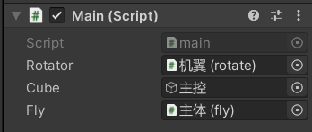

## 父子关系获取

unity的父子关系是使用Transform方法来维持的

所以获取父子级关系都要依靠Transform

### 父关系获取

```c#
//获取父级
Transform parent = this.transform.parent;

//获取父级节点
GameObject parentNode = this.transform.parent.gameObject
```

一级节点没有父节点,会返回null

### 子关系获取

方法1:遍历

```c#
foreach(Transform child in transform)
{
	Delog.Log("*子物体:"+child.name);
}
```

方法2:GetChild()方法

需要知道子项的索引号

```c#
//获取第n号子项
Transform child = this.transform.GetChild(0);
Debug.Log("*子物体:"+child.name);
```

方法3:Find()方法

```c#
//获取名为x子项,x是一个字符串
Transform child = this.transform.Find("x");
Debug.Log("*子物体:"+child.name);
```

## 关系设置

### 设置新父级

```c#
this.transform.SetParent(x);//x是目标物体的Transform变量

this.transform.SetParent(null);//设置为一级结点
```

### 显示/隐藏设置

activeSelf(ture/false)

```c#
Transform child = this.transform,Find("x");//获取物体x
if(child.gameObject,activeSelf){
	child.gameObject.SetActive(false);//如果x为隐藏,则显示
}else{
	child.gameObject.SetActive(false);如果x为显示,则将其隐藏
}

```

# 资源

unity中提供了各种资源对应的类

音频资源AudioClip

图片资源

视频资源

材质资源

网格资源

脚本资源

## 脚本中调用资源

以音频资源为例

audio可以在unity窗口以组件参数显示,在unity界面将需要操作的音频拖过去,这就是指定变量的过程

```c#
public AudioClip audiotest;
    // Start is called before the first frame update
    void Start()
    {
  
    }

    // Update is called once per frame
    void Update()
    {
        AudioSource audioSource = GetComponent<AudioSource>();
        audioSource.PlayOneShot(audiotest);
    }
```

## 资源数组

脚本中可以定义数组变量

例如:音乐盒中会存放很多的音乐,这个时候就需要使用资源数组

脚本

```c#
public AudioClip[] audiotest;

void Update(){
        AudioSource audioSource = GetComponent<AudioSource>();
        audioSource.PlayOneShot(audiotest[0]);
}
```

此时audio作为资源数组,在组件参数中的显示为

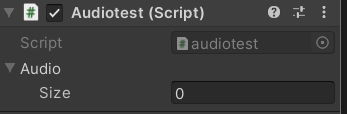

通过指定size大小,就可以存放很多音乐进去了

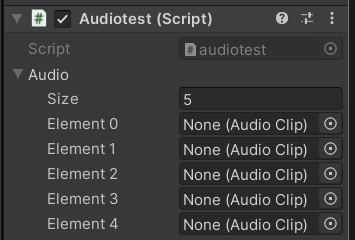

# 动画控制

动画控制使用unity内置的一种特殊资源Animator Controller

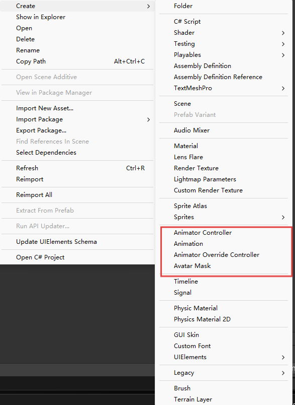

新建一个动画控制器文件，打开在左上角可以看到它的参数设置parameters

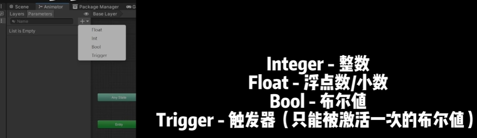
