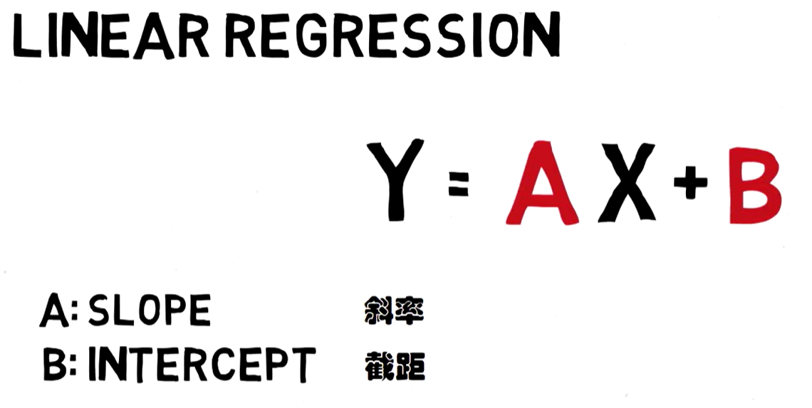
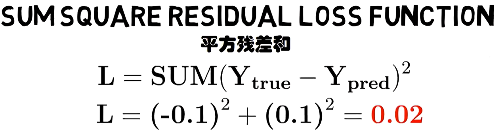
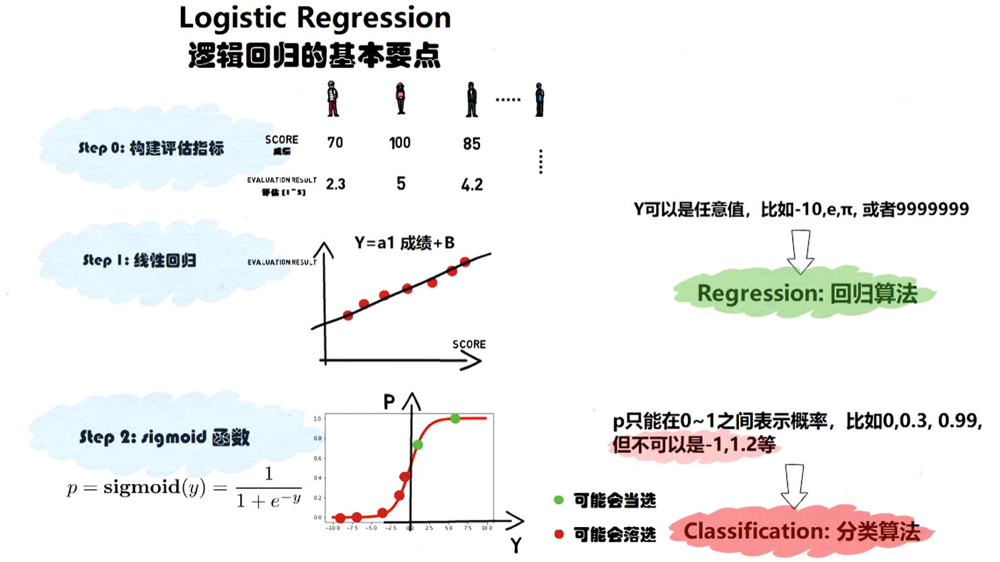

# 机器学习（Machine）

人工智能是一个包含很多知识的宏大领域，机器学习只是这个大命题下，实现人工智能的一种方法

## 定义和概念

### 机器学习定义

通过算法和模型使计算机从数据中自动学习并进行预测或决策。它是人工智能的核心技术，广泛应用于图像识别、自然语言处理、推荐系统等领域。

是在统计学的框架内的，所以会用到很多统计学的知识

### 三要素

#### 模型

#### 策略

#### 算法

### 分类

#### 有监督学习（supervised learning）

监督学习（Supervised Learning）是机器学习中的一种方法，它通过使用带有标签的训练数据来学习输入特征与输出标签之间的映射关系。每个训练样本都包含输入（特征）和对应的目标输出（标签），模型通过学习这些数据来进行预测。

就像一个有答案的老师在教你。你学习大量的“题目（数据）”和对应的“标准答案（标签）”，目标是学会一个函数，能够对新题目做出正确的回答。

这个类型的模型可以完成的任务：

* 回归：预测连续的数值，标签值是连续的
* 分类：预测离散的类别标签，标签值是离散的

#### 无监督学习（unsupervised learning）

通过对未标记类别的样本数据进行学习，挖掘数据内在结构与规律

就像你自己在观察世界，没有现成的答案。你需要自己发现数据中内在的结构、模式或分组。例如，给你一堆新闻，你自己把它们归纳成政治、体育、娱乐等类别（但一开始并没有人告诉你这些类别是什么）。

这个类型的模型可以完成的任务：

* 聚类：将数据分成不同的组，无需预先知道类别。
* 降维：在尽可能保留关键信息的前提下，减少数据的特征数量。
* 关联规则学习：发现数据中特征之间的有趣联系。

#### 强化学习（deep learning）

通过让智能体（agent）在环境中采取行动并根据所获得的奖励（reward）来学习最优的策略（policy）。简而言之，强化学习的目标是让智能体学会在特定环境下做出决策，以最大化累积奖励。这种学习方式模拟了生物体如何在环境给予的正反馈（奖励）和负反馈（惩罚）中学习行为的过程。

更像训练一只宠物。你不会告诉它每个动作对不对，但它做出一个动作后，你会给它一个奖励或惩罚。它的目标是通过不断尝试，学习一套能获得最大累积奖励的行为策略。这与**最优控制** 问题在思想上是高度一致的。

**这个类型的模型可以完成的任务：决策序列、游戏、机器人控制**

#### 深度学习

深度学习是机器学习的一个分支，它试图模拟人脑的工作原理，通过一种称为“人工神经网络”的模型，尤其是 **包含多个隐藏层的深度网络** ，来学习和提取数据中的复杂模式。

可以完成的任务：**视觉、语言、序列决策**

### 各种术语解释

#### 特化与泛化

特化：从一般到特殊，提取某个样本的特征就是这个过程

泛化（generalization）：从特殊到一般，

衡量一个训练得到模型的好坏，就需要考虑它的泛化能力

#### 归纳偏好

当有很多的模型能够选择，而且它们的能力都差不多，那么遵循**奥卡姆剃刀原则**我们要选择尽量简单的模型

#### NFL定理

**No** **Free** **Lunch** **Theorem**，没有免费的午餐定理

对于任意可能的数据分布，如果我们对所有可能的机器学习算法进行平均，那么它们在测试数据上的表现是相同的，即 **没有任何算法在所有可能的任务上都比其他算法更优** 。

它告诉我们，不存在一种在所有问题上都表现最优的学习算法。

算法的优劣：某些算法在特定数据分布上可能表现良好（例如，深度学习在图像分类任务上），而在其他数据分布上则可能表现不佳（例如，决策树在某些结构化数据上可能更优）。因此，选择合适的算法需要根据具体任务和数据集的特性，而不是寻找一种“万能”算法。

#### 过拟合与欠拟合

过拟合（over fitting）：模型中包含的参数多，对已知的数据预测效果很好，但是对未知的数据效果不好

过拟合原因有

* 训练时把噪声也作为有用信息输入了
* 用于训练的数据太少，或者无法体现出整体的特征

过拟合解决方法

* 拓展数据集，数据增强的方式
  数据增强分为有监督和无监督两种
  有监督：采用预设规则对已有训练数据进行变换，产生新的数据
  无监督：学习数据的分布，生成一些新的数据
* 降低模型复杂度，有正则化和减少特征选择
  正则化（Regularization）：分为L1正则化和L2正则化
  L1正则化（）：所有权重参数的和与绝对值的和
  L2正则化（岭回归）：权重参数的平方和在开方
  减少特征选择
  减少特征选择的办法有很多：深度学习中的Dropout方法（在全连接处以一定概率去除神经元）、早停（在训练过程中，提前结束对神经网络的迭代）、集成学习（）

欠拟合（underfitting）：包含参数太少，对已知和未知的数据的效果都不好

#### 数据集划分

划分其实就是把数据划分为训练集和测试集，常见方法有三种

##### 留出法

比如80%的数据用来训练模型，剩下的20%数据用来作为测试数据

##### 交叉验证

比如将整个数据分为十分份，每一次都选择一份作为测试集，其他九分用来训练

##### 自助法

有放回的随机抽样作为一个训练集

#### 模型性能度量

错误率E=a/m*100%，a分类错误的样本数量，m是用于分类的总样本数

精度accurary=1-E

查准率P：预测的结果和数据有多少误差，比如我用来测试的数据，0的有x个，1的有y个，那么这个模型预测出来有x1个0，y1个1，这个模型预测对了多少就是查准率

查全率R：所有为1的样本中，预测出了有多少个为1的

类别数量不平衡F1=2PR/（P+R）

#### 激活函数

激活函数是用来处理单个神经元输出上的函数，它决定了这个神经元是否应该被“激活”（即输出一个较强的信号）以及激活的程度。

如果没有激活函数，无论神经网络有多少层，整个模型就等价于一个简单的线性回归模型（因为线性变换的叠加依然是线性变换）。激活函数通过其非线性特性，使得神经网络能够拟合极其复杂的非线性关系。

就像用乐高积木（线性变换）搭建复杂形状（非线性模型），激活函数就是那些 **可以转弯、旋转的连接件** ，没有它们，你只能搭出一条直线。

* **它不是用来处理输入的**
* 激活函数是使用了神经网络的模型特有的

#### 损失函数

衡量**模型在整个数据集上的预测值**与**真实值**之间差距的函数。这个差距被称为“损失”或“成本”。

* 它就是用来评估模型好坏的函数
* 几乎所有的机器学习模型都有自己的损失函数

#### 神经网络

神经网络的基本灵感来源于生物大脑中神经元的连接方式。但它是一个高度简化的数学模型。

神经网络只是一个方法/思想，它在深度学习中能用到，监督学习、无监督学习、强化学习这些也能用到

理解神经网络要通过神经元和网络结构两方面来理解

##### 单个神经元

**一个神经元的计算分为两步：**

1. **加权求和（线性变换）：** 接收来自其他神经元的输入信号 `(x₁, x₂, ...)`，每个输入都有一个权重 `(w₁, w₂, ...)`，表示其重要性。神经元计算所有输入的加权和，再加上一个偏置项 `b`（类似于控制系统中的调节参数）。
   * `z = w₁x₁ + w₂x₂ + ... + b`
   * 这一步完全是一个**线性回归**模型。
2. **激活函数（非线性变换）：** 将上一步的线性结果 `z` 输入一个**激活函数** `f(z)`，得到该神经元的最终输出 `a`。
   * `a = f(z)`
   * 这一步引入了 **非线性** 。常用的激活函数如Sigmoid、ReLU等。

**一个神经元 = 线性回归 + 非线性激活函数。**

##### 网络结构

单个神经元能力有限。神经网络的威力在于将大量的神经元按照**层**的方式连接起来。

* **输入层：** 负责接收原始数据（如图像的像素、传感器的读数）。
* **隐藏层：** 位于输入和输出层之间。这些层是“黑箱”部分，负责从数据中逐层提取和组合特征。所谓“深度”学习，就是指具有 **多个隐藏层** 。
* **输出层：** 产生最终的预测结果（如分类类别、预测数值）。

**信息流动：** 数据从输入层进入，经过每个隐藏层的神经元进行处理（每个神经元都执行一次自己的加权求和与激活函数），最终到达输出层。

## 机器学习模型

### 监督学习

从给定的**训练数据**集中学习出一个函数（模型参数），当新的数据到来时，可以根据这个函数预测结果。监督学习的训练集要求包括输入输出，也可以说是特征和目标。训练集中的目标是由人标注的。监督学习就是最常见的分类（注意和聚类区分）问题，通过已有的训练样本（即已知数据及其对应的输出）去训练得到一个最优模型（这个模型属于某个函数的集合，最优表示某个评价准则下是最佳的），再利用这个模型将所有的输入映射为相应的输出，对输出进行简单的判断从而实现分类的目的。也就具有了对未知数据分类的能力。监督学习的目标往往是让计算机去学习我们已经创建好的分类系统（模型）。

#### 线性回归模型（linear regression）

线性回归是机器学习算法的起点

讨论的问题是我们能否将两个事物之间的关系使用一条曲线来表示，再通过这条曲线去预测、估计变量

线性回归模型就是用来确定两个变量之间是否存在某种线性关系

一般最小二乘法或梯度下降法拟合直线

评估一条曲线是否理想，也就是曲线好不好的标准，我们使用损失函数来评估

线性回归的损失函数就是平方残差和

计算训练集每个数据点到我们推测曲线的距离平方和，得到一个值

这个值越大，说明这个回归模型不好

这个值越小，说明这个回归模型很好

如果一组数据不具备线性的特征，那么是不能使用线性回归模型进行预测的，哪怕求出公式，预测结果也多半是不可信的

#### 逻辑回归（logistiic regression）

逻辑回归是线性回归的一个变种

不再拟合一条线到两个具有线性关系的数值变量，而是尝试预测一个分类输出变量

线性回归能够生成线性关系的函数，但是函数的输出是任意大小的数值（-∞，+∞），如果我们需要进行分类任务，那么线性回归就不好用了

引入sigmoid函数

$$
F(x)=\frac{1}{1+e^{-x}}
$$

对线性回归函数的输出代入sigmoid函数处理，那么它的输出结果就会是（0，1）区间的值

在二分类的任务中，这已经能否完成任务了

逻辑回归中进行评估的函数是交叉熵函数，这个函数是逻辑回归的损失函数

$$
L=-\sum [y_{true}\log(p)+(1-y_{ture})\log(1-p)]
$$

这个函数的值也是越小越好

本质上逻辑回归也是基于线性回归进行分类的，如果不是线性数据，那么不能用这个方法处理

#### KNN算法/k近邻（k-Nearest Neighbor）

#### 决策树（decision tree）

（1）基尼系数

$$
gini(T)=1-\sum\pi^2=\frac{S1}{（S1+S2）}gini（T1）+\frac{S2}{（S1+S2）}gini（T2）
$$

（2）信息熵$H(x)$

$$
H(x)=-\sum\pi *\log_2(x)
$$

信息增益$gain（A)$

$$
gain(A)=H(x)=H`(x)
$$

#### 朴素贝叶斯分类器

#### 支持向量机

#### 主成分分析与流形分析

#### k均值 k-means

#### DBSCAN

#### 集成学习

将若干个弱学习器集合在一起，形成一个强学习器

分为bagging和boosting

#### 智能推荐

#### 关联分析

#### 神经网络

### 无监督学习

输入数据没有被标记，也没有确定的结果。样本数据类别未知，需要根据样本间的相似性对样本集进行分类（聚类，clustering）试图使类内差距最小化，类间差距最大化。通俗点将就是实际应用中，不少情况下无法预先知道样本的标签，也就是说没有训练样本对应的类别，因而只能从原先没有样本标签的样本集开始学习分类器设计。

非监督学习目标不是告诉计算机怎么做，而是让它（计算机）自己去学习怎样做事情。

# 深度学习
