# HTML

HTML标签全称Hypertext Markup Language

## HTML标签

HTMl通过标签（也称）元素定义文本、图像、链接

HTML中标签是尖括号<>包围的关键字

双标签：有开始标签和结束标签，内容介于这两个标签之间

```
<p>这是一个段落</p>
```

单标签：用于没有内容的元素

```
<br>
```

### HTML结构

文档类型声明

html标签对（包含head标签对和body标签对）

### 常用文本标签

#### 1.标题标签

html中有6个标题标签，在body中用关键字h1到h6表示

```html
<!DOCTYPE html>
<html>
    <head>
        <title>html测试网站</title>
    </head>
    <body>
        <h1>一级标题标签</h1>
        <h2>二级标题标签</h2>
        <h3>三级标题标签</h3>
        <h4>四级标题标签</h4>
        <h5>五级标题标签</h5>
        <h6>六级标题标签</h6>
    </body>
</html>
```

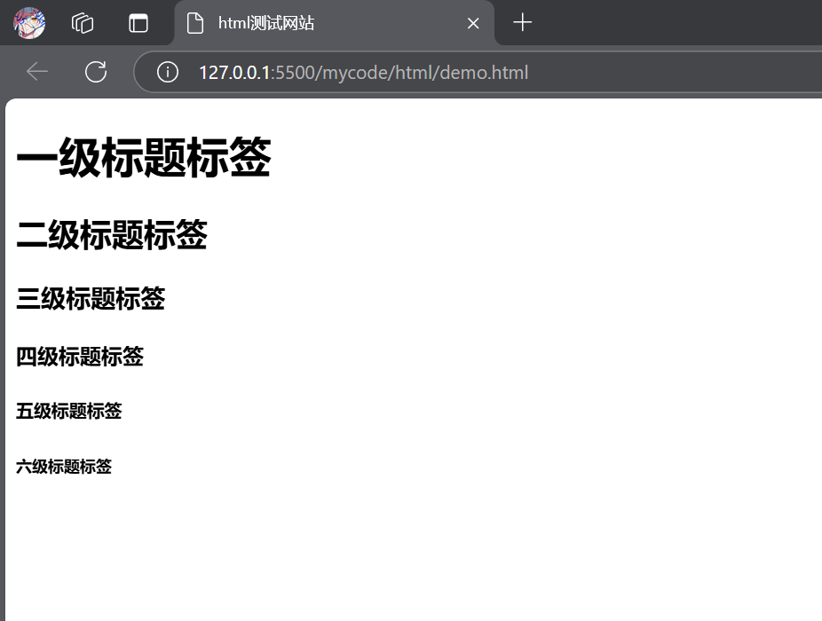

#### 2.段落标签p

```html
<p>这是一个段落<\p>
```

#### 3.文本样式标签

加粗b或strong

```
<p><b>1+1=2</b></p>
<p><strong>1+1=2</strong></p>
```

下划线u

```
<p><u>114514</u></p>
```

斜体i

```
<p><i>science</i></p>
```

删除线s

```
<p><s>science</s></p>
```

#### 4.列表ul＆ol

##### （1）无序列表

ul表示无序列表，ul中包含着几个li标签

```
<ul>无序列表元素1</ul>
<ul>无序列表元素2</ul>
<ul>无序列表元素3</ul>
```

效果：

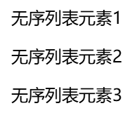

```
<ul>
	<li>无序列表元素1</li>
	<li>无序列表元素2</li>
	<li>无序列表元素3</li>
</ul>
```

效果：

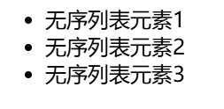

##### （2）有序列表

ol表示有序列表元素

有序列表和无序列表除了显示不同，用法都是一样的

```
<ol>
    <li>有序列表标签1</li>
    <li>有序列表标签2</li>
    <li>有序列表标签3</li>
</ol>  
```

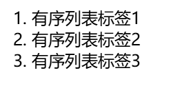

#### 5.表格table

table包含tr，tr中包含th和td

```html
<table>
    <tr>
        <th>列表题1</th>
        <th>列表题2</th>
        <th>列表题3</th>
    </tr>
    <tr>
        <td>元素11</td>
        <td>元素12</td>
        <td>元素13</td>
    </tr>
    <tr>
        <td>元素21</td>
        <td>元素22</td>
        <td>元素23</td>
    </tr>
    <tr>
        <td>元素31</td>
        <td>元素32</td>
        <td>元素33</td>
    </tr>
</table>
```

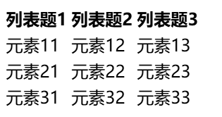

在table中有属性border，可以限定表格宽度

#### 6.换行标签br 分割线标签hr

br换行，类似c++中的endl，在网页中将同一行的两个元素分开在两行显示

hr在特定位置创建一条分割线，前后元素会分开在两行显示

## HTML属性

属性定义标签（元素）的行为和外观，以及和其他元素的关系

基本语法

```HTML
<开始标签 属性名="属性值">
```

每个元素都可以具有不同的属性

**属性名称不区分大小写，属性值区分大小写**

```html


<!--前两个语句效果是相同的，最后一个与前两个效果不一样>
```

### 适用于大部分标签的属性

有些属性是所有元素都会有的

#### 1.class

class的作用是为HTML元素定义一个1或多个类名

#### 2.id

定义元素唯一的id

#### 3.style

规定元素的行内样式

**以上几个属性在css中使用频率较高**

### 具有特定属性的标签

#### 超链接a

a标签用于链接到其他的网页和位置

a标签有href属性和target属性

href属性值就是a链接到的位置，这个位置可以是网页的url文件路径，也可以是邮箱地址、手机号等

```html
<a href="https://www.bilibili.com/">这是一个超链接</a>
```

效果：

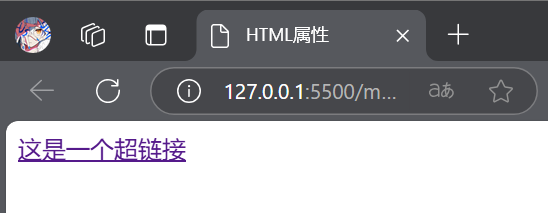

target属性用于定义链接的打开方式，有四种打开方式，

_self 在当前标签页打开

_blank 在新的标签页打开

_parent 在父窗口或父框架

_top 在顶层窗口或顶层框架中打开

#### 图片img

img具有src属性，alt属性，width，height

src定义要显示文件的路径（相对路径和绝对路径都可以）或url

alt是图片的定义文本，也就是图片名称，浏览器加载不出来的时候就会显示名称，名称可以留白，可以重复

width和height指图片显示的宽度和高度

## HTML区块

元素在浏览器中的显示方式不一样，有些元素不同代码如果中间没有分隔换行，就会在浏览器中成一行显示，有些则会自动分行显示，按照这样分类，将元素分为行内元素和块元素

### 块元素

块元素：自动从新行开始，独占一行，自动分行显示的元素，块元素用于组织和布局页面的主要结构，将内容分隔为逻辑块，如div、ul、ol、hr、br

#### div

通常用于创建块级容器，组织页面结构和布局

### 行内元素

行内元素：不会独占一行，不会分行显示的元素，不能包含块级元素如img、a、b、strong

#### span

内联样式化文本，在某个行中嵌入元素

### 行内块元素

水平方向上排列，可以设置块级元素的各种属性，可以包含行内元素和块级元素，其实最重要的就是能设置行高

## HTML表单

创建一个表单和创建一个表格差不多

### form标签

form有很多属性，如果想要创建表单，就需要将内容写在form标签内

#### action属性

指数据提交的地方，填入一个url，也就是后端提供的api

### input标签

input标签用于输入文本，有几个常用的属性

#### type属性

指定输入的文本类型

属性值有：text（文本）、radio（选项）、password（密码）、checkbox（多选）、submit（提交数据）

#### placeholder和value属性

添加描述,填写文本时给用户提示，placeholder在用户选中输入时，文本会消失，而value中的值不会消失

#### name属性

为输入项归类，name中的值相同的input标签将归为一类，只能有一个输入

#### id属性

为input标签设置id

### label标签

为input标签取标题

#### for属性

绑定指定的input标签

## 补充

2025.6.2

学习了数据结构里的树，其实html的语法就是一种树结构

* **节点** ：HTML 的每个标签、文本、属性等都对应树中的一个节点。
* **父子关系** ：嵌套的标签形成父子关系。例如，`<body>` 是 `<h1>` 和 `<p>` 的父节点。
* **根节点** ：HTML 文档的根节点是 `<html>`

```
html
├── head
│   └── title
│       └── 网页标题
└── body
    ├── h1
    │   └── 这是一个标题
    └── p
        └── 这是一个段落。
```

# CSS

样式表语言，用于定义网页样式和布局样式表语言

HTML相对于房子的骨架，css相对于装修

## CSS导入

### CSS语法

CSS通常由选择器、属性和属性值组成

```
选择器{
	属性1：属性值1；
	属性2：属性值2；
}
```

1.选择器的声明可以写无数条属性；

2.声明的每一行属性，必须由英文分号结尾；

3.声明中的所有属性和值都是以键值对形式出现的

```css
/*这是一个p标签选择器*/
p{
 color:blue;
 font-size:16px;
}
```

### CSS的三种导入方式

#### 1.内联样式

在HTML标签中，使用style属性进行定义

```html
<p style="color:blue;">这是一个标签</p>
```

#### 2.内部样式表

在head标签中使用style属性进行定义

```html
<!DOCTYPE html>
<html>
<head>
	<meta charset="UTF-8">
    <meta name="viewport" content="width=device-width, initial-scale=1.0">
    <title>CSS导入</title>
    <style>
        p{
            color: aqua;
            font-size: 16px;
        }
    </style>
</head>
<body>
	<p>这是一个p标签</p>
</body>
</html>
```

#### 3.外部样式表

将CSS样式单独放在一个CSS文件中，在head标签中使用link标签链接到网页中

优先级：内联样式>内部样式表>外部样式表

### CSS选择器

选择器允许对特定元素或一组元素定义样式

常用的选择器:元素选择器、类选择器、ID选择器、通用选择器、子元素选择器、后代选择器（包含选择器）、并集选择器（兄弟选择器）、伪类选择器

#### 元素选择器

在head的style中定义

```
元素名{
	属性1：属性值1；
	属性2：属性值2；
}
```

#### 类选择器

在head的style中定义

```
.类名{
	属性1：属性值1；
	属性2：属性值2；
}

```

#### id选择器

在head的style中定义

```
#id内容{
	属性1：属性值1；
	属性2：属性值2；
}
```

#### 通用选择器

选择所有元素，即选择器内容**对所有元素生效**，在head的style中定义

```
*{
	属性1：属性值1；
	属性2：属性值2；
}
```

#### 子元素选择器

选择位于父元素内部的子元素，先指定父元素再指定子元素，子元素或父元素那个标签直接出现不会生效，只对'父元素中的子元素'这个条件满足的元素才会生效（其实就是嵌套）

在head的style中定义

```html
.父元素 > .子元素{
	属性1：属性值1；
	属性2：属性值2；
}
............................
例如：
.father > .son {
	color:red;
}/*这里father是父元素div的类名，son是子元素p的类名，这个样式仅对类为father中的son这个元素生效*/
<div class="father
	<p class="son">...</p>
</div>
```

#### 后代选择器

后代会包括子代，也就是说父元素后代中的这种元素全都运用这种样式

在head的style中定义

```
.父元素 元素名{
	属性1：属性值1；
	属性2：属性值2；
}
例如：
.father p {
	color:red;
}/*这里father是父元素div的类名，p是后代元素，这个样式仅对类为father中的p元素生效*/
<div class="father>
	<p>...</p>
	<div>
		<p>...</p>
	</div>
</div>
```

#### 兄弟选择器（相邻选择器）

 当相邻元素符合定义的类型组合时就会应用样式

在head中的style中定义

```
元素名 + 元素名 {
	属性：属性值；
}
例如：
p + h3 {
	color:red;
}
...
<h3>一个标题</h3>	  第一行
<p>一个标签</p>       第二行
<h3>一个标题</p>	  第三行
第二行和第三行符合定义，会被运用样式，但是第一行不会应用定义样式
```

#### 伪类选择器

实现类似于某些网站的鼠标悬停改变文字、黑条效果，例如萌娘百科的黑条文本

hover是鼠标悬停效果

first-child是第一个子元素

nth-child（）是第x个子元素，x是nth代表的数字

active链接的状态

```
#id:hover{
	color：red;
}
...
例如：
#father:hover{
	color：red;
}
...
<p id="father">一个标签</p>
```

#### 伪元素选择器

::after选中元素之前插入虚拟的内容

::before选中元素之后插入虚拟的内容

## CSS的属性

前面用到的属性color、font-size、font-family

属性在html官方或者[HTML 教程 | 菜鸟教程](https://www.runoob.com/html/html-tutorial.html)可以直接查到

复合属性：多个属性的集合体，例如font

#### font属性

font是一个复合属性，可以直接设定字体的颜色、大小、字体等等

#### line

##### line-height

设置行高

#### width

设置宽度，单位px

#### height

设置宽度，单位px

#### display

display：inline将内容转换为行内属性

display：inline-block将内容转换为行内块元素

## CSS盒子模型

CSS中如何一个元素都可以看作一个盒子

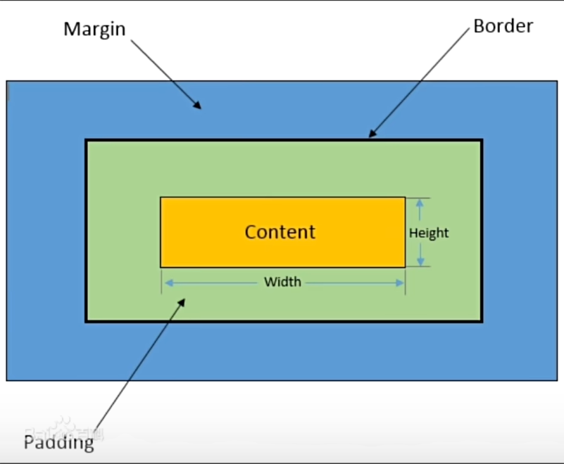

内容(content)：盒子包含的图片、文字等

内边距（Padding）：内容和边框之间的空间，通过padding设置属性

边框（Border）：盒子的边界，用border设置属性

外边距（Margin）：盒子与其他元素之间的空间，使用margin设置属性

### padding

可以设置大小、颜色、边框样式

### border

一个复合颜色，可以设置大小、颜色、边框样式

边框样式有：solid实线、dashed虚线、dotted点线、double双实线

也可以拆解成border-style、border-color、border-width、border-left、border-top等等

### margin

可以设置大小、颜色、边框样式

```
<style>
    .hit{
        color: aquamarine;
        font: 25px;
        border-style: solid;
        border-color: red;
        border-width: 10px  ;
    }
    .hitiloveyou{
        background-color: aqua;
        border: 5px green double;
        display: inline-block;
        padding: 15px;
        margin: 15px;
    }
</style>
 
 <body>
    <div class="hit">
        <p>zs1hangneirong</p>
    </div>
    <div class="hitiloveyou">
        <p>yuihang1neir</p>
    </div>
    <div>
        <p>1111111</p>
    </div>
</body>
```

## 浮动

传统网页布局方式：标准流、浮动、定位、自适应布局

标准流是块级和行内元素按默认规定进行排列

float属性创建浮动框，选择左浮动、右浮动或者不浮动，语法：

```
选择器{
 float：left/right/none
}
```

浮动特性：

1.脱标:脱离标准流

2.一行显示，顶部对齐

3.具备行内块元素特性

### 父元素坍塌

如果子元素是浮动的，但是父元素没有高度，那么父元素会出现坍塌

```
<style>  
    .father{
        border:  red double 3px;
    }
    .left-son{
        width: 100;
        height:100;
        background-color: green;
        float:left;
    }
    .right-son{
        width: 100;
        height:100;
        background-color: purple;
        float:right;
    }
</style>

<div class="father">
    <div class="right-son">111111111</div>
    <div class="left-son">22222222</div>
</div>
<p>33333333</p>
```

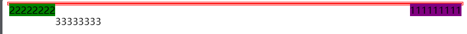

在左右浮动的子元素之后再输入其他元素,顺序就会出错,这是因为左右子元素是浮动的,撑不开父元素框架

### 解决坍缩的方法

1.在父元素中添加属性overflow:hidden

```
<style>  
    .father{
        border:  red double 3px;
        overflow: hidden;
    }
    .left-son{
        width: 100;
        height:100;
        background-color: green;
        float:left;
    }
    .right-son{
        width: 100;
        height:100;
        background-color: purple;
        float:right;
    }
</style>

<div class="father">
    <div class="right-son">111111111</div>
    <div class="left-son">22222222</div>
</div>
<p>33333333</p>
```

2.伪元素清除法

添加父元素伪元素

```
<style>  
    .father{
        border:  red double 3px;
    }
    .father::after{
    	content:"";
    	display:table;
    	clear:both;
    }
    .left-son{
        width: 100;
        height:100;
        background-color: green;
        float:left;
    }
    .right-son{
        width: 100;
        height:100;
        background-color: purple;
        float:right;
    }
</style>

<div class="father">
    <div class="right-son">111111111</div>
    <div class="left-son">22222222</div>
</div>
<p>33333333</p>
```

以上两种的方法的结果如图

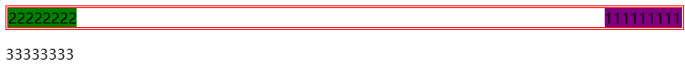

## 定位

定位方式：相对定位、绝对定位、固定定位

### 1.相对定位

对应属性position中的relative,使用left、top、right、bottom确定与相邻元素的相对位置

```

```

### 2.绝对定位

对应positon中的sbsolute，使用left、top、right、bottom确定与相邻元素的位置，绝对定位的元素与其他元素不在同一层，注意可能会覆盖掉下一层的元素，类似于图层的关系绝对定位的元素在最上面一层

### 3.绝对定位

对应position中的fixed，用left、top、right、bottom确定与网页边框的位置，它会始终固定在网页的位置上，无论如何滑动，都不会改变其位置

# JavaScript

JS和java没有任何关系，js用于设计在网页上实现动态效果，嵌入HTML中之后可以实现网页根据用户的操作状态变化

## JS导入方式

### 1.直接嵌入

js代码放在script标签中,script标签可以写在head标签内也可以写在body标签

```
<script>
    console.log("hello,world1内联样式body");
    alert("你好");
</script>
```

console.log打印日志,alert弹出内容

### 2.外部导入

通过script标签的src属性导入

```
<script src="./JS/my.js">
    console.log("hello,world2内联样式head");
</script>
```

## JS变量

三种变量声明方式:var（函数作用域）、let（块级作用域）、const（常量）

let变量比var变量要更安全一些

js中的变量是动态的，let和var赋值可以是文本、整数、浮点小数、负数、数组等等

### 两个变量的区别

var变量在块级区域（if、while、for）之外仍然能够访问

let变量只在块级区域起作用，区域之外是不能访问变量值的

```
if(ture){
	var a=29;
}
console.log(a);
输出：20
if(ture){
	let a=29;
}
console.log(a);
输出报错
```

var允许重复声明，let变量不允许重复声明

```
var a=20;
var a=1;
不会报错
let a=20;
let a=1;
会报错
```

## JS控制语句

### 条件语句

if、else-if、else语句

```
if(condition1){
	执行语句;
}
else if(condition2){
	执行语句;
}
...
else {
	执行语句;
}
```

### 循环语句

for循环

```
for(初始化表达式;循环条件;迭代器){
	执行语句;
}
```

while循环

```
while(循环条件){
	执行语句;
}
```

break和continue关键字

break跳出循环

continue跳出当前循环执行下一个循环

## 函数

使用关键字function定义，和c++语法一样

```javascript
function 函数名(参数1;参数2;参数3){
	执行语句;
	return 返回值
}
例:
function hello(a){
    console.log("hello,world");
    console.log(a);
}
var a="上午好";
hello(a);
```

## 事件

事件指网页触发的特定瞬间

常见事件:用户的点击、键盘按下、页面加载

onClick(点击事件)、onMouseOver（鼠标经过）、onMouseOut（鼠标移出）、onCharge（文本内容改变事件）、onSelect（文本框选中）、onFocus（光标聚集）、onBlur（移开光标）

### 事件绑定

将事件绑定到html元素中,有三种方法:

#### 1.HTML属性

```
<button onclick="onclick_event()">这是一个绑定事件</button>

<script>
	function onclick_event(){
    alert("点击事件触发了");
	} 
</script>
```

#### 2.DOM属性

#### 3.addEventlistener方法

## DOM

网页被加载时，浏览器会创建页面的文本对象，也就是DOM，每个HTML或XML文档都可以视为一个文档树，文档树是整个文档的层次结构表示，文档节点是整个文档树的节点

DOM是文档树的接口，可以通过JS操作这个树状结构

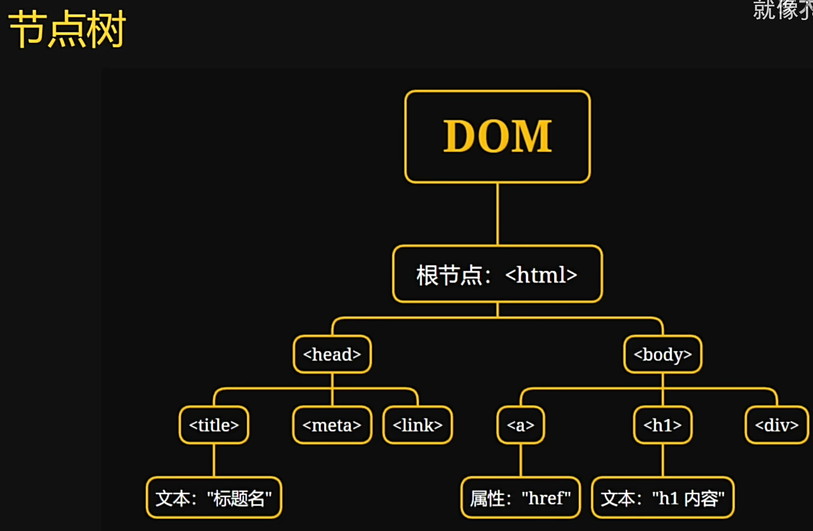

### 获取元素

在script中输入document.getelmentbyXXX获取元素

注意:只有通过id获取的元素才是单个元素,其余方式获取的元素都是数组

```
<div id="box1">
    <p>11111111</p>
</div>
<div class="box2">222222222</div>
<div>33333333</div>
<script>
    var a=document.getElementById("box1");
    console.log(a);
    var b=document.getElementsByClassName("box2")[0];
    console.log(b);
    var c=document.getElementsByTagName("div")[2];
    console.log(c);
</script>
```

### 修改HTML标签内容

使用.innerHTML和.innerTEXT修改元素内容

.innerHTML会对HTML里的标签敏感,自动将内容修改为对应的html格式(注意双引号不会识别内容,单引号才会识别)

```
a.innerHTML='<a href="#">你好世界!</a>';
```

### 修改标签属性

使用".style.属性名"更改属性

```
var c=document.getElementsByTagName("div")[2];
console.log(c);
c.style.color='red';
```

### DOM属性绑定事件

```
变量名.事件名 = function(){
	执行语句;
}
例如:
<button>一个按钮</button>
<script>
	var d=document.getElementsByTagName('button')[0];
    console.log(d)
    d.onclick=function(){
    console.log('点击');
	}
</script>
```

### addEventlistener方法绑定事件

addEventlistener第一个参数为触发方式，第二个参数为触发方法（注意这里调用的是方法，写函数名不需要加括号）

```
<button>一个按钮</button>
<script>
	var d=document.getElementsByTagName('button')[0];  
    d.addEventListener('click',onclick);
    function onclick(){
        console.log('点击');
    }
</script>

也可以写成匿名函数的形式
<button>一个按钮</button>
<script>
	var d=document.getElementsByTagName('button')[0];  
    d.addEventListener('click',
    function(){console.log('点击');}
    );
  
</script>
```

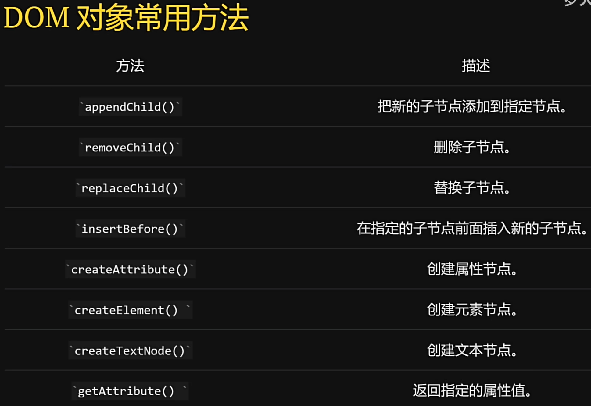

# 


# 其他知识点

## 注释

使用CTRL+/就可以**添加注释**或者**注释掉选中的代码**

## 打印不同变量的组合

用+来连接变量

```
a=10;
console.log("您的余额为:"+a);
```
