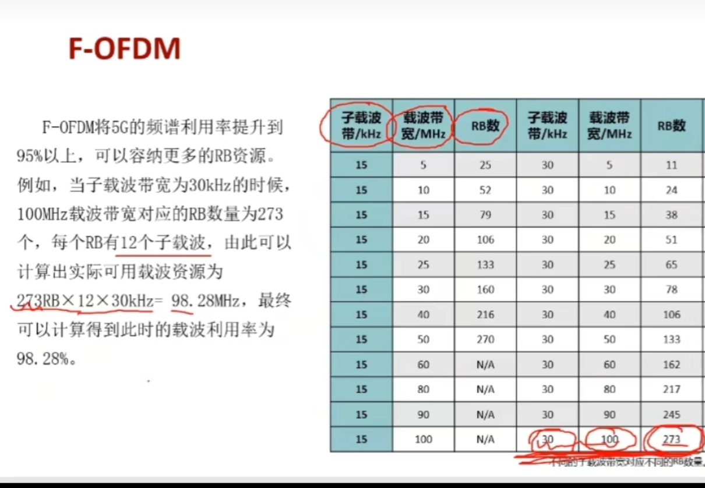

# 大唐杯培训

## 课程笔记1

### 机器学习与智能网络优化

#### 机器学习与无线网络优化

5G无线网络优化按工作内容分为日常优化和网络优化

机器学习：监督学习、无监督学习、强化学习

应用问题：无法建模问题、难以求解问题、统一模式高效问题、最优检测与估计问题

四个步骤：业务沟通与业务确认

##### 业务沟通与业务确认

如何转

#### 5G智能优化平台

关联系数：完成特征选择，依据是去掉对目标影响较小的特征

相关矩阵：对相关性高的特征也要选择性地删除

界面调参和程序调参

上传脚本

模型训练

#### 算法原理

##### 特征选择

特征指与分析目标相关联的数据

保留特征多，预测能力上升，计算复杂度会上升

保留特征少，预测能力下降，计算复杂度会下降

分三种方法：过滤式、包裹式、嵌入式

相关系数：0.3线性无关、0.3-0.5低线性相关、0.5-1强线性相关

##### 人工智能

### 5G基站

#### 基站开通流程

需求导入>基站勘察（初勘、复勘）>基站系统安装>基站开头调测>单站验证/业务测试

5G系统开通调测目标:建立5G逻辑小区,逻辑小区建立前提是本地小区正常运行

5G频段：700M-900M

#### 勘察规划

#### 网络部署

EMB6216板卡：

风扇板卡HFCD放8槽位，在最右侧，竖着

电源板卡HDPSD占两个槽位，放4槽位

主控板卡放0，1槽位

基站板卡放1，2，3，5，6，7

空缺槽位需要用空面板挡住

辅材配置：AAU使用16cm^2^的导线,25G光模块

## 大唐杯总复习

## 5G理论知识

特点：超高速率、超大连接、超低时延

关键性能：embb、urllc、mmtc

4G和5G差异：时延、吞吐率、连接数、网络架构（切片技术）

4g完成了宏基站向分布式基站的演进

5G组网架构：NSA、NA

核心网：用户连接、用户鉴权、计费管理、移动性管理、外部网络接口

面向业务的核心网：灵活架构、可编程能力、智能管道

控制面用户名分离：提升用户体验和网络效率

原生云

### 两种站点分布方式：DRAN和CRAN

AAU、BBU

DRAN分布式站点：每个站点独立部署机房

DRAN优点：1.灵活组网；2.光纤消耗少;3.单站出问题不会影响其他站点

DRAN缺点:1.投资规模大2.建设周期长3.不利于资源共享4.不利于业务高效协同

CRAN集中式站点：多个站点的BBU集中部署在同一个机房

CRAN优点:1.站间高效协同,覆盖重叠区多2.难度低,可以快速部署3.资源共享

CRAN缺点:1.光纤消耗大2.风险高3.要求机房设施完善

cloud RAN具有CU/DU分离的思想,将BBU分割成**实时处理**和**非实时处理**两部分

5G整体架构:核心网AMF/UPF,两个基站交互对应X2接口,站和核心网之间对应S1接口

提升速率（新空口技术）:全双工、**massive MIMO**、polar编码、SCMA、numerology

减低时延：灵活帧、自包含时隙、免授权调度、D2D

提升覆盖：上下行解耦、EN-DC、M-MIMO

毫米波：传播距离远

QAM正交振幅调制技术：提高频带利用率、多进位和正交载波技术结合，QAM前面的数字越高，速率越高，256QAM比64QAM多四倍速率

5G上下行都支持256QAM

### M-MIMO关键技术

M-MIMO：天线数最多256个，增加了垂直维度的覆盖能力，阵子之间的距离不能太大，降低上行干扰，工作原理是通过对每个天线进行加权，天馈结构扩大，显著提升小区容量

1.下行波束赋型

流程：通道校正->权值计算->加权->赋型

2.下行用户多流传输

3.下行PDSCH复用和PDCCH复用

4.上行用户多流传输

5.上行PUSCH复用

提高增益的方法

阵列、赋型、复用、分集增益

传统MIM0：水平通道，垂直方向只有一个主瓣

### 信道编码技术

原则：编码性能、编码效率、灵活性

Turba编码：用于大包用户

Polar编码：用于小包用户，理论是信道极化

校验编码LDPC码

F-OFDM技术：对子代滤波的正交频分复用；4G的子载波带宽是固定的15kHZ，各种参数不可变化，5G是可以改变的，灵活配置不同的应用场景（时延场景、移动场景、覆盖场景）

载波利用率计算

### 上下行解耦技术

基于测量结果选择合适的上行载波，是一种新的频谱配对技术，免受手机高频传输时更大路径损耗和穿透损耗，降低NR的时延

### 降低时延的技术

免调度技术（）

D2D通信技术（设备和设备直接通信，不需要通过基站）

### 提升覆盖的技术

EN-DC技术（移动性管理，主站切换，从4g主站动态切换到5g主站）

### NR接入流程

网络切片

NSA组网接入（有4g基站参与）

SA组网接入

NR移动性管理：NSA组网和SA组网，Xn切换

## 仿真

### 勘站规划

1.全网规划：覆盖规划、容量规划

2.单站规划：射频规划、小区参数规划

方位角测量，天线挂高

### 网络部署与实施

### 开通调测

### 业务验证

### 车联网
