# 四轴飞行器设计入门

教程使用的是小马哥dragonfly四轴飞行器开源项目

环境：keil 5.20版本

固件包：stm32f1xx、stm32f4xx

固件库：stm32f1xx V1.8.0、stm32f4xx V3.5.0

## keil5使用

### 基本功能

#### 文件管理

左上角

新建文件

打开文件

保存文件

#### 编码方式

在Edit中的configuration中

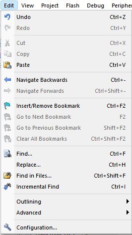

一般选择UTF-8

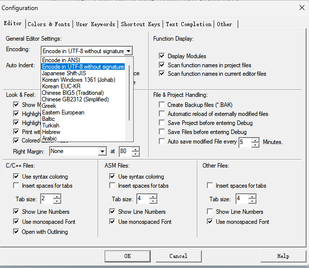

### 新建工程

#### 使用stm32官方固件库新建项目

STM32的固件库提供了stm32所使用的各种代码，包括外设驱动、芯片内的各种代码示例

新建一个文件夹命名 Template。

这是工程的根目录文件夹。然后为了方便我们存放工程需要的一些其他文件，这

里我们还新建下面 4 个子文件夹： CMSIS,USER,FWLIB,DRIVER

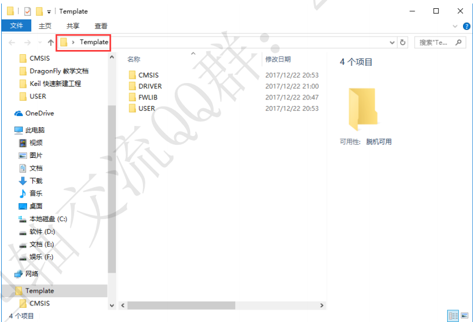

然后将将工程必须的文件，从 STM32 官方标准库里拷贝到我们刚新建的文件夹中

CMSIS 文件夹：

固件库路径: F:\DragonFly 资料包\02、源码\0201、固件库与器件包\固件库

1 定位到 STM32F4xx_DSP_StdPeriph_Lib_V1.8.0\Libraries\CMSIS\Device\ST\STM32F4xx\Source\Templates\arm 目录下 startup_stm32f411xe.s

F411 的启动文件拷贝到新建的 CMSIS 文件夹下。

2 定位到 STM32F4xx_DSP_StdPeriph_Lib_V1.8.0\Libraries\CMSIS\Device\ST\STM32F4xx\Source\Templates 目录下的 system_stm32f4xx.c 一个文件

拷贝到 CMSIS 文件夹下。

3 定位到 STM32F4xx_DSP_StdPeriph_Lib_V1.8.0\Libraries\CMSIS\Device\ST\STM32F4xx\Include 目录下将 stm32f4xx.h、system_stm32f4xx.h 两个文件拷贝到CMSIS 文件夹下。

4 定位到 STM32F4xx_DSP_StdPeriph_Lib_V1.8.0\Libraries\CMSIS\Include 目录下将 core_cm4.h、core_cmFunc.h、core_cmInstr.h、core_cmSimd.h、四个文件拷贝到 CMSIS 文件夹下。

其次 FWLIB 文件夹：

1 定位到 STM32F4xx_DSP_StdPeriph_Lib_V1.8.0\Libraries\STM32F4xx_

StdPeriph_Driver 目录下将 inc、src 两个文件夹拷贝到新建的 FWLIB 文件夹。

最后 USER 文件夹：

1 定位到 STM32F4xx_DSP_StdPeriph_Lib_V1.8.0\Project\STM32F4xx_StdPeriph_Templates 目录下将 main.c、stm32f4xx_conf.h、stm32f4xx_it.c、stm32f4xx_it.h、四个文件拷贝到新建的 USER 文件夹。

DRIVER 文件夹是用来存放用户手写的外设驱动程序.c 文件、.h 文件，用户手写程序请都存放在此文件夹。

打开 Keil,点击 Keil 的菜单： Project ->New Uvision Project ，然后将目录定位到刚才建立的文件夹 Template 之下的 USER 子目录，同时，工程取名为Template 之后点击保存，我们的工程文件就都保存到 USER 文件夹下面。

接下来会出现一个选择 Device 的界面，就是选择我们的芯片型号，这里我们定位到 STMicroelectronics。这里我们选择 STMicroelectronics STM32F4>Series>STM32F411CC

右击 Target1，选择 Manage Project Items,在 Project Targets 一栏，我们将 Target 名字修改为 Template,然后在

Groups 一栏删掉一个 SourceGroup1，建立三个 Groups： CMSIS,DRIVER,USER,FWLIB

CMSIS中添加startup_stm32f411xe.s 和system_stm32f4xx.c

USER中添加main.c、STM32f4xx_it.c

FWLIB中添加Template>src中的所有源文件，然后删去stm32f4xx_fmc.c、stm32f4xx_fmpi2c0.cstm32f4xx_fsmc.c这三个文件

完事后软件中显示是这样子的

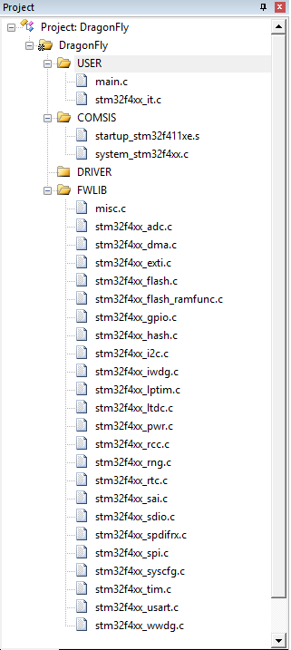

点击keil中的，添加头文件路径和全局宏定义标识符

全局宏定义标识符：STM32F411xE,USE_STDPERIPH_DRIVER

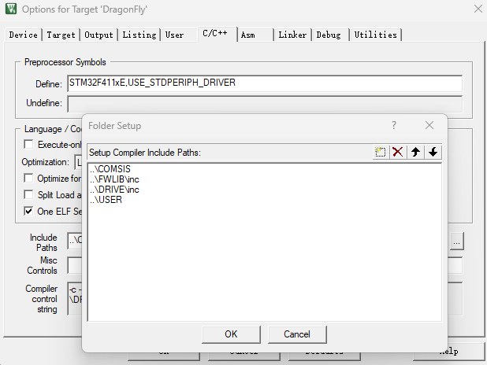

将main.c中的代码修改为

```c
#include "stm32f4xx.h"


void delay(int cnt);

int main()
{
  GPIO_InitTypeDef  GPIO_InitStructure;
  RCC_AHB1PeriphClockCmd(RCC_AHB1Periph_GPIOB, ENABLE);

  GPIO_InitStructure.GPIO_Pin = GPIO_Pin_8;
  GPIO_InitStructure.GPIO_Mode = GPIO_Mode_OUT; 
  GPIO_InitStructure.GPIO_OType = GPIO_OType_PP; 
  GPIO_InitStructure.GPIO_Speed = GPIO_Speed_100MHz; 
  GPIO_Init(GPIOB, &GPIO_InitStructure);
	while(1)
	{
		*(uint32_t*)(0x40020018) = 0xFFFF;
		GPIO_SetBits(GPIOB,GPIO_Pin_8);//USER_LED灭
		delay(1000);
		GPIO_ResetBits(GPIOB,GPIO_Pin_8);//USER_LED亮
		delay(1000);
	}
}
void delay(int cnt)
{
	int i,j;
	for(i=0;i<cnt;i++)
	{
		for(j=0;j<0xfff;j++)
		{}
	}
}
```

左上角图标

表示只编译当前文件

表示编译目标文件

编译全局文件

编译全局文件一次，然后根据报错修改代码

成功编译后，由于飞行器使用的是8MHz的晶振所以还需要手动修改一下时钟频率

#### 使用keil快速新建stm32工程

直接在keil5中新建文件，选好芯片后，会弹出RTE的选择页面

我们在此勾选我们需要的芯片基本功能、外设功能，会自动创建好工程

以下内容是必选的

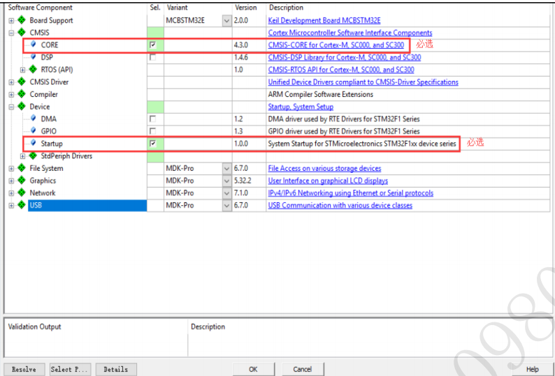

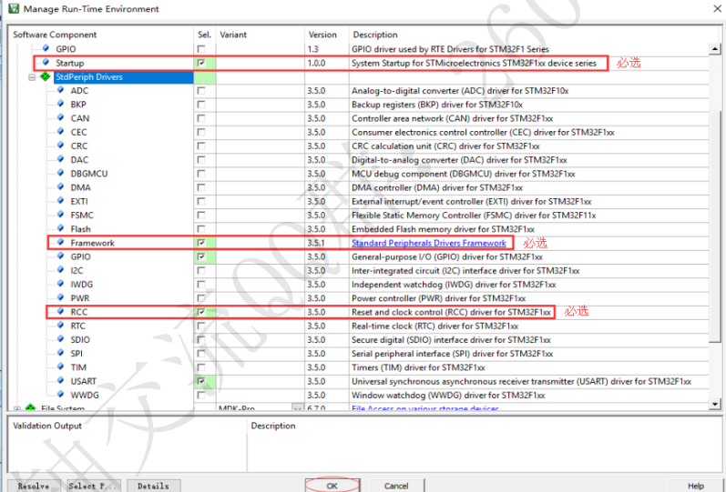

在后续开发中如果需要添加新的外设功能，就打开勾选对应的功能就好

stm32f103创建的工程使用的是标准库

stm32f4使用的是HAL库，如果要使用标准库，就得用stm32固件库手动创建工程了


# stm32

使用的是b站up主keysking的教程

https://www.bilibili.com/video/BV12v4y1y7uV/

## stm32基本认识

单片机就是微型计算机，所有计算机需要的功能都集成在一块芯片上了

位数指的是CPU一次处理的数据位宽，位宽越高，性能越强

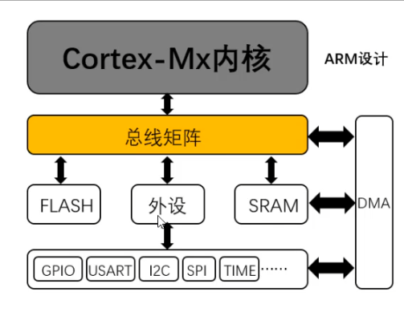

ST官方有着一套命名规则，要根据具体的运用选用不同的芯片系列

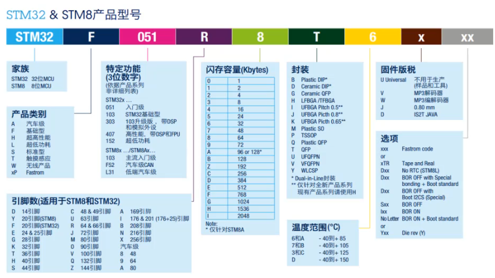

stm32芯片内的总线一共11条，主控总线有S0\S1\S2\S3\S4\S5，被控总线M0\M1\M2\M3\M4

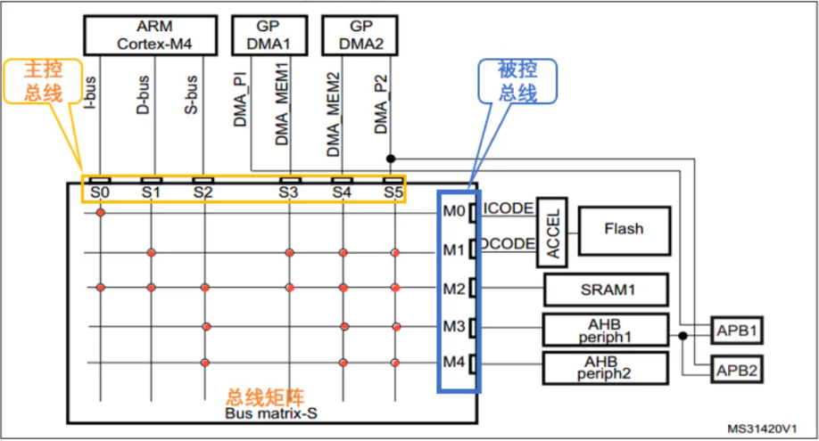

stm32使用C语言编程的本质，是在操作各种**外设寄存器**

stm32有4GB的地址空间，st公司已经大致规定死了地址分配情况

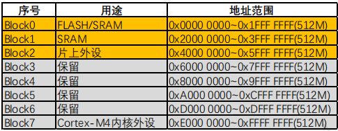

如果寄存器很少的话，可以直接查地址操作寄存器地址编程，但是stm32地址太多了，所以st公司已经将各种地址操作都封装成了函数，也就是我们所说的标准库和HAL库

## 环境搭建

传统都是使用keil，但是keil很多stm32库已经停止维护了

现在一般使用stm32CubeMX+keil的组合

stm32公司推出了stm32cubeIDE做为stm32的集成开发软件

更高级的一般使用vscode或者clion，自己搭建环境

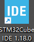

## GPIO

GPIO引脚就是通用输入输出引脚

GPIO有八种输出模式

1.推挽输出：输出3.3v高电压或输出0v低电压

### 点灯大师LED master

新建项目

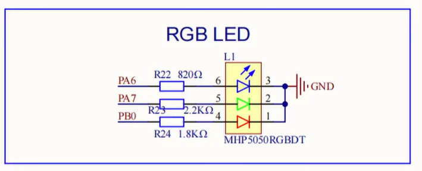

将PA7设置为GPIO_OUT,然后在GPIO设置之中，将其设置为高电平

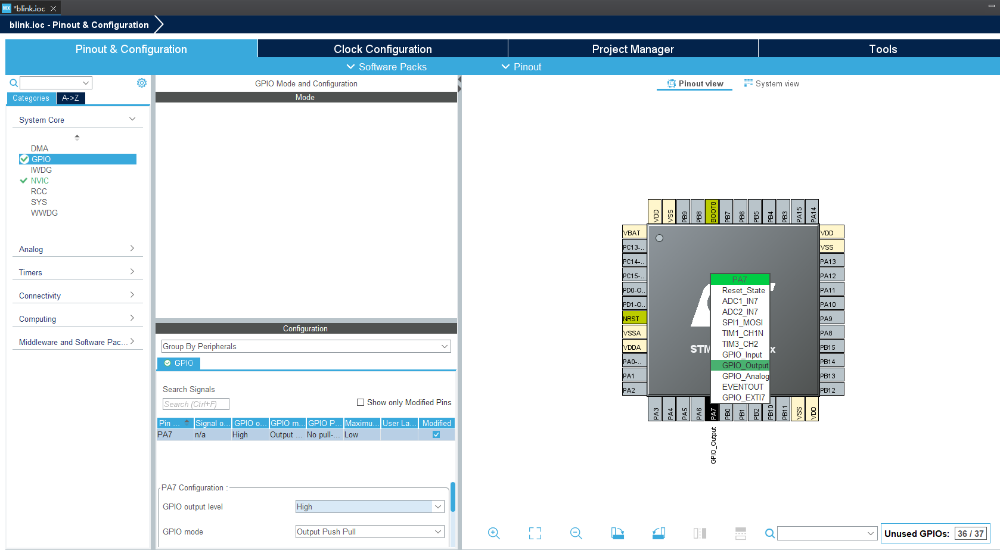

然后ctrl+s或者右上角保存，点击build，然后点run，cubelIDE会自动将代码拷贝到单片机然后运行

### 点灯宗师 绚丽小灯

cubelIDE中打开了哪个的mian函数，在运行时就会自动下载对应的文件

按照点亮PA7的设置进行，将PA7保持低电平

IDE自动生成的代码中，存在一对对的注释

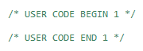

如果我们需要自己编写代码，需要将自定的代码写在这种注释间，这样IDE在编译时会自动保留注释间的代码

第一个代码

在GPIO_Init()处,添加HAL_GPIO_WritePin

函数第一个参数是GPIO组,第二个参数是GPIO编号,第三个参数设置高低电平

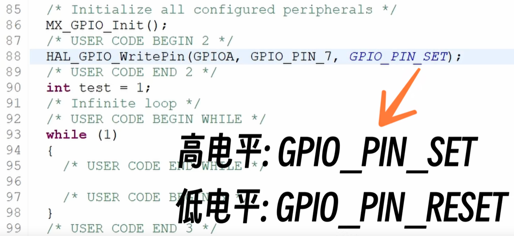

在while循环中写入点亮PA7的代码，并且在其后加入低电平代码，就可以实现小灯的闪烁，正常的指令执行时间是特别快的，如果不添加HAL_Delay（）延迟函数的话，是没法实现闪烁的。

HAL库的Delay函数，只有一个参数，表示延迟多少毫秒（单位是毫秒）

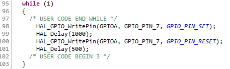

写炫彩小灯程序

在cubeMX页面，右键接口，可以自定义用户的接口标签

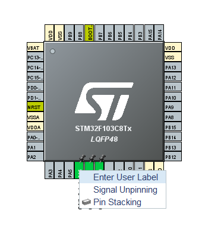

PA6标签为BLUE,PA7标签为GREEN,PB0标签为RED,

while循环体内容

```stm32
while (1)
  {
    /* USER CODE END WHILE */
	  if(state<=2||state == 5)
	  {
		HAL_GPIO_WritePin(RED_GPIO_Port,RED_Pin,GPIO_PIN_SET);
	  }else
	  {
		HAL_GPIO_WritePin(RED_GPIO_Port,RED_Pin,GPIO_PIN_RESET);
	  }
	  if(state>=1&&state<=3)
	  {
	  	HAL_GPIO_WritePin(GREEN_GPIO_Port,GREEN_Pin,GPIO_PIN_SET);
	  }else
	  {
		  HAL_GPIO_WritePin(GREEN_GPIO_Port,GREEN_Pin,GPIO_PIN_RESET);
	  }
	  if(state>=2)
	  {
	  	 HAL_GPIO_WritePin(BLUE_GPIO_Port,BLUE_Pin,GPIO_PIN_SET);
	  }
	  else
	  {
		  HAL_GPIO_WritePin(BLUE_GPIO_Port,BLUE_Pin,GPIO_PIN_RESET);
	  }
	  HAL_Delay(500);
	  state++;
	  if(state>5){
		  state=0;
	  }
    /* USER CODE BEGIN 3 */
  }
```

### 按键控制小灯

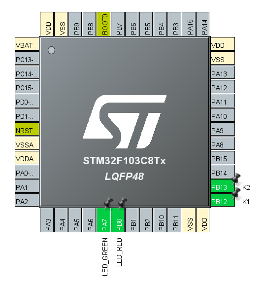

PB12、PB13设置为GPIO的input输入口，在GPIO设置中将PB13口的模式设置为上拉电阻模式

while循环内代码

```stm32
while (1)
  {
    /* USER CODE END WHILE */
	  if(HAL_GPIO_ReadPin(K1_GPIO_Port, K1_Pin)==GPIO_PIN_RESET)
	  {
		  HAL_GPIO_WritePin(LED_GREEN_GPIO_Port, LED_GREEN_Pin, GPIO_PIN_SET);
	  }else
	  {
		  HAL_GPIO_WritePin(LED_GREEN_GPIO_Port, LED_GREEN_Pin, GPIO_PIN_RESET);
	  }
	  if(HAL_GPIO_ReadPin(K2_GPIO_Port, K2_Pin)==GPIO_PIN_RESET)
	  {
		  HAL_GPIO_TogglePin(LED_RED_GPIO_Port, LED_RED_Pin);
		  while(HAL_GPIO_ReadPin(K2_GPIO_Port, K2_Pin)==GPIO_PIN_RESET){};
	  }else
	  {
		  HAL_GPIO_WritePin(LED_RED_GPIO_Port, LED_RED_Pin, GPIO_PIN_RESET);
	  }
    /* USER CODE BEGIN 3 */
  }
```

值得注意的是，在使用按键K2(PB13)时，需要使用while循环等待按键电平恢复，否则，由于stm电路的运算级别是毫秒级别的，按下一次PB13后，手松开还没等电平恢复高电平，程序已经执行很多遍了，导致无法控制

### GPIO八大模式

#### GPIO电路内部原理

所有GPIO口都围绕下图的电路结构实现

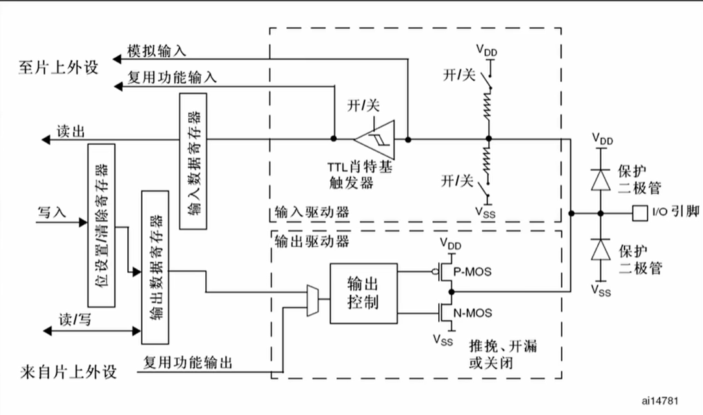

最右侧部分为保护电路，钳位到0-3.3V，也就是最高能承受3.3V的电压波动，长时间高电平输入会损坏电路

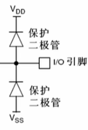

在stm手册中，I/O level代表芯片引脚的容忍电压，标为FT的引脚是5V容忍引脚

最左侧是数据寄存器

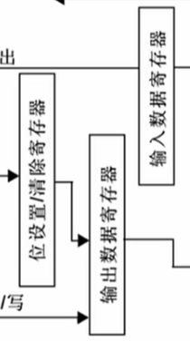

寄存器连接着程序和电路，按照每32位一组的数据存储芯片特定电路的开关信息，程序对电路的控制就是通过修改电路中的数据来实现的


WritePin函数中的参数就是讲BSRR寄存器中的第7位数据设置为1


输入驱动器

施密特触发器有两个参考电平，高于高参考电平判定为高电平信号，低于低参考电平判定为低电平信号，在两个参考电平之间会维持之前的电平不变，

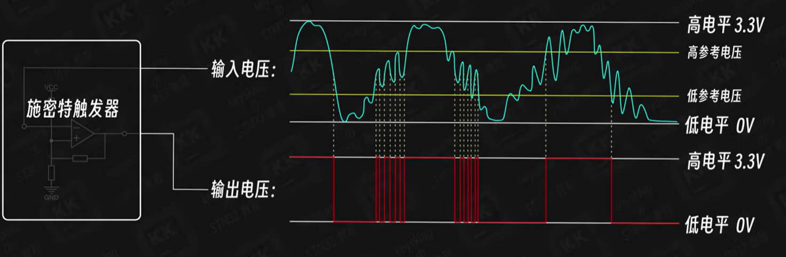

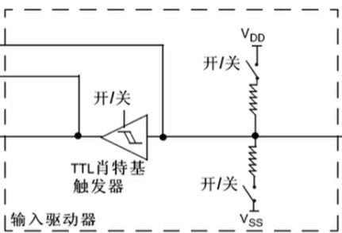

输出驱动器

输出控制模块控制着P-MOS和N-MOS模块，其实就是两个开关，VDD是高电平3.3V，VSS是低电平0V

有两个控制指令来源，一个输出寄存器的输入，另一个是片上外设的输入（串口模块、I2C模块这些）

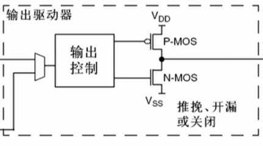

#### 推挽输出

该模式下，在输出驱动器中，P-MOS和N-MOS协同工作

假设小灯是高电平工作，程序将数据传入寄存器，然后输出驱动器将P-MOS连通，N-MOS关闭，这样就会使得输出高电平到外部电路，I/O引脚接收高电平，小灯点亮

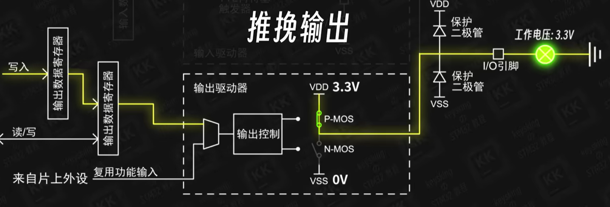

推挽输出只能实现3.3V的高电平输出，如果模块需要更大的电平进行驱动，就无法使用推挽输出

#### 开漏输出

开漏输出有更大的电压工作范围

开漏输出模式下，输出驱动器中只有N-MOS在工作，但是工作模块并不接地，而是存在外接电源，例如这里小灯原本的接地端直接接入了5V的高电平，只要N-MOS连通，小灯就能变为通路，有外接5V电源提供电压

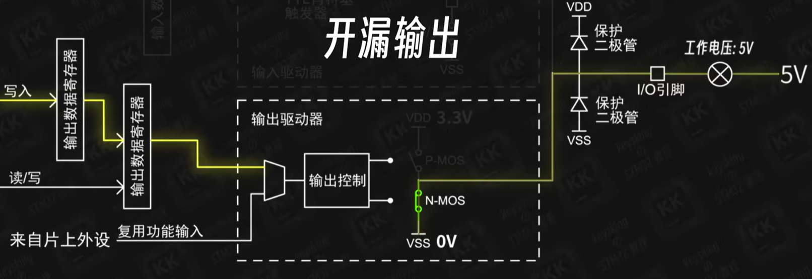

值得注意的是，因为外接电源的缘故，模块的I/O口不能随意选区，要根据外接电压大小选择能承受相应高电压的I/O口，避免造成损坏

开漏输出依赖外部电源提供驱动，更加灵活

推挽输出直接提供内部电源进行驱动

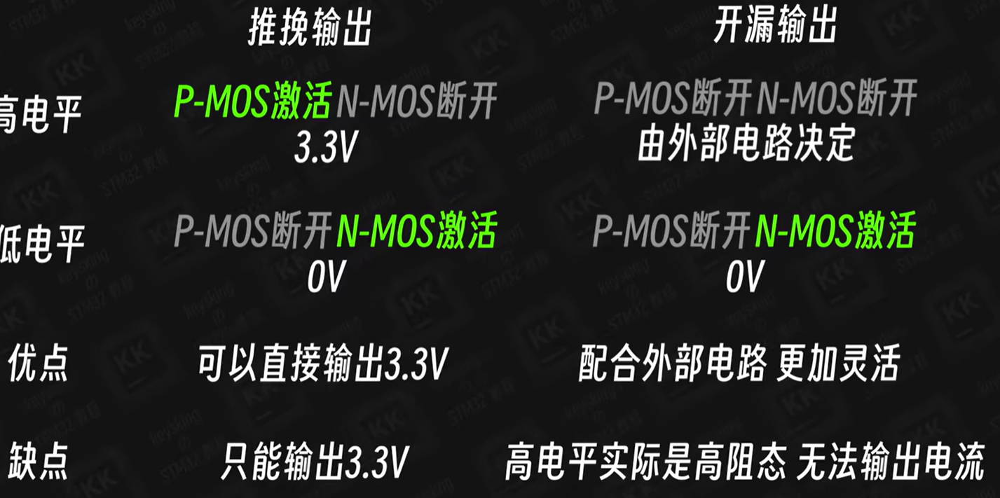

#### 复用推挽输出

复用推挽输出接收的指令来自片上外设，原理与推挽输出一致

#### 复用开漏输出

复用开漏输出接收的指令来自片上外设，原理与开漏输出一致

#### 浮空输出

相对于接口处连接了一个无限大的电阻，在不按下按键时，是高电平，按下按键后会接地，因此是低电平

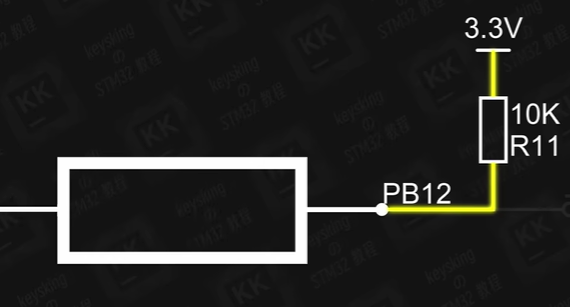

#### 上拉输入

上拉：使用电源将GPIO口拉高的操作，上拉操作可以起到限流作用，防止电源直接与GND相连而短路

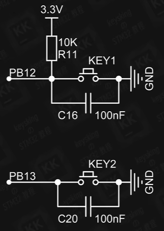

上拉电阻对应上拉电路

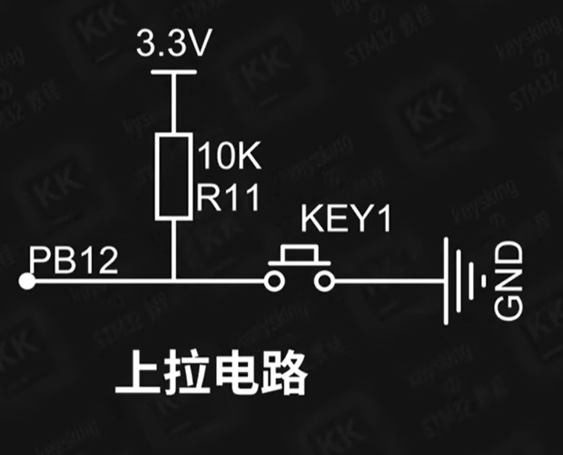

#### 下拉输入

下拉就是将GPIO口接地

将上拉电阻处连接的高电平与按键处连接的接地线对换，就可以得到默认低电平，按下按键后高电平的按键了

不过下拉不常用，因为会有短路的风险

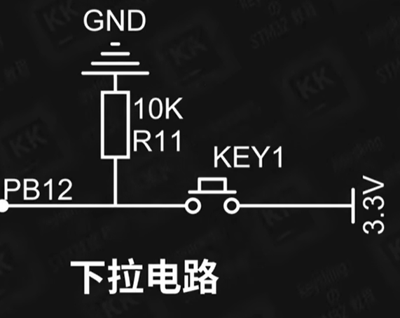

#### 模拟输入

在输入驱动器的左上角可以看到模拟输入

模拟输入：输入信号的准确电平值

数字输入：高电平输入1，低电平输入0

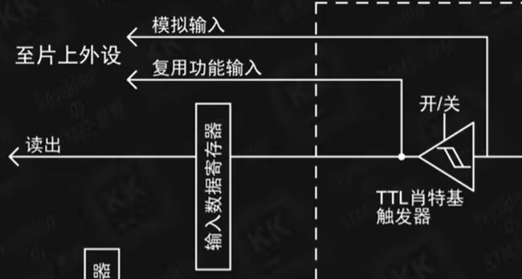

### 使用标准库进行点灯

标准库的特点就是操作寄存器，所以我们需要查阅手册了解GPIO的寄存器地址

GPIO的初始化流程（以GPIOB8为例）

* 使能GPIO时钟
* 配置GPIOB的第8个IO口
* 配置PB8为输出模式
* 配置PB8的输出类型为推挽
* 配置PB8的输出速度为100MHz
* 初始化GPIOB

```c
#include "stm32f4xx.h"

void delay(uint32_t);

int main()
{
	GPIO_InitTypeDef GPIO_InitStructer;
	RCC_AHB1PeriphClockCmd(RCC_AHB1Periph_GPIOB,ENABLE);

	GPIO_InitStructer.GPIO_Mode=GPIO_Mode_OUT;
	GPIO_InitStructer.GPIO_OType=GPIO_OType_PP;
	GPIO_InitStructer.GPIO_Pin=GPIO_Pin_8;
	GPIO_InitStructer.GPIO_PuPd=GPIO_PuPd_UP;
	GPIO_InitStructer.GPIO_Speed=GPIO_High_Speed;

	GPIO_Init(GPIOB,&GPIO_InitStructer);
	while(1)
	{
		GPIO_SetBits(GPIOB, GPIO_Pin_8);
		delay(200);
		GPIO_ResetBits(GPIOB, GPIO_Pin_8);
		delay(200);
	}
}

void delay(uint32_t cnt)
{
	uint32_t i,j;
	for(i=0;i<cnt;i++)
	{
		for(j=0;j<0xFFF;j++)
		{}
	}
}
```

各种寄存器的函数参数，st公司都已经定义好了，不知道怎么写就去函数定义里不断查找，总能找到对应的宏定义

## 中断

### 中断机制

计算机中异常的一种，嵌入式设备也是通用的

正在执行任务1时，中断任务1，先处理更重要的任务2，任务2执行完成后再执行任务1


触发中断的事件有很多：指令出错、计时器时间结束、串口接受到数据、GPIO口电平发生变化

EXIT0到EXIT15对应的是16根信号线，可以将对应的GPIO按钮设置为输出到EXIT信号线

中断的过程（stm32电路）：输入驱动器处理GPIO输入信号——>边沿检测电路——>请求挂起寄存器——>NVIC(中断控制器)——>NVIC根据对应中断向量执行对应中断处理函数——>清零请求挂起寄存器，防止重复触发


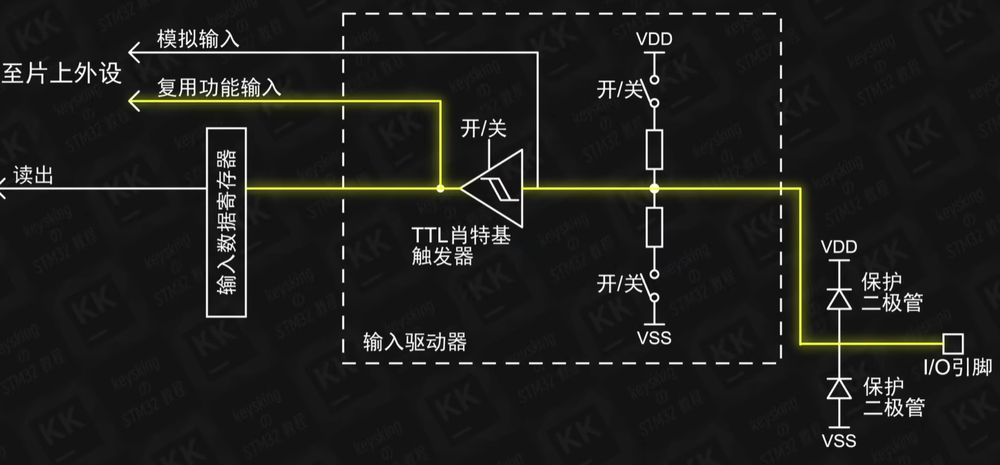

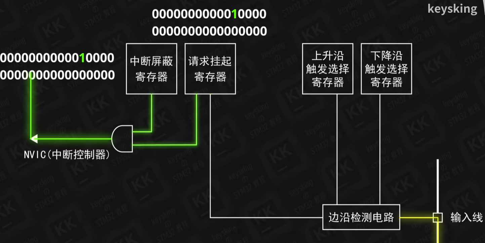

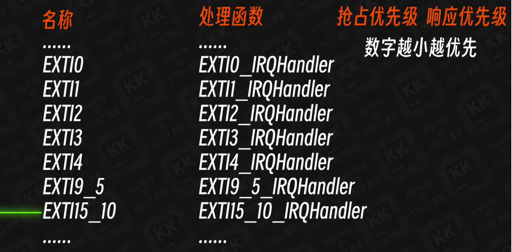

多个中断同时触发时，可以设置优先级来规定执行顺序

优先级分为抢占优先级和响应优先级

多个中断同时触发时，先比较抢占优先级再比较响应优先级，数字越小越优先

### 外部中断的使用

任务：红色小灯闪烁，当按下KEY1时，绿色小灯亮起

将PB12设置为GPIO_EXIT12

共有六种模式：上升沿触发中断、下降沿触发中断、上下沿都触发中断

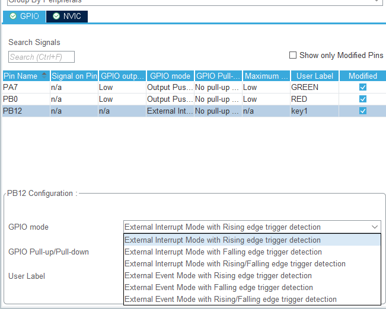

由于按键key1是接的上拉电阻，当按下时，会产生一个低电平，也就是下降沿信号，因此选择下降沿触发中断模式

在NVIC种启动EXT15到10的中断向量

在Src文件下的stm32f1xx_it.c代码中，有着各个中断处理函数的定义，找到对应的函数，编写中断处理代码这里按键产生的是EXIT12信号，对应处理函数EXTI15_10_IRQHandler(void)

因为硬件的消抖效果不是那么好，所以除了直接写入反转小灯电平的函数，还需要进行软件消除抖动，也就是在执行反转函数时延迟10ms，以判断是按键按下还是抬起

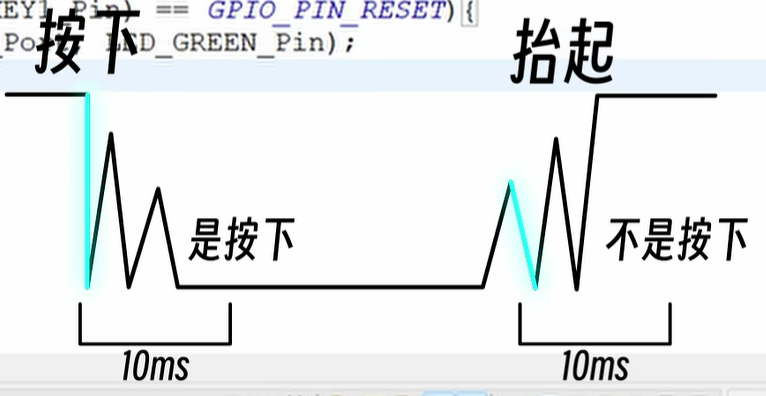

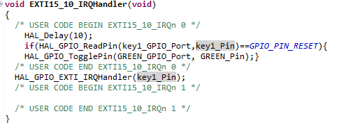

除此之外，还需要对中断处理函数的优先级进行修改，默认的EXIT15_10函数的优先级与时钟函数的优先级一样，而delay函数依赖于时钟函数，因此不修改优先级的话，函数执行会直接卡死

需要让Time base的优先级小于EXTI函数

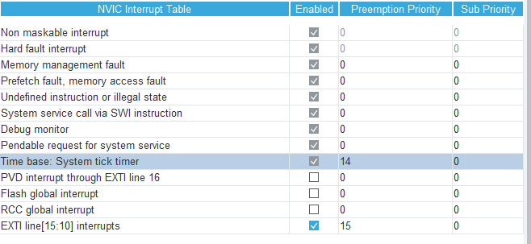

## 串口

### 初识串口

常见的串口有rs232、rs485、usb、TTL

嵌入式常见的串口是TTL串口，TTL只有两根数据线，发送的口为TX（transmit），用于接受的口为RX（receive），使用时需要让一个设备RX口接另一个设备的TX口，此外还有一根地线用于共地

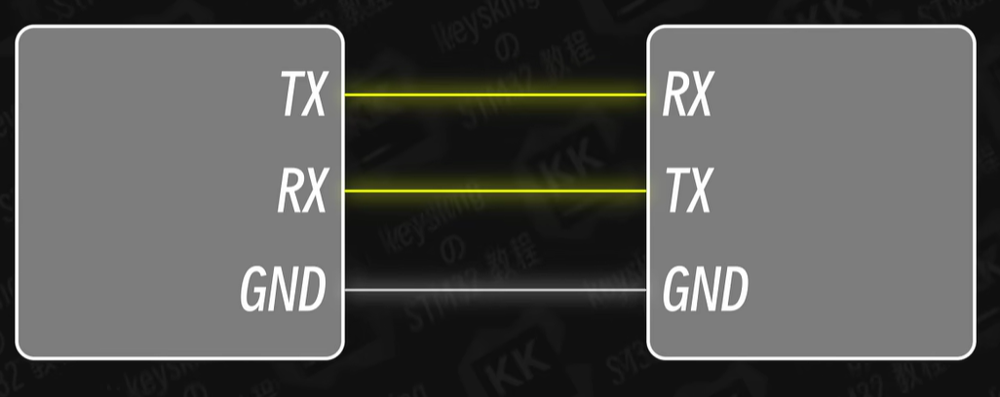

TTL串口通信

* 全双工通信
* 异步通信

### 轮询模式

#### 发送数据

在sys中将debug口设置为串行模式

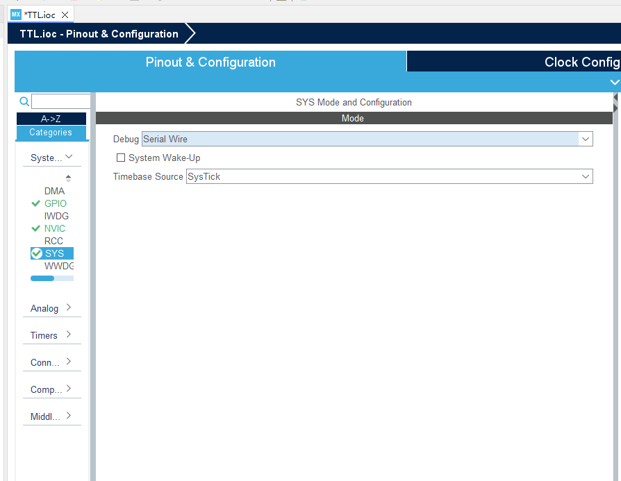

connectivity下有很多种串口，I2C、CAN、USART、USB

**UART** （通用异步收发器）、**USART** （通用同步/异步收发器）

TTL使用的是UART通信方式

查看学习版引脚可知，串口USART2将串口USART2的通信方式

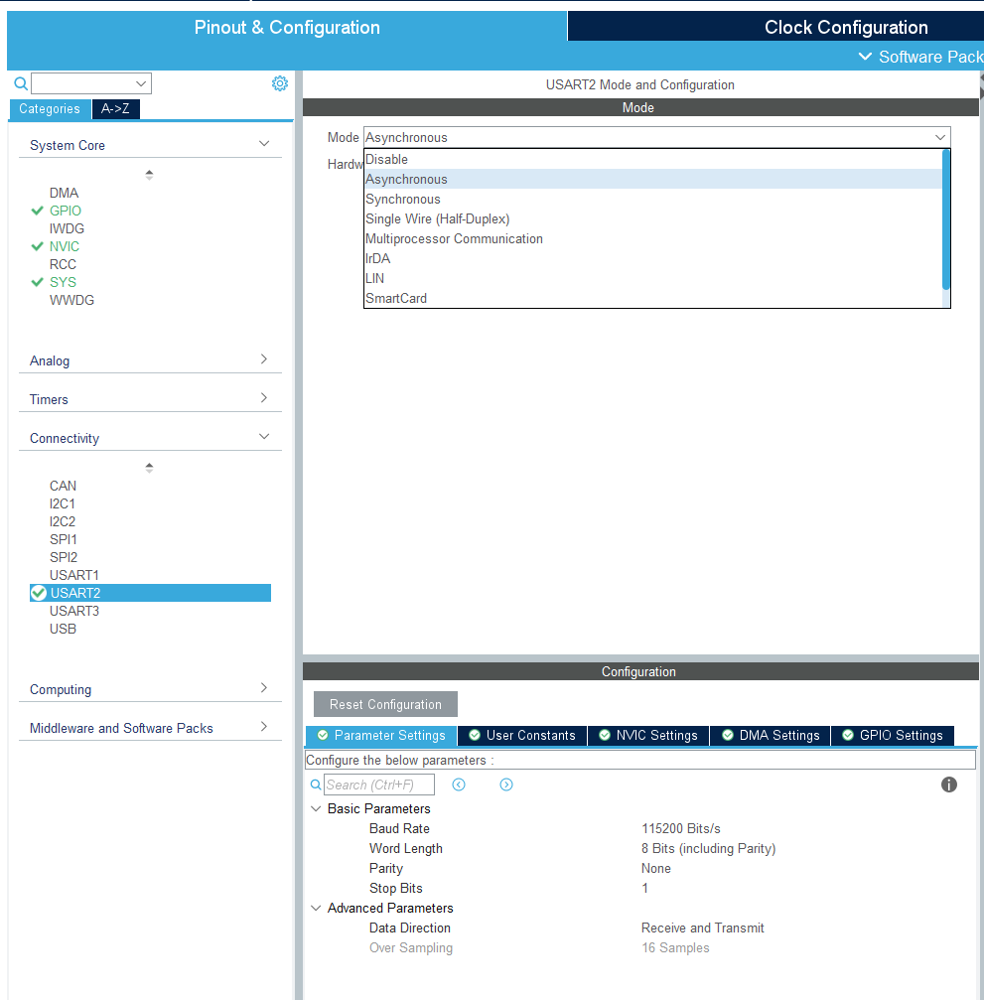

需要注意的是通信设备的波特率，一般常用的波特率有9600、19200、38400、115200

PA2、PA3分别打开对应的TX和RX模式，生成代码后，main中会出现初始化函数

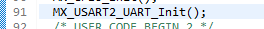

轮询模式串口发送函数HAL_UART_Transmit

第一个参数是要操作的串口指针（huart2，含义是hal库的第二个uart串口）

第二个参数需要发送信息的指针（需要uint8_t类型的指针，注意使用强制转换或者定义的时就定义为uint8_t类型）

第三个参数内容长度（strlen函数取得）

第四个参数超时时间

与电脑的连接过程中，传输数据给开发板一般使用的是usb转TTL接口模块进行通信

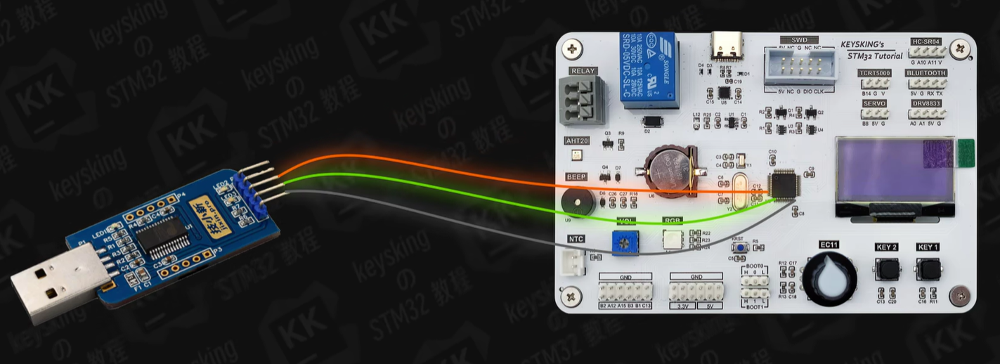

学习板上已经集成了串口转usb芯片，所以不需要连接模块

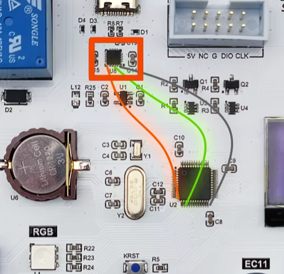

查看传输的数据使用的是串口调试工具（一类软件）

在工具中选择连接的串口（可以通过拔插接口的方式寻找），设置好波特率和数据位等参数与开发板代码设置一致，就可以收到消息了。

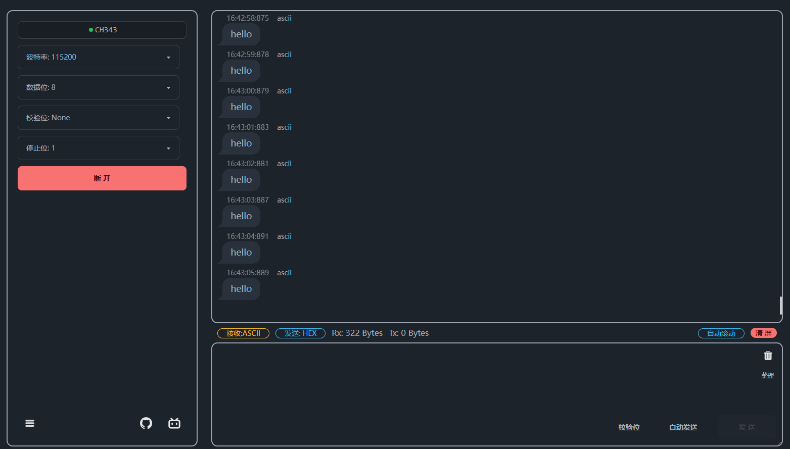

#### 接收数据

先定义接收数组

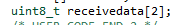

轮询模式串口接收函数HAL_UART_Receive

使用HAL_UART_Receive函数接收数据

参数与HAL_UART_Transmit是一样的

完整代码

```c
uint8_t rx_data[2];

while (1)
  {
    /* USER CODE END WHILE */
	  HAL_UART_Receive(&huart2, rx_data, 2, HAL_MAX_DELAY);
	  GPIO_PinState state = GPIO_PIN_SET;
	  if (rx_data[1] == '0')
	  {
	      state = GPIO_PIN_RESET;
	  }
	  if (rx_data[0] == 'R')
	  {
	      HAL_GPIO_WritePin(RED_GPIO_Port, RED_Pin, state);
	  }
	  else if (rx_data[0] == 'G')
	  {
	      HAL_GPIO_WritePin(GREEN_GPIO_Port, GREEN_Pin, state);
	  }
	  else if (rx_data[0] == 'B')
	  {
	      HAL_GPIO_WritePin(BLUE_GPIO_Port, BLUE_Pin, state);
	  }
	  HAL_UART_Transmit(&huart2, rx_data, 2, HAL_MAX_DELAY);
    /* USER CODE BEGIN 3 */
  }
```

### 串口原理

#### 串口发送

stm32中有着与发送相关的寄存器有发送数据寄存器（TDR）、发送移位寄存器

发送移位寄存器将数据转换成高低电平从TX引脚输出

**发送数据寄存器**存储下一位要发送的数据，stm32的CPU会不断查询发送寄存器是否发送完，如果发送完了，就会将**发送数据寄存器TDR**中的数据传给**发送移位寄存器**，然后把下一位待发送数据传到**发送数据寄存器TDR**中

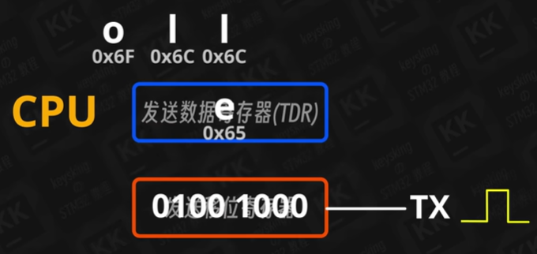

#### 串口接收

stm32中有着与发送相关的寄存器有**接收数据寄存器（RDR）**、**接收移位寄存器**

**接收移位寄存器**读取RX传来的高低电平信号，每读取八位，就传给**接收数据寄存器（RDR）**，CPU读取RDR中有一位数据，就将数据读入储存器

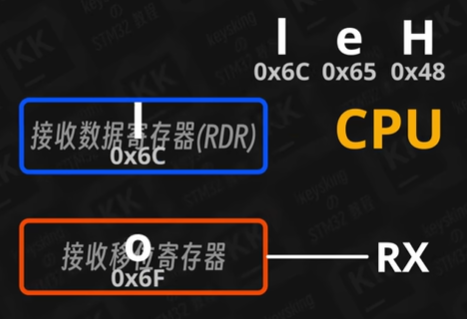

### 中断模式收发

#### 阻塞现象

在轮询模式收发过程中，CPU会一直查询数据寄存器，不管是接收还是发送，使得cpu无法完成其他任务，这种情况称为“阻塞现象”

要消除阻塞，可以使用中断机制，当移位寄存器发送完了，CPU再去完成数据转移操作，其他时间可以进行其他任务

#### 中断收发函数

中断接收函数HAL_UART_Receive_IT有三个参数

* 第一个是需要操作串口的指针
* 第二个参数是要发送数据的指针
* 第三个参数是发送数据的长度
* 因为不需要占用cpu使得阻塞,所以中断接收函数并没有第四个参数超时时间

HAL_UART_Receive_IT不会阻塞程序,写在循环体内会导致程序还没接收完数据就会继续向下执行了,因此函数要写在循环体外


在NVIC中将usart2的中断向量打开后

可以在stm32f1xx_it.c最后面看到usart2的中断处理函数


因为关于usart2的中断事件都共用一个中断向量，因此中断接收处理代码不能直接写在中断处理函数中

按ctrl点开函数HAL_UART_IRQHandler

在2600行左右可以看到关于RX接收和TX发送的回调函数，这里的函数都是弱定义，也就是说什么可以直接在main.c代码中强定义我们自己的回调处理函数，也就是触发中断接收或中断发送时，会运行的函数


直接复制函数结构到main.c中，把__weak前缀删掉，并且重新定义


1. 一般的接收处理函数会每接收一个电平信号就触发一次中断，但是HAL库中的接收中断会在收到规定的电平信号数后才会触发一次，（定义波特率时定义的数据长度），如果定义数据长度是8，那么接收8个电平信号后，才会执行一次中断
2. main函数中调用一次HAL_UART_Receive_IT(&huart2, rx_data, 2)，在接收两字节数据后就会自动触发中断，执行回调处理函数，其余时间cpu会去做其他事情
3. 需要注意的是，这里的rx_data变量需要作为全局变量来使用，因为不仅main函数中使用到了，在回调函数中也使用到了这个变量
4. 因为接收处理函数是不能写在循环中的，如果只在main中执行一次那么就只能接收一次数据，没法多次接收数据，所以我们在回调函数末尾再执行一遍接收处理函数，这样每次执行完回调函数，都会重新有一个接收函数在等待数据，实现多次接收数据

main函数


### 串口DMA模式

DMA通道能够实现数据搬运的自动处理，在触发数据发送寄存器空中断时不会再调用CPU处理，而是直接使用DMA处理，这样会更节省CPU的使用

在USART2的配置中，最上方除了基本信息1的配置，还有NVIC、DMA等配置选项，点开DMA配置，点开Add按钮


DMA推导可以选择为用于USART2的RX接收或者USART2的TX发送，分别创建RX接收和TX发送的DMA通道，其余参数保持默认即可


通道设置参数解释：DMA1的第六通道专门设计为UART2的接受通道，方向是接收寄存器到内存，优先级是低，由于寄存器只有一个字节因此地址不自增而内存数据要逐步读取因此设置地址自增


DMA模式收发就是将中断收发函数的后缀从IT改为DMA就行，函数的参数设置和中断收发函数是一样的，用法也是一样的。

### 收发不定长数据

使用串口空闲中断来接收不定长数据，因为当数据接收时，串口一直都有数据流入，当没有数据流入时，即没有电平信号传来时，就是触发了串口空闲中断

串口空闲中断触发函数HAL_UARTEx_ReceiveToIdle

Ex代表扩展，也就是HAL_UART的扩展函数

idle代表空闲中断

此函数也是存在着三个版本（正常，DMA，IT）


参数与之前的收发函数一致，只不过第三个参数代表的是一次接收最大的数据长度，一般是256

HAL_UARTEx_ReceiveToIdle对应的回调函数是HAL_UARTEx_RxEventCallback

在stm32f1xx_it.c中UART2的函数里，ctrl点进uart回调函数里可以找到，复制格式到main.c里重新定义一份


main中的回调函数定义


在接收时使用普通或者IT模式也是可以的，使用DMA模式时要注意过半中断回调的情况，当发送数据达到最大数组的一半时，会自动再调用一次回调函数（也就是说当收到的数据大于一半长度时，一次接收就会调用两次回调函数，接收过半一次，接收完一次）

为了避免过半回调的情况，需要在回调函数中手动添加关闭过半回调的命令_HAL_DMA_DISABLE_IT(&hdma_usart2_rx,DMA_IT_HT)

第一个参数是DMA通道的指针地址

第二个参数是要关闭中断行为


### 蓝牙模块（简易数据包解析）

蓝牙分为经典蓝牙和低功耗蓝牙（BLE）

蓝牙连接分为主机和从机，从机向外散发自己的信息，主机扫描信号，发起连接

建立连接后通过约定协议进行通信，协议有很多种

使用BT24蓝牙串口透穿模块，usart3接口连接

建立工程后将通信模式改为异步，将波特率修改为9600（蓝牙使用的一般是9600），NVIC中开启USART3的中断，并添加RX和TX的DMA通道

写上一套DMA接收不定长数据的代码（调用空闲中断函数、对应的回调函数）


发送的指令格式一般是：包头+长度+指令内容+校验位

这里规定

包头0xAA

灯灭为0xFF 灯亮为0x00

红灯0x01 绿灯0x02 蓝灯0x03

校验位的值为所有数的加和

代码

```c
void HAL_UARTEx_RxEventCallback(UART_HandleTypeDef *huart, uint16_t Size)
{
  if(huart==&huart3){
	  HAL_UART_Transmit_DMA(&huart3, receive_data, Size);
	  if(receive_data[0]==0xAA){
		  if(receive_data[1]==Size){
			  uint8_t sum=0;
			  for(int i=0;i<Size-1;i++){
				  sum+=receive_data[i];
			  }
			  if(sum==receive_data[Size-1]){
				  for(int i=2;i<Size-1;i+=2){
					  	  GPIO_PinState state = GPIO_PIN_SET;
					  	  if (receive_data[i+1] == 0x00)
					  	  {
					  	      state = GPIO_PIN_RESET;
					  	  }
					  	  if (receive_data[i] == 0x01)
					  	  {
					  	      HAL_GPIO_WritePin(RED_GPIO_Port, RED_Pin, state);
					  	  }
					  	  else if (receive_data[i] == 0x02)
					  	  {
					  	      HAL_GPIO_WritePin(GREEN_GPIO_Port, GREEN_Pin, state);
					  	  }
					  	  else if (receive_data[i] == 0x03)
					  	  {
					  	      HAL_GPIO_WritePin(BLUE_GPIO_Port, BLUE_Pin, state);
					  	  }
				  }
			  }
		  }
	  }
	  HAL_UARTEx_ReceiveToIdle_DMA(&huart3, receive_data, sizeof(receive_data));
	  __HAL_DMA_DISABLE_IT(&hdma_usart3_rx,DMA_IT_HT);
  }
}
```

逻辑竞就是先判断包头对不对,然后判断数据加和是否等于校验位,接下来就开始执行对应指令了

例如:0xAA 0x05 0x01 0xFF 0xAF

就是让小灯0x01点亮

在进行复杂任务时，我们需要建立数据缓冲区，把数据搬到main函数中while循环里进行处理

### 使用标准库实现USART串口功能

GPIO、RCC、USART

#### 使用USART实现printf（）

使用串口通信，一般是以下几个步骤

* IO引脚复用功能初始化
* 1
* 1
* 1
* 1


## I2C

### I2C通信原理

I2C通信和TTL串口一样也是使用两根线，一条共地线进行通信

两根数据线中，一根用于数据传输SDA，另一根用于传输时钟频率SCL


I2C通信是

* 半双工通信：同一时间只能接收或发送，不能同时进行收发
* 主从模式：只要主机发起通信请求，从机才能开始通信，因此I2C能够同时连接多个设备
* 总线协议：能同时对多个设备进行通信的协议
* 同步通信：由主机发送固定的频率信号作为总线上的统一时间

I2C通信协议中，每个设备都有自己唯一的地址，当需要与某个从机通信时，就可以发送对应的地址进行通信

I2C通信过程：需要发送信号时，主机先在时钟线高电平时，拉低通信电平作为通信开始的信号，当主机发送完数据后，在低电平时由从机将电平拉低一次作为应答信号，随后总线控制权转交给从机，从机发送完信号后，主机在时钟处于高电平时将数据线拉高，结束通信

只有在发送开始通信和结束通信时，主机才会在时钟线高电平进行操作，其余时间的通信都是在时钟线低电平发送数据的


### 实现与温湿度传感器AHT20的通信

打开usart2，设置异步，打开I2C1，设置为I2C模式

在project manager->code generator中打开“为每个外设单独生成一份.c文件”选项，保存


在项目文件的core->src里就能看到对应的外设驱动文件


src中新建新的头文件，注意文件名要手动添加头文件.h后缀，否则不会自动生成初始代码，同时新建一个同名的c代码源文件


写代码

.h头文件中引用头文件i2c.h

.c文件中引用.h头文件

这样就可以在c代码文件中使用i2c.h的函数了，i2c.h中有i2c1这个对I2C1接口操作的句柄（类似之前使用的huart2、huart3）

文件套娃路径


数据手册中找到读取流程


其实ath20传感器的地址是0x38，但是I2C规定与从机交互时，地址会左移一位，初始化从机左移补零，即0x70，从从机读取数据左移动补1，即0x71

I2C读取函数HAL_I2C_Master_Receive()有五个参数

* 第一个参数是操作接口的句柄指针&hi2c
* 第二个参数是从机地址
* 第三个参数是接收数据的变量指针
* 第四个数据是读取数据大小
* 第五个是超时时间

I2C读取函数HAL_I2C_Master_Trasnsmit()有五个参数

* 第一个参数是操作接口的句柄指针&hi2c
* 第二个参数是从机地址
* 第三个参数是接收数据的变量指针
* 第四个数据是读取数据大小
* 第五个是超时时间

对照数据手册读取内容，实现AHT的初始化函数和测量函数

```c
#include"AHT20.h"

#define AHT_ADDRESS 0X70

void AHT20_Init(){
	uint8_t readBuffer;
	HAL_Delay(40);
	HAL_I2C_Master_Receive(&hi2c1, AHT_ADDRESS, &readBuffer, 1, HAL_MAX_DELAY);
	if((readBuffer & 0x08)==0x00)
	{
		uint8_t sendbuffer[3]={0xBE,0x08,0x00};
		HAL_I2C_Master_Transmit(&hi2c1, AHT_ADDRESS, sendbuffer, 1, HAL_MAX_DELAY);
	}
}


void AHT20_Read(float *Temperature,float *Humidity)
{
	uint8_t sendBuffer[3]={0xAC,0x33,0x00};
	uint8_t readBuffer[6]={0};

	HAL_I2C_Master_Transmit(&hi2c1, AHT_ADDRESS,sendBuffer, 3, HAL_MAX_DELAY);
	HAL_Delay(75);
	HAL_I2C_Master_Receive(&hi2c1, AHT_ADDRESS, readBuffer, 6, HAL_MAX_DELAY);

	if((readBuffer[0] & 0x80)==0x00){
		uint32_t data=0;
		data=(((uint32_t)readBuffer[1]<<12)+((uint32_t)readBuffer[2]<<4)+((uint32_t)readBuffer[3]>>4));
		*Humidity=data*100.0f/(1<<20);
		data=((((uint32_t)readBuffer[3]&0x0F)<<16)+((uint32_t)readBuffer[4]<<8)+((uint32_t)readBuffer[5]));
		*Temperature=data*200.0f/(1<<20)-50;
	}
}

```

要将实现的函数在.h文件中声明


main.c文件中先包含头文件


### I2C中断、DMA与状态机编程

#### 中断方式

不使用中断机制的话，I2C正常收发过程中CPU会一直被占用。无法完成其他任务

通信时，每发送一个字节的数据从机都要发送应答信号

中断模式能做到当从机发送应答信号之后，CPU会来处理一字节的数据发送，然后再去做其他任务，直到再次收到从机的应答信号

DMA模式是将所有的字节数据发送都交给DMA来完成，直到所有数据发送完再通过中断通知CPU来处理

在I2C1的NVIC配置中，将I2C1的事件中断和错误中断都打开，主要使用事件中断


将AHT20的代码改造，将读取数据的收发函数修改为_IT后缀，并把第五个参数超时时间删去

```c
void AHT20_Read(float *Temperature,float *Humidity)
{
	uint8_t sendBuffer[3]={0xAC,0x33,0x00};
	uint8_t readBuffer[6]={0};

	HAL_I2C_Master_Transmit_IT(&hi2c1, AHT_ADDRESS,sendBuffer, 3);
	HAL_Delay(75);
	HAL_I2C_Master_Receive_IT(&hi2c1, AHT_ADDRESS, readBuffer, 6);

	if((readBuffer[0] & 0x80)==0x00){
		uint32_t data=0;
		data=(((uint32_t)readBuffer[1]<<12)+((uint32_t)readBuffer[2]<<4)+((uint32_t)readBuffer[3]>>4));
		*Humidity=data*100.0f/(1<<20);
		data=((((uint32_t)readBuffer[3]&0x0F)<<16)+((uint32_t)readBuffer[4]<<8)+((uint32_t)readBuffer[5]));
		*Temperature=data*200.0f/(1<<20)-50;
	}
}
```

**因为使用了中断完成数据读取,所以程序在调用完读取函数后,就继续执行剩下的代码,不会等待数据读取完成,这就会导致,当运行到发送读取数据的代码时,数据还没有测量完，导致显示结果出错**

解决这个问题需要使用简单的状态机


使用中断接收发送,就是在正常的接收发送函数后添加后缀_IT,并且删除等待时间

HAL_I2C_Master_Transmit_IT();

HAL_I2C_Master_Receive_IT();

这两个函数都是四个参数

* 第一个参数是操作接口的句柄指针&hi2c
* 第二个参数是从机地址
* 第三个参数是接收数据的变量指针
* 第四个数据是读取数据大小

将原本的测量函数拆开为三部分，初始化函数不动

```c
void AHT20_Init(){
	uint8_t readBuffer;
	HAL_Delay(40);
	HAL_I2C_Master_Receive(&hi2c1, AHT_ADDRESS, &readBuffer, 1, HAL_MAX_DELAY);
	if((readBuffer & 0x08)==0x00)
	{
		uint8_t sendbuffer[3]={0xBE,0x08,0x00};
		HAL_I2C_Master_Transmit(&hi2c1, AHT_ADDRESS, sendbuffer, 1, HAL_MAX_DELAY);
	}
}
void AHT20_Measure(){
	static uint8_t sendBuffer[3]={0xAC,0x33,0x00};
	HAL_I2C_Master_Transmit_IT(&hi2c1, AHT_ADDRESS,sendBuffer, 3);
}

void AHT20_Get(){
	HAL_I2C_Master_Receive_IT(&hi2c1, AHT_ADDRESS, readBuffer, 6);
}

void AHT20_Analysis(float *Temperature,float *Humidity){
	if((readBuffer[0] & 0x80)==0x00){
			uint32_t data=0;
			data=(((uint32_t)readBuffer[1]<<12)+((uint32_t)readBuffer[2]<<4)+((uint32_t)readBuffer[3]>>4));
			*Humidity=data*100.0f/(1<<20);
			data=((((uint32_t)readBuffer[3]&0x0F)<<16)+((uint32_t)readBuffer[4]<<8)+((uint32_t)readBuffer[5]));
			*Temperature=data*200.0f/(1<<20)-50;
		}
}
```

关于中断使用的几点说明

* sendBuffer需要使用静态变量,若 `sendBuffer` 是普通局部变量（栈内存），函数退出时缓冲区被销毁，但I2C外设仍在访问该内存（通过DMA或中断），导致出错。
* 重新定义的函数要记得在.h文件中进行声明

状态机实现,对main.c修改

```c
/* USER CODE BEGIN PV */
// 0:初始状态 1：正在发送测量命令 2：测量命令发送完成 等待75ms后读取AHT20数据 3：读取中 4：读取完成，解析并展示数据，然后恢复初始状态
uint8_t aht20state=0;
/* USER CODE END PV */

int main(void)
{

  /* USER CODE BEGIN 1 */

  /* USER CODE END 1 */

  /* MCU Configuration--------------------------------------------------------*/

  /* Reset of all peripherals, Initializes the Flash interface and the Systick. */
  HAL_Init();

  /* USER CODE BEGIN Init */

  /* USER CODE END Init */

  /* Configure the system clock */
  SystemClock_Config();

  /* USER CODE BEGIN SysInit */

  /* USER CODE END SysInit */

  /* Initialize all configured peripherals */
  MX_GPIO_Init();
  MX_I2C1_Init();
  MX_USART2_UART_Init();
  /* USER CODE BEGIN 2 */
  AHT20_Init();

  float temperature,humidity;
  char message[50];
  /* USER CODE END 2 */

  /* Infinite loop */
  /* USER CODE BEGIN WHILE */
  while (1)
  {
    /* USER CODE END WHILE */
//	  AHT20_Read(&temperature,&humidity);
//	  sprintf(message,"温度：%.1f ℃，湿度：%.1f %%\r\n",temperature,humidity);
//	  HAL_UART_Transmit(&huart2,(uint8_t *)message,strlen(message),HAL_MAX_DELAY);
//	  HAL_Delay(1000);

	  if(aht20state==0){
		  AHT20_Measure();
		  aht20state=1;
	  }else if(aht20state==2){
		  HAL_Delay(75);
		  AHT20_Get();
		  aht20state=3;
	  }else if(aht20state==3){
		  AHT20_Analysis(&temperature,&humidity);
		  sprintf(message,"温度：%.1f ℃，湿度：%.1f %%\r\n",temperature,humidity);
		  HAL_UART_Transmit(&huart2,(uint8_t *)message,strlen(message),HAL_MAX_DELAY);
		  HAL_Delay(1000);
		  aht20state=0;
	  }
    /* USER CODE BEGIN 3 */
  }
  /* USER CODE END 3 */
}
```

关于main.c函数改造的几点说明

* 由状态1到状态2(Transmit函数完成后自动执行的)、状态3到状态4(Receive函数完成后自动完成)都是在回调函数中实现的
  ```
  //在I2C.c中重新实现回调函数的声明
  /* USER CODE BEGIN 0 */
  void HAL_I2C_MasterTxCpltCallback(I2C_HandleTypeDef *hi2c)
  {
  	if(hi2c==&hi2c1){
  		aht20state=2;
  	}
  }


  void HAL_I2C_MasterRxCpltCallback(I2C_HandleTypeDef *hi2c)
  {
  	if(hi2c==&hi2c1){
  			aht20state=4;
  		}
  }
  /* USER CODE END 0 */
  ```
* aht20state状态变量需要在main.h中进行extern声明,因为不止main中使用,中断函数也要使用这个变量

#### DMA方式

实现方式与中断方式相同，只需要更改两个接收发送函数就行，将后缀从_IT修改为_DMA

## OLED

OLED屏幕的原理就是将很多的小灯进行排列,只要点亮需要的小灯就可以显示图像了

使用的是128列X64行的小灯

与使用GPIO口正常点亮小灯不同,一般的屏幕是使用屏幕驱动芯片来实现的(常用的有CH1116、SSD1306芯片)


芯片会将屏幕的小灯进行分页分组处理

将64行分为8页（每一页有8行），由0-127对每一列进行编号


这样分完后指定页号上每一列都有8个小灯，就更好可以使用1字节数据控制8个小灯的状态（一字节是八位）

### CH1116芯片通信

#### 指令通信


指令格式是三位

* 第一位是I2C接口的地址
* 第二位固定是0x00
* 第三位是指令

设置页地址

如果要设置page0的地址，则指令内容为0xB0，如果要设置page7的地址，则指令内容为0xB7

设置列地址

列地址设置要分两次发送，设置第90列的地址，先将低4为设置为A（指令为0x0A），再将高4位设置为5（指令为0x15）

#### 数据通信


* 第一位是I2C接口的地址
* 第二位固定是0x40
* 第3位往后，每个字节代表一列（8个）小灯的亮灭

CH1116芯片还有一个特性，就是每次设置完一位数据后，列地址会自动+1

例如设置完要操作第0页，第0列的小灯，接着发送数据，第三位会控制0页0列的小灯、第四位会控制0页1列的小灯......

**用法**:只要设置要操作第0页，第0列的小灯,然后使用数据发送的指令,发送128位数据,就可以设置完第0页小灯的亮灭,然后再让设置为第1页,继续循环8次就可以完成整个屏幕的亮灭了

#### 实操过程

##### 工程配置

**开启外部晶振** ：在Pinout&Configuration -> System Core -> RCC 页面，将 High Speed Clock (HSE) 配置为 Crystal/Ceramic Resonator


**配置时钟频率** ：在Clock Configuration 页面，将PLL Source 选择为 HSE，将System Clock Mux 选择为 PLLCLK，然后在HCLK (MHz) 输入72并回车，将HCLK频率配置为 72 MHz


**配置I²C1** ：在 `I2C1` 配置页，将I2C模式选择为  **`I2C`** ，并在下方 `Parameter Settings` 将 `I2C Speed Mode` 选择为 **`Fast Mode`**


**配置生成单独.c/.h文件** ：在Project Manager -> Code Generator页面中，勾选Generate peripheral initialization as ... per peripheral


##### 代码

###### (1) 初始化过程

创建oled.h和oled.c

oled.c中包含头文件oled.h

## 定时器TIM

### 时钟树

#### 时钟信号

时钟信号产生与边沿触发器有关

边沿触发器的特性是只有输入端有一个低电平到高电平变化时，会使得输入端和输出端连通，其他时候输入端与输出端不连通，输入端的信号就由时钟信号给出（按照一定频率制造上升沿）


边沿触发器用于阻隔单片机内部各个电路模块运算的互相影响（因为电路运算会存在一定的延迟，造成电压不稳，如果直接连通各个模块的话，可能会传递错误信号）

时钟树完整图


#### 主干

stm32内部存在一个AHB（先进高性能总线），AHB连接着各个模块，是各个外设之间通信的总线

**HCLK**是AHB中的时钟信号线


systick是系统处理器中给处理器提供时钟基准的部件，HCLK与systick的连接之间存在分频器，用来设定处理器的运行时钟


APB（先进外设总线）是用来连接外设与stm32的总线，APB1和APB2连接不同功能的外设


* APB上的时钟线也是来自HCLK，连接部分存在一个分频器，用来设置APB连接外设的时钟频率，分频后外设使用的时钟叫PCLK（APB1用的叫PCLK1，APB2用的叫PCLK2）
* PCLK连接至定时器的部分还存在一个倍频器，用来保证定时器有一个高频的时钟信号，倍数无法自行设置，而是分频器的倍数为/1时，倍频器为x1倍，当分频器倍数为/2 /4 /8 /16时，倍频器的倍数是x2
* PCLK连接至定时器的部分存在一个额外分频器


HCLK的时钟源来自HSI、HSE、通过PLL锁相环的HSI或HSE

HSI是高速内部时钟

HSE是高速外部时钟，需要接入晶振才能使用，晶振的精度会比高速内部时钟的精度要高很多

#### 补充分支

FCLK是自由运行时钟，真正来源是AHB的预分频器，在HCLK停止工作时（stm32休眠时），FCLK仍然能够启动，能够使得stm32从休眠模式唤醒


Flash编程接口，时钟信号永远来自HSI


USB提供时钟信号的分支，信号来源是PLL锁相环


CSS时钟安全系统，时钟来自HSE或PLL时可以选择开启，当HSE发送故障时，会立刻切换信号为HSI，可以紧急制动


独立小时钟树，时钟源是低速内部时钟LSI、低速外部时钟LSE、HSE的/128分频，连接外设是RTC和IWDG（看门狗）


MCO时钟输出功能，在RCC中勾选“Master Clock Output”，就可以将PA8设置为RCC_MCO输出，将时钟信号引出来，连接其他外部额外电路会使用，一般用不到


### 基本定时功能

***定时器就是计数器***

定时器功能：计数、捕获脉冲宽度、计算PWM占空比、输出PWM波形、编码器计数

f10系列有8个定时器：TIM1~TIM8

按功能强弱分为

* 基本定时器：TIM6、TIM7
* 通用定时器：TIM2、TIM3、、TIM4、TIM5
* 高级定时器：TIM1、TIM8

计时原理：一串脉冲信号以恒定频率输入到寄存器，寄存器每收到一个上升沿就+1，那么只要读取寄存器中的数据，就可以得到计时时间


由于寄存器最多存放16bit位数据，如果输入72MHz的话，最大才能记录0.09s，不够用

为了解决这个问题，寄存器前添加了预分频器，当接收到了n个脉冲后就发送一个脉冲给计数器

预分频器本质上也是个计数器，要设置为n分频，那么分频器的数字要设置为n-1


定时器之间也是可以级联的，这样可以增加最大计时时间

自动重装载寄存器：定时m个脉冲，当计数器的值达到m-1时，就会将计数器清零，并且“提醒一次”（调用一次函数）


预分频器和自动重装载寄存器都有影子寄存器的机制，就是真正工作的其实是预分频器的拷贝，还有自动重装寄存器的拷贝

自动重装寄存器的影子寄存器机制，是可以手动打开的


设置预分频器和自动重装载寄存器，会在下一个计数周期才生效

补充：计数器三种模式

* 向上计数模式：从0开始计数到自动重装载预设值
* 向下计数模式：从预设值开始计数到0
* 中央对齐模式：从0开始计数到自动重装载预设值再倒数回0

### 定时器更新中断

当每次计时器计数到自动重装载寄存器的预设值时，会触发的中断

先启用TIM4/NVIC中的中断选项，打开TIM4的全局中断


启动TIM4的函数加上_IT后缀，启动中断

```c
HAL_TIM_Base_Start_IT(&htim4);
```

重写中断回调函数(每一次)

弱定义在drivers/STM32F1xx_HAL_Driver/src/stm32f1xx_hal_tim.c


#### 定时器中断机制实操过程

启动TIM4，勾选内部时钟源

根据APB的定时器速率设置，设置预分频器与自动重载寄存器

开启定时器中断，使用HAL_TIM_Base_Start_IT启动定时器TIM4

重写HAL_TIM_PeriodElapsedCallback中断回调函数

### 定时器外部时钟


stm32f103上每个定时器有四个输入通道：TI1、TI2、TI3、TI4

TI1~TI4每个输入通道都有输入滤波器（消抖）、边沿检测器

边沿检测器是检测到上升或下降边沿就会发出脉冲的装置

TI1_ED只能双边沿触发

TI1FP1和TI2FP2可以选择上升、下降、双边触发


外部时钟ETR有两种模式，一个是与定时器的信号一样输入到从模式控制器（外部时钟模式1），另一种是独立输入触发控制器（外部时钟模式2）

因为stm32f103引脚有限，因此TIM3和TIM4并没有引出对外部时钟的GPIO口，所以只有TIM2和TIM1能够使用EXR

极性选择和边沿检测配合形成可上升、下降、双边触发的触发器，ETR最高只能为内部时钟的1/4，所以需要结果预分频处理，输入滤波用于消抖


### 循迹模块


模块上有用于手动调节阈值的定位器

当红外光强度大于阈值时，小灯就会亮起，同时DO引脚输出高电平


#### 实操

##### 使用外部时钟模式2

设置TIM2为EXR模式，这样PA0引脚就会设置为TIM2定时器的外部时钟输入


将循迹模块中的DO引脚接到PA0，就能将循迹模块DO引脚产生的时钟信号引入定时器TIM2中


TIM的基本设置中，下方clock中有三个选项

Clock Filter对应ETR的滤波设置,用于消除抖动,填入0-15之间的数字,每个数字对应的滤波大小可以查手册得到,一般都是直接填15就行

Clock Polarity对应ETR的极性选择

Clock Prescaler对应ETR的预分频设置


打开I2C选项，并设置为每个外设独立生成.c/.h文件

将oled.c oled.h从标准库中添加到工程文件

main中引入头文件


main.c文件中写入以下代码

```c
 /* USER CODE BEGIN 2 */
  HAL_Delay(20);
  OLED_Init();
  HAL_TIM_Base_Start(&htim2);
  int counter=0;
  char message[20]="";
  /* USER CODE END 2 */

  /* Infinite loop */
  /* USER CODE BEGIN WHILE */
  while (1)
  {
    /* USER CODE END WHILE */
	  OLED_NewFrame();

	  counter =__HAL_TIM_GET_COUNTER(&htim2);
	  sprintf(message,"counter:%d",counter);
	  OLED_PrintString(0,0,message,&font16x16,OLED_COLOR_NORMAL);


	  OLED_ShowFrame();

	  HAL_Delay(100);
    /* USER CODE BEGIN 3 */
  }
```

为了消除抖动,需要将TIM2的滤波设置为15


如果记录的值超过了64435，那么可以选择使用中断更新的方式，记录中断调用的次数，输出为寄存器的值+更新次数*自动重装载寄存器设定值

##### 使用外部时钟模式1

TIM2的模式设置为外部时钟模式1，然后就可以看到很多时钟源

ETR1、TI1_ED、TI1FP1、TI2FP2就是图中输入到触发器的四个外部时钟信号


选择ETR1模式，其余不用改动和使用外部时钟2是一样的

### 外部时钟模式1

#### 定时器从模式

外部时钟模式1是通过从模式控制器实现的


cubemx中除了外部时钟模式1，还有：

复位模式Reset Mode：与自动重装载寄存器功能差不多，当从模式控制器收到预设的信号（上升沿、下降沿、双边），就会将计数器置为0，

* 复位模式也会触发定时器更新中断（调用中断回调函数）
* 从模式设置为复位模式后，从模式控制器就会被占用了，不再作为时钟信号源，此时可以把内部时钟或EXR的外部时钟模式2作为时钟源


触发源除了ETR1、TI1_ED、TI1FP1、TI2FP2外

还有其他选项ITR0~ITR3,这些在之后的笔记会提到


定时器中断的触发是通过设置标志位来实现的,当自动重装载寄存器达到预设值或从从模式控制器有输入,都会导致相应的标志位被置为1,当检测到标志位为1就会触发相应中断


只要检测相应标志位,就能区分是自动重装载触发的中断还是从模式控制器触发的中断

获取标志位的函数,在回调函数定义中能够找到

```c
__HAL_TIM_GET_FLAG(htim,TIM_FLAG_TRIGGER)//第一个参数是哪个定时器,第二个参数是获取哪个标志位
```

在调用标志位后,stm32是不会自动将标志位清零的,所以为了以防万一,要记得为标志位手动清零

* 定时器每一次初始化时都会使得更新中断标志位置为1,程序启动时会调用一次中断回调函数,如果影响了判断逻辑,可以在初始化前将其手动清零

  

```
__HAL_TIM_CLEAR_FLAG(htim,TIM_FLAG_TRIGGER);
```

一份回调函数示例


##### 从模式实操

打开usart2为异步模式

TIM2设置为复位模式，触发源为TI1FP1，时钟源为内部时钟源，打开TIM2全局中断

TIM2的预分频器为8000-1,自动重装载寄存器为5000-1

时钟树保持PB1为8MHz不变,这样的结果是,定时器频率为1000Hz,每5秒触发一次自动重装载

main函数中，写入tim2的中断初始化,以及定时发送定时器的代码

```c
/* USER CODE BEGIN 2 */
  HAL_TIM_Base_Start_IT(&htim2);
  int counter=0;
  char message[20]="";
  /* USER CODE END 2 */
  while (1)
  {
	  counter=__HAL_TIM_GET_COUNTER(&htim2);
	  sprintf(message,"counter: %d",counter);
	  HAL_UART_Transmit(&huart2,(uint8_t*)message,strlen(message),100);
	  HAL_Delay(500);
  }
```

重写TIM2的中断回调函数

```c
char updateMSG[]="正在自动重装载";
void HAL_TIM_PeriodElapsedCallback(TIM_HandleTypeDef *htim){
	if(htim==&htim2){
		HAL_UART_Transmit(&huart2,(uint8_t*)updateMSG,strlen(updateMSG),100);
	}
}
```

当触发源没输入时会看到串口每

连接循迹模块,每次光线变化,都会触发自动重装载

#### 定时器门模式

门模式Gate Mode:将从模式变为一道门,当外部时钟源(例如TI1),当外部时钟源输入高电平时,门就打开,计时器可以正常接收内部时钟源或EXR外部时钟模式2的信号,相对于将外部时钟源作为一个条件判断


* 默认是高电平打开,低电平关闭,如果需要反转这个效果就需要在cubelmx中设置为下降沿触发

  
* 门模式在收到上升下降沿时会将触发器中断标志位置为1,但是不会重置定时器,所以不会触发定时器的更新中断函数

##### 门模式实操

在门模式下,更新中断标志位与触发器标志位没有关系,所以标志位判断逻辑是不能写在定时器更新中断的回调

示例代码,其余设置与从模式一致

```c
 
/* USER CODE BEGIN 0 */
char updateMSG[]="正在自动重装载";
char triggerMsg[]="从模式触发";
void HAL_TIM_PeriodElapsedCallback(TIM_HandleTypeDef *htim){
	if(htim==&htim2){
		HAL_UART_Transmit(&huart2,(uint8_t*)updateMSG,strlen(updateMSG),100);
	}
}
/* USER CODE END 0 */
/* USER CODE BEGIN 2 */
  HAL_TIM_Base_Start_IT(&htim2);
  int counter=0;
  char message[20]="";
  /* USER CODE END 2 */

  /* Infinite loop */
  /* USER CODE BEGIN WHILE */
  while (1)
  {
	  if(__HAL_TIM_GET_FLAG(&htim2,TIM_FLAG_TRIGGER)==SET){
			__HAL_TIM_CLEAR_FLAG(&htim2,TIM_FLAG_TRIGGER);
			HAL_UART_Transmit(&huart2,(uint8_t*)triggerMsg,strlen(triggerMsg),100);
		}
	  counter=__HAL_TIM_GET_COUNTER(&htim2);
	  sprintf(message,"counter: %d",counter);
	  HAL_UART_Transmit(&huart2,(uint8_t*)message,strlen(message),100);
	  HAL_Delay(500);
    /* USER CODE END WHILE */

    /* USER CODE BEGIN 3 */
  }
```

#### 定时器触发模式

触发模式Trigger Mode:检测到设定的边沿后让定时器开始计数

* 触发模式只要检测到设定边沿就会让定时器开始计数,所以触发模式只能开启计数,并不能停止计数,所以一般会与单脉冲模式一起使用
* 单脉冲模式就是计时器不再循环计数,计数到自动重装载后就会停止计数

##### 定时器触发模式实操

TIM2设定为触发模式,勾选下面的"One Pulse Mode",打开单脉冲模式,其余与从模式一致


### 输入捕获与超声波测距

超声波测距模块HC-SR04


原理:发出超声波,再接收遇到障碍物返回的声波

* **(发送时间-接收时刻)x声速/2=距离**

HC-SR04模块有两个主要接口Trig和Echo

控制端Trig输入一个高电平后,模块会发送超声波,并且将输出端Echo拉高,当接收到回声时会让Echo端拉低


只要计算Echo端高电平持续时间就能计算距离了

#### 输入捕获

输入通道捕获到上升沿/下降沿时(可设置),立刻将计数器值记录到捕获寄存器中,以便程序随时读取


当TI1或TI2触发捕获时,会将计数器上的值存入对应的捕获寄存器,并且如果重写了捕获回调函数,还会触发一次回调函数

一个捕获寄存器只能捕获上升沿或下降沿,不能实现双边沿捕获

但是stm32存在TI1FP2和TI2FP1两个输入口,使得TI1可以使用TI2的捕获寄存器,TI2可以使用TI1的捕获寄存器

TI3与TI4也存在这样的机制

捕获函数HAL_TIM_IC_Start()

* 两个参数
* 第一个是定时器操作句柄
* 第二个是哪一个通道

```c
HAL_TIM_IC_Start(&htim1,TIM_CHANNEL_3);
HAL_TIM_IC_Start_IT(&htim1,TIM_CHANNEL_4);
```

#### 实操

sys的debug设为serial wire模式,RCC使用外部晶振,I2C1设置位I2C模式

总线时钟设为72MHz,代码生成中设置为每个外设生成一份单独代码

打开PA11引脚,重设名称为Trig

TIM1设置为


粘贴库font.h、oled.h、font.c、oled.c

代码

```c
 /* USER CODE BEGIN 0 */
int upEdge=0;
int downEdge=0;
float distance=0;
void HAL_TIM_IC_CaptureCallback(TIM_HandleTypeDef *htim)
{
  if((htim==&htim1) && htim->Channel==HAL_TIM_ACTIVE_CHANNEL_4){
	  upEdge = HAL_TIM_ReadCapturedValue(htim,TIM_CHANNEL_3);
	  downEdge=HAL_TIM_ReadCapturedValue(htim,TIM_CHANNEL_4);
	  distance=((downEdge-upEdge)*0.034)/2;
  }
}
/* USER CODE END 0 */
/* USER CODE BEGIN 2 */
  HAL_Delay(20);
  OLED_Init();

  HAL_TIM_Base_Start(&htim1);
  HAL_TIM_IC_Start(&htim1,TIM_CHANNEL_3);
  HAL_TIM_IC_Start_IT(&htim1,TIM_CHANNEL_4);

  char message[20]="";
  /* USER CODE END 2 */

  /* Infinite loop */
  /* USER CODE BEGIN WHILE */
  while (1)
  {
	  HAL_GPIO_WritePin(Trig_GPIO_Port,Trig_Pin,GPIO_PIN_SET);
	  HAL_Delay(1);
	  HAL_GPIO_WritePin(Trig_GPIO_Port,Trig_Pin,GPIO_PIN_RESET);
	  __HAL_TIM_SET_COUNTER(&htim1,0);
	  HAL_Delay(20);

	  OLED_NewFrame();

	  sprintf(message,"距离：%.2fcm",distance);

	  OLED_PrintString(0,0,message,&font16x16,OLED_COLOR_NORMAL);

	  OLED_ShowFrame();

	  HAL_Delay(500);
	  /* USER CODE END WHILE */

    /* USER CODE BEGIN 3 */
  }
```

### 定时器输出比较模式

定时器输出比较模式下,捕获寄存器被用作比较寄存器


输出比较模式下,比较寄存器设定值会一直与计数器里的值进行比较,根据比较结果判断输出高电平或者低电平

输出比较有四种模式

* 冻结模式:不输出,或者说比较结果不改变比较寄存器的输出
* 强制有效:无论比较结果如何,都输出有效电平
* 强制无效:无论比较结果如何,都输出无效电平
* 匹配模式:有三种设置,一是设置为与计数器相等时,输出有效电平,二是相等时输出无效电平,三是相等时翻转电平
* **PWM模式1**：计数器值小于比较寄存器时输出有效，计数器值大于比较寄存器时输出无效电平
* **PWM模式2**：计数器值小于比较寄存器时输出无效，计数器值大于比较寄存器时输出无效电平


比较寄存器的出口处存在一个输出控制器，可以设置输出何种电平，默认情况下寄存器输出有效电平时，GPIO口输出高电平，通过设置输出控制器可以翻转这种效果

### 呼吸灯

只要将渐变的pwm信号输出到小灯上,就能做出呼吸灯一样的效果

#### 实操

开发板设置

Debug设hi为Serial Wire

RCC的高速时钟源设置为晶振

时钟树将HCLK设置为72MHz

TIM3设置

* 通道1为PWM模式1
* 打开内部时钟源
* 预分频器为72分频（计数器输入信号为1MHz频率，1秒钟计1M次数）
* 自动重装载器值为100（一秒钟数10000次0到99，可以推出PWM信号的周期为0.0001秒=0.1μs）
* PWM模式1的比较寄存器的预设值为50


由于TIM3通道1的GPIO口已经连接了LED小灯，所以只需要控制通道一输出的电平就可以控制小灯亮灭了

在main函数的while循环中写入以下循环代码

```c
for(int i=0;i<100;i++){
		__HAL_TIM_SET_COMPARE(&htim3,TIM_CHANNEL_1,i);
		HAL_Delay(10);
	  }
	  for(int i=99;i>=0;i--){
	  	__HAL_TIM_SET_COMPARE(&htim3,TIM_CHANNEL_1,i);
	  	HAL_Delay(10);
	  }
```

**代码实现的PWM波形变化**

**第一个for循环（变亮过程）：**

* 比较值从0递增到99
* 占空比从0%逐渐增加到99%
* PWM波形的高电平时间逐渐变长
* LED亮度从熄灭逐渐变亮到接近最亮

**第二个for循环（变暗过程）：**

* 比较值从99递减到0
* 占空比从99%逐渐减少到0%
* PWM波形的高电平时间逐渐变短
* LED亮度从接近最亮逐渐变暗到熄灭

**代码实现的时间特性**

 每个亮度级别持续10ms（HAL_Delay(10)）

* 完整的变亮过程：100个步骤 × 10ms = 1秒
* 完整的变暗过程：100个步骤 × 10ms = 1秒
* 一个完整的呼吸周期：2秒

### 旋钮控制输出PWM波形

#### 旋转编码器


编码器有着A相和B相两个输出口

可以自行设置输出电平，默认A相固定输出高电平，B相固定输出低电平

#### 标准库的

## PWM

### PWM基础

PWM信号就是周期方波信号


电路信号分

* 数字信号:高低电平
* 模拟信号:连续的信号,任意受到电磁干扰


pwm最大的作用就是用来作模拟信号的输出

因为stm32f103没法实现模拟信号的直接输出,因此使用PWM进行模拟


如果连接舵机,调节占空比还可以控制电机转速,控制舵机角度

### PWM输出

定时器有PWM输出模式

## ADC

### ADC原理

ADC是使用模拟信号输出数字信号的技术，有很多种实现方法

stm32使用的是逐次逼近法（SAR），原理就是二分比较

stm32f103使用的是12位ADC，也就是输出电压值由12位二进制数确定（0~4095），12位也被称为ADC的分辨率

比如0V对应二进制数0000 0000 0000，3.3V对应1111 1111 1111，因为stm32最大电压是3.3V，所以最大值（12位全是1）对应电压是3.3V


假如输入电压是0.9V，那么单片机会将0.9V保存在一个电容上，然后用1000 0000 0000（3.3V的一般1.65V）与之比较，如果待测电压比1.65V大就设置第12位为1，然后1再比较下一位二分位（0100 0000 0000）

依次循环往复，直到比较完12位数，就可以得到待测电压对应的二进制编码

然后会将该数值存入一个数据寄存器中，便于取用

比如测量结果转换为十进制是1116，那么用**1116/4095x3.3V**就可以得到待测电压

### ADC基本使用

原理只需了解即可，实际使用时，只需要这三部就可以使用

1启动ADC->2采样转换->3获取结果计算

stm32F103C8T6上的GPIO口有16个ADC采样通道

内部有两个ADC转换结构ADC1、ADC2，每一个结构内分规则组和注入组，规则组可以设定注册那几个ADC输入通道，输入电压后ADC结构就会将该通道的电压值放入**规则通道寄存器中**1


```c
HAL_ADCEx_Callbration_Start(&hadc1);//HAL库的校准函数，需要写在while循环之外
HAL_ADC_Start(&hadc1);//ADC启动函数,参数是AD的操作句柄
HAL_ADC_PollForConversion(&hadc1,HAL_MAX_DELAY);//等待转换完成的函数，参数1是adc的操作句柄，第二个是等待时间
HAL_ADC_GetValue(&hadc1);//获取转换值的函数
```

### 实操

两种使用示例

方法一：打开ADC1的PA5输出，配置时钟树hclk频率为72MHz，ADC1\2使用的是APB2，将ADC1\2时钟频率设为12MHz

打开用来显示数据的输出串口,这里使用uart2的DMA模式收发数据


main.c函数中，实现读取ADC1的转换值，再通过串口输出

写入以下函数

```c
 HAL_ADC_Start(&hadc1);
 HAL_ADC_PollForConversion(&hadc1,HAL_MAX_DELAY);


/* USER CODE BEGIN 2 */
  int value=0;
  float voltage=0.0;
  char message[20]="";

  HAL_ADCEx_Calibration_Start(&hadc1);
/* USER CODE END 2 */

  /* Infinite loop */
  /* USER CODE BEGIN WHILE */
  while (1)
  {
	  HAL_ADC_Start(&hadc1);
	   HAL_ADC_PollForConversion(&hadc1,HAL_MAX_DELAY);
	  value=HAL_ADC_GetValue(&hadc1);
	  voltage=(value/4095.0)*3.3;

	  sprintf(message,"ADC:%d %.2f",value,voltage);
	  HAL_UART_Transmit_DMA(&huart2,(uint8_t*)message,strlen(message));
	  HAL_Delay(1000);
    /* USER CODE END WHILE */

    /* USER CODE BEGIN 3 */
  }
```

方法二：在ADC1的配置选项中,将ADC1的Continuous Conversion Mode打开,这会让stm32只需要启动一次adc,以后会一直自动执行读取转换这个循环


其他设置与方法一一致

在main函数中写入以下代码

```c
/* Initialize all configured peripherals */
  MX_GPIO_Init();
  MX_DMA_Init();
  MX_ADC1_Init();
  MX_USART2_UART_Init();
  /* USER CODE BEGIN 2 */
  int value=0;
  float voltage=0.0;
  char message[20]="";

  HAL_ADCEx_Calibration_Start(&hadc1);
  HAL_ADC_Start(&hadc1);
  HAL_ADC_PollForConversion(&hadc1,HAL_MAX_DELAY);
  /* USER CODE END 2 */

  /* Infinite loop */
  /* USER CODE BEGIN WHILE */
  while (1)
  {
	  
	  value=HAL_ADC_GetValue(&hadc1);
	  voltage=(value/4095.0)*3.3;

	  sprintf(message,"ADC:%d %.2f",value,voltage);
	  HAL_UART_Transmit_DMA(&huart2,(uint8_t*)message,strlen(message));
	  HAL_Delay(1000);
    /* USER CODE END WHILE */

    /* USER CODE BEGIN 3 */
  }
```

因为转换过程stm32会自动执行,所以不需要将ADC启动的函数写入循环中,循环中只需要不断读取ADC1寄存器的值就可以了

### ADC多通道采集

ADC1的规则组中存在一个注册表,可以注册多个通道,使得单个ADC可以读取多个通道的输入,每个通道数据转换完成后,会将数据传送到**规则通道寄存器(ADC存放数据的寄存器)**,并且将转换结束标志位置为1


开启ADC的**扫描模式**后,ADC会循环采集注册表上的所有通道,然后依次放到寄存器

但是可能会出现寄存器值覆盖的情况,上一个通道的数据还没从寄存器里取出,就被下一个通道的测量值覆盖了

解决这种情况可以使用DMA功能,设定一个数组变量,让DMA在ADC每次转换完成后,都将数据从寄存器搬运到数组内

#### 实操

时钟树HCLK为72MHz,ADC1频率为12MHz

ADC1通道的IN4\IN5\内部温度通道\内部电压通道打开


内部电压通道的采样周期设置为71.5个周期


main中写入以下代码

```c
/* USER CODE BEGIN PV */
uint16_t values[4];
char message[50]="";
/* USER CODE END PV */

/* USER CODE BEGIN 0 */
void HAL_ADC_ConvCpltCallback(ADC_HandleTypeDef* hadc)
{
  if(hadc==&hadc1){
	  sprintf(message,"%d %d %d %d",values[0],values[1],values[2],values[3]);
	  HAL_UART_Transmit(&huart2,(uint8_t*)message,strlen(message),HAL_MAX_DELAY);
  }
}
/* USER CODE END 0 */

//main函数中写入
 /* USER CODE BEGIN 2 */
  HAL_ADCEx_Calibration_Start(&hadc1);


  /* USER CODE END 2 */

  /* Infinite loop */
  /* USER CODE BEGIN WHILE */
  while (1)
  {
	  HAL_ADC_Start_DMA(&hadc1,(uint32_t*)values,sizeof(values)/sizeof(uint16_t));
	  HAL_Delay(1000);
    /* USER CODE END WHILE */

    /* USER CODE BEGIN 3 */
  }
```

使用DMA

时钟树HCLK为72MHz,ADC1频率为12MHz

ADC1通道的IN4\IN5\内部温度通道\内部电压通道打开

采样周期均设置为71.5个周期


将ADC1的DMA通道打开,并将DMA的circular模式开启


```c
//以下代码写在main函数中

/* USER CODE BEGIN 2 */
  uint16_t values[4];
  char message[50]="";

  HAL_ADCEx_Calibration_Start(&hadc1);
  HAL_ADC_Start_DMA(&hadc1,(uint32_t*)values,sizeof(values)/sizeof(uint16_t));
  /* USER CODE END 2 */

  /* Infinite loop */
  /* USER CODE BEGIN WHILE */
  while (1)
  {
	  HAL_Delay(1000);
	  sprintf(message,"%d %d %d %d",values[0],values[1],values[2],values[3]);
	  HAL_UART_Transmit(&huart2,(uint8_t*)message,strlen(message),HAL_MAX_DELAY);
  }
```

NTC热敏电阻存在专门的计算公式,可以应用在代码中

温度计算

* **通过ADC值计算NTC电阻值**
  * `adc_value` 输入ADC结果，范围 0 - 4095
  * `return` 返回NTC电阻值，浮点数类型，单位Ω

```c
floatADC2Resistance(uint32_t adc_value){
return(adc_value /(4095.0f- adc_value))*10000.0f;
}
```

* **通过NTC阻值计算温度**
  * `R1` NTC电阻值
  * `return` 返回温度，float类型，单位摄氏度

```c
floatresistance2Temperature(float R1){
float B =3950.0f;
float R2 =10000.0f;
float T2 =25.0f;
return(1.0/((1.0/ B)*log(R1 / R2)+(1.0/(T2 +273.15)))-273.15);
}
```

## RTC

## SPI通信

SPI通信方式一种全双工同步串行通信方式

* 全双工通信
* 同步通信
* 串行通信

SPI一般由4条线组成

* 主设备输出与从设备输入线（MOSI）
* 主设备输入与从设备输出（MISO）
* 时钟信号（SCLK）
* 从设备使能选择线（CS）


主从机连接


单片机内spi通信模式选择

* Full-Duplex Master全双工主机
* Full-Duplex slave全双工从机
* Half-Duplex Master半双工主机
* Half-Duplex slave半双工从机
* Receive Only Master只接收型主机
* Receive Only slave只接收型从机
* Transmit Only Master只传输型主机

spi通信常用模块W25Q64\W25Q128


#### spi使用

## 寄存器

## 补充

## stm32电路原理图

### b站up：KEYSKING的STM32_KIT学习板


引脚说明


## stm32cube IDE使用

代码提示（补全）alt+/

跳转到声明：ctrl+鼠标点击函数名

# 树莓派

可参考文档：[入门 | Raspberry Pi 树莓派 ](https://pidoc.cn/docs/computers/getting-started)

## 基础入门

以下内容使用的是树莓派4B开发板

### 基本认识

树莓派分硬件和软件部分

软件部分包含操作系统和应用程序

树莓派的操作系统是基于linux系统开发出的Raspberry Pi OS系统，但是也有人移植了windows、安卓、苹果这些系统


Raspberry Pi OS系统一般使用命令行操作，但这个系统也存在桌面版

### 系统安装

需要读卡器和SD卡

使用官方提供的imager，下载Windows版本后，打开这个应用程序

选择好树莓派型号、系统版本、安装位置（SD卡）

下一步后，会询问是否自定义安装，一般建议使用自定义安装

自定义选项的内容就是linux系统的一些基本设置

* 用户名和密码
* WiFi认证
* 主机名
* 时区
* 键盘布局
* 远程连接（ssh）

安装完系统后，连接电源和显示器开机


没有显示器就一定要在自定义设置中设置好WIFI和SSH连接，并在WIFI连接的后台找到树莓派的网络地址

在windows连接ssh服务器，然后启动远程桌面连接

### 远程连接

#### ssh连接

笔记本和树莓派连接到同一个局域网下，先进到树莓派，接入设置，设置好我们的主机名，以后就一直使用我们的主机名登录，不怕麻烦也可以使用ip地址登录

##### 设置主机名

进入设置

```linux
sudo raspi-config
```

进入system options


进入hostname


设置好自己的主机名称后选择OK


以后连接树莓派，ip地址就是主机名字了


#### VNC连接显示远程屏幕

下载vncviwer

输入主机名称，登录用户和密码就可以显示远程桌面了


#### 静态IP地址设置

如果使用主机名连接的话，每次连接到网络，都会被网络分配一个新的ip地址，每次需要远程操作，都要查看一遍ip地址，使用静态ip地址可以让树莓派每次的地址都是同一个

### 文件传输

传输文件方法

* u盘传输
* vnc软件
* ssh服务器
* FTP文件传输协议

推荐使用服务器，用ssh就可以，简单方便

### 配置python编译环境

树莓派中推荐的编程语言就是python

树莓派中默认安装了python2和pytthon3，但是要注意版本问题

因为安装了python，所以我们也可以使用pip安装一些软件包

树莓派中自带了thonny编译器，能够编写一些python代码


### linux命令行的基本使用

详细的知识，请看linux的学习笔记，这里的描述很简略

#### 终端会话窗口


#### 超级用户

这命令前加上sudo，就可以以超级用户的身份执行指令，类似于windows的“以管理员身份运行”

也可以直接切换root用户，第一次进入root模式前要先设置密码

```powershell
sudo passwd root //设置root密码

su root //切换到root用户
```

#### 常用文件操作指令

```powershell
pwd    //显示当前所在目录
cd ~   //切换到主目录(/home/usr)，~也可省略不写
cd dir //切换到指定目录， dir表示文件路径
cd ..  //# 切换到上一级目录

ls //展示当前目录下所有文件
ls -a //展示当前目录下所有文件（包括隐藏文件）

touch file //创建文件
mkdir dir //创建目录

cat file //査看文件file内容
more file //查看文件file内容
head file //查看文件file前10行
tail file //查看文件file后10行

rm file //删除文件
rm -r dir //删除目录

mv file1 file2 //移动文件，若file2不存在，则将file1改名为file2)；若file2存在，则file1覆盖掉原file2，并更名为file2
mv file fir //将文件file移动到dir目录中
```

### 树莓派中使用docker

# IMU

## 一、介绍和应用

### 介绍

IMU惯性测量传感器，常见的有六轴和九轴的，六轴可以测量角速度和加速度，九轴多了磁力计

常用的有MPU6050（六轴）和MPU9050（九轴）

### 应用

#### 1.惯性测量

加速度为a，经过时间t之后，将a对时间t积分可得到小车路程s

转弯时，知道角速度**w**，由 ``ʘ=w•△t``可求得转弯角度

#### 2.多传感器融合

IMU和电机编码器进行惯导融合，更精准测量速度和运动轨迹，

与相机进行融合VIO

数据融合可以从时间和空间两方面进行解释

+ 时间：IMU数据频率很高，可以弥补低频率传感器（如相机）数据不连贯的不足
+ 空间：IMU可以和不同维度数据进行互补


    中央的芯片比较重要，其他部分都可以焊接出来

    DOF越多精度越高，价格也越高，常用的有6DOF和9DOF

    MPU6050和MPU9050自带数字运动处理器（DMP）


## 二、IMU原理

由加速度计和陀螺仪组成

### 1、加速度计

默认重力加速度g方向为-z，

加速度计主要是运用牛二定律，可以简化成小球放在盒子中的模型解释

``

盒子往左以a的加速度运动，盒子中静止的小球会和容器壁相撞，小球的质量是已知的，器壁上的压力计测量到作用力F，计算得出a的大小，且作用力的反方向就是整个物体的加速度方向。这样的装置在xyz三个方向上都有

### 2、陀螺仪

## 三、IMU姿态解算

### 1、加速度计姿态解算

### 2、陀螺仪姿态解算

初始角度加上角速度对时间的积分制即可得到现有角度

**Angel⊝=Angel⊝~0~+∫ wd~t~**

### 3、数据融合

    加速度和角速度都可以解算出姿态，但是加速度计容易受到振动的影响，所以噪声比较大；陀螺仪噪声很小，但是存在零漂问题（初始角度无法准确测量，且仪器静置时，角速度不完全为零），所以积分后误差会被积累。

    两种数据虽然无法直接使用，但是可以通过数据融合，将两种数据融合在一起，得到噪声小，误差也小的角度数据。

#### （1）互补滤波

    一阶互补滤波是将两种数据按照一定的比例融合在一起，

    但是一般用到比较少

#### （2）kalman滤波

    使用都是直接调库

## 四、原始数据采集

九轴IMU集成了三轴加速度、三轴角速度、三轴磁力

性能参数：量程、非线性性、零偏、轴间灵敏度、噪声密度、温偏

为了读取数据，需要用特定的通信协议与其通信，常见IMU一般使用I^2^C或者SPI协议，带有I^2^C控制器和SPI控制器

### I2C通讯协议

电路实现

当数据线为高电平时，说明没有设备在控制总线，而为

时钟线为高电平时，数据线由高跳低为启动信号

时钟线为低电平时，数据线由低跳高为结束信号

当时钟线处于低电平时，数据线才能变化，否则就会被判断为启动或者结束信号

通讯过程：

### SPI通信协议

SPI通讯协议的实现比I^2^C的要简单

标准SPI有四条线，分别是MOSI、MISO、SCLK、CS

MOSI和MISO是两条方向相反的数据线，意味着spi可以实现全双工的通信

SCLK为时钟线

CS为片选线

通信过程：

主机向从机发送一个字节，从机也会向主机发送一个字节

### 硬件电路搭建

集成IMU芯片的模块、单片机MCU

### 固件驱动开发

取数据需要进行一些必要操作，不能直接从IMU读取

SPI通讯，master I^2^C

### 上位ROS驱动程序


## 复数和2D旋转

### 基本变换

复数z=a+bi可以表示成用

$$
\begin{bmatrix}a\\b\\\end{bmatrix}
$$

来表示，基$\begin{bmatrix}1,i\end{bmatrix}$与其相乘就可以得到z

z1=a+bi，z2=c+di

复数加减法𝑧1 − 𝑧2 = (𝑎 − 𝑐) + (𝑏− 𝑑)*𝑖.*
复数乘法z1z2 = ac - bd + (bc + ad)*i* = $\begin{bmatrix}a,-b\\b,a\\\end{bmatrix}$$\begin{bmatrix}c\\d\\\end{bmatrix}$
z1z2=$\begin{bmatrix}a,-b\\b,a\\\end{bmatrix}$$\begin{bmatrix}c,-d\\d,c\\\end{bmatrix}$=z2z1（交换乘积次序不影响结果）
特殊复数矩阵
1=$\begin{bmatrix}1,0\\0,1\\\end{bmatrix}$ *i*=$\begin{bmatrix}0,-1\\1,0\end{bmatrix}$

复数的模长$||z||$=✓(a^2^+b^2^)=✓($z$$\overline{z}$)

复数共轭 $\overline{z}$=a - bi

### 欧拉角和四元数

#### 欧拉角

##### 介绍

欧拉角就是绕物体坐标系的三个轴（X,Y,Z）旋转的角度

###### 坐标系

坐标系分世界坐标系[^1]和刚体坐标[^2]

欧拉角可以分为两种情况：

1. 静态欧拉角：绕世界坐标系旋转，物体旋转过程中坐标轴保持静止
2. 动态欧拉角：绕刚体坐标系运动，物体旋转过程中坐标轴随着物体做系统的运动

###### 欧拉角计算

欧拉角方向遵循右手坐标系，包含三个自由量：yaw (偏航角)、pitch (俯仰角)、roll (翻滚角)，分别指绕Y/Z/X轴的角度


###### 右手坐标系

在右手坐标系中，大拇指指向坐标轴正方向，四指旋转方向为角度的正方向


左手和右手坐标系的特点在于，同样的位置坐标（或者说一个坐标点），如果将两个坐标系的两个轴对齐，那么最后一个轴的坐标方向是相反的

###### 欧拉角万向节死锁

#### 四元数

欧拉角的定义很形象，容易让人理解，但是如果使用计算机直接模拟计算的话计算量过大，而四元数不符合人一般的理解思维，但是更便于计算机计算

##### 四元数转欧拉角

传感器一般得到的数据是四元数，通常将四元数转换为欧拉角进行计算

# Vivado HLS设计

## HLS工作机制

CAD（计算机辅助设计）→CAE（计算机辅助工程）→EDA（电子设计自动化）→ESL（电子系统级的设计方法）

ESL

* 使用高级语言（C、C++）：Vivado HLS
* 基于模型的可视化设计工具：Xlinx的System Generator

Vivado HLS可以将c/c++转化为HDL的过程：scheduling（调度）→control logic extraction（控制逻辑提取）→binding（硬件资源映射）

HDL是硬件描述语言，主要有verilog和VHDL两种

## HLS设计流程

传统流程：HDL（verilog等）→RTL simulation（行为级仿真，验证算法）→synthesis（综合）→implementation（布局布线）→system debug

HLS设计流程：高级语言（C/C++）→C simulation（c语言仿真，验证算法）→c synthesis（c综合）→RTL Synthesis implementation（综合与布局布线）→system debug

综合时，会有三个指标：Latency、Timing、Resource


## 任意精度的数据类型


字符类型数据不支持（char类型）

任意精度的数据类型：


当使用这种声明时，我们可以尽量写在头文件里，这样便于调试

## 基本语法

### 变量初始化

int类型


ap类型变量可以在尖括号内填入四个值，定义整数部分和小数部分的精度


浮点型float需要加f后缀，表面它是单精度变量


隐式数据转换

显式数据转换

### 常用运算


### 打印字符信息


### C++基本运算

加减乘除、取余


自增自减


条件运算


逻辑运算和位运算

## 复合数据类型

也就是结构体和枚取类型

### 结构体struct

一般都是在头文件中进行声明


fileld_level：每个数据的边界向8对齐，结构体中每个数据占用空间都是8的倍数

struct_level:整体的边界向8对齐，比如一个结构体有5个int数据，每个四字节，那么一个结构体占20字节（4X5），整体向8对齐，所以最终占用24字节（8的倍数）

### 枚取类型enum


## C Test Bench

test bench是一个虚拟硬件环境，vivado中我们需要使用c/c++去描述一个环境，以此来在虚拟环境中验证我们的设计

stimulus提供输入数据

Reference Model：产生参考值

DUT：待测模型，我们需要综合的代码，

Scoreboard：把DUT结果与Reference进行比较

例子：测试一个加法程序


### 测试激励Stimulus

stimulus的数据源

* 直接定义
* 存储在数组中
* 通过外部文件读取

#### 使用数组


#### 从外部文件读取

使用c++的ifstream


例子：

文件路径一般直接放在test bench下，这样比较易读


### 输出监测Scoreboard

Scoreboard的功能就是比较输出和参考值

输出错误信息

有两种方法进行比较

* if语句
* 系统函数

#### 使用if语句


可以允许一定范围内的偏差

#### 使用系统函数

头文件要包含 `<fstream>`


### 格式控制Output Format

控制结果如何输出


bitset输出二进制

oct输出八进制

dec输出十进制

hex输出十六进制


浮点数输出要考虑精度


## 接口综合

### 基本介绍

接口指的是函数定义的输入


ap_ctrl_hs

ap_ctrl_none

ap_ctrl_ovld


### 对数组的处理


数组的protocol是ap_memory或者ap_fifo类型


### 向输入输出端口（IO）添加寄存器

添加寄存器的一定要保证protocol是ap_ctrl_hs


输出端口添加寄存器只需要打勾就行，输入端口添加寄存器需要手动输入对应的输入变量名

### 添加全局的时钟使能信号

ap_ce信号默认是不会添加的，可以手动开启这个信号


### 控制IO数量


### config_rtl


## for循环优化

### 基本性能指标


for循环主要有Latency以及相应的Interval这些指标，在程序仿真结果中可以看到

for循环在结束时，会有判断循环是否结束的周期消耗


### 流水线

流水线是最常见的一种循环优化方式


### 部分展开


### 循环合并

将Rigion中的代码进行合并，降低latency


这个做法其实是为大型项目准备的

如果是小体量的代码，其实循环不用合并，在编代码的时候直接写在一起进行了

其实就是在说：vivado中可以把循环看作一个整体变量来处理

### 数据流


### 嵌套for循环

循环分类


imperfect loop需要转变成semi-perfect或perfect loop

### 其他优化方法

## 数组优化

### 数组分割


三种数组分割方式

* Block分组
* Cyclic分组
* Register分组


### 数组映射和重组


### 其他优化方法


## 函数层面的优化


