# Pr

## Pr入门

# Au（附带录音与声音设计）

## Au入门

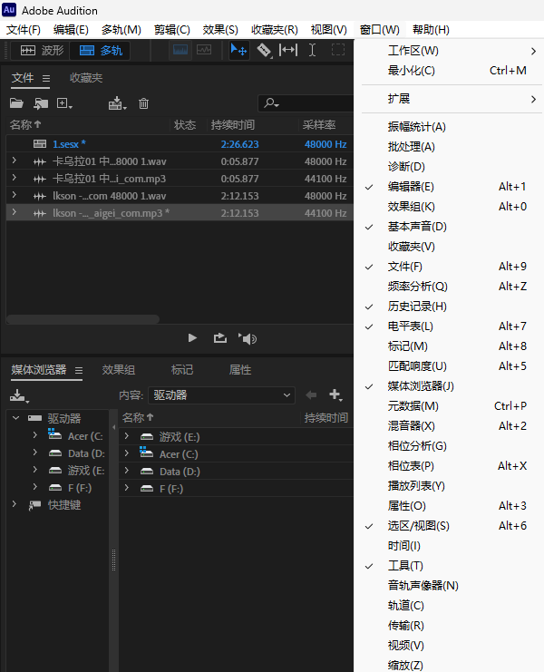

au中的所有功能页面都可以在窗口中打开，如果发现了有些窗口不在，可以手动打开

撤销：ctrl+z（老一套了）

### 如何录制音频

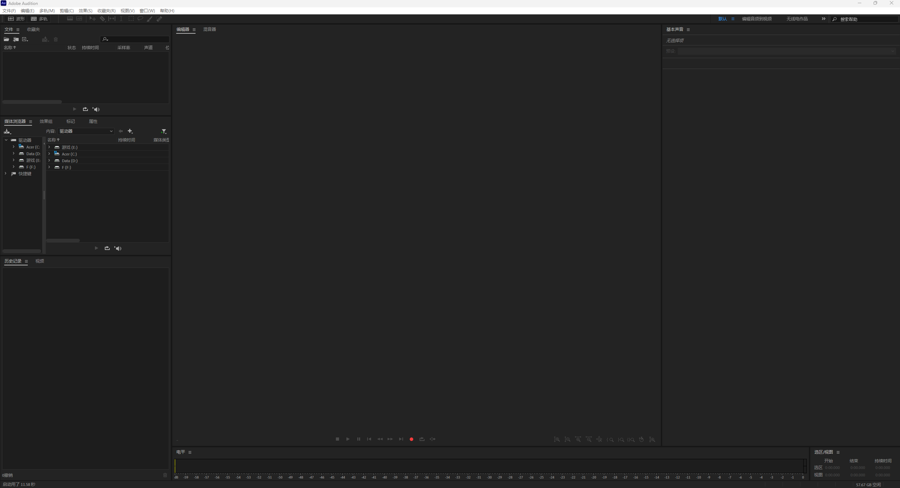

点击红色的录音键就可以创建音频

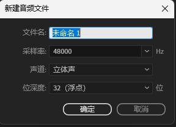

声音信号在电脑中的表示都是连续的电平信号，详见信号与系统笔记，emmm...

采样率：表示每秒采样点的个数,一般的调频广播的采样频率是32000HZ，广播数字电影的采样频率是48000HZ

声道：声音的发生点，单声道也就是只有一个发声点，立体声会有2-4个发生点，可以自定义

位深度：位深度越大，提供的动态范围越大，一般选择16位或32位

创建完成后就会开始录制了

使用这些按钮进行简单的录制操作（播放、暂停、继续）

录制完成后左上角或者ctrl+s保存文件

保存过程说明

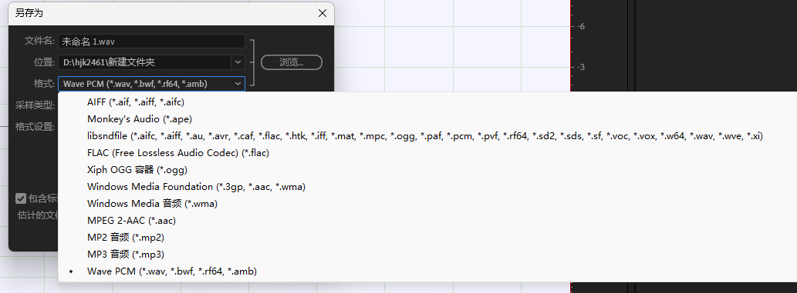

文件名和文件位置是基本操作，不细说

保存格式

MP3：文件小，可以轻易保存和传输

WAV和FLAC(无损格式)：都是无损的格式存储方式，文件会比较大

### 开始剪辑

#### 导入音频素材

左上角打开音频文件、文件浏览器选择、软件框外直接拖文件进软件都可以导入音频

导入的音频会出现在素材库中

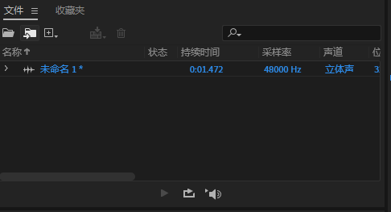

声音的波形包含了振幅、频率等信息

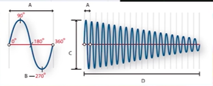

A波长

B相位度

C振幅

D一秒（单位时间）

不同波形的声波叠加在一起时会产生不同的作用，相同的声波会加强，相反的声波会抵消

#### 剪辑工具

剪辑工具有

切断、滑动、移动只能在多轨编辑器中使用

* 切断
* 滑动
* 移动

时间工具：在两个编辑器中都能使用，选定一段时间进行编辑

矩形、套索、画笔、污点修复只能在频谱轨道中使用

* 矩形、套索就是选择一定频率进行编辑
* 画笔类似于蒙版，对频率进行淡化等处理
* 污点修复能参照周围音频的特征，能够用来消除杂音

#### 剪辑过程

拿到音频后，先对音频整体听一遍，在有问题的地方使用标记（快捷键M）

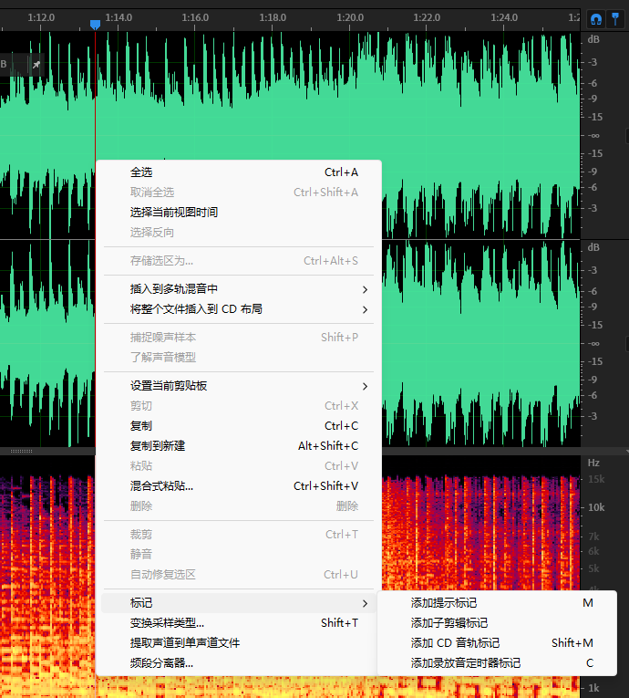

然后在有标记的地方进行相应地处理

### 基本剪辑操作

#### 降噪处理

##### 自适应降噪

在左上角效果选项中找到降噪/恢复

一般选择自适应降噪（因为方便，不专业的就别瞎弄其他降噪方式了）

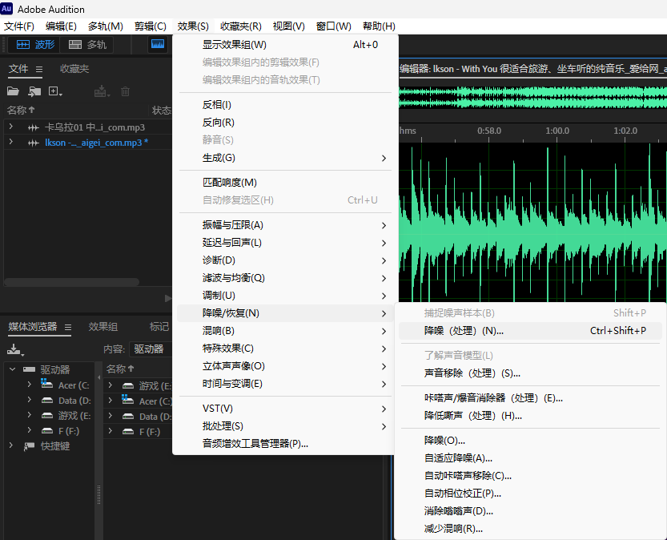

默认选项外，其他三个降噪方式各有优缺点

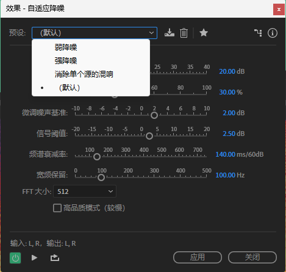

各个数值的含义

* 降噪幅度：确定降噪的级别，介于6到30dB之间的值效果比较好
* 噪声量：表示包含噪声的原始音频的百分比
* 微调噪声基准：调整的基本准则
* 信号阈值：基准和阈值可以将数值手动调整到自动计算的数值之上或之下
* 频谱衰减率：确定噪声处理下降60dB的速度。微调该设置可以实现更大程度的降噪，而失真更少
* 宽频保留：保留指定的频段与找到的失真之间的所需音频

FFT大小越高，效果越好，但是性能要求会变高，处理时间还会变长

为了尽可能减少失真可以打开高品质模式

使用时间工具进行选区，有选区的话，就只会对选区进行处理，无选区就会对整个音频进行处理

##### 特殊噪音杂音降噪

消除口水音

口水音的波形类似于噼啪声的音频

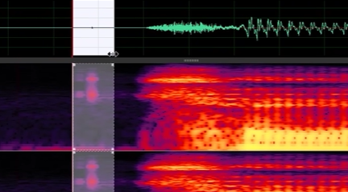

选中该声音存在的片段，在左上角降噪/恢复中选择自动咔嗒声移出

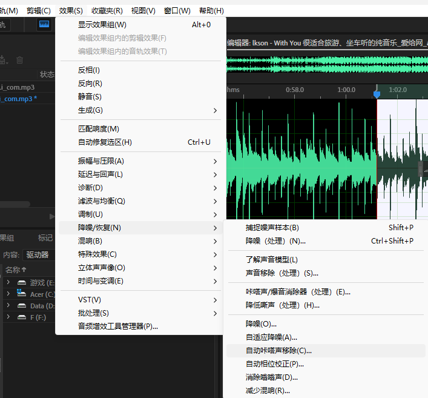

除此之外，之间使用修复画笔直接抹除对应频谱也可以实现消除

##### 爆音和高频的嘶声处理

就是炸麦的地方

在效果-降噪/恢复里选择降低嘶声

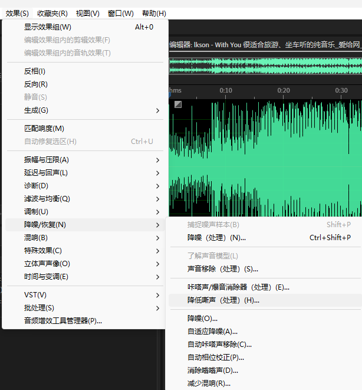

选中时间片段，运用就可以减少一些爆音

##### 电话滋滋声

可以使用修复工具一点点抹除，也可以选中然后右键选择**自动修复选项**

##### 修复人声中的杂音和剪辑不需要的音频

人声中的杂音使用矩形工具选中，然后使用修复画笔或者自动修复完成

不需要的音频直接选中片段，然后按键盘上的删除键就行

#### 音量大小调整

选中音量太大、太小的区域，然后滑动软件里的振幅按键

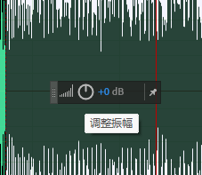

就可以调整大小，左滑变小，右滑变大

#### 插入背景音乐（多轨混音）

在文件中新建一个多轨会话

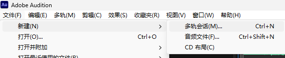

将需要混音的音频拖动到不同的轨道上

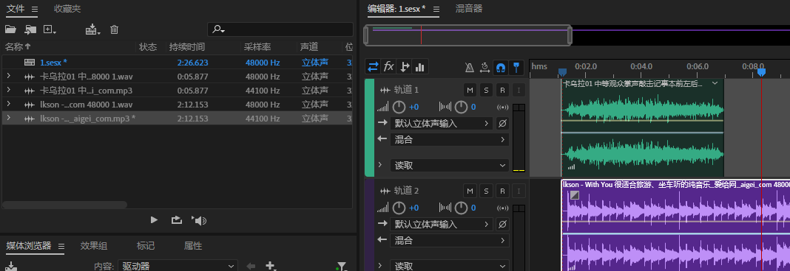

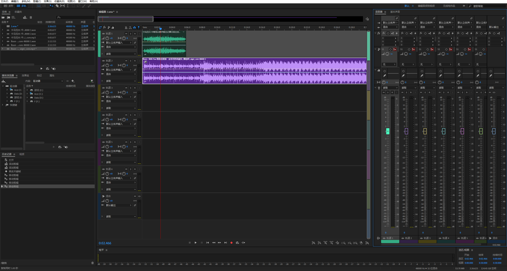

M静音 R启用录音 S独奏 I输入监听

调节每个轨道的按键，或者直接拉动混音器的滑块可以调整音量大小

选中剃刀工具将在需要的地方裁剪，不需要的音频直接删除就行

混音调节音量的过程，可以将电脑扬声器音量调节到30左右进行调节

##### 多轨混音的保存

“保存”和“另存为”都是保存工程文件，只有导出功能可以保存我们混音后的整个音频

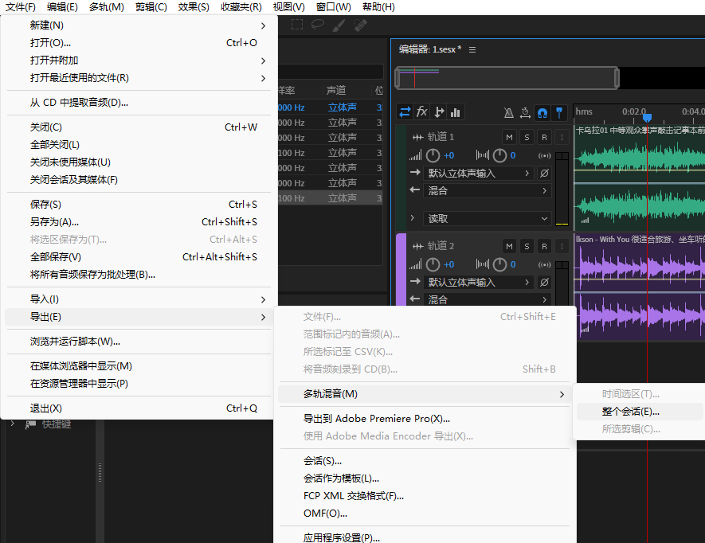

入门这些设置都使用默认的就好，还有更专业的手动降噪，在进阶操作里再细说

## AU进阶

### 快速人声处理

#### 音量匹配

##### 自动匹配

多轨混音界面，在基本声音面板，先为每段音频选择合适的声音类型

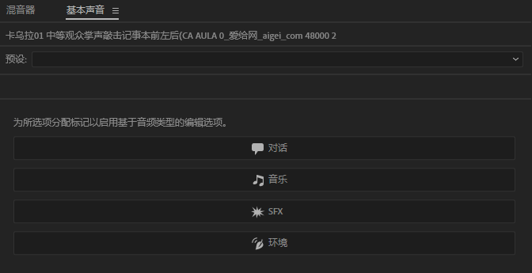

然后打开响度，自动匹配，会自动调节音量

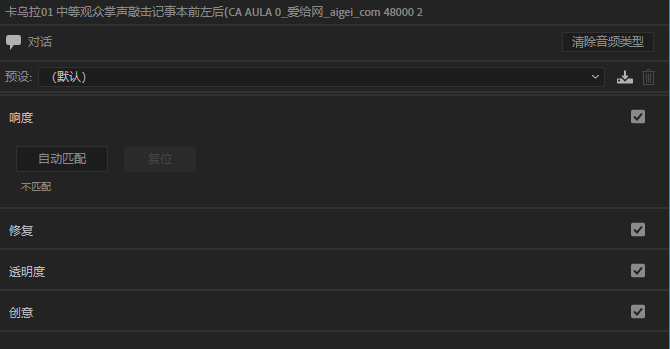

##### 匹配剪辑响度

按ctrl选中多个音频

然后在右上角剪辑->匹配剪辑响度

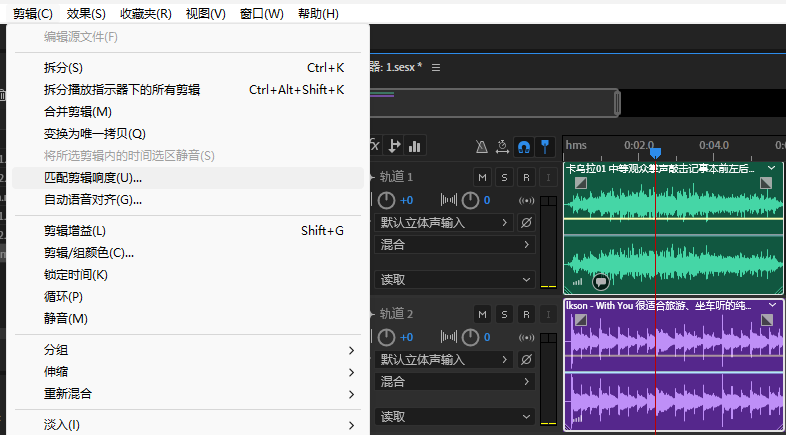

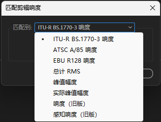

接下来要选择匹配类型：

* ITU17770：国际电信联盟的一个响度标准
* ATSC:美国消费电子协会的标准
* EBU：欧洲的标准
* RMS：信号电压的一种度量方法，对电压敏感
* 峰值幅度：没什么用
* 响度：选中目标响度，然后匹配到目标响度
* 感知响度：同响度，但是匹配的是中频

##### 效果里的匹配响度

这种调节方式用的很少，专业的人员用的多

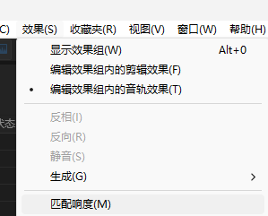

打开匹配响度工作区

将素材区的音频拖进去，点击会自动分析，

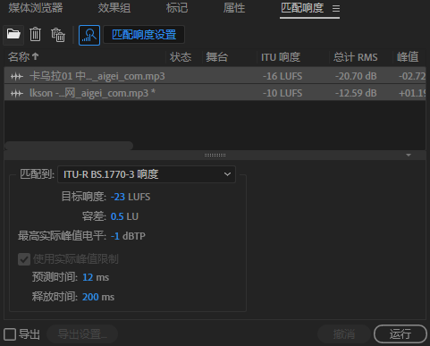

选择合适的标准，调节目标响度、容差这些，然后运行即可、

**这种调节方式会直接改变素材区里的音频文件格式**

#### 人声处理（快速）

优化人声在于放大声音的优势，减小声音的劣势

在处理之前，要进行降噪预处理

为轨道音频选择对话（在基本声音界面选）

选默认调整参数，预设并不能体现每个人声音的特点（音色）

修复选项

调整相应的处理程度，边听边调就行

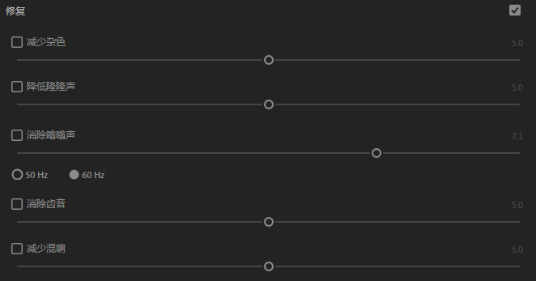

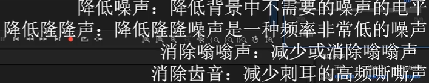

透明度选项会更加聚焦在人声，可以让软件自动分析

EQ就是录音环境调整

增强语音

这些选项都根据情况选择预设就够用了

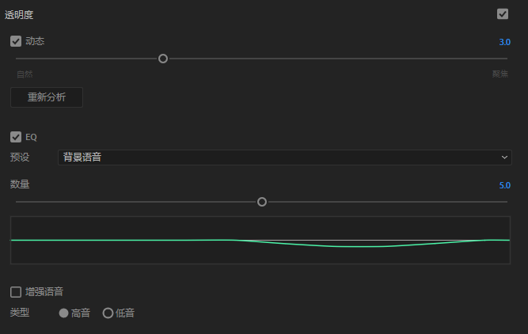

创意选项：可以用来营造环境氛围

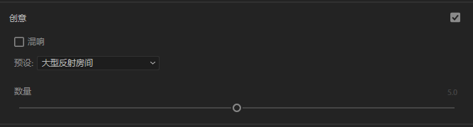

剪辑音量就是总体改变声音大小

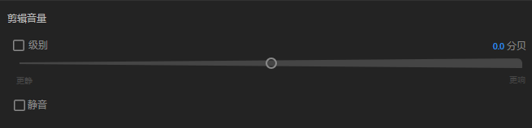

### 背景音乐处理

在混音器或者音轨中打开预渲染可以提高处理性能

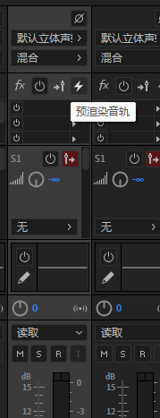

点击音频轨道左上角的滑块

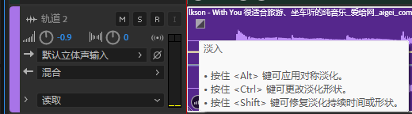

按住就可以拖出淡入曲线，拖动时按ctrl可以改变形状

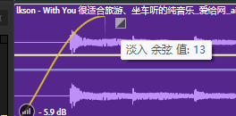

淡出效果同理

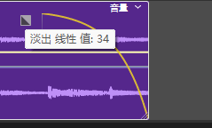

音频的拼接处，拉动方块，会设置交叉淡入淡出效果

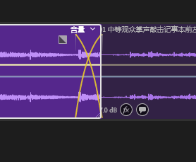

使用剃刀或者拉动音频边缘调整时间不是那么的精确

使用基本声音里的音乐类型，打开持续时间，然后输入需要的时间值，重新混合，会让声音时间自动调整

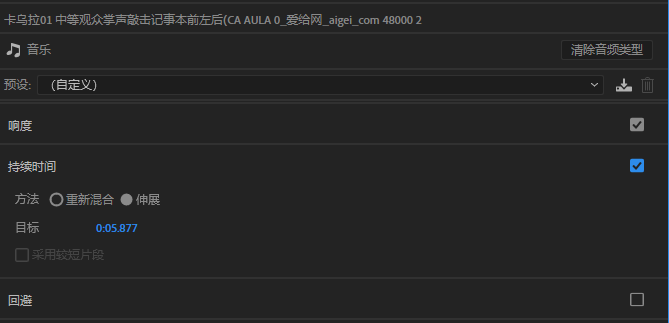

### 闪避

闪避就是为某个音频设置行为，当它遇到特定的声音类型时，就会执行这些行为（自动降低音量或者放大音量）

#### 自动闪避

设置一些闪避基本量

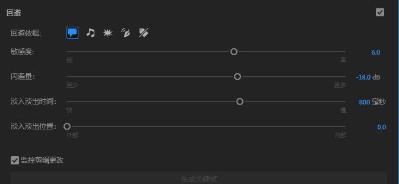

#### 手动闪避

打开“监控剪辑更改”可以手动调整闪避点和时间

### 自动化轨道使用

音轨上会有多条线，分别代表音量、声像

（声像就是左声道和右声道，L的值越高越偏向左声道，R的值越高越偏向右声道）

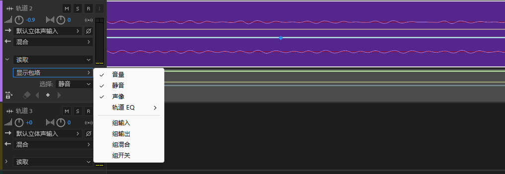

可以在线上单击打上关键帧，然后就可以拖动对应的曲线实现各种效果，比如某一段音频拉低，某一段打开静音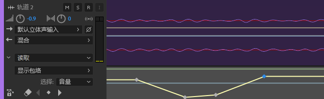

### 音调校正

在效果里找到

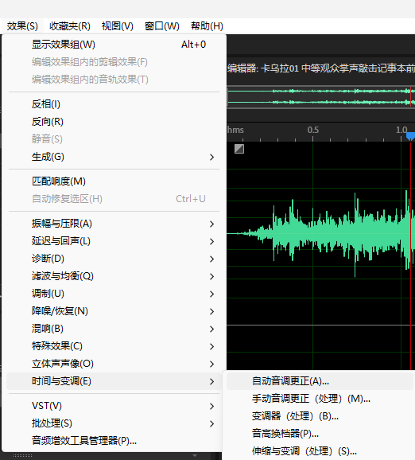

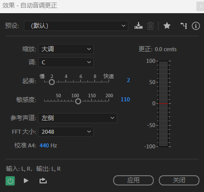

FFT设置为20248或4096会比较自然

### 生成文本到语音

效果生成->语音

然后输入文本，调整一些基本属性，就可以生成音频了

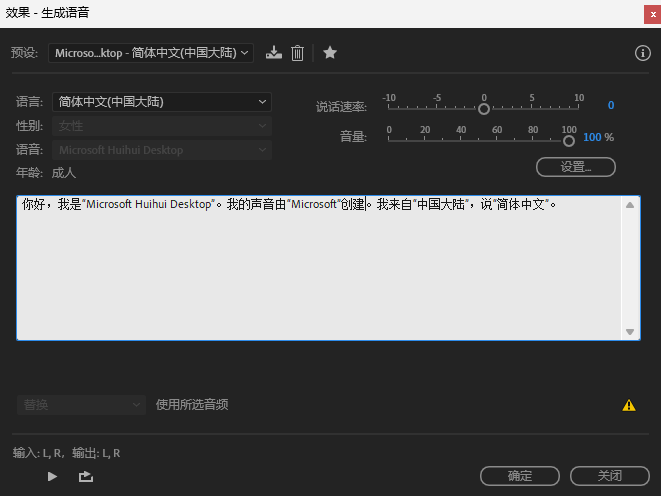

# Ae

## Ae入门

# Blender

## blender初级

### 第一部分 基础知识

#### 下载和界面认识

##### 一、下载

可以在官网（blender.org），也可以在steam

##### 二、界面

第一次打开会进行初始化设置，

##### 三、快捷键

1.视角的控制

旋转视角:鼠标中健按住可旋转

平移视角: shift+鼠标中健

推进推远视角:滚动鼠标中健

在编辑-偏好设置-视图切换-缩放-选择 缩放至鼠标位置

2.物体的控制

移动物体:G     旋转物体:R     缩放物体:S

恢复变换:Alt+G,Alt+R，Alt+S

新建物体:Shift+A

复制物体: Shift+D  (移动并复制）

删除物体:X或者Delete

隐藏物体:H （或点击小眼睛）     显示隐藏物体:Alt+H

隐藏没有被选中的物体: Shift+H

选择物体刷选:C全选:A     按住Shift可以加选或者减选

3.视图的切换 （以下均为小键盘）

按住alt键再用中键旋转可转到你需要的视图

~键可以调出视图的饼菜单，然后选择视图

7-顶视图，1-前视图，3-右视图，9反转当前视图

0:切换摄像机的视角

5:切换透视投影和正交投影

2,4,6,8:前后左右角度微调（默认15°）

+，- : 缩放微调

##### 四、界面的逻辑与辅助信息

###### 1.窗口构成

每个部分左上角都有面板库，可以根据需要随时替换对应面板

每个窗口都可自由分割，往本面板的方向拉，可以得到相同面板，往其他面板方向拉，可以合并到其他面板

###### 2.游标和原点

#### 3d建模基本流程

建模（modeling）  布光（lighting） 材质（texturing） 渲染（rendering）

### 第二部分 建模

#### 点线面选择和控制

##### 编辑模式

选中物体，如何按tab可进入编辑模式

在偏好设置-键位映射-勾选拖动激活饼菜单，就可以按tab，然后移动鼠标显示饼菜单

编辑模式下1，2，3数字键，分别对应选择点、线、面

在对应模式下，快捷键G（移动）、R（伸缩）、S（旋转）

按住alt选择，会选中相连的一圈

按L会选中所有相交或相连的点线面

若要选择背面的点线面，可在右上角开启透视模式

##### 法线

法线方向：蓝正红反

法线显示在右上角视图叠加层中，开启“面朝向”，可以看到物体表面正反

法向在右上角网络编辑模式叠加层中开启

#### 建模十大操作

1．挤出：E
连续挤出：CTRL ＋右键

2．向内挤出：1

3．倒角：CTRL+B

4．循环切割：CTRL+R

5．合并：M
合并物体：CTRL+J

6．断开：V

7．填充：F
栅格填充 CTRL+F
栅格填充必须是偶数面

8．切刀：K
按鼠标右键或者空格键退出

9．桥接：CTRL+E
桥接必须是同一个物体

10．分离：P
