# 数据结构

## 导论

数据结构的存储和组织数据的方式

研究方法

1.数学和逻辑模型（抽象数据类型）

2.具体实现
目前常用的数据结构：数组、链表、栈、队列、树、图

数组、链表、栈、队列都是顺序结构组织的（或者说这些数据结构都是线性的）

树、图是非线性的数据结构

数据结构的选择要看我们需要操作的数据特点和数据行为特点

## ADT（抽象数据类型）

ADT就是定义一组数据以及可以在这组数据上执行的操作，但隐藏数据的具体存储方式和实现细节

ADT由以下两部分组成
数据表示：定义数据的存储结构，通常使用结构体来封装数据成员
操作接口：定义可以在数据上执行的操作，如创建、销毁、访问、修改等，这些操作通过函数来实现

## 链表（linked list）

列表是相同类型对象的集合，一般可分为静态列表和动态列表

列表可以使用数组实现
动态列表实现可以通过创建一个很大的数组，将数组的一部分用于存储列表来实现

数组是一串连续的地址，所以只需知道基地址和数据类型就能知道所有数据的位置

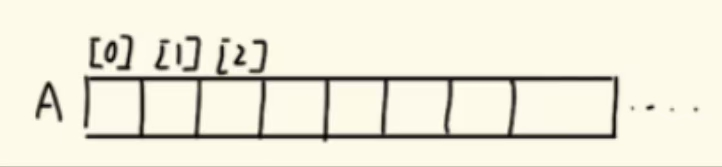

```c
int A[maxsize];
int end=-1;定义一个索引变量,当指向-1时,说明数组为空
insert(x);
```

插入末尾:end+1
插入中间：插入位后的所有数都后移一位，end+1

移除移除中间值：前移位后的所有数都前移一位，end-1
移除末尾：end-1

当数组满的时候，我们一般会创建一个新的两倍大小的数组，并且复制前一个数组的值

使用数组实现存储的成本分析

R/w读写O(1):因为只需对一个特定位置更改
Insert插入O(n):最坏的情况是需将所有数都右移
Remove移除O(n):同上
Add新建O(n)

数组特点：读写成本低，但是其它操作成本高，大部分时间里很多数组未被使用，内存效率太低，
且不方便扩展

### 基本介绍

内存管理器

内存地址的形式

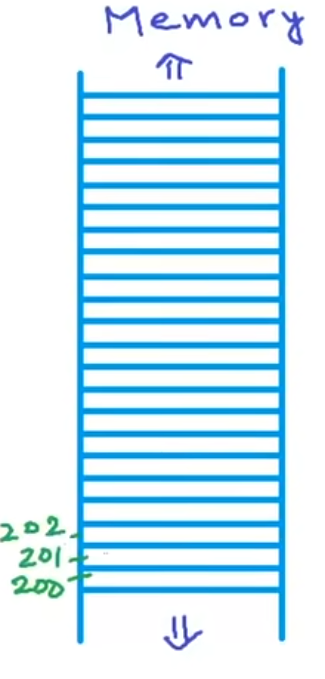

链表：每次向内存申请两个变量作为一个节点，一个变量存储数值，另一个变量存下一个节点的地址

最后一个节点的地址会指向NULL

数组与链表的时间成本分析

|                  | 数组       | 链表                                         |
| ---------------- | ---------- | -------------------------------------------- |
| 访问元素         | O(1)       | O(1)                                         |
| 内存使用         | 固定长度   | 长度可拓展                                   |
| 元素插入（开头） | O(n)       | O(1)                                         |
| 元素插入（开头） | O(n)       | O(n)                                         |
| 元素插入（结尾） | O(1)或O(n) | O(n)（因为不最后一个地址，所以需要从头遍历） |
| 元素删除         | 同插入     | 同插入                                       |
| 容易程度         | 简单易实现 | 容易出问题，如内存泄漏                       |

### C/C++实现

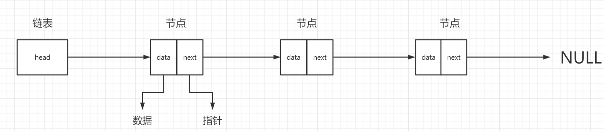

```c
struct Node
{
    int data;
    struct Node* next;
};
```

一般我们需要创建一个指向存储头节点地址的指针

```c
创建节点
Node* A;
A=NULL;
Node* temp = (Node*)malloc(sizeof(Node));\\在c++中我们可以使用new字符   Node* temp = new Node();
(*temp).data = x;
(*temp).next = NULL;
```

遍历链表

```c
Node* temp1 = A;
while (temp1->next != NULL)
{
	temp1=temp1->next;
}
temp1->next = NULL;
```

#### 在头部插入节点

```c
struct Node* head;
void Insert(int x){
	Node* temp = (Node*)malloc(sizeof(Node));\\在c++中我们可以使用new字符   Node* temp = new Node();
	temp->data = x;
	temp->next = head;
	head = temp;
}
print
```

#### 任意位置插入一个节点

内存四区的知识详见c语言笔记和python笔记

编写一个函数，第一个参数是位置，第二个参数是值insert（data，n）

应该要处理所有的情况，包括头部插入，中间插入，末尾插入，如果位数不够应该怎么办

```c
void insert_at_any(Node** headpointer,int data,int n){
    struct Node* temp1= new Node();
    temp1->data=data;
    temp1->next=NULL;
    if(n==1){
        temp1->next=*headpointer;
        temp1=*headpointer;
        return ;
    }
    Node* temp2=*headpointer;
    for(int i=0;i<n-2;i++){
        temp2=temp2->next;//遍历到n-1位
    }
    temp1->next=temp2->next;//添加的节点指向原本的第n位,添加了一位数据后,原本的第n位就变成了第n+1位
    temp2->next=temp1;//第n-1位指向添加的节点地址
}
```

#### 任意位置删除一个节点

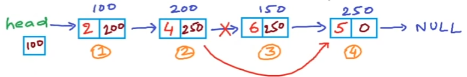

删除第n个节点的指针就需要将n-1个节点和n+1个节点连接起来，特殊情况就是删除头节点的话，就需要将head指针指向第二个节点

```cpp
void Delete(Node **headpointer)
{
    cout<<"what "<<endl;
    int n;
    scanf("%d",&n);
    struct Node* temp =*headpointer;
    if(n==1){
        *headpointer=temp->next;
        free(temp);
        cout<<"delete complete"<<endl;
        return ;
    }
    for(int i=0;i<n-2;i++){
        temp=temp->next;
    }
    struct Node* temp1=temp->next;
    temp->next=temp1->next;
    free(temp1);
    cout<<"delete complete"<<endl;
}
```

 对于删除第一位的情况，设置一个if语句，然后直接将头节点的指针赋值为next就可以了

#### 反转链表

##### 迭代实现

反转链表的思路不是交换数字，而是改变地址指向

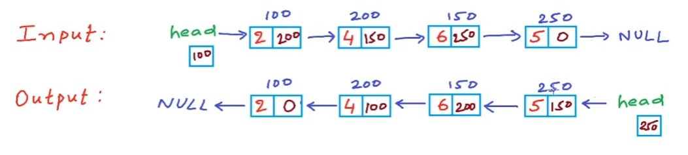

首先需要设置变量

一个变量current储存当前需要改变的节点地址

```cpp
void reverse(Node** headpointer){
    struct Node* prev = NULL;
    struct Node* current = *headpointer;
    struct Node* next = NULL;
    while(current!=NULL){
        next = current->next;
        current->next = prev;
        prev = current;
        current = next;
    }
    *headpointer =prev;
}
```

当链表为空或链表只有一个节点时，也能适用

##### 递归实现

#### 反转打印链表

##### 递归实现

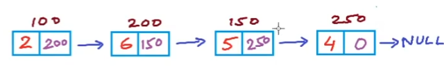

实现正向输出2 6 5 4

```cpp
void print1(Node* p)
{
    if(p==NULL)
        return ;
    cout<<"->"<<p->data;
    print1(p->next);
}
```

反转输出4 5 6 2

只需要将打印和递归调用的顺序对调，就可以实现反转打印

```cpp
void reverseprint(Node* p){
    if(p==NULL)
        return ;
    reverseprint(p->next);
    cout<<"->"<<p->data;
}
```

顺序打印，迭代比递归更有效率，更节省内存空间

反转打印，如果用迭代那么就需要一些临时变量来存储信息，这和递归调用栈区的效果是一样的，所以递归更分便一些

#### 双向链表

 普通链表只有一个指向下一位的值，双向链表有两个指针，一个指向前一个节点，一个指向后一个节点

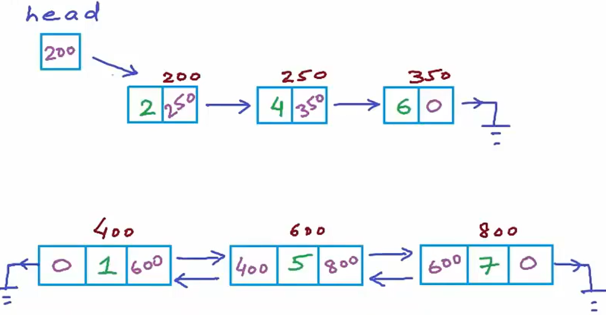

有点是查询节点更加方便，很多操作会变简单，但是会浪费更多的内存

##### 双向链表的实现

定义方式

```cpp
struct Node{
    int data;
    struct Node1* next;
    struct Node1* prev;
};
```

遍历实现与频谱链表一致

插入开头和插入任意位置

```cpp
void insert_at_head(Node** headpointer, int x)
{
    struct Node1* temp = new Node1();
    temp->data = x;
    temp->next = *headpointer; 
    temp->prev = NULL; 
    *headpointer = temp; 
}

void insert_at_any1(Node1** headpointer, int x, int n)
{
    struct Node1* temp = new Node1();
    temp->data = x;
    temp->next =NULL;
    if(n==1){
        temp->next=*headpointer;
        temp->prev =NULL;
        *headpointer = temp;
        return ;
    }
    struct Node1* temp1=*headpointer;
    for(int i=0;i<n-2;i++){
        temp1=temp1->next;
    }
    temp->next=temp1->next;
    temp->prev=temp1;
    if(temp1->next!=NULL){
        temp1->next->prev=temp;
    }
    temp1->next=temp;
}
```

反转链表(比普通链表要更加简单)

```cpp
void reverse_doubly_linked_list(Node1** headpointer) {
    if (*headpointer == NULL) {
        return; // 空链表，无需反转
    }

    Node1* current = *headpointer;
    Node1* temp = NULL;

    // 遍历链表并交换每个节点的 next 和 prev 指针
    while (current != NULL) {
        temp = current->prev;
        current->prev = current->next;
        current->next = temp;
        current = current->prev; // 移动到下一个节点（原来的 prev）
    }

    // 更新头指针
    if (temp != NULL) {
        *headpointer = temp->prev; // temp 最后指向原链表的尾节点
    }
}
```

## 栈（stack）

### 栈 ADT

栈也称为Last-in- first-out（LIFO）

只能对栈顶进行操作，先入后出

只能对栈顶进行插入和删除，不能对中间的元素进行操作，不能从中间掏出一个元素来操作

栈操作：

压栈（插入）push

弹出（删除）pop

返回顶部元素top

是否为空isempty

因为这些常规操作都是对一个元素进行操作，所以时间系数都是O（1）

应用：函数调用（递归）、撤回操作、编译器实验栈来检查括号是否匹配

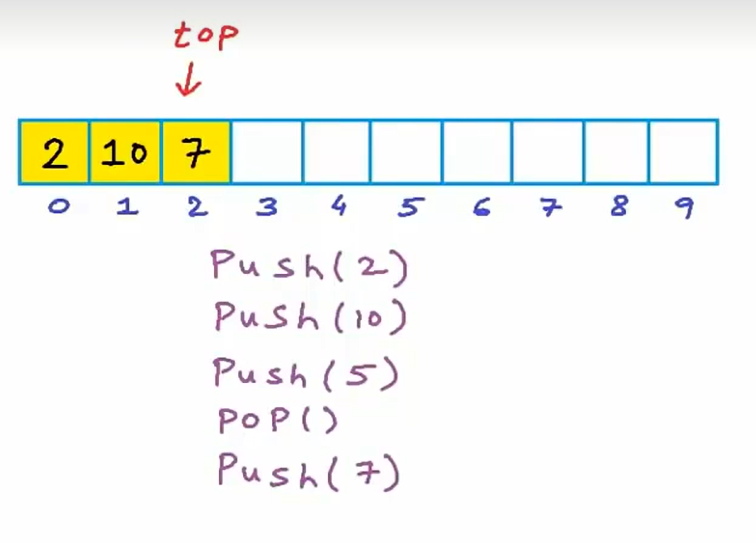

### 栈的实现

#### 数组实现

top用来指示栈顶的位置，当栈为空栈时，top的值为-1

每次push，top+1，然后会将数值赋值给数组的第top位素

每次pop，会将数组的第top位删除，然后top-1

使用数组创建栈会存在溢出问题，当top达到数组的最大值时，就不能再进行压栈操作了

发生溢出问题时，一般我们会新建一个两倍大小的新数组，这时候push的时间复杂度会达到O（n）

考虑最好和最坏的情况，push的平均复杂度是O（1）

而pop操作和top操作一般会进行合并，删除栈顶也会返回栈顶的元素值

```cpp
 ##include <iostream>
 ##define N 100

using namespace std;

int a[N];
int top=-1;

void push(int x){
    if(top==N-1){
        cout<<"stack isfull"<<endl;
        return;
    }
    a[++top]=x;
}

void pop(){
    if(top==-1){
        cout<<"stack is empty"<<endl;
        return;
    }
    top--;
}

int Top(){
    return a[top];
}

int main(){
```

使用宏定义数组大小，这样方便修改大小

#### 链表实现

只要对链表的操作进行限制，每次操作只能对一端进行就可以实现栈

链表的大小不是固定的，没有数组的大小限制，当push和pop时，可以直接操作链表一端的元素进行插入和删除进行实现

将head指向的头节点视为栈顶，将head当作top来用

push操作

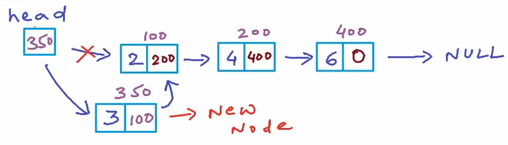

pop操作

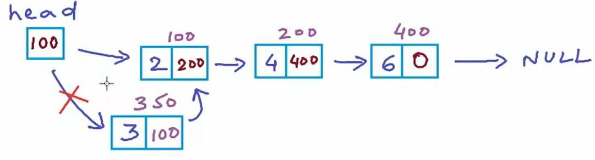

```cpp
struct Node{
    int data;
    Node* next;
};

struct Node* top =NULL;

void push(int x){
    Node * temp =new Node();
    temp->data=x;
    temp->next=top;
    top=temp;
}

void pop(){
    if(top == NULL){
        printf("stack is empty\n");
        return ;
    }
    Node * temp=top;
    top=top->next;
    delete temp;
    return;
}


int Top(){
    if(top == NULL){
        printf("stack is empty\n");
        return ;
    }
    return top->data;
}
```

### 使用栈来反转链表和字符串

#### 反转字符串

将字符数组放进一个栈中，然后依次将栈顶元素对原字符串进行覆盖

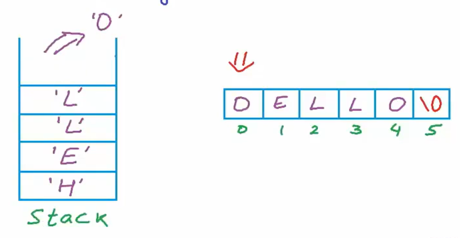

```cpp
 ##include<iostream>
 ##include<stack>
 ##include<string.h>
using namespace std;

void Reverse(char c[],int len){
    stack<char> s;
    for(int i=0;i<len;i++){
        s.push(c[i]);
    }
    for(int i=0;i<len;i++){
        c[i]=s.top();
        s.pop();
    }
};
```

cpp中提供了stack的定义，在使用时，只需要导入头文件stack就可以使用栈了

这里使用push和pop实现反转的时间复杂度是O（n），因为使用了一个栈，所以空间复杂都也是O（n）

其实反转字符串还有一种更方便的方法：直接都对数组操作，将第i位和第n-i-1位互换（双指针）

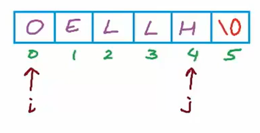

#### 链表反转

使用计算机内存栈区的递归特性实现反转

```cpp
void Reverse(Node* top,int len)
{
    Node* temp = top;
    stack<Node*> s;
    while(temp!=NULL){
        s.push(temp);
        temp=temp->next;
    }
    temp = s.top();
    top = temp;
    s.pop();//这三步是不可以省略的，必须将temp重新指向栈顶，才能继续使用循环输出结果
    while(!s.empty()){
        temp->next = s.top();
        s.pop();
        temp = temp->next;
    }
    temp->next=NULL
}

```

#### 检查括号匹配

给定一个包含括号的字符串，检查左右括号（包括小括号、中括号、大括号）是否匹配

将左括号压入栈中,遇到右括号就与栈顶的左括号(最近被压入的括号)进行匹配判断

```cpp
bool check_parenthesis(const string& expression) {
    int len=expression.length();
    stack<char> s;
    for(int i=0;i<len;i++){
        char temp=expression[i];
        if(temp=='('||temp=='['||temp=='{'){
            s.push(temp);
        }
        else if(temp==')'||temp==']'||temp=='}'){
            if(s.empty()) {
                return 0; // 如果栈为空，说明没有匹配的左括号
            }
            char top = s.top();
            s.pop();
            if((temp==')' && top!='(') || (temp==']' && top!='[') || (temp=='}' && top!='{')) {
                return 0; 
            }  
        }
    }
    if(s.empty()==1){
        return 1;}
    return 0;
}

```

#### 前缀、后缀、中缀表达式的概念

一个算术表达式由操作符和操作数组成

二元运算符（操作符）：操作数只有两个的运算符（操作符）

运算符优先级顺序

1.括号（大括号>中括号>小括号）

2.幂运算（从左到右）

3.乘、除（从左到右）

4.加、减（从左到右）

运算符的结合律：

1.左结合：多个相同算符按从左往右运算

2.右结合：多个相同算符按从右往左运算

##### 中缀表达式：

把操作符放在操作数中间的写法，如：22+11、（1+2）*4

运算规则，必须按照符号优先级来执行

##### 前缀表达式

把操作符放在操作数前面的写法，例如：2+3写为+ 2 3，a+b*c写为+a**bc

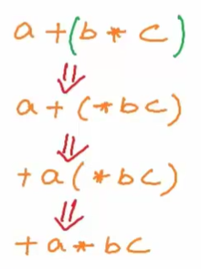

##### 后缀表达式

把操作符放在操作数后面的写法，例如：2+3写为2 3 +，a+b*c写为a b c * +

在编程角度，前缀和后缀表达式是最容易进行解析的

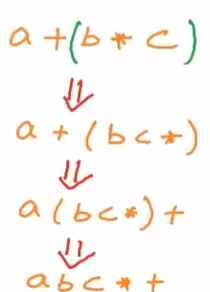

##### 前缀和后缀的求值

先将前缀表达式转换为后缀表达式

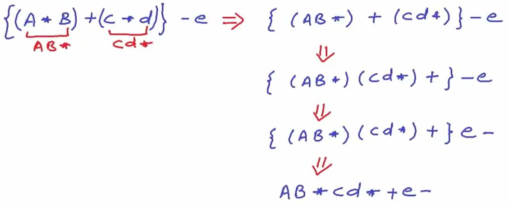

后缀表达式求值过程；后缀表达式中每个操作符都是对它前面的两个操作数进行对应运算，**从左往右**扫描，每次遇到操作数都压入栈中，遇到操作符就对栈顶两个元素进行对应操作，然后将运算结果压压栈，最终结果就是栈顶元素

前缀表达式求值：前缀表达式中每个操作符都是对它后面的两个操作数进行对应运算，**从右往左**扫描，每次遇到操作数都压入栈中，遇到操作符就对栈顶两个元素进行对应操作，然后将结果压栈压栈，最终结果就是栈顶元素

##### 中缀转后缀

###### 没有括号的表达式转换

使用一个栈作为操作符栈，使用另一个容器(字符串或者数组之类的))来存放后缀表达式

操作符栈行为：第一个符号直接压入，后续压栈过程中，如果**扫描到的符号优先级比栈上的操作符高**，就将扫描到的符号压栈，如果**扫描到的符号优先级比栈上的操作符低**或者**扫描到了表达式的结尾**，就把栈中所有的操作符按弹出顺序放入后缀表达式末尾

###### 有括号的表达式转换

括号外的表达式对括号内的表达式不会产生影响

和没有括号的转换区别在于，如果遇到左括号就压入操作符栈，遇到相匹配右括号就把之前的运算符全部弹出，直到弹出左括号，其他规则与没有括号的表达式式转换一致

## 队列（queues）

### 基本介绍

队列是一种先进先出的数据结构，插入是在队尾，删除是在队头，可以想象为一个两头开口的容器

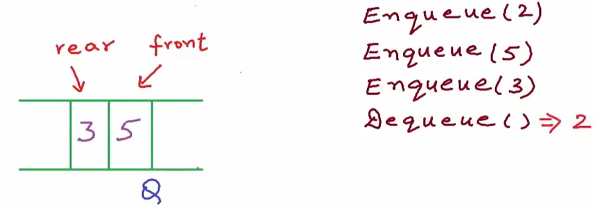

基本操作：

入队（push or Enqueue）

出栈（pop or Dequeue）删除同时返回对头元素

查看对头元素（front or peek）

检查是否为空（isempty）

这些操作的复杂度都是O（1）

队列的运用主要是在进程服务上，当有多个进程请求时，进程按时间顺序存放在队列里，依次让cpu处理，类似现实中排队做事一样

### 数组实现

```cpp
int A[10];
int front =-1,rear=-1;

bool isEmpty(int front,int rear){
    if(front == -1&&rear==-1){
        return true;
    }
    return false;
}
void enqueue(int x,int* a[])
{
    if((rear+1)%10==front){
        cout<<"队列已满"<<endl;
        return ;
    }
    else if(isEmpty(front,rear)){
        front =0;
        rear =0;
    }else{
        rear=(rear+1)%10;
    }
    A[rear]=x;
}
int dequeue(int* a[])
{
    if(isEmpty(front,rear)){
        cout<<"队列为空"<<endl;
        return ;
    }
    else if(front==rear)
    {
        int temp = A[front]; 
        front ==-1;
        rear==-1;
        return temp;
    }
    else{
        int temp = A[front];
        front=(front+1)%10;
        return temp;
    }
}

```

#### 补充：循环数组

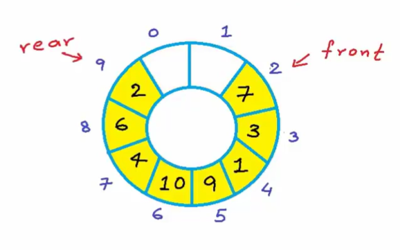

假如有一个a[10]数组，序号9之后就是0，在数组中实现队列时，如果使用线性的数组，会发生front序号越来越靠后，front序号前的位置全是空的，造成空间浪费，使用循环数组避免这个问题

### 链表实现

使用链表实现会更加简单一些，而且可以很方便地扩展长度

```cpp
struct Node{
    int data;
    Node* next;
};

Node* front = nullptr;
Node* rear = nullptr;

bool isEmpty(){
    if(front == nullptr && rear == nullptr){
        return true;
    }
    return false;
}
void enqueue(int x){
    Node* temp_Node= new Node;
    temp_Node->data = x;
    temp_Node->next =nullptr;
    if(isEmpty()){
        front = temp_Node;
        rear = temp_Node;
    }
    else{
        rear->next = temp_Node;
        rear = temp_Node;
    }
}
int dequeue(){
    if(isEmpty()){
        cout<<"队列为空"<<endl;
        return ;
    }
    else if(front == rear){
        int temp=front->data;
        delete front;
        front =nullptr;
        rear ==nullptr;
        return temp;
    }
    else{
        int temp=front->data;
        front = front->next;
        return temp;
    }
}
```

## 树（tree）

### 介绍

 把现实中的树倒过来看，计算机中的树结构是向下生长的，根是在顶部，叶节点是在下方

树是由 **节点（Node）** 和 **边（Edge）** 组成的结构。

树具有以下特点：

1. 树是一个  **连通的无环图**
2. 树中有且仅有一个节点被称为  **根节点（Root）** 。
3. 除根节点外的每个节点都有且仅有一个父节点。
4. 每个节点可以有零个或多个子节点。

基本术语

1. **根节点（Root）** ：树的起始节点，没有父节点。每棵树只有一个根节点。
2. **子节点（Child）** ：一个节点直接连接的下一级节点称为它的子节点。
3. **父节点（Parent）** ：一个节点直接连接的上一级节点称为它的父节点。
4. **叶子节点（Leaf）** ：没有子节点的节点称为叶子节点。
5. **内部节点（Internal Node）** ：既有父节点又有子节点的节点。
6. **兄弟节点（Sibling）** ：具有相同父节点的节点互为兄弟节点。
7. **高度（Height）** ：从根节点到叶子节点的最长路径上的边数称为树的高度。
8. **深度（Depth）** ：从根节点到某个节点的路径上的边数称为该节点的深度
9. **度（Degree）** ：一个节点的子节点个数称为该节点的度。树的度是所有节点的最大度。

树的分类

1. 普通树
2. 二叉树
3. 完全二叉树
4. 满二叉树
5. 平衡二叉树
6. 二叉搜索树
7. N叉树
8. 红黑树、B树、B+树

在计算机的中，树的运用主要有：文件管理系统、组织数据结构（快速搜索）、trie树存储字典、网络拓扑算法

### 二叉树

二叉树的特点：每个节点最多有两个子节点，分别称为 **左子节点** 和  **右子节点**

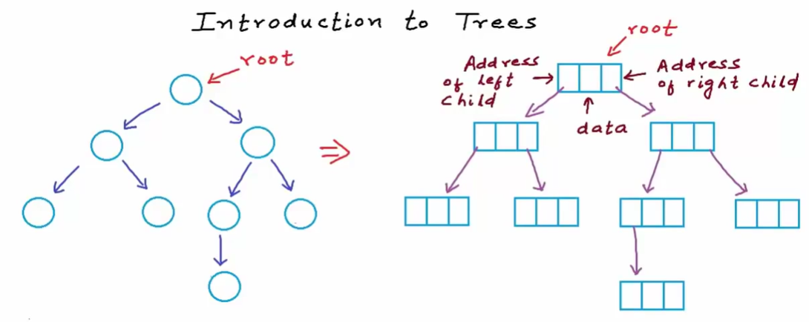

c或c++中一般的定义节点为

```cpp
struct Node{
	int data;
	Node* left;
	Node* right;
}
```

第i层中至多有2的i次方个节点，根的层级为第0层

完全二叉树：除了最后一层，其它所有层都被填满了

满二叉树：所有层，包括最后一层，都被填满了

平衡二叉树：每一个父节点的两个子节点有相同的子节点（两个子节点度相同）

共高h层满二叉树的节点总数=$2^0+2^1+...+2^h$=$2^{h+1}-1$（数列求和)

高度h=$log_2{(n+1)}-1$

使用数组可以简单实现一下满二叉树的结构，对于数组第i个数来说，第2i+1个结点是左节点，第2i+2个节点是右节点

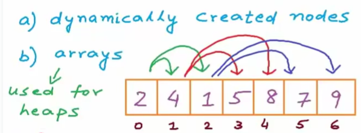

实际上，计算机系统中栈的实现就是采用数组模拟树这样的方法

#### 二叉搜索树（BST）

二叉树搜索树是一种特殊的数据结构，满二叉树中，左节点的值小于右节点，就可以形成二叉搜索树

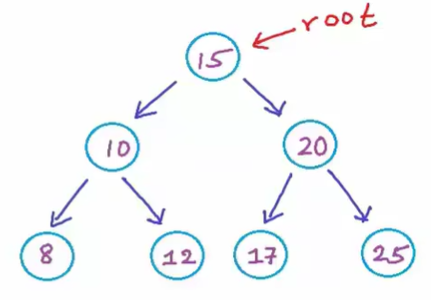

搜索过程；将搜索的值与每一个节点比较，如果要搜索的值小于节点的值，就往左节点走，搜索的值大于节点的值，就往右节点走

插入过程：将数据比较，插入的值小于节点的值，就往左节点走，大于节点的值，就往右节点走，直到到达最后一个节点，判断小于节点的值，就添加到最后一个节点的左节点，大于节点的值，就添加到最后一个节点的右节点

##### 二叉搜索树的c/c++实现

插入与搜索过程主要使用递归的思路

```cpp
#include<iostream>

using namespace std;

struct BstNode{
    int data;
    BstNode* left;
    BstNode* right;
};

BstNode* createnewnode(int x){
    BstNode* newNode = new BstNode;
    newNode->data = x;
    newNode->left = nullptr;
    newNode->right = nullptr;
    return newNode;
}

BstNode* insert(BstNode** rootPtr,int x){
    if(*rootPtr == NULL){
        *rootPtr = createnewnode(x);
    }
    else if(x<=(*rootPtr)->data){
        (*rootPtr)->left = insert(&((*rootPtr)->left), x);
    }
    else if(x>(*rootPtr)->data){
        (*rootPtr)->right = insert(&((*rootPtr)->right), x);
    }
    return *rootPtr;
}

bool search(BstNode* root,int data){
    if(root==NULL){
        return false;
    }
    else if(root->data==data){
        return true;
    }
    else if(data<root->data){
        return search(root->left,data);
    }
    else{
        return search(root->right,data);
    }
}


int main(){
    BstNode* root=nullptr;
    root = insert(&root, 10);
    insert(&root, 5);
    insert(&root, 15);
    insert(&root, 3);
    printf("Searching for 5: %s\n", search(root, 5) ? "Found" : "Not Found");
    printf("Searching for 15: %s\n", search(root, 15) ? "Found" : "Not Found");
    printf("Searching for 3: %s\n", search(root, 10) ? "Found" : "Not Found");
    printf("Searching for 20: %s\n", search(root, 20) ? "Found" : "Not Found");
    return 0;
}
```

##### 查找最大最小值

因为二叉搜索树,大小关系是可知的,左节点小于右节点

所以找最小值只要一直遍历左节点就行,最大值则一直遍历右节点

```cpp
int findMin(BstNode* root){
    if(root==NULL){
        return -1;
    }
    while(root->left != NULL){
        root = root->left;
    }
    return root->data;
}

int findMax(BstNode* root){
    if(root==NULL){
        return -1;
    }
    while(root->right != NULL){
        root = root->right;
    }
    return root->data;
}
```

##### 内存中的堆栈

递归调用都是保存在栈中实现的

动态内存分配是在堆中

关于堆栈的内容详见计算机系统笔记

#### 二叉树的高度

**高度（Height）** ：从根节点到叶子节点的最长路径上的边数称为树的高度。

要找到最长的那一条路,仍然使用递归的思路,因为每一个节点都可以看做有左右子树,使用每一次递归度把查找的节点看作根(返回值+1的原因),比较左右子树的高度,返回高度最大的值,这样最终递归出的值就是树的高度

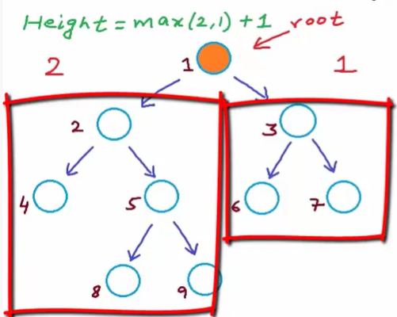

```cpp
int findHeight(BstNode* root){
    if(root == NULL){
        return -1; // Height of an empty tree is -1
    }
    int leftHeight = findHeight(root->left);
    int rightHeight = findHeight(root->right);
    return 1 + max(leftHeight, rightHeight);
}
```

#### 二叉树的遍历

分为广度优先遍历和深度优先遍历

##### 广度优先

###### 层次遍历

先访问同一深度或相同层级的节点，然后再移到下一层级进行访问

在同一层级从左往右进行访问

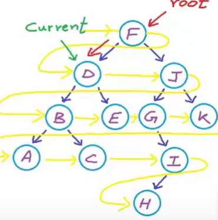

层次遍历需要使用对列来进行实现，将根节点入列，如果节点不为空，就将左右节点加入队尾，每一次出列时，检查出列的元素有没有节点，有节点就把左右节点加入队尾，一直遍历到节队列为空，就可以将二叉树进行层次遍历了

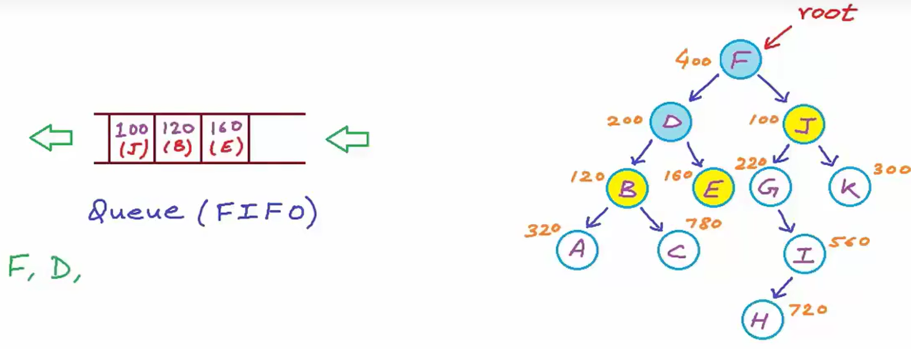

```
void levelOrder(treeNode *root){
    if(root==nullptr)return ;
    queue<treeNode*> q;
    q.push(root);
    while(!q.empty()){
        treeNode* current=q.front();
        if(current->left != nullptr){
            q.push(current->left);
        }
        if(current->right != nullptr){
            q.push(current->right);
        }
        cout<<current->data<<" ";
        q.pop();
    }
}
```

时间复杂度O（n）

空间复杂度O（1）到O（n）之间

##### 深度优先

一直往下一左子树访问直到完成所有左子树的深度

深度优先有三种遍历顺序：前序遍历、中序遍历、后序遍历

###### 前序遍历（DLR）

遍历顺序：根->左子树-> 右子树

```
void preorderTraversal(BstNode* root){
    if(root == NULL){
        return;
    }
    cout << root->data << " ";
    preorderTraversal(root->left);
    preorderTraversal(root->right);
}
```

###### 中序遍历(LDR)

遍历顺序：左子树->根-> 右子树

```
void inorderTraversal(BstNode* root){
    if(root == NULL){
        return;
    }
    inorderTraversal(root->left);
    cout << root->data << " ";
    inorderTraversal(root->right);
}
```

###### 后序遍历(LRD)

遍历顺序：左子树->右子树-> 根

```
void postorderTraversal(BstNode* root){
    if(root == NULL){
        return;
    }
    postorderTraversal(root->left);
    postorderTraversal(root->right);
    cout << root->data << " ";
}
```

#### 二叉搜索树判断

二叉搜索树的定义就是所有左子树都小于根节点，所有右子树都大于根节点

为了方便递归调用，将函数实现分为三部分

函数一功能是判定左节点的值小于根节点的值，函数二是判定右节点的值大于根节点的值

```
bool isLesser(treeNode* root,int val)
{
    if(root==nullptr){return true;}
    if(root->data<=val&&isLesser(root->left,val)&&isLesser(root->right,val))
    {return true;}
    else{
        return false;
    }
}
bool isGreater(treeNode* root,int val)
{
    if(root==nullptr){return true;}
    if(root->data>=val&&isGreater(root->left,val)&&isGreater(root->right,val))
    {return true;}
    else{
        return false;
    }
}

bool check_binarytree(treeNode* root){
    if(isLesser(root->left,root->data)&&isGreater(root->right,root->data)&&check_binarytree(root->left)&&check_binarytree(root->right))
    {
        return true;
    }
    else{
        return false;
    }
}
```

这是最简单的一种思路，类似于暴力枚取，随节点数增长，递归次数会指数级增长，所以这种方法很很容易发生栈溢出，时间复杂度是O（n^2）

另一种思路是，为条子树设置边界值，根节点的范围是（-∞，+∞）

每遍历到左节点就更新一下左边界，遍历到右节点就更新一下右边界

相对于第一种方法，这样可以直接省去两个判断大小的函数

```cpp
bool check_binarytree1(treeNode* root,int minvalue,int maxvalue){
    if(root->data>=minvalue&&root->data<=maxvalue&&check_binarytree1(root->left,minvalue,root->data)&&check_binarytree1(root->right,root->data,maxvalue))
    {
        return true;
    }
    else{
        return false;
    }
}

int main(){
	check_binarytree1(root,INT_MIN,INT_MAX);
}
```

这样的写法每个节点只需要遍历一次即可，递归次数调用会呈线性增长，而不是指数级,时间复杂度是O(n)

#### 二叉树的节点操作

##### 从二叉搜索树中删除一个节点

考虑三种情况

1. 删除节点没有子节点：直接删就行
2. 删除节点有一个子节点（可以是左子也可是右子）：将子节点替代删除节点的位置
3. 删除节点左右子节点都有：将这种情况退化为1和2来处理

综合三种情况，我们有一种更普适性的做法，去查找删除节点的左子树或右子树

方法一：找到左子树的最大值，替代删除节点（退化为情况1）

```cpp
struct treeNode* Findmin(treeNode* root){
    while(root->left!=nullptr)
    {
        root=root->left; 
    }
    return root;
}

struct treeNode* Delete(treeNode* root,int data){
    if(root==nullptr)return root;
    else if(data<root->data) root->left=Delete(root->left,data);
    else if(data>root->data) root->right=Delete(root->right,data);
    else
    {
        //case1
        if(root->left==NULL&&root->right==NULL)
        {
            delete root;
            root =NULL;
        }
        //case2
        else if(root->left==NULL)
        {
            struct treeNode* temp=root;
            root=root->right;
            delete temp; 
        }

        else if(root->right==NULL)
        {
            struct treeNode* temp=root;
            root=root->left;
            delete temp;
        }
        //case3
        else{
            struct treeNode* temp = Findmin(root->right);
            root->data=temp->data;
            root->right=Delete(root->right,temp->data);//树会转换成case2，递归调用处理case2
        }
        return root;
    }
}

```

方法二：找到右子树的最小值，替代删除节点（退化为情况2）

```cpp
struct treeNode* Findmin(treeNode* root){
    int min;
    while(root->left!=nullptr)
    {
        root=root->left; 
    }
    return root;
}

struct treeNode* Delete(treeNode* root,int data){
    if(root==nullptr)return root;
    else if(data<root->data) root->left=Delete(root->left,data);
    else if(data>root->data) root->right=Delete(root->right,data);
    else
    {
        //case1
        if(root->left==NULL&&root->right==NULL)
        {
            delete root;
            root =NULL;
  
        }
        //case2
        else if(root->left==NULL)
        {
            struct treeNode* temp=root;
            root=root->right;
            delete temp; 
        }

        else if(root->right==NULL)
        {
            struct treeNode* temp=root;
            root=root->left;
            delete temp;
        }
        //case3
        else{
            struct treeNode* temp = Findmin(root->right);
            root->data=temp->data;
            root->right=Delete(root->right,temp->data);//树会转换成case2，递归调用处理case2
        }
        return root;
    }
}
```

##### 二叉搜索树的中序后继节点

一个节点的**中序后继**是指在中序遍历序列中紧接在该节点之后的节点。

两种情况

1. **存在右子树** ：后继节点为右子树中的最左节点（即右子树的最小值节点）。
2. **无右子树** ：后继节点为第一个比该节点值大的祖先节点（即沿父指针向上追溯，直到当前节点是其父节点的左子节点，此时父节点为后继）。

```cpp
struct treeNode* Get_successor(struct treeNode* root,int data){
    struct treeNode* current=Find(root,data);
    if(current==nullptr)return NULL;
    //case1:没有右子树
    if(current->right!=NULL){
        return Findmin(current->right);
    }
    //case2：存在右子树
    else{
        struct treeNode* successor=NULL;
        struct treeNode* ancestor=root;
        while(ancestor!=current)
        {
            if(current->data<ancestor->data){
                successor=ancestor;
                ancestor=ancestor->left;
            }
            else
                ancestor=ancestor->right;
        }
        return successor;
    }
}
```

## 图（map）

边、点、有序对、有向图、无向图、加权图（具体概念详见离散数学）

### 图的属性

自环

多重边

稠密图：变多

稀疏图；边少

路径（通路）

连通性

强连通、弱连通

环

### 边列表

G=（V,E）

表示图这种数据结构需要两个列表，一个是点列表，另一个是边列表

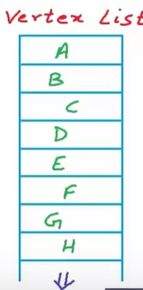

无权图

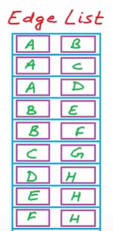

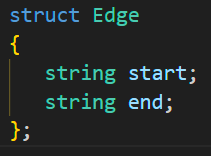

有权图

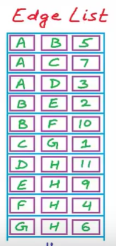

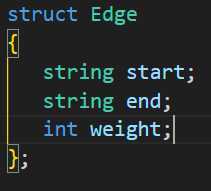

边列表的存储方式会占用很多的内存，因为边数是的空间复杂度是O（n^2）,n是边数

### 邻接矩阵

对于有n个顶点的图，建立一个n阶矩阵

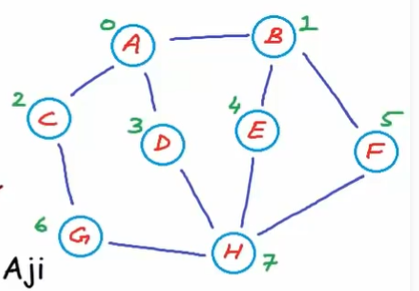

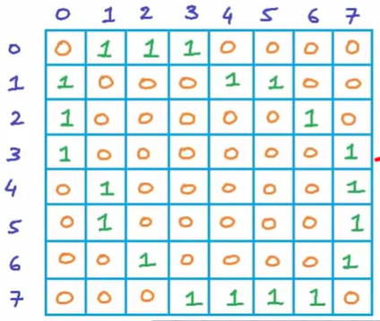

对于稠密图，邻接矩阵很实用，但是如果是稀疏图，邻接矩阵的花销会特别大，主要是空间利用上

### 邻接表

将0作为看作多余的数据，对于每个节点只存储与它相邻节点的信息，不存储与它不相邻的信息

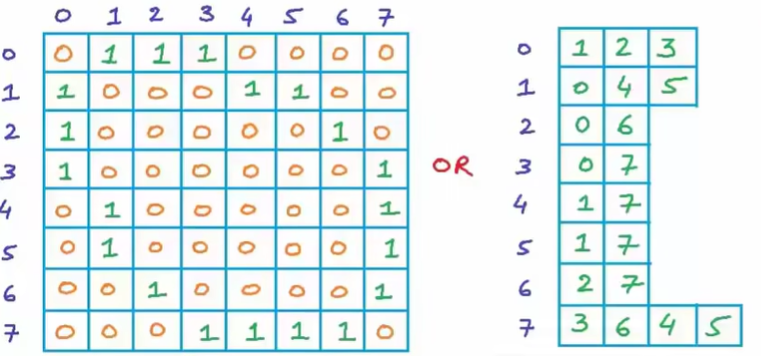

使用数组实现在增加和减少边时会有一些麻烦，利用链表会更加方便

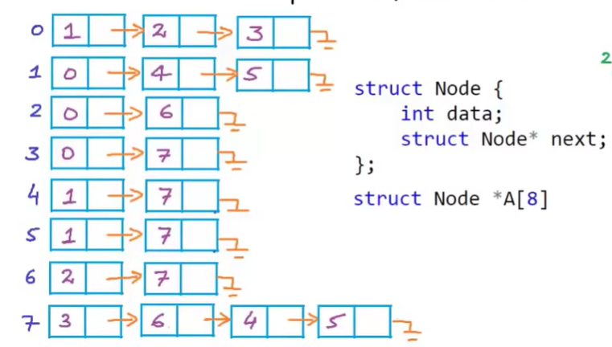

# 算法

## 十大排序

### 选择排序

### 插入排序

### 归并排序

归并操作：将n位数据和m位数据合并为一个m+n位的数据

将每一个元素看作一个个独立的子序列，然后每次对相邻的子序列进行排序

每个数作为一组，每一次两组从最小的元素开始比较，从左往右同时扫两组数据（因为每一组都是大小排好的顺序，所以从左往右就是从小到大的顺序），每次比较两组头部的数据，选两个数组中最小的放在新表的前面，然后下移一位

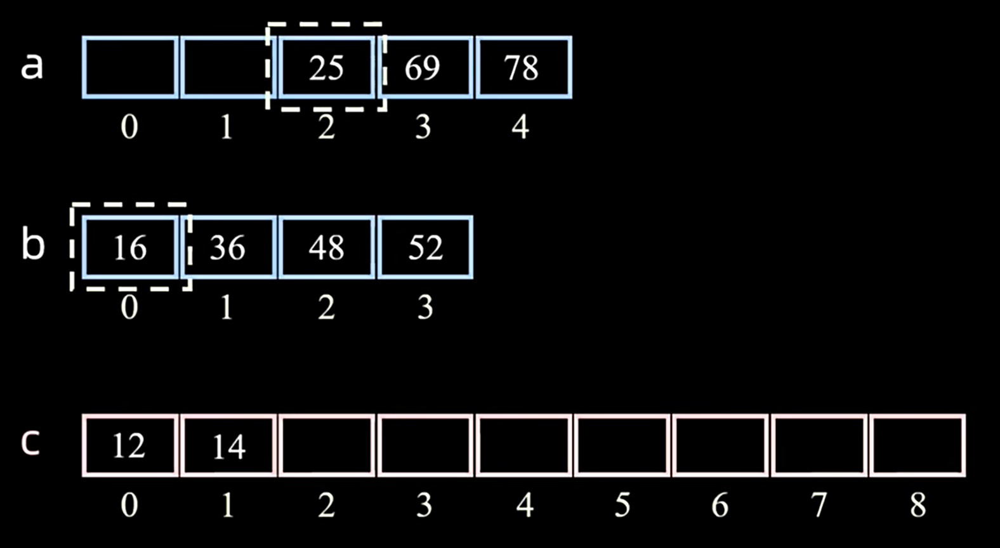

如果有一组元素已经比完了，剩下的一组元素就直接放到新表剩下的位置里

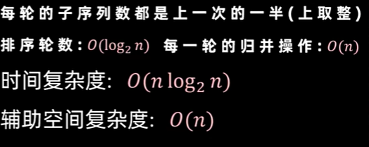

### 快速排序

**选择基准 :** 从待排序数组中选择一个元素作为基准值（选择策略有多种，如第一个元素、最后一个元素、中间元素、随机元素）。

**分区 (Partition):** 这是快速排序的核心操作。重新排列数组，使得：

所有小于 基准值 的元素都移动到基准值的 **左边** 。

所有大于基准值的元素都移动到基准值的 **右边** 。

基准值 元素本身则位于最终排序后它应该处于的正确位置。此时，数组被基准值 划分成了两个子数组（左子数组元素 <= pivot，右子数组元素 >= pivot）

递归地对基准值 **左边**的子数组和**右边**的子数组进行快速排序

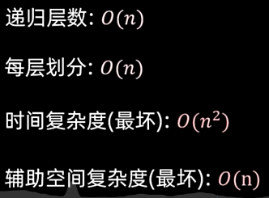

## 哈夫曼树与哈夫曼编码

### 哈夫曼树生成

使用二进制对字符进行编码时，不等长编码应该让每一个字符不含有其他字符的前缀

使用等长编码方案可以让每一个字符不含有其他字符的前缀，但是会浪费空间，不是最优的

使用哈夫曼编码可以让编码肯定不会含有前缀

原理：出现字符越多的字符编码长度越短，出现次数越少的字符编码长度越长，其次，只要让其他字符不出现在根到该字符的路径上，就不会产生歧义，因为每一个路径都是唯一的

对一个字符串，将每一个字符作为一个节点，节点的值是它出现的次数

生成树：首先计算所有字符的次数，然后每次取最小的两个生成他们的父节点，直到所有节点都生成完

生成哈夫曼树后将所有往左的边标0，所有往右的边标1，所有字符的编码就等于从根到他们的路径是经过的序号排列

带权路径长度是节点的值乘以根到该节点的边数

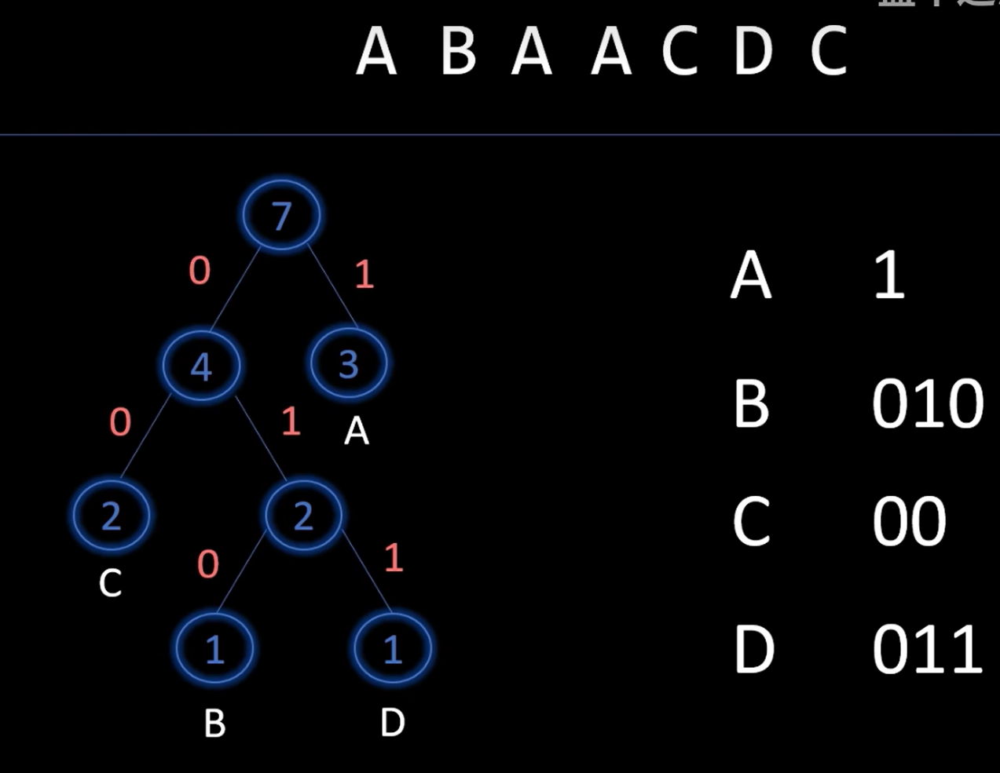

## 并查集

## 最小生成树

给定一个无向图，在无向图中求一棵树（n-1条边、无环、连通所有点），而且这棵树的边权和最小

其实就是找一个能连通所有点，而且权和最小的图

### prim算法

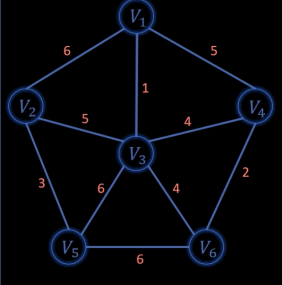

### Kruskal算法
