# 框架

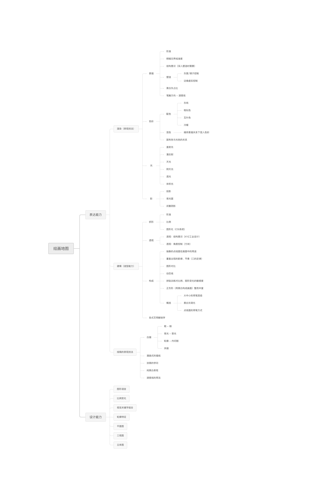

# 入门

## 练习

一.排线（控笔能力）

要点：1.中间粗，两头细

2.上一笔和下一笔尽量一样

3.画完一张，再来一张不同方向的二 .定点连线（接线能力）

要点：1.随意打点，然后把每一个点都相连

2.连线保持中间粗，两头细三.打型练习

要点：1.大型：用直线来确定，不能用曲线

2.造型：修细节

3.作辅助线：新建一个图层来做辅助线四、临摹（长期练习）

从易到难，新手临摹复杂的画是没用的

包括平常绘画时都要记得找参考，有些结构，画法，头发形状，动作是很难想出来的你自己明白自己喜欢什么样的图，不参考的话，你是永远画不出来你喜欢的图的

五、临摹到打型熟练后，就围绕三个方面狠狠练习：速写、素描、速涂速涂概括（用色块概括）

### 基本练习：几何体

正方体，长方体，圆柱体（重点），锥体

同一种几何体要从不同方向，不同角度多练几遍，还可将几何体切开，画出切开后的样子

画的时候一定要将表示结构的线段画出来可以使用对称工具，水平翻转

素描初识

素描：用单一色彩，借助明度变化表现对象的绘画方式一般由黑白灰的线条组成

固有色：物体在自然光下的主要颜色三大面：亮面，灰面，暗面

五大调：亮面（受光面），灰面（中间色），明暗交界线，反光，暗面（背光）

一般二次元绘画只需要固有色（固有色就是亮面）和暗面就能体现立体感

平涂：只包含固有色（亮面），暗面，高光

伪厚涂（更为写实）：固有色，高光，灰面，明暗线，反光一个样例（自己画的）

### 抓型

九宫格->图形抓型->透视抓型-->速写

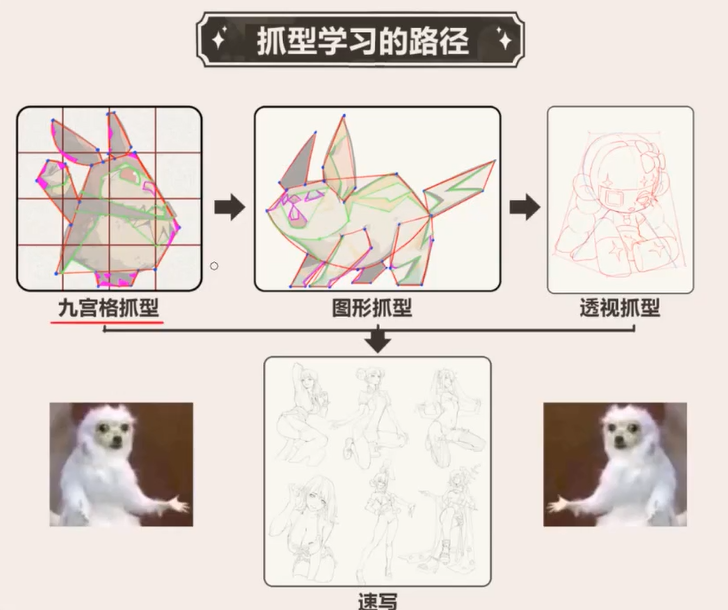

#### 九宫格抓型法

画格子，然后把每一个格子的内容都对准

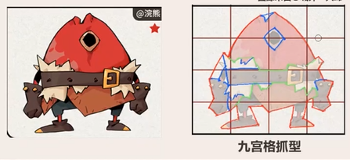

#### 图形抓型法（多边形归纳法、2D转2D）

顾名思义就是用图形来抓型

图形抓型和九宫格抓型区别在于一级形的分割，图形抓型会更加**简洁**

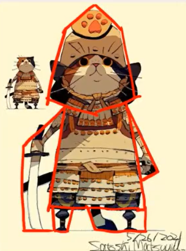

图形简洁很重要！！！图形简洁很重要！！！图形简洁很重要！！！

##### 图形抓型法的好处

* 图形抓型的方法很符合正常作画的思维，能提高图形概、整理复杂图形的能力
* 图形简单，所以能够快速记忆图画，快速复制
* 打下图形基础，能够看懂大佬的画作，有了学习大佬技法的基础

##### 图形抓型法流程

###### 1.分析框架

分析框架这个过程要动一下脑子，需要一些思考过程

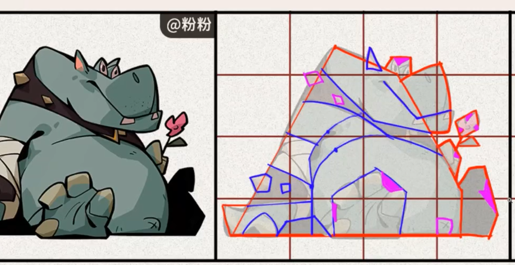

* 九宫格抓型中，可能会直接将图形整个外框归为一个图形
* 图形抓型要尽量去将图形具体分层，例如画一个人，头是一块图形，胸腔是一块图形，四肢又各自是几块图形，而不是整个人的外框都归为一个图形
* 如果抓型的对象比较零碎，那么就要使用图形的切削：将复杂图形使用简单形状的切削和组合实现，并且适当忽略细节（至于“怎么适当”这个事就要靠练习去感受了）
* 要按先大后小的顺序绘画，因为没有九宫格去定位，我们只能靠图形之间的相对关系去定位，先画出大的图形，能快速帮我们确定空间关系
  概括原图的时候也要尽量用大的图形切割
  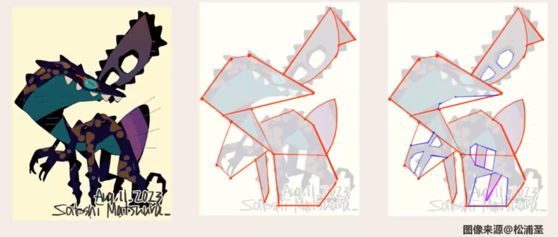

技巧：可以多用“D”字形状去切分

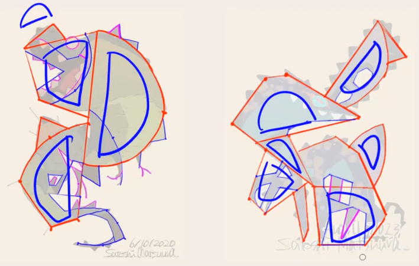

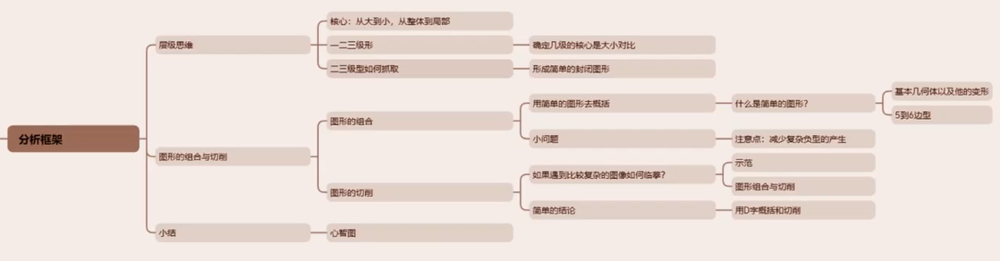

###### 2.临摹框架

就是先要把切割好的框架图形画出来

技巧：

1.确定斜线斜率的方法——空想坐标系

不好画的斜线就去找其他有关系的线条，画坐标系看斜率

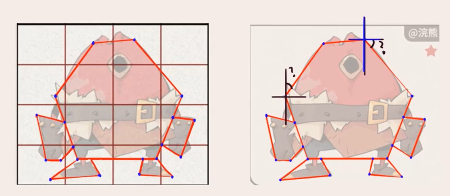

2.使用色块画图形会比单纯使用线条要更好看
因为线条框出来的图形内部是空的，会存在各种细节，让你的眼睛不好判断

（虽然填颜色很麻烦，但是这是前期熟悉时，辅助绘画用的，后面熟练了，这些都是不需要考虑的

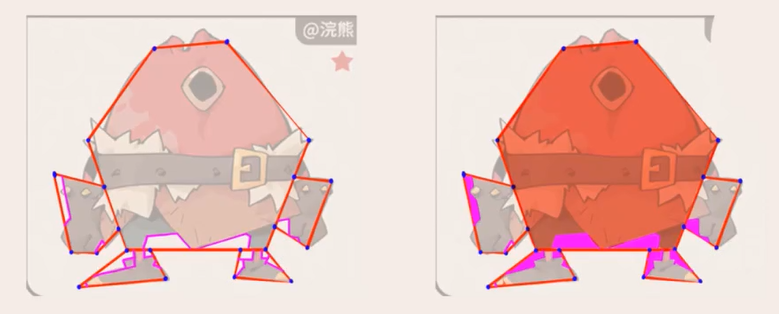

###### 3.细化修正

我们练习的是抓型，不是造型，要注意练习的目的

抓型的目的是为了准度，造型的目的是为了增加对比，让图片更好看

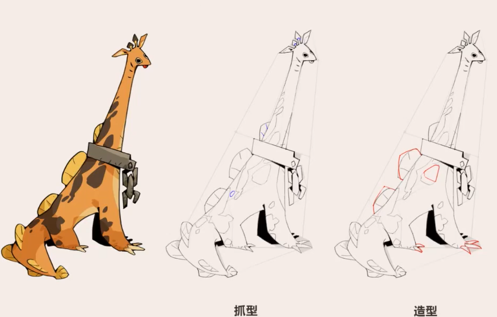

其实临摹完大部分线条后，只要把外轮廓描一遍，再把几块地方涂黑，就会看起来很高级、好看

###### 技巧：1+3+N法

主要图形1~2个，次要图形3~~4个，其余就是各种小图形

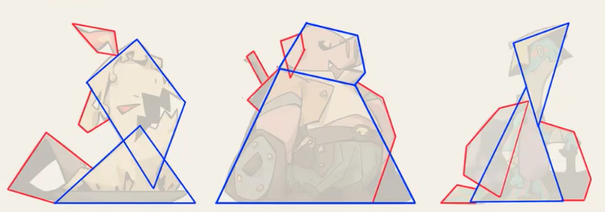

###### 技巧：正负形检查法

怎么判断一级形概括得好不好？可以将图形的的负形描出，如果负形只需要一到两个简单图形就能概括，那么就比较好

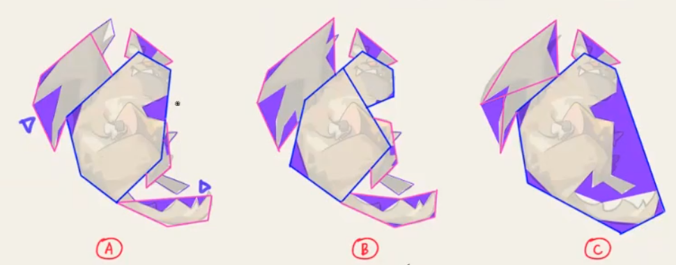

A的一级形就很不错，C负形太多了

###### 技巧：四等分角度

对于斜线，一开始无法准确判断斜率，考虑斜线在四等分角度的哪个区间，然后临摹的地方画上坐标系在对应角度区间画出斜线就好

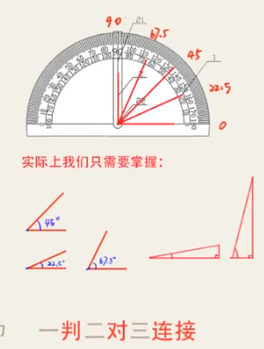

###### 技巧：图形拆分法

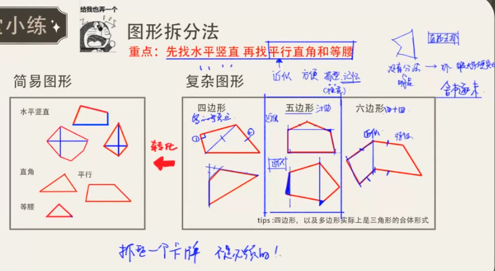

#### 透视预备

##### 透视抓型法（3D转2D、透视知识前置）

练习不同角度几何体的时候，不要去想什么消失点、远近大小这些知识，先把手练会，脑子不用动，等到正式系统学习透视知识时，这些东西都会连通的

##### 透视抓型法步骤

1.分析框架

2.临摹框架

3.用简单集合体概括大结构

4.细化小结构

5.细化修正

#### 构成预备

##### 技巧：天与地

在没有九宫格作为标准的情况下，我们需要自己制造标准

将图形最上面（天）和最下面（地）拉出直线，确定高度，然后十分专注地画出第一个基本形状，以这些为参考标准，就能画准了

##### 技巧：拆解图形，量化标准

自查时，可以按物体、人物的部件拆分出图形，然后对照原图和自己画的每一个部分，就可以看哪些部分是没做好的，没有必要让所有部分都一模一样，但是要做到符合我们心中的预期

也可以按照大块颜色区域去划分图形自查

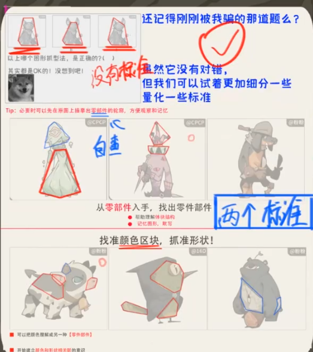

##### 不同风格的抓型特点

###### QQ人

QQ人的比例都是对称的

头、躯干、腿的比例是1：1：1，脸上双眼与中庭的宽度比也是1：1：1，手腿宽度是1：1

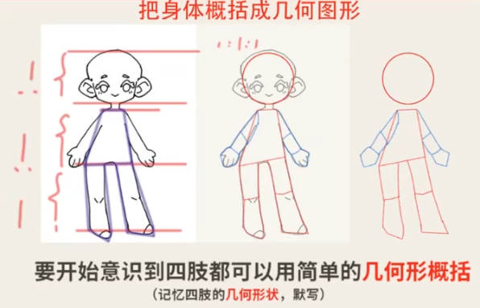

QQ人没有大开大合的线条，我们要关注的是一些小转折

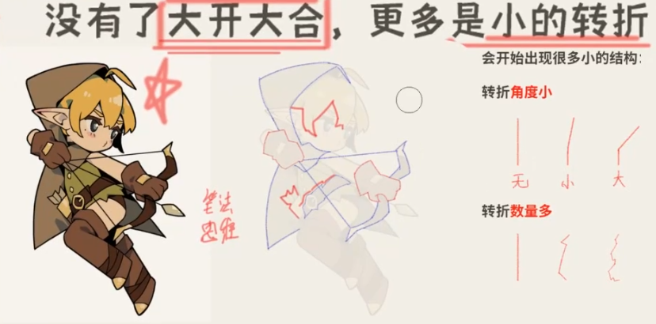

做练习时，要从单人图开始，不要去抓多人图、复杂线条的图，也不要找大透视的图

老老实实找QQ人的图来练

###### 二次元

不管是画什么东西，任何东西都可以概括成五边形、四边形

“图形是万用的”

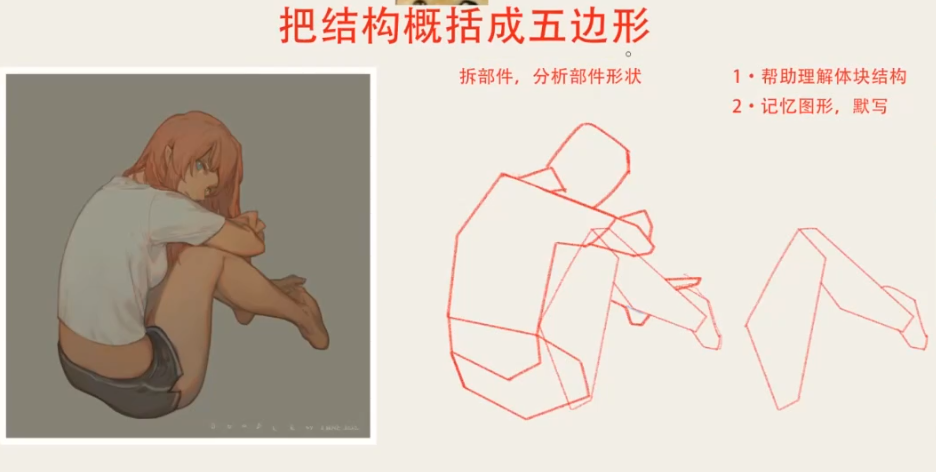

在日常练习时，临摹完人体后，就随便默写一下，看看自己临摹完记住了哪些图形构成

从五边形到画出真正的质感，体积感的塑造要靠透视的知识

利用透视的知识对简单的五边形进行切削、填充等操作，从二维变为视觉上的三维

手的关节是最多的，也是人体上最复杂的，所以手的部分需要额外记忆

学画手时，一定要找外轮廓明显的、漏出4-5个手指、尽量避免弯曲和遮挡、不要画互动图，也就是找那种外轮廓你一眼就能看出是手的，没有手和手之间互动的图

###### 技巧：三角形抓法

二次元的脸是有朝向的，在抓型时，可以把眼睛左右两端和嘴巴下端连起来，就可以根据这个三角形判断脸的朝向

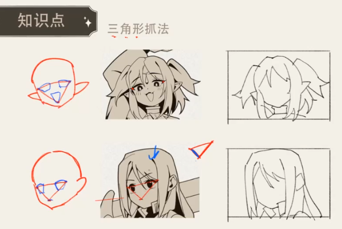

##### 抓型与写生

写生就是将肉眼看到的景象复制到画布上，写生是很难的一件事

因为眼睛会在画布和观察的事物上来回切换，需要一直花精力去比对观察。

如果大型没抓准，那么后续会越来越难画

#### 色彩预备

基础的光影色彩知识有十分的话，这里是三分左右的光影色彩知识

光影的大致操作

* 画光影的图层设置为“正片叠底”，图层的线条就不会遮挡其他图层的线条
* 阴影的颜色把H、S都调为0，明度调到需要的程度

然后就可以贴着线稿画阴影了，画多的地方用橡皮擦擦掉就行

画阴影要用色块来话，就是要去找暗部，找线条相接的地方，找轮廓线

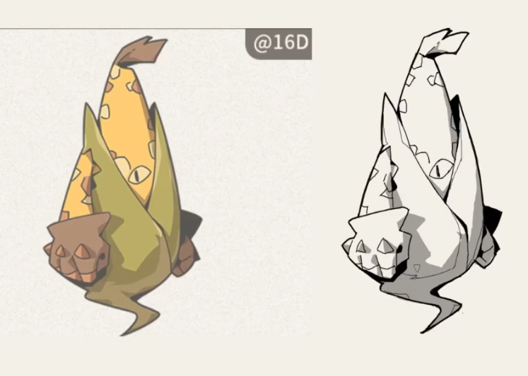

如果暗部有多层，那么第二层的暗部，就是再增加一个正片叠底的图层，然后颜色不要改，在第二层暗部区域再叠一层

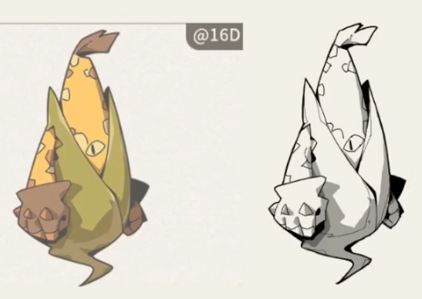

初学时，我们只画到第一层就足够了

##### 光影知识点

光影的类别有三类：厚度（明暗交界线）、投影、闭塞

###### 厚度

由物体体积产生的阴影

###### 投影

也就是光源照射产生的影子

重点是找光源的位置

###### 闭塞

也就是物体相接触的地方

这种地方光是进不去的，所以画闭塞就直接画成纯黑的就行了

闭塞不需要画在正片交叠图层，直接画在线稿层就行

##### 如何学习临摹图的阴影

临摹图形时，要学习一下作者的阴影处理，比如怎么做阴影大小对比的，怎么把阴影简化的

### 速写

### 素描

### 问题记录

 **叠图检查次数和时机？**

答：叠图检查要在4次以下，叠图检查一般在四个时间点：一级形画完检查一次、二级形画完检查一次、细节完善（三级形）检查一次，最终成图检查一次

一定要手臂发力？

答：不要跳过纠结于一定要用手肘发力，或者说不要想着手臂、手肘一定要动，怎么舒服怎么来就行，手肘发力是为了在手绘时，纸面无法缩放，能够画出长直线，但是板绘我们可以缩放画面，长直线也可以变成短直线，所以不要太纠结，自己舒服就好

**抓型一定要画得特别准吗？**

答：临摹是存在一个边际效应的，比如你画到60%-80%的相似度，只需要画60分钟，但是画到90%需要120分钟，多花了一倍的时间，但是收获很少

所以一般来说画到60-80%的相似度即可，剩下的到90%的部分，你觉得自己花时间是一定能够做到的，这样就可以了，留出的时间可以去干更多的事情

**如何提高速度？**

答：要牢记绘画流程，而且练习流程要和创作流程对应，练习时的步骤是怎么样的，创作过程也是什么样的，流程熟练之后自然就快了

很多时候绘画并不是画线条的速度不够快，而是不知道下一步要做什么，一直停在某一步

练习和绘画时，如果发现自己到哪一步不太熟练，那就接着往下画，不要一直停在那，画完之后，你就知道自己在哪一步有所不足，之后练习中就着重练习这一步

**人体要从解剖开始画吗？**

答：如果从医学解剖图、肌肉开始画，那么就学歪了，绘画目的是为了画出好看的图，绘画的人体轮廓要概括成图形才好看，学解剖和肌肉只能画出很死板的肌肉，一点都不好看

要从图形开始学

# 核心思想

## 层级思维

将图画抽象成不同层级的图形

一级形：**概括整体**的层级，用5-6边来概括，尽量使用直线，不要有明显的曲线

二级形： **分割整体**的层级，不要过多分割，只取明显，分割线与一级形的组成形状不能太复杂

三级形：**还原细节**的层级，不需要还原所有细节，细节面积一般很小，线的误差会放大，所以使用小色块会比较好画

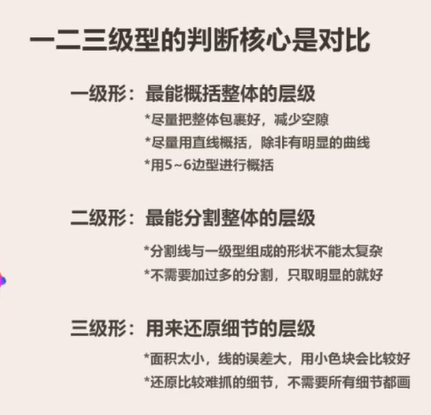

不管是哪一层，归纳出的图形都要**尽量封闭**

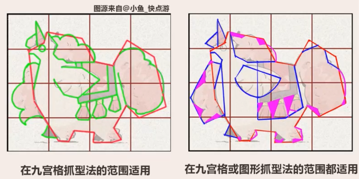

## 控线（CSI概括）

在实际运用时，要时刻判断概括图形的线用法，该用C线、S线还是I线？两个点之间的线条大概长度，最好一笔画成

CSI控线练习方法——定点描图

## 核心：图形组合

使用基本图形组合来概括，下图中的一般概括法会让后续的细化变麻烦，增大故作六，使用尽量使用简单图形，不要有太多转折

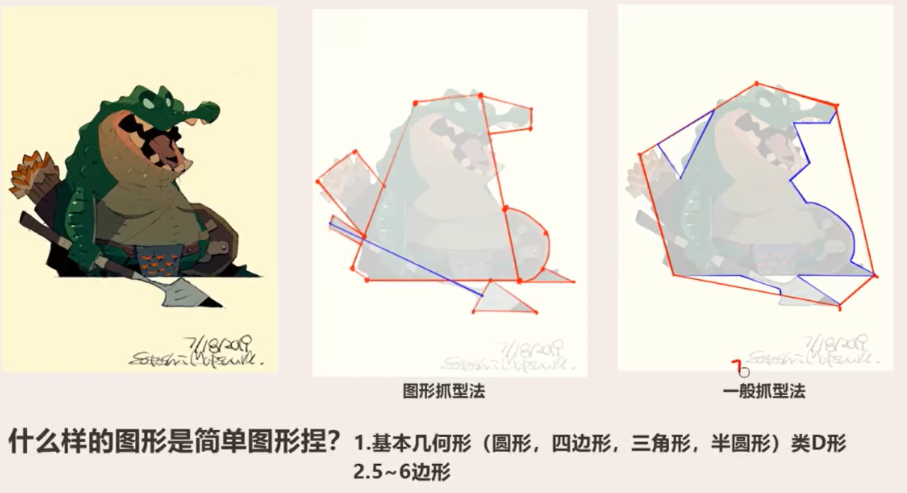

## 图形大小对比

构成图形时，整体轮廓的图形，要有一定的大小对比

这样让图形能让有看点

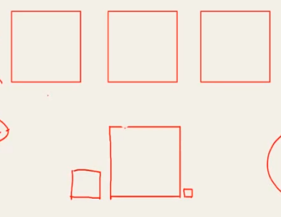

上面整齐的三个方块，没有下面存在大小对比的方块有看点

## 画面解剖

为什么大佬的图这么好看？

在九宫格时期，只能练到型准、控线，而看不到画面的设计，也就是为什么画面这么好看

为了看到这些设计，就需要抛去九宫格，使用图形概括的方法去重新认识画面，怪物也好、二次元人物也好，都是可以概括为一个个简单图形的

画师在创作时都是从简单图形出发的，整体图形的构成，阴影色块的图形大小、分布，闭塞关系，这些都是我们需要从画面中看到的

如果我们从现实照片里概括出这些知识，会花费很多时间，而解剖大佬的图形，就是快速学习大佬们从现实事物中概括出的设计知识，能做到事半功倍的效果

知识积累不够，很多东西我们是从画面中看不到的，练习是要在知晓绘画知识的基础上的，天天练死劲是不可取的

## 卑鄙的画画人

我们对绘画已经学到了很多的方法

十字抓型、九宫格、图形概括、各种抓型技巧

绘画时，不要拘泥于只使用一种方法，尤其是接触到新的画风、新的风格时，要认真对待，只要能够把图得又快又好，用多少方法都不为过

## 练习和创作如何关联

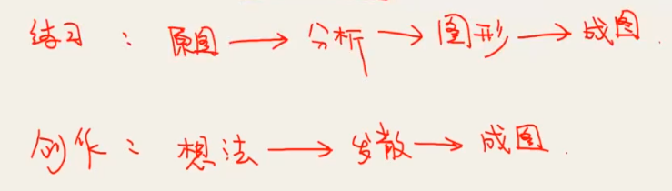

练习过程中，原图、分析、成图我们基本都是记不住的，能够留下深刻印象的只有概括出的简单图形

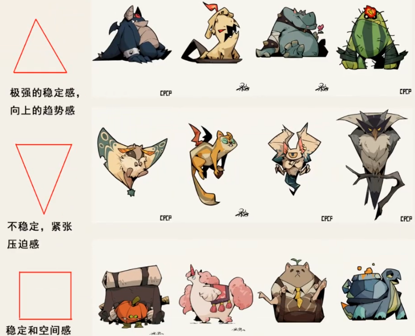

三角形可以是蘑菇、仙人掌、恶魔，那也可以是和恶魔、恶魔这些类似的东西

创作过程中最难的就是想法这一步，很多时候只是有个大概的想法，比如我要画一只恶魔、画一只蝴蝶，但是恶魔和蝴蝶可以是什么样子呢？我们就可以从平常练习的积累中知道，恶魔可以是三角形、蝴蝶可以是倒三角形，之后就有了抓手，开始进入创作的发散阶段

## 关键点推理

# 透视

## 大纲

## 第一讲

### 最小必要知识

人类的视野范围

摄影机的角度和物体的关系决定了要画几点透视

旋转问题：N点透视，但是并非所有物体的消失点都只能为一组，一个画面是可以存在多组消失点的

### 常见错误

1.蹭线

线条尽量一笔画成，除了长线条，都要尽量一条线直接画完

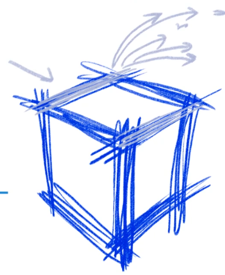

2.甩线

线要画直，有头有尾，不能乱甩

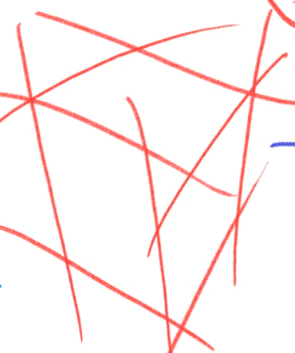

3.反透视

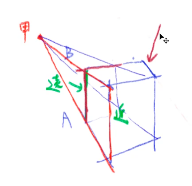

如果不拉出来看，线看起来很对，但实际是歪的

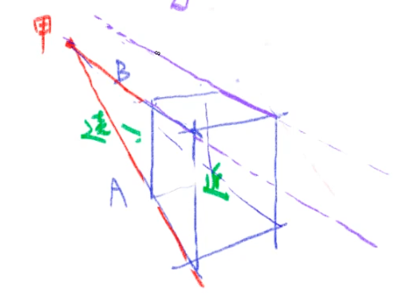

每次歪一点，多次线条积累下来就直接歪了，尽量多检查

（每一条线都检查也可以，但是很难做到，没有耐心

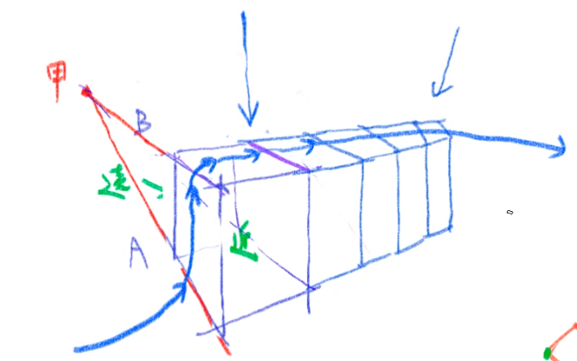

### 检查方法

钢笔工具，点两个点会自动生成一条直线，如何我们拖拽一端，就可以绕一点旋转，用来检查透视

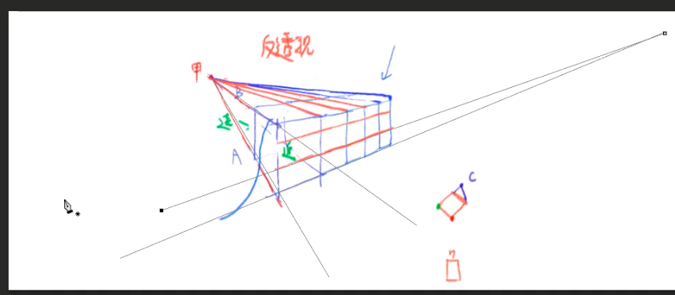

### 抓型与空间

看到画面中的图形，可以在想象一下三视图，或者直接画出三视简图，然后比较一下线条之间的比例关系

然后照着三视图，像搭建积木一样，画出图像

#### 二维抓型画法

九宫格那一套

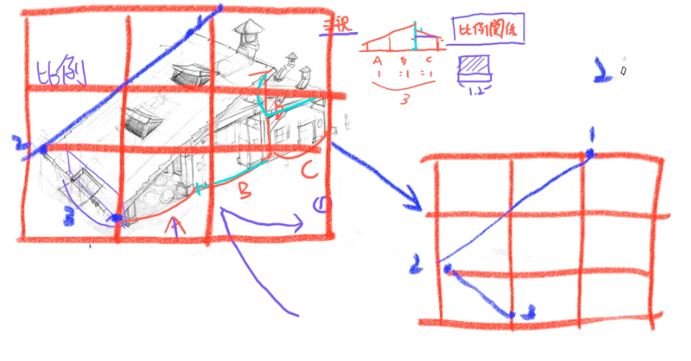

在透视绘画中，有着两种临摹画法

#### 方盒子

从画面中找到三维xyz的线条方向，然后画出一个方向一致的方盒子，然后在盒子里画出物体

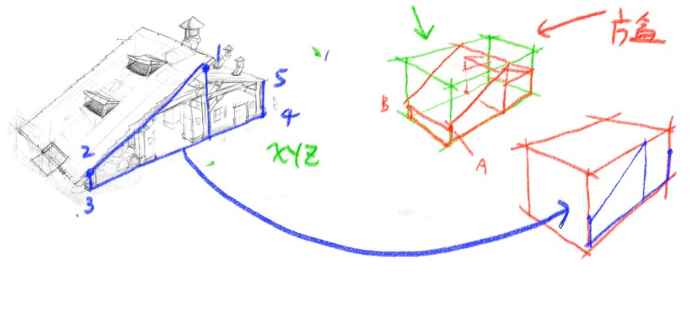

和二维的抓型其实也是一样的，都是在找坐标点点，不过点从二维九宫格、十字线这些，变成了盒子上三维的坐标点

#### 比例画法

根据线条关系，按比例画出来

先大概定出底面（地板），然后根据底面的点，不断根据关系延伸，推理出其他的点

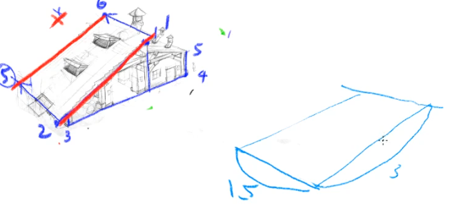

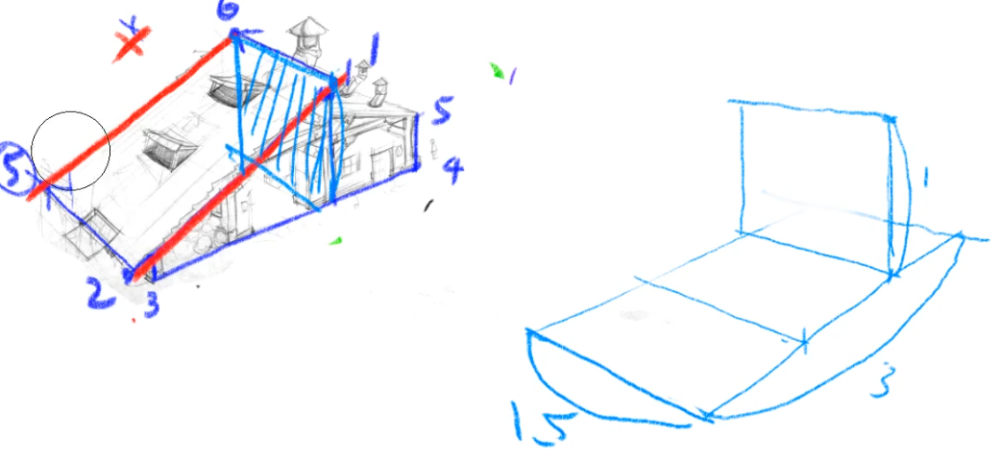

侧面的图要根据夹角角度推测

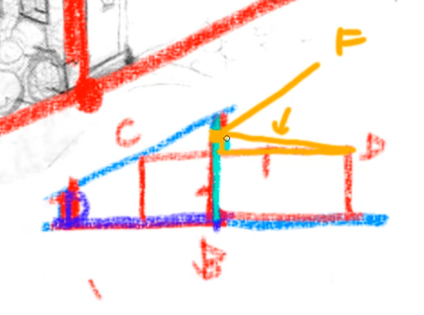

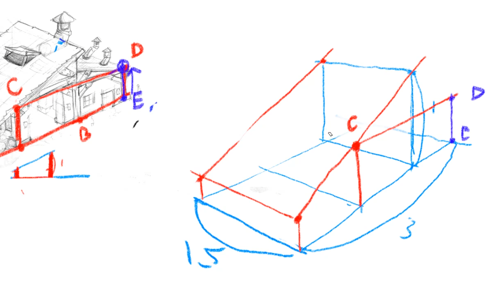

背后看不见的点，就要根据推理出的其他点（D、C）画

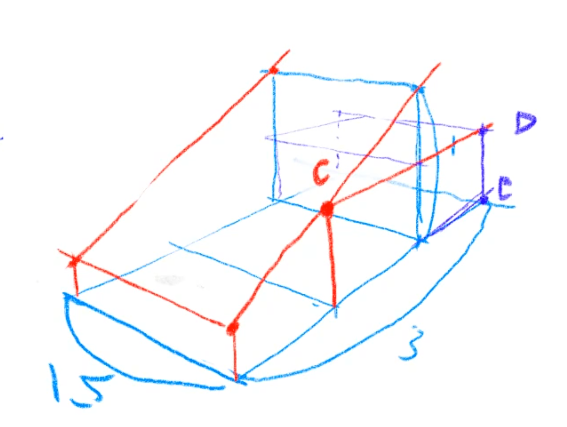

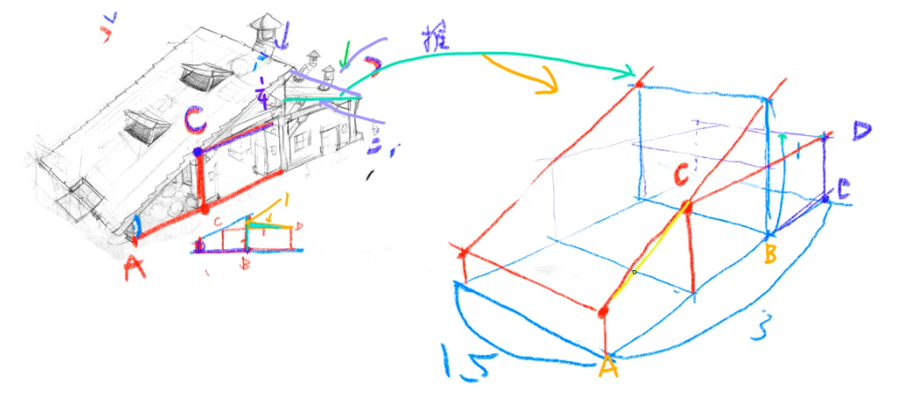

### 透视的基本计算逻辑

#### 打交叉、求中点

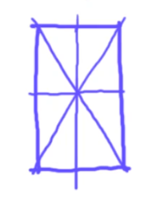

#### N字法（Z字法）

数学原理就是两个方块共用一个中心

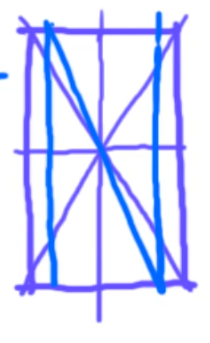

比如要画屋顶上的两个窗户，就需要算N字和Z字去确定关系

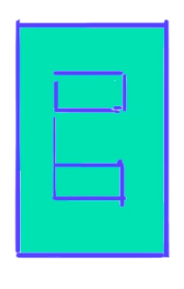

### 技巧：自由变换贴图

很多抓不准的小透视关系，可以画出它的正视图，然后自由变换贴上去

比如屋顶的两扇窗户

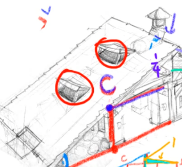

先画出正面的

然后在画好的大形上Ctrl+T贴上去

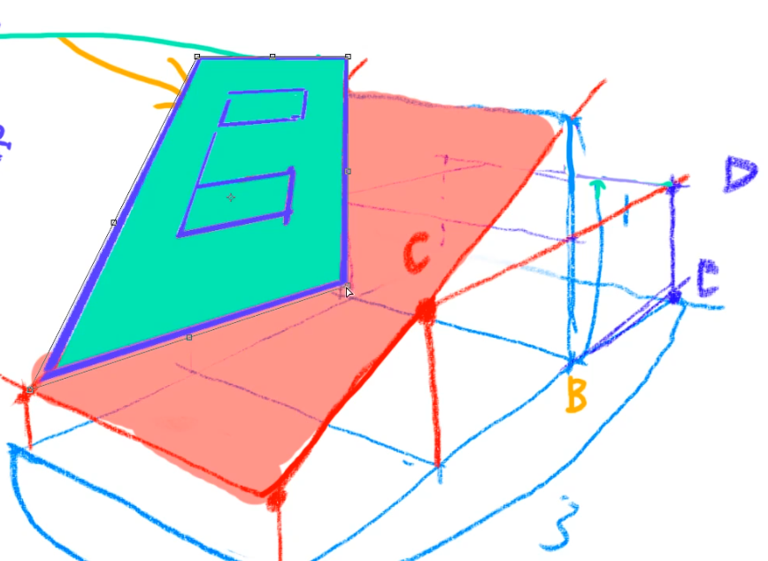

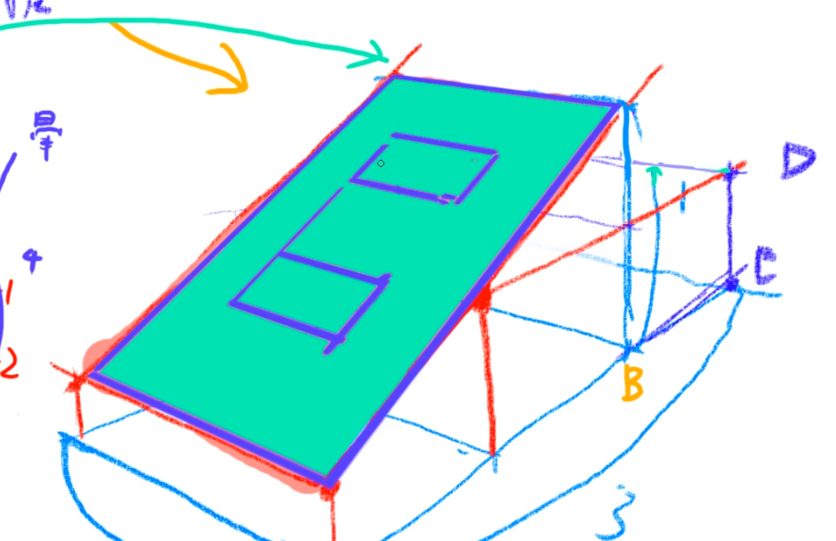

### 技巧：倍增法

画出1：1的方块

然后一个顶点连接对应边的中点，就可以延长出来的另一个1：1的方块，然后我们就得到了1：2的关系

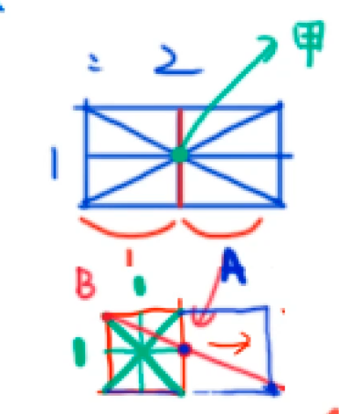

找1：3的关系，就在延长出的第2个方块，再做一次倍增，算上原来的一个方块，三个1：1方块连起来就是1：3的关系

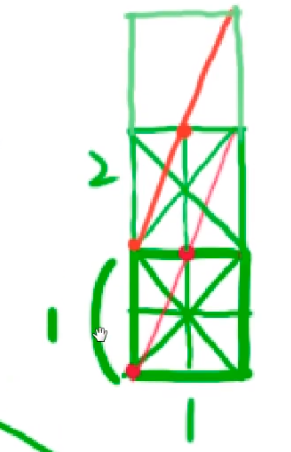

如果只是正视图可能不觉得倍增法的强大，在三维透视空间中，其实这个方法也是适用的，比目测要靠谱很多

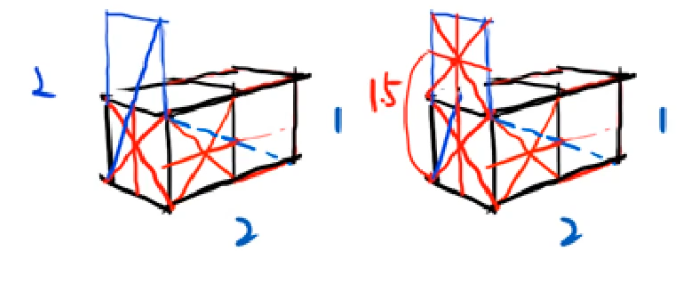

### 技巧：色块强调

有的时候画的太累，或者眼花了，会忘记自己在画哪些面，可以拿个颜色把面涂一下，方便区分不同面

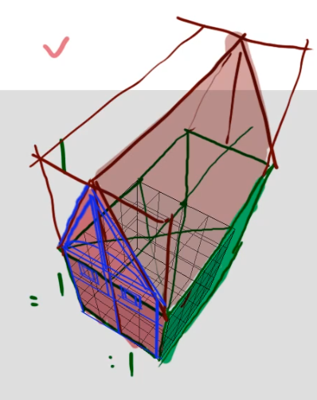

### 45°是最好画的角度

45°方块特征

1.对称

45°方块左右的斜度是一样的，左右面积也是一样的

也就是所有的关系都是1：1的比例关系

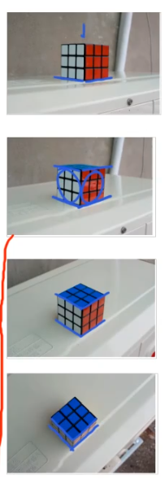

## 第二讲

线画的直，透视才是准的，直线画得直可以解决大部分的问题

找方块的角度，就找一张照片或者用3d软件摆一个，就直接画，不能空想

线画直的能力（不用软件辅助）：需要积累用线的经验

画好机械体->画好球体->画好人体

推理结构：需要画机械结构来学会和熟练使用

曲面结构物体、动脑思考怎么拆解物体

## 其他

### PCDA循环

Plan（计划）、Do（执行）、Check（检查）和 Act（处理）

绘画需要前中后期计划，“练习”只占了Do这个环节，只是纯练的话，只能提升我们的熟练度，没办法学到真正的东西

前期的计划（你想达成什么样的目标）、中期执行、后期复盘，每个环节都不可以少

纯练习的时间要和思考的时间一样，尽量做到时间1：1

### 分类-周哈里窗

知识点可以分门别类，周哈里窗将信息分类为四个部分，分类好知识，能够让我们更加了解自己，知道自己哪些地方不会，能够更好地向他人提问，最终目的都是为了扩大第一个区域“共识区域”

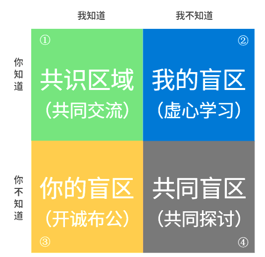

# 色彩

# 构成

## 人体

### 日系五官

脸部特征概括:三庭五眼

（发际线到眉弓骨，眼睛到鼻子，鼻子到下巴这"三庭"距离大致相等，两眼及两眼之间加上眼睛左右到脸两侧宽度大致为"五个眼睛"的长度）

调控比例需要注意:

1. 脸型（脸蛋的形状）:"转折"在嘴巴处，鼻子可以高一点但不能太矮，大概在下庭的二分之一处，脑袋上半部分比下半部分要
2. 眼距，眼型
3. 中线位置（眼睛位置）

二次元头骨比较大，从眼睛部位画一条中线，发顶到中线距离会比中线到下巴的距离长

一个样例

### 角色表情

2024年1月29日 19:34

常见的表情有喜怒哀乐等，

表情能塑造出角色特有的气质，包括常说高冷、开朗活泼等形象特点可以在绘画时想一下，如果自己是这种表情，该是什么样子的

"公式"表情:头偏左，眼睛看镜头

眼睛看向上下左右等不同的方向都会造成表情的改变

### 头发

头型画的好头发就能画好，头发是在头型的基础上添加的头发不是直的，是贴着脑袋生长的，是弯的

头发片不能过于平均

完美的头发片是顺滑的

画头发要用加法，先画大片，再加细节

先画大块的头发进行分组，然后再细化，理清结构层次，哪一片在前面，哪一片在后面

人体比例及体块

2024年1月30日 20:52

头身比是一个相对的概念，

一般二次元正常头身比是7\~8个头身先学会一种比例，之后再慢慢扩充

二次元手会短一些，轮廓会和现实中的不一样，脖子长0.5个头，胸腔1.5个头，宽2个头，胸腔底部到盆骨大概

0.5个头

手肘在腰的那里，确定手肘就能得到上臂的长度，下臂长度与上臂相同，手掌大概0.5个头长大腿大概2个头左右，小腿比大腿稍微短一些，脚宁愿画小一些也不要画得太大

体块（直接记忆）

男性线条更为硬朗，直线条会用得多，女性更为柔和，造型会更圆一些

女 男

人体需要特别高的熟练度才能画好

肌肉结构

一.脖子

斜方肌

骨架

正面

侧面

背面

> 女性肩部不能太突，不然会比较难看

> 造型大概为方形加三角形的样子
>
> 
>
> 二.肩部
>
> 
>
> 三.手臂正面 侧面
>
> 背面
>
> 
>
> 四、胸腔、腹肌、肋骨
>
> 五、臀部、腿部
>
> 穿插关系很重要
>
> 可以把臀部看作腿部一个大号的三角肌
>
> 
>
> 

> 前期练习就照着图片把肌肉机构描出来，熟练后再进行默写
>
> 

六、手部（动作太多，比较复杂）

先画扁的体块，再将手指切出来，手指关节不要明显

指甲盖没必要画

要画的话，指甲盖不要太明显男性指甲

女性指甲

速写（人体动态）

速写：较短时间内，以简洁、快速的方式捕捉主题的形态、结构和特征的绘画作品。两种手法

1.（蹭线）：偏向打形

2.偏向表达（前期不好画，但是快，人体熟练后可以偏向这种）

造型偏向：

1. 方、硬

2. 圆、弧

> 
>
> （不用刻意去营造这种偏向，哪种舒服画哪种）
>
> 
> 动态：先学会简单角度的动态（仰视俯视、侧面这种）人体正常体态（侧）
>
> 注意正常站姿下人体胸腔部分都是倾斜的，并非直线
>
> 
>
> 
>
> 正常站姿下的腿部

> 正面小腿部分会有向外拐的趋势
>
> 
>
> 背后视角
>
> 
>
> 张开腿时，现实中外拐趋势不会这么夸张

> 体态正确，人就能站稳（关系到重心的问题，可以从视觉上直接判断）观察时，如果觉得角色站不稳，有歪倒趋势，说明重心是歪的
>
> 
>
> 重心歪了，进行姿态调整时，可以想象歪倒的方向，然后想想如果这样倒下去正常人会做出什么姿态来维持平衡，以此调整姿态（受力分析会很游泳）

> 支撑物可以创造出更多的动作
>
> 
>
> 以上这些仅考虑在地面上的姿态如果是在空中，姿态会更加自由

> 有变化才好看，塑造造型时太过对称会不好看，比如腿部两腿都是直的、同一角度就不好看，
>
> 
>
> 

### 日系色彩

> 2024年7月17日 13:51
>
> （先把素描练好再来去研究各种色彩技法，混色、渐变、藏色、彩虹等等这些，不会配色可以直接用黑白灰，除了皮肤，都用黑白灰）
>
> 一、色彩基础色相
>
> 明度
>
> 饱和度（鲜艳度、纯度、浓度）色彩感受：轻、重、冷、暖
>
> 色感：培养色感需要在日常生活中观察
>
> 对比：多个颜色放一起，它看起来冷那就是冷色，看起来暖那就是暖色色彩不能极端，饱和度不要太高

> 二、暗部色（素描）
>
> 暗部尽量要统一，往冷色偏，就大部分是冷的，往暖色偏，就大部分是暖的
>
> 灰色可以用来调和
>
> 很多颜色都是画的过程中堆叠随机画出来的，觉得不错就保留下来
>
> 三、色彩配比固有色区分 亮暗区分
>
> 色相区分
>
> 主色调明确（主色调占很大比例，主色不一定是一种颜色，也可以是多种颜色）主色控制在三种色系（浅红、暗红都属于一种色系）以内
>
> 某些物质、材质必须要用固定配色（如金属、皮革），特殊材质不能乱用色彩
>
> 二分画法
>
> 2024年7月18日 14:14
>
> 通过概括达到立体效果，明暗面加上阴影

> 对结构的理解决定阴影画得准不准确

> 二分作用：

1. 用于塑造（二分作为作画过程的一个环节）

> 
>
> 塑造是指利用阴影（暗部）增加细节表达、增加材质质感

有塑造

2. 用于表达（结果）

> 学会找光源，解剖明暗关系
>
> 看整体，不要看细节
>
> 
>
> 正侧光是最容易理解的光影，先学会画正侧光再去学其他角度的光
>
> 暗部不是沿着线画的，而是去涂一个面，不要总是哪里有线就在哪里画阴影，先画大块的阴影，小部分的阴影是后期塑造的时候再来画的，大块阴影是按结构来找的，重点是结构
>
> 错误示范（衣服褶皱）

有塑造

顶光

> 
>
> 错误示范（头像）

> 练习，每一次练完一个东西的线稿，那就接着把它的二分画出来

# ps常用快捷键

> 2024年1月12日 15:48
>
> 笔：B
>
> 橡皮擦：E裁剪：C套索：L
>
> 新建图层：Ctrl+shift+N图层合并：Ctrl+E
>
> 撤回：Ctrl+Z或Ctrl+Alt+Z抓取：空格
>
> 自由变换：Ctrl+T
>
> 按shift可以画出标准直线
>
> 分区 入门 的第 35 页
>
> 头发的画法
>
> 2023年12月3日 19:03
>
> 一、动态线画法
>
> 确定动态线（头发走势）------\>头发分组（画叶片）

> 走势
>
> 二、分组画法
>
> 
>
> 
> 
>
> 
>
> 

> 增加细节
>
> 

# 色彩基础知识

> 2024年3月1日 16:31
>
> 色相（Hue）：可以理解为我们平常所说的"颜色"
>
> 饱和度（Saturation，明度）：指强度，能决定色彩的鲜艳程度
>
> 色值（Value，纯度）：颜色深浅色环
>
> 暖色：色环上红橙黄一边的颜色会给人热烈、兴奋的感觉冷色：以蓝色为主导的，绿色紫色等，
>
> 相似色搭配：用色环上相邻的颜色搭配
>
> 
>
> 互补色搭配：用色环上相对的颜色搭配
>
> 
>
> 分裂互补配色：用相对颜色的两侧颜色搭配
>
> 
>
> 三元配色：在色环上选取的颜色呈标准的三角形

> 四元配色：在色环上选举的颜色呈矩形
>
> 
>
> 配色平衡法则：
>
> 1.深浅平衡：利用明度变化
>
> 

> 冷暖平衡：
>
> 画面太冷太暖都会引起不适，过于冰冷的画面可以加入一些暖色点缀，以此平衡画面
>
> 
>
> 互补色平衡：对比明显，突出画面
>
> 
>
> 色彩大小平衡（面积平衡）：可以用于突出主体
>
> 
>
> 有无彩色平衡：彩色指色环上的颜色，无彩色只黑白灰无彩色会看起来很无聊，有彩色会让画面比较鲜活
>
> 无彩色 有彩色
>
> 
>
> 二者结合
>
> 
>
> 花色纯色平衡：花色指有多种颜色组合的模块或者多种图案的部分，就是一个画面不能太花，要有纯色部分
>
> 
>
> 一些配色原则：

1. 如果整幅画面颜色太扎眼了，可以选其中一种颜色降低饱和度
2. 不要过多的使用大量色彩，要保证整幅画面具有可读性，简单易懂
3. 中性颜色（白色，黑色，灰色）可以帮助平衡画面
4. 明亮色彩能带来温馨感和现代感
5. 低饱和度颜色更适合用于商业场合
6. 看从广告，商业产品，绘画作品中学习色彩搭配，还不会就直接上配色网站

# 个人配色积累

> 2024年7月17日 15:55
