# 框架

# 入门

## 练习

一.排线（控笔能力）

要点：1.中间粗，两头细

2.上一笔和下一笔尽量一样

3.画完一张，再来一张不同方向的二 .定点连线（接线能力）

要点：1.随意打点，然后把每一个点都相连

2.连线保持中间粗，两头细三.打型练习

要点：1.大型：用直线来确定，不能用曲线

2.造型：修细节

3.作辅助线：新建一个图层来做辅助线四、临摹（长期练习）

从易到难，新手临摹复杂的画是没用的

包括平常绘画时都要记得找参考，有些结构，画法，头发形状，动作是很难想出来的你自己明白自己喜欢什么样的图，不参考的话，你是永远画不出来你喜欢的图的

五、临摹到打型熟练后，就围绕三个方面狠狠练习：速写、素描、速涂速涂概括（用色块概括）

### 基本练习：几何体

正方体，长方体，圆柱体（重点），锥体

同一种几何体要从不同方向，不同角度多练几遍，还可将几何体切开，画出切开后的样子

画的时候一定要将表示结构的线段画出来可以使用对称工具，水平翻转

素描初识

素描：用单一色彩，借助明度变化表现对象的绘画方式一般由黑白灰的线条组成

固有色：物体在自然光下的主要颜色三大面：亮面，灰面，暗面

五大调：亮面（受光面），灰面（中间色），明暗交界线，反光，暗面（背光）

一般二次元绘画只需要固有色（固有色就是亮面）和暗面就能体现立体感

平涂：只包含固有色（亮面），暗面，高光

伪厚涂（更为写实）：固有色，高光，灰面，明暗线，反光一个样例（自己画的）

### 抓型

九宫格->图形抓型->透视抓型-->速写

#### 九宫格抓型法

画格子，然后把每一个格子的内容都对准

#### 图形抓型法（多边形归纳法、2D转2D）

顾名思义就是用图形来抓型

图形抓型和九宫格抓型区别在于一级形的分割，图形抓型会更加**简洁**

图形简洁很重要！！！图形简洁很重要！！！图形简洁很重要！！！

##### 图形抓型法的好处

* 图形抓型的方法很符合正常作画的思维，能提高图形概、整理复杂图形的能力
* 图形简单，所以能够快速记忆图画，快速复制
* 打下图形基础，能够看懂大佬的画作，有了学习大佬技法的基础

##### 图形抓型法流程

###### 1.分析框架

分析框架这个过程要动一下脑子，需要一些思考过程

* 九宫格抓型中，可能会直接将图形整个外框归为一个图形
* 图形抓型要尽量去将图形具体分层，例如画一个人，头是一块图形，胸腔是一块图形，四肢又各自是几块图形，而不是整个人的外框都归为一个图形
* 如果抓型的对象比较零碎，那么就要使用图形的切削：将复杂图形使用简单形状的切削和组合实现，并且适当忽略细节（至于“怎么适当”这个事就要靠练习去感受了）
* 要按先大后小的顺序绘画，因为没有九宫格去定位，我们只能靠图形之间的相对关系去定位，先画出大的图形，能快速帮我们确定空间关系
  概括原图的时候也要尽量用大的图形切割
  

技巧：可以多用“D”字形状去切分

###### 2.临摹框架

就是先要把切割好的框架图形画出来

技巧：

1.确定斜线斜率的方法——空想坐标系

不好画的斜线就去找其他有关系的线条，画坐标系看斜率

2.使用色块画图形会比单纯使用线条要更好看
因为线条框出来的图形内部是空的，会存在各种细节，让你的眼睛不好判断

（虽然填颜色很麻烦，但是这是前期熟悉时，辅助绘画用的，后面熟练了，这些都是不需要考虑的

###### 3.细化修正

我们练习的是抓型，不是造型，要注意练习的目的

抓型的目的是为了准度，造型的目的是为了增加对比，让图片更好看

其实临摹完大部分线条后，只要把外轮廓描一遍，再把几块地方涂黑，就会看起来很高级、好看

###### 技巧：1+3+N法

主要图形1~2个，次要图形3~~4个，其余就是各种小图形

###### 技巧：正负形检查法

怎么判断一级形概括得好不好？可以将图形的的负形描出，如果负形只需要一到两个简单图形就能概括，那么就比较好

A的一级形就很不错，C负形太多了

###### 技巧：四等分角度

对于斜线，一开始无法准确判断斜率，考虑斜线在四等分角度的哪个区间，然后临摹的地方画上坐标系在对应角度区间画出斜线就好

###### 技巧：图形拆分法

#### 透视预备

##### 透视抓型法（3D转2D、透视知识前置）

练习不同角度几何体的时候，不要去想什么消失点、远近大小这些知识，先把手练会，脑子不用动，等到正式系统学习透视知识时，这些东西都会连通的

##### 透视抓型法步骤

1.分析框架

2.临摹框架

3.用简单集合体概括大结构

4.细化小结构

5.细化修正

#### 构成预备

##### 技巧：天与地

在没有九宫格作为标准的情况下，我们需要自己制造标准

将图形最上面（天）和最下面（地）拉出直线，确定高度，然后十分专注地画出第一个基本形状，以这些为参考标准，就能画准了

##### 技巧：拆解图形，量化标准

自查时，可以按物体、人物的部件拆分出图形，然后对照原图和自己画的每一个部分，就可以看哪些部分是没做好的，没有必要让所有部分都一模一样，但是要做到符合我们心中的预期

也可以按照大块颜色区域去划分图形自查

##### 不同风格的抓型特点

###### QQ人

QQ人的比例都是对称的

头、躯干、腿的比例是1：1：1，脸上双眼与中庭的宽度比也是1：1：1，手腿宽度是1：1

QQ人没有大开大合的线条，我们要关注的是一些小转折

做练习时，要从单人图开始，不要去抓多人图、复杂线条的图，也不要找大透视的图

老老实实找QQ人的图来练

###### 二次元

不管是画什么东西，任何东西都可以概括成五边形、四边形

“图形是万用的”

在日常练习时，临摹完人体后，就随便默写一下，看看自己临摹完记住了哪些图形构成

从五边形到画出真正的质感，体积感的塑造要靠透视的知识

利用透视的知识对简单的五边形进行切削、填充等操作，从二维变为视觉上的三维

手的关节是最多的，也是人体上最复杂的，所以手的部分需要额外记忆

学画手时，一定要找外轮廓明显的、漏出4-5个手指、尽量避免弯曲和遮挡、不要画互动图，也就是找那种外轮廓你一眼就能看出是手的，没有手和手之间互动的图

###### 技巧：三角形抓法

二次元的脸是有朝向的，在抓型时，可以把眼睛左右两端和嘴巴下端连起来，就可以根据这个三角形判断脸的朝向

##### 抓型与写生

写生就是将肉眼看到的景象复制到画布上，写生是很难的一件事

因为眼睛会在画布和观察的事物上来回切换，需要一直花精力去比对观察。

如果大型没抓准，那么后续会越来越难画

#### 色彩预备

基础的光影色彩知识有十分的话，这里是三分左右的光影色彩知识

光影的大致操作

* 画光影的图层设置为“正片叠底”，图层的线条就不会遮挡其他图层的线条
* 阴影的颜色把H、S都调为0，明度调到需要的程度

然后就可以贴着线稿画阴影了，画多的地方用橡皮擦擦掉就行

画阴影要用色块来话，就是要去找暗部，找线条相接的地方，找轮廓线

如果暗部有多层，那么第二层的暗部，就是再增加一个正片叠底的图层，然后颜色不要改，在第二层暗部区域再叠一层

初学时，我们只画到第一层就足够了

##### 光影知识点

光影的类别有三类：厚度（明暗交界线）、投影、闭塞

###### 厚度

由物体体积产生的阴影

###### 投影

也就是光源照射产生的影子

重点是找光源的位置

###### 闭塞

也就是物体相接触的地方

这种地方光是进不去的，所以画闭塞就直接画成纯黑的就行了

闭塞不需要画在正片交叠图层，直接画在线稿层就行

##### 如何学习临摹图的阴影

临摹图形时，要学习一下作者的阴影处理，比如怎么做阴影大小对比的，怎么把阴影简化的

### 速写

### 素描

### 问题记录

 **叠图检查次数和时机？**

答：叠图检查要在4次以下，叠图检查一般在四个时间点：一级形画完检查一次、二级形画完检查一次、细节完善（三级形）检查一次，最终成图检查一次

一定要手臂发力？

答：不要跳过纠结于一定要用手肘发力，或者说不要想着手臂、手肘一定要动，怎么舒服怎么来就行，手肘发力是为了在手绘时，纸面无法缩放，能够画出长直线，但是板绘我们可以缩放画面，长直线也可以变成短直线，所以不要太纠结，自己舒服就好

**抓型一定要画得特别准吗？**

答：临摹是存在一个边际效应的，比如你画到60%-80%的相似度，只需要画60分钟，但是画到90%需要120分钟，多花了一倍的时间，但是收获很少

所以一般来说画到60-80%的相似度即可，剩下的到90%的部分，你觉得自己花时间是一定能够做到的，这样就可以了，留出的时间可以去干更多的事情

**如何提高速度？**

答：要牢记绘画流程，而且练习流程要和创作流程对应，练习时的步骤是怎么样的，创作过程也是什么样的，流程熟练之后自然就快了

很多时候绘画并不是画线条的速度不够快，而是不知道下一步要做什么，一直停在某一步

练习和绘画时，如果发现自己到哪一步不太熟练，那就接着往下画，不要一直停在那，画完之后，你就知道自己在哪一步有所不足，之后练习中就着重练习这一步

**人体要从解剖开始画吗？**

答：如果从医学解剖图、肌肉开始画，那么就学歪了，绘画目的是为了画出好看的图，绘画的人体轮廓要概括成图形才好看，学解剖和肌肉只能画出很死板的肌肉，一点都不好看

要从图形开始学

# 核心思想

## 层级思维

将图画抽象成不同层级的图形

一级形：**概括整体**的层级，用5-6边来概括，尽量使用直线，不要有明显的曲线

二级形： **分割整体**的层级，不要过多分割，只取明显，分割线与一级形的组成形状不能太复杂

三级形：**还原细节**的层级，不需要还原所有细节，细节面积一般很小，线的误差会放大，所以使用小色块会比较好画

不管是哪一层，归纳出的图形都要**尽量封闭**

## 控线（CSI概括）

在实际运用时，要时刻判断概括图形的线用法，该用C线、S线还是I线？两个点之间的线条大概长度，最好一笔画成

CSI控线练习方法——定点描图

## 核心：图形组合

使用基本图形组合来概括，下图中的一般概括法会让后续的细化变麻烦，增大故作六，使用尽量使用简单图形，不要有太多转折

## 图形大小对比

构成图形时，整体轮廓的图形，要有一定的大小对比

这样让图形能让有看点

上面整齐的三个方块，没有下面存在大小对比的方块有看点

## 画面解剖

为什么大佬的图这么好看？

在九宫格时期，只能练到型准、控线，而看不到画面的设计，也就是为什么画面这么好看

为了看到这些设计，就需要抛去九宫格，使用图形概括的方法去重新认识画面，怪物也好、二次元人物也好，都是可以概括为一个个简单图形的

画师在创作时都是从简单图形出发的，整体图形的构成，阴影色块的图形大小、分布，闭塞关系，这些都是我们需要从画面中看到的

如果我们从现实照片里概括出这些知识，会花费很多时间，而解剖大佬的图形，就是快速学习大佬们从现实事物中概括出的设计知识，能做到事半功倍的效果

知识积累不够，很多东西我们是从画面中看不到的，练习是要在知晓绘画知识的基础上的，天天练死劲是不可取的

## 卑鄙的画画人

我们对绘画已经学到了很多的方法

十字抓型、九宫格、图形概括、各种抓型技巧

绘画时，不要拘泥于只使用一种方法，尤其是接触到新的画风、新的风格时，要认真对待，只要能够把图得又快又好，用多少方法都不为过

## 练习和创作如何关联

练习过程中，原图、分析、成图我们基本都是记不住的，能够留下深刻印象的只有概括出的简单图形

三角形可以是蘑菇、仙人掌、恶魔，那也可以是和恶魔、恶魔这些类似的东西

创作过程中最难的就是想法这一步，很多时候只是有个大概的想法，比如我要画一只恶魔、画一只蝴蝶，但是恶魔和蝴蝶可以是什么样子呢？我们就可以从平常练习的积累中知道，恶魔可以是三角形、蝴蝶可以是倒三角形，之后就有了抓手，开始进入创作的发散阶段

## 关键点推理

# 透视

## 大纲

## 第一讲

第一讲要学会画不同角度的方块，起码要学会45°的

### 最小必要知识

人类的视野范围

摄影机的角度和物体的关系决定了要画几点透视

旋转问题：N点透视，但是并非所有物体的消失点都只能为一组，一个画面是可以存在多组消失点的

### 常见错误

1.蹭线

线条尽量一笔画成，除了长线条，都要尽量一条线直接画完

2.甩线

线要画直，有头有尾，不能乱甩

3.反透视

如果不拉出来看，线看起来很对，但实际是歪的

每次歪一点，多次线条积累下来就直接歪了，尽量多检查

（每一条线都检查也可以，但是很难做到，没有耐心

### 检查方法

钢笔工具，点两个点会自动生成一条直线，如何我们拖拽一端，就可以绕一点旋转，用来检查透视

### 抓型与空间

看到画面中的图形，可以在想象一下三视图，或者直接画出三视简图，然后比较一下线条之间的比例关系

然后照着三视图，像搭建积木一样，画出图像

#### 二维抓型画法

九宫格那一套

在透视绘画中，有着两种临摹画法

#### 方盒子

从画面中找到三维xyz的线条方向，然后画出一个方向一致的方盒子，然后在盒子里画出物体

和二维的抓型其实也是一样的，都是在找坐标点点，不过点从二维九宫格、十字线这些，变成了盒子上三维的坐标点

#### 比例画法

根据线条关系，按比例画出来

先大概定出底面（地板），然后根据底面的点，不断根据关系延伸，推理出其他的点

侧面的图要根据夹角角度推测

背后看不见的点，就要根据推理出的其他点（D、C）画

### 透视的基本计算逻辑

#### 打交叉、求中点

#### N字法（Z字法）

数学原理就是两个方块共用一个中心

比如要画屋顶上的两个窗户，就需要算N字和Z字去确定关系

### 技巧：自由变换贴图

很多抓不准的小透视关系，可以画出它的正视图，然后自由变换贴上去

比如屋顶的两扇窗户

先画出正面的

然后在画好的大形上Ctrl+T贴上去

### 技巧：倍增法

画出1：1的方块

然后一个顶点连接对应边的中点，就可以延长出来的另一个1：1的方块，然后我们就得到了1：2的关系

找1：3的关系，就在延长出的第2个方块，再做一次倍增，算上原来的一个方块，三个1：1方块连起来就是1：3的关系

如果只是正视图可能不觉得倍增法的强大，在三维透视空间中，其实这个方法也是适用的，比目测要靠谱很多

### 技巧：色块强调

有的时候画的太累，或者眼花了，会忘记自己在画哪些面，可以拿个颜色把面涂一下，方便区分不同面

### 45°是最好画的角度

45°方块特征

1.对称

45°方块左右的斜度是一样的，左右面积也是一样的

也就是所有的关系都是1：1的比例关系

## 第二讲

**第二讲要学会找比例，推理比例关键点位置**

线画的直，透视才是准的，直线画得直可以解决大部分的问题

找方块的角度，就找一张照片或者用3d软件摆一个，就直接画，不能空想

线画直的能力（不用软件辅助）：需要积累用线的经验

画好机械体->画好球体->画好人体

核心是16个角度的方块

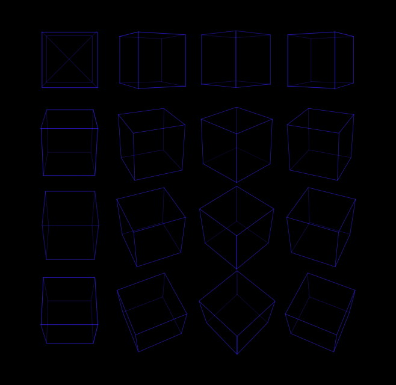

只要会画16个角度，剩下的所有角度可以通过翻转、对称得到

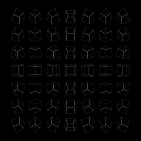

### 推理结构

推理结构：需要 画机械结构来学会和熟练使用

曲面结构物体、动脑思考怎么拆解物体

熟练画师都会记住一个基础模型，然后在这个模型的基础上修改为自己的画风

练习方式：在各种角度的方块内，画出方块对应角度的物体，透视不一定要画得准确，但是一定要画好组成这个物体的各种形状，找好各种点

### 比例分析

大概画出一个物体的正视图和侧视图（或者任意两个方向的视图），然后开始找点，找出各个关键点在的比例关系

#### 人体推理

两大环节：肌肉、空间关系

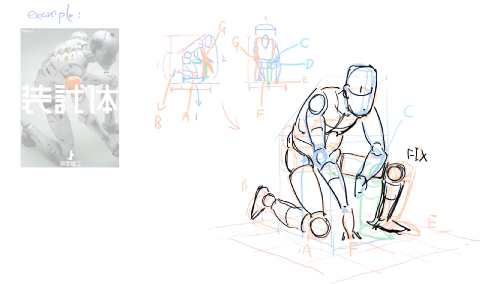

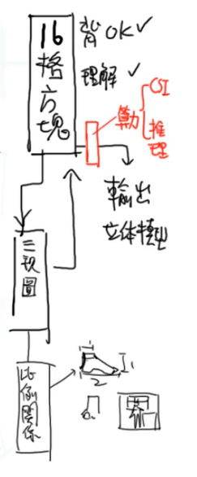

## 第三讲

重点：旋转

解决物体：如果一个物体没有对齐透视线，那么应该如何推理？

如图，A和B是同一个透视角度里的，但是想要画一个C角度的桌子要怎么办呢？

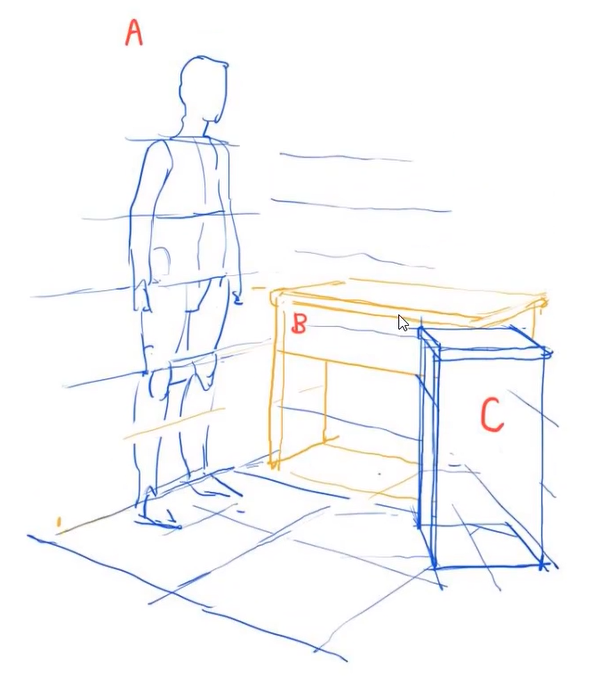

设计训练：想要画大场景、想要画背景，那么需要设计专门的练习，然后才能去画作品

#### 消失点汇聚的平面线

同一个平面上的点，它们的消失点会处于同一条线上

同一个平面：上下面重合的物体就是处于一个平面的物体（就是要忽略高度）

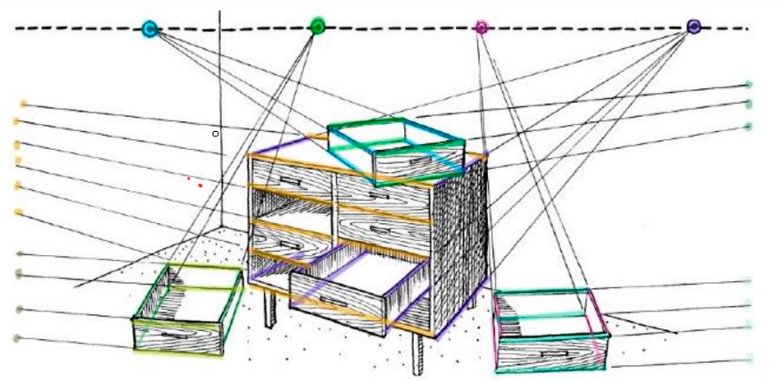

确定消失点水平线的方法：求十字，找45°方块

学会找45°角，那么其他角度（67.5°、22.5°）都可以出来了

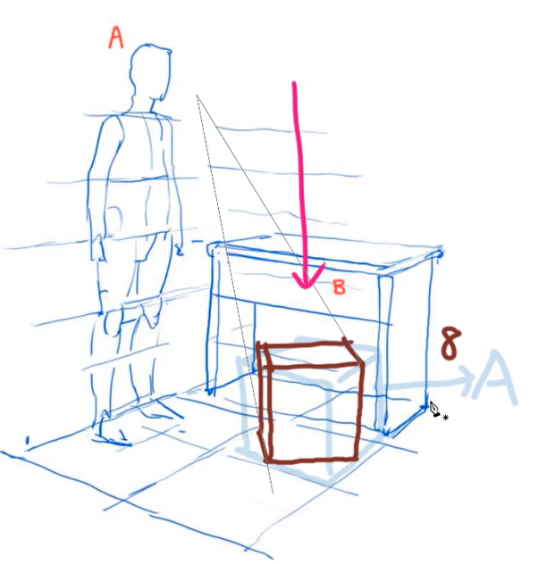

实操或者后续绘画要简化流程时，可以不用画出严格的45°角方块，可以先大概画出45°的方块，然后用钢笔工具检查透视对不对

在水平线上随便拉一个点的透视过来，能否随意画出任意角度的物体？

答：不能，因为拉出来不一定会是正方形，可能是方形、长方形，你看不出来

#### 角度量化

要画一个圆柱的所有角度要怎么画？脑子里想着方块各个角度的样子，然后在方块里切出来就行，实际不必要画出方块，但是脑子里要能想象出圆柱对应哪一个角度的方块

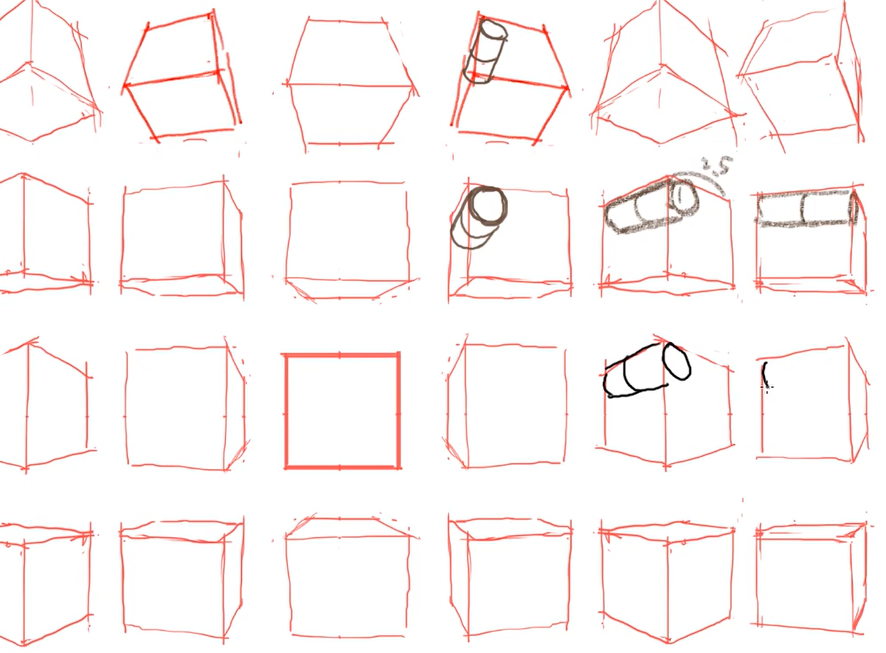

人体各种肢体的变化不会画，不是人体的物体，而是不会画各种方向的圆柱，不会画各种方向圆柱的问题是你不会画各种方向的方块、脑子里没有这些方块的形状

如果有这些角度参考，那么人体的各种肢体变化只是对应角度旋转过来的

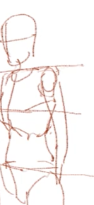

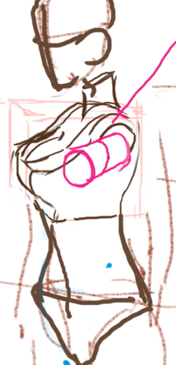

画不出人体出来不是肌肉体块没有记住的问题，就是画方块、旋转的问题

##### 焦距（距离关系）

近距离：竖直方向收缩很强烈

中距离：竖直方向有一点收缩

远距离：竖直方向几乎平行

#### 平面和平面线

平面：地平面、视平面、任意平面

地平面消失点收束的线是地平线

视平面消失点收束的线是视平线（画面的中线）

“所有放地平面的物体消失点都要收束到地平线”

地平线不一定是平的，有可能是斜的，当视平面和地平面成一定角度，那么地平线就会变成斜的

如果地平线是平的，那么视平线和地平线是重合的，如果成角度，那么就不重合了

视平线和透视关系无关，只和画面角度、看的角度有关，视平线在实际画画时没什么用但要和地平线做好区分

同一个平面的方块可以使用之前的画45°方法，但是如果有一个悬浮在空中的方块（物体）怎么画？

领域展开法：直接画一个所需角度的大概方块，这个大概方块不需要考虑现有的任何透视，除了不要反透视没有其他要求， 是飘在空中的，然后切出图层只留这个方块，以这个方块为基准（领域展开！）画出一组透视物体，然后把画好的物体放回原图

## 第四讲

第四讲的重点是距离感

对于出现很多重复、大量相同物件的情况下，虽然有透视，但是没有距离感

物体之间的间隔需要精确的计算，不要凭感觉绘画

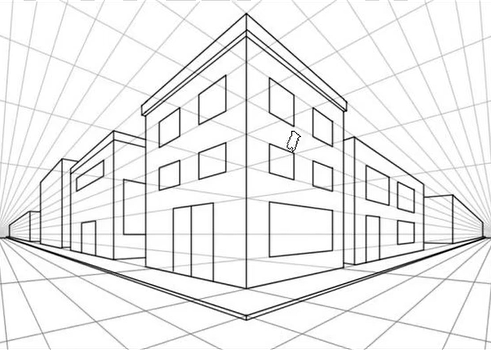

如图的透视，大体上看是对的，但是仔细看建筑之间的间隔，会发现距离感把握不对，间隔太宽了

破窗效应：房间里刚收拾完，是非常整洁的，如果有一点垃圾污渍，都会很明显，而如果房间一直都是杂乱的，没有收拾过，那么多一点垃圾，你也会觉得很合理，不会像整洁房间多一点污渍那么碍眼

使用钢笔工具绘画就相当于整洁房间的状态，当有一条线不直，都会很明显，而纯手绘，线条2有抖动的状态就是杂乱房间的状态

使用钢笔工具能够很明显地看出透视的问题，适合用于平时练习和作业，或者要求严格的作品

我们平常创作时，没必要时时刻刻使用钢笔工具，线条抖动是能接受的。

如果排列方体，会发现大概6个方体之后，就会压得特别扁了，一点都不明显

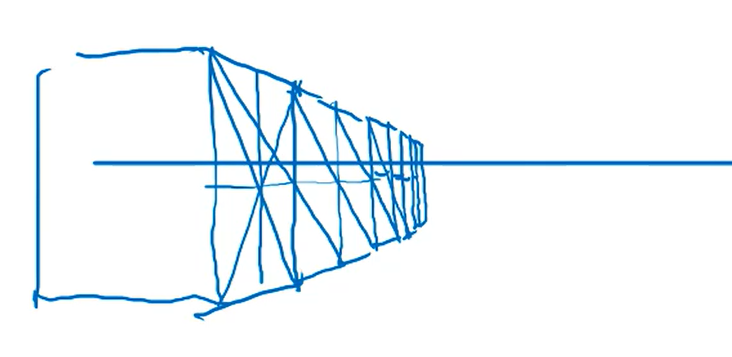

#### 近景

#### 中景

对于中景物体的把握，可以使用贴图，既能减少计算，又能找到各自的比例关系

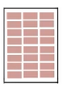

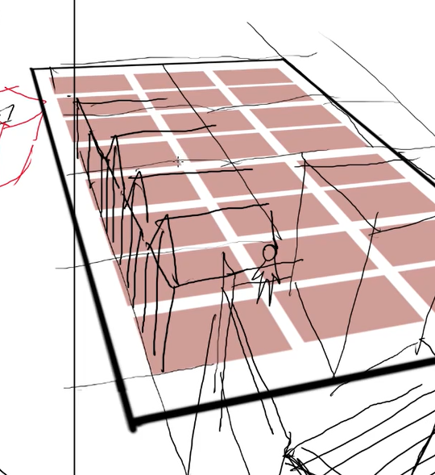

想要画大小不一的中距离物体，就需要调整贴图大小，或者整合物体，在贴图时调整一下各个物体

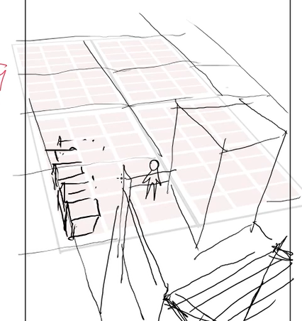

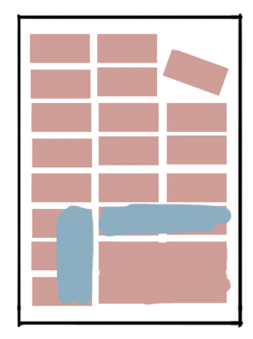

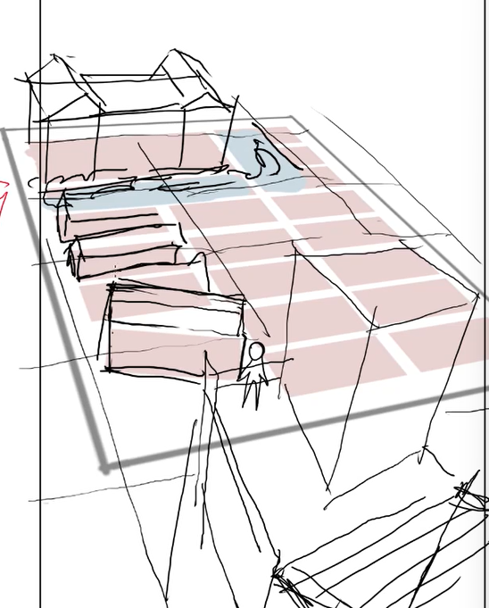

#### 远景

涉及到一些不是透视的内容

表现技法：分为线稿的表现技法和色彩的表现技法

线稿的技法中有一种“空气透视”，也就是远处因为雾气、光线等原因，看不清一些细节，导致在绘画时一些线条被省略，减少画面信息量，也能更为真实

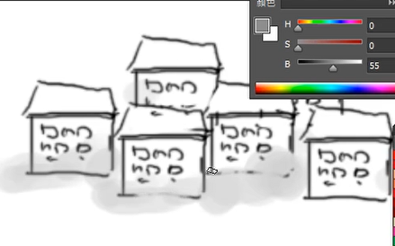

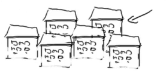

远处的物体（指6-7个方块之后的物体）计算不需要太过精确，宽度不能太宽，因为收缩的原因，宽度都会被压缩得特别扁，远处物体的宽度可以用第7、8块方块的宽度做对比来估计（如果是方块的话，基本都是一条线了），还可以填充很多的东西（树、高楼、远山）塞在一小块地方

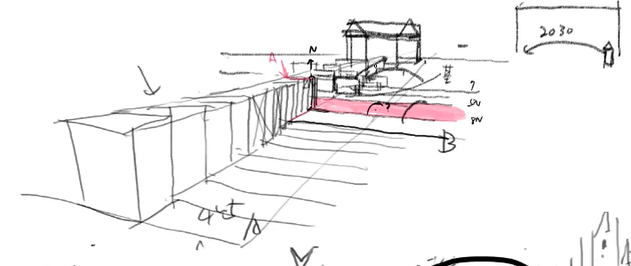

远处的山是在地平线上吗？

越靠近地平线，一小点线段都会表示特别大的距离，尤其是贴近地平线上，几乎表示无穷远，所以山是不可能在地平线上的

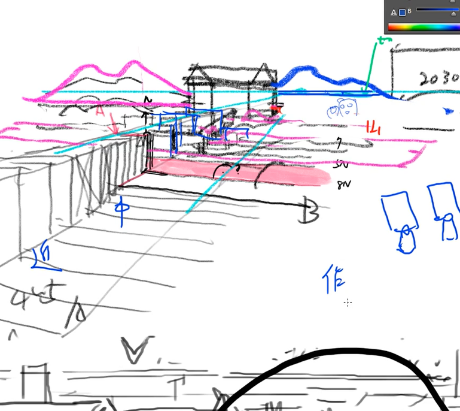

#### 云和云上皱褶的推理

一般认为云这些软、发散的物体是图形，但是如果把它看作三维建模，要怎么考虑呢？

看作多个椭球物体的堆叠，褶皱是由这些物体的接触产生的

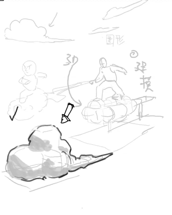

类似的衣服的褶皱也是由物体堆叠产生的

手臂上的衣服褶皱就是圆柱上加了一堆香蕉

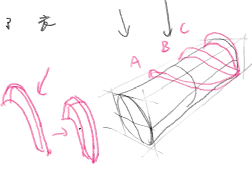

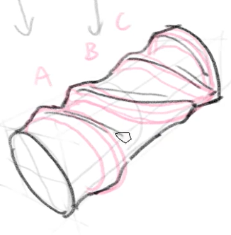

## 第五讲

第五讲的核心：人物/人体

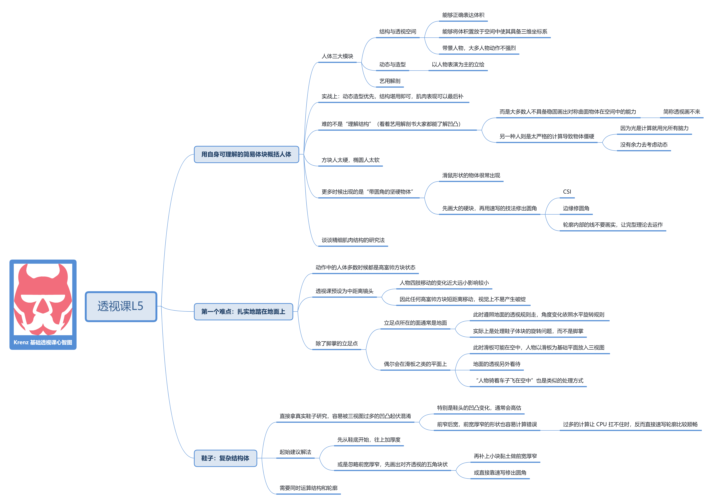

### 摆脱钢笔工具的方法（透视辅助线简化、徒手画方块的诀窍）

利用角平分线对称，换角度找对称线，不断逼近，找到最平的那一条，即是地平线（二分法）

斜面的角度误差控制在一定范围内，不需要太准确，达到使用钢笔工具的80%左右，看起来对即可

### 由内向外和由外向内画法的结合（抓型plus、透视抓型法）

高考绘画中强调的是由外向内的画法，因为高考注重的是画出人脸，都是使用先画出大型、大概形状，然后开始切型

而L1-L4的练习都是由内向外的画法，从最开始一个基本的方体推理到各种物体的透视关系，类似于工程制图、工业设计的画法

经常看到一些人体速写特别的流畅，既不是切型方法，也不是推理的方法

人体速写需要由内向外、由外向内两种思路的结合

思路：

1.找xyz方向透视的线索，先找到透视空间的角度

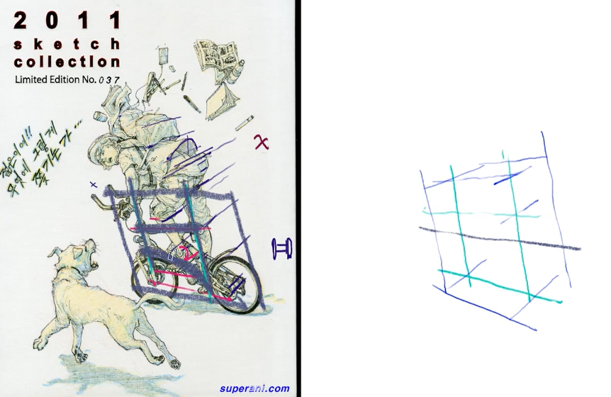

2.运用推理的思想，找到可以辅助的形状，忽略旋转的物体

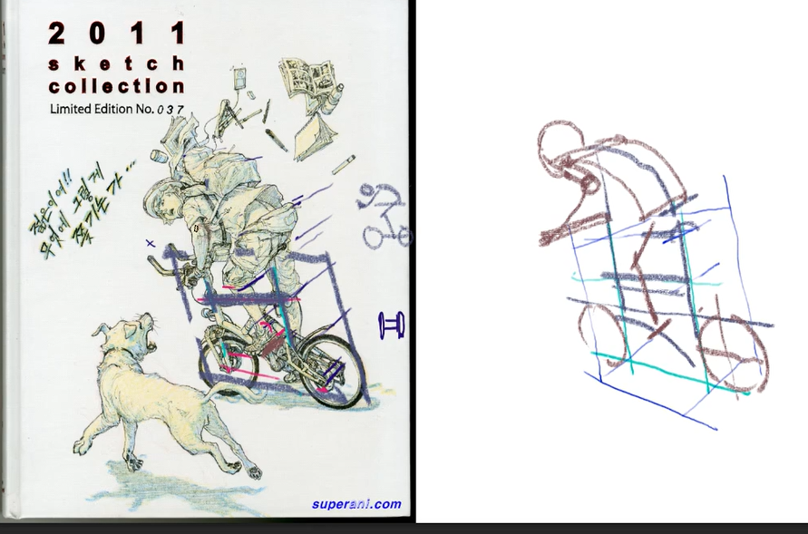

### 人体透视

整体特别难抓的物体，例如大的机器人，要将其拆解为一块块小的方体

方体转圆，圆体转方

人体的各个块看作高富帅方块，只要不反透视，不要严格按照消失点画

gesture

重点

1.xyz透视空间

2.斜率

先画出原柱人，然后根据需要，把部分体块转化为方体，例如手上要画个盾牌，那么手臂就可以转为方块

先从动态线抓出圆柱结构，根据需要将圆柱体转化为不同角度的方体

## 第六讲

### 参考体系（起始xyz、起始空间）

我们在绘画时，批判正、歪是需要一个标准的，我们说一个东西画歪了，那么想想什么东西是正的呢？

一开始画的东西作为基准，比如我们画人体，先画盆骨再画胸腔、再画腰部

那么可以以盆骨为基准

空间中一定有一个东西是正的，能够视为基准的，然后以这个基准架空间画其他方块、物体

其他物体如果角度不一样，那就使用旋转、自由方块两种方法去画

训练空间感时，画人体要从胸腔开始，以胸腔为基准画其他体块，摆脱从头开始画的惯性思维

### 两组、多组方块的空间关系

要有意识地练两组方块的空间关系

很多人在画人体时，画头画得特别好，也符合空间透视，但是画完头，就不知道胸腔的空间关系在哪了

所以在画头时要考虑好头的方块和胸腔方块的空间关系

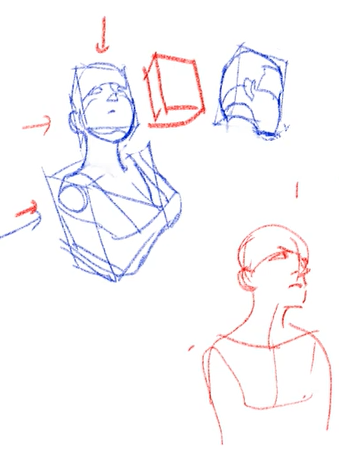

固定一个方块的空间，思考另外一个方块对于起始方块的旋转，练好这个，才能画好人体的各种姿态

如果想要画一个动态，要先画出一个初始方块，然后从它定的动态线补全其他体块

两个练习思路

起始物体

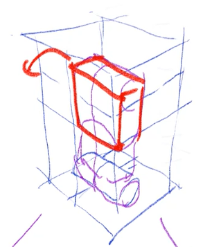

练习一：转摄像机、转观察视角

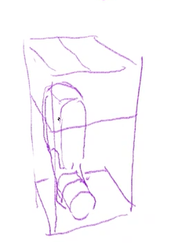

练习二：固定一个方块，尝试转其他方块

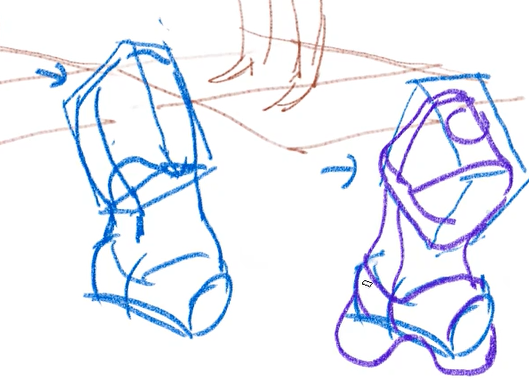

旋转的长度、角度不需要精准控制，计算就是让旋转后的方块线条走向符合大致的透视关系即可，尤其是45°、22.5°时的走向，要容许误差

旋转是针对初始xyz轴，还是自由旋转呢？应该是自由旋转的，但是角度不要太大，角度过大就会像脊椎断掉了一样

### 核心系统（减少练习量的方法）

只要思考好两个方块的关系

那么就可以画出很多的姿势，比如胸腔和骨盆的一组关系，可以延申出很多的动作

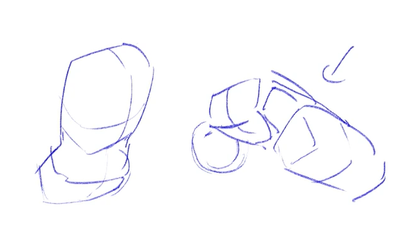

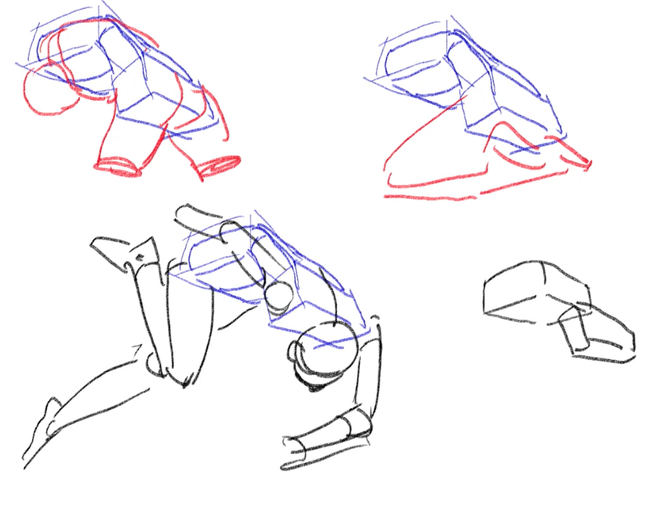

所以练习人体的思维从来不是，先画好骨架，再一块块画肌肉，这样是思考练习量特别大，因为把两个简单的方块关系，拆解成了很多复杂形体（很多肌肉条、骨骼这样复杂形体）的空间关系

胸腔+骨盆这一组方块关系一定要练好

简化的系统应该是，通过体块、方块（2组~3组）之间的空间关系，扩展体积得到人体

所以只需要练习好多组方块的空间关系，就可以有画人体很好的基础

注意：两个方块是两个空间。也就是说头和胸腔、胸腔和盆骨这样的两组关系，它们之间是没有强相关的，没有说头是这个角度的方块，胸腔就得是某个角度的方块，方块的角度都是随你喜欢怎么画都可以，一个方块定义之后，另一个方块想画成旋转也可以，想画成自由方块也可以

养成习惯：看到什么物体都把它用方块圈起来，找到xyz轴，思考三视图

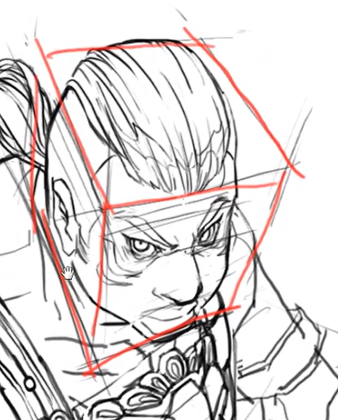

脖子、腰部这些柔软的地方，可以不用管，因为这些地方是有弹性范围的，只要合理，都可以画

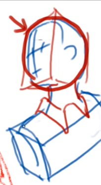

### 旋转推理

如何推理如下图的旋转

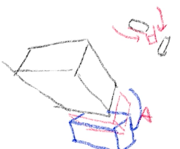

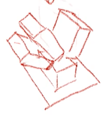

体积线是能够体现体块朝向的

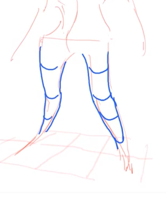

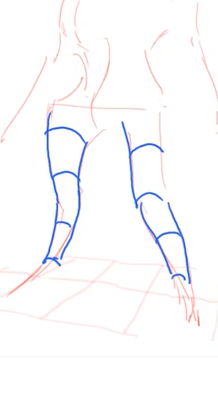

### 角度练习

三个主要课题：建模、角度、组合

## 第七讲

### 布料的推理

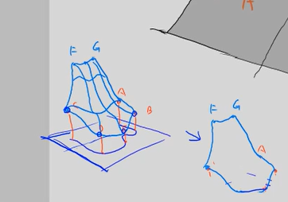

可以在参考平面上点出一条线，然后想象线上每个点的高度，然后连出线条，使得布料在空间上有着参考依据

### 16格

重点不在完全准确，而是在于角度有区分

### 临摹抓型+透视

默写是很重要的一步

使用建立方块的方法抓型，会使得默写变得简单

画的时候，如果发现看不懂临摹图的透视（看得出方盒子在哪的图），那么就不要练这一张图，换一张图

### 鱼眼透视、大透视

大透视的基础也是16格方块，其实也是旋转各种方块，只是比一般透视要转得更频繁一些，对算力要求更高

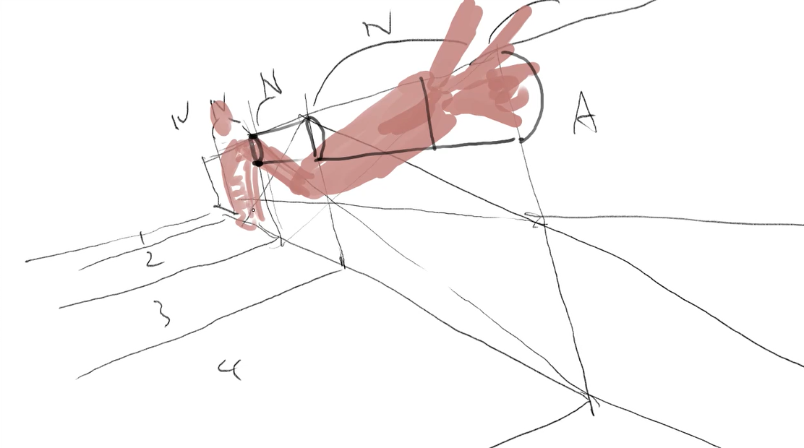

大透视其实可以看作一条河流一样的形状，用河流的姿态去理解

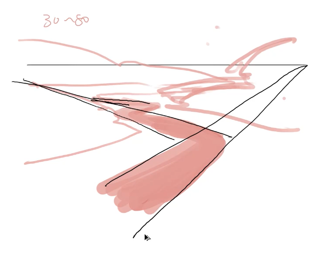

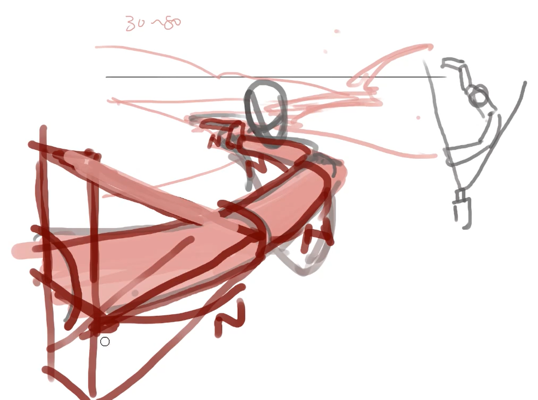

### 自由旋转角度

画出各种不同角度的方形

## 第八讲

### 后续的学习路线

#### 学习曲线

八节课的知识，可以让我们能够画出简单的带景人物

人物不要有大动态

练习带景人物的目的，是为了提高算例，提高透视的推理能力

这个过程要动脑子，透视练习就是为了练推理能力

练习时，一张纸可以直截取一部分，整个大的纸张上，可以画出完整的平面和透视线

练习对象：鸟山明、金政基、k大魔法学院的心得

学习透视的最终目的是能够搭建出这一套系统，而不是单纯地记住这些知识

但是记住知识是搭建系统的前提，每次画完都要回顾一下透视的知识点

#### 看说明书心态

类似于作业那种，一步一步详细地跟着做，但是很多人会觉得看说明书很无聊

每次练习一个题材都要起码画3-4张

第一张就照着原图画，第二张可以转一个角度，第三张就完全默写

### 研究方式

#### 人体比例

每个人记住的人体比例都会有些差别，重要的不是准确的数字关系，而是趋势要正确

人体比例的关键点在于那些转折

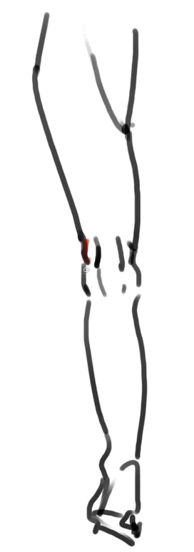

例如大腿根部的突起、膝盖处的突起，这些突起都是因为内部骨骼结构的原因

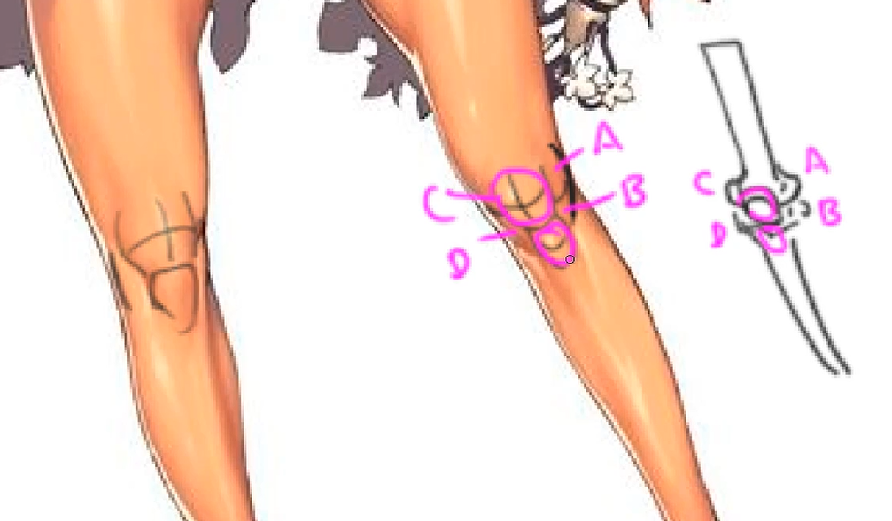

这些鼓点、凹陷，就是应用解刨学的关键比例数据

要记住的东西就是这些点在体块上的比例，例如膝盖凹陷是在整条大腿的0.5（一半左右），越接近真实人体，这些细小的凹陷、突起的比例就会越详细

#### 系统思维

拆解

记住专有名词

### 练习方式

创作练习

尽量不要画空旷的室外场景，要多画室内场景，即画面中的大部分物件是能够计算的，高楼等空旷场景都是由作者定下的，没有办法练习到透视，而且还很难去矫正

要在甲方要求和自己喜欢做的东西之间，找到共同的部分

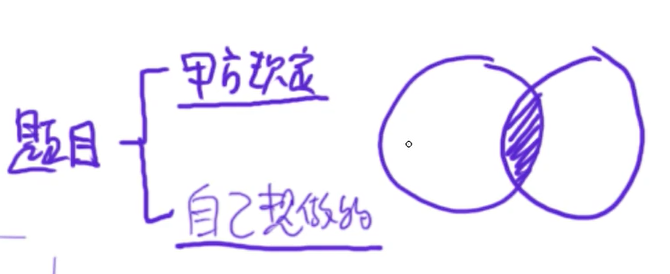

#### 找参考

作品集重要的不是最终呈现的作品，而是体现你本人的思维和逻辑，你为了画出这个画，怎么产生想法的？怎么找的资料？怎么运用这些资料的？

##### 参考分类

看到参考之后，要把参考分类，你是觉得这张参考图的色彩好，还是元素和画的题材切合

否则找参考就只是找到你喜欢的图，而说不出你喜欢它的哪一点

一般分类：物品元素、色彩、演出（角色动作）、场景透视

#### 人体比例

## 透视dlc

## 其他

### PCDA循环

Plan（计划）、Do（执行）、Check（检查）和 Act（处理）

绘画需要前中后期计划，“练习”只占了Do这个环节，只是纯练的话，只能提升我们的熟练度，没办法学到真正的东西

前期的计划（你想达成什么样的目标）、中期执行、后期复盘，每个环节都不可以少

纯练习的时间要和思考的时间一样，尽量做到时间1：1

### 分类-周哈里窗

知识点可以分门别类，周哈里窗将信息分类为四个部分，分类好知识，能够让我们更加了解自己，知道自己哪些地方不会，能够更好地向他人提问，最终目的都是为了扩大第一个区域“共识区域”

# 色彩

## 第一讲

必要基本知识

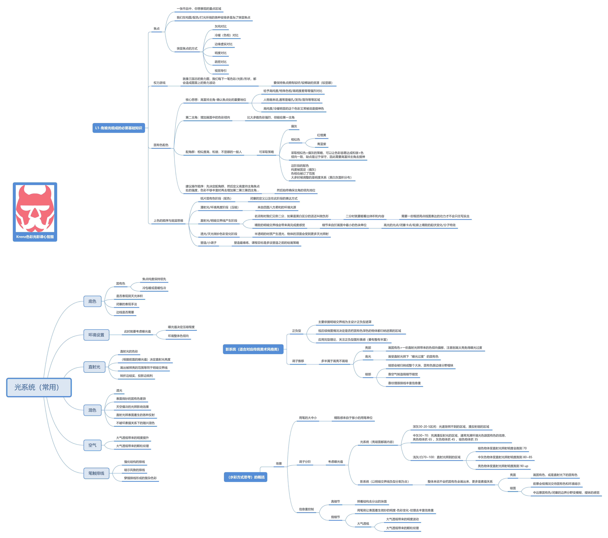

初学阶段目标：看到一个颜色能够大概调出来

### 焦点

焦点就是一副作品中你想要表达的重点区域

构图、打光、配色都是为了突出焦点

#### 四种常见的对比方式

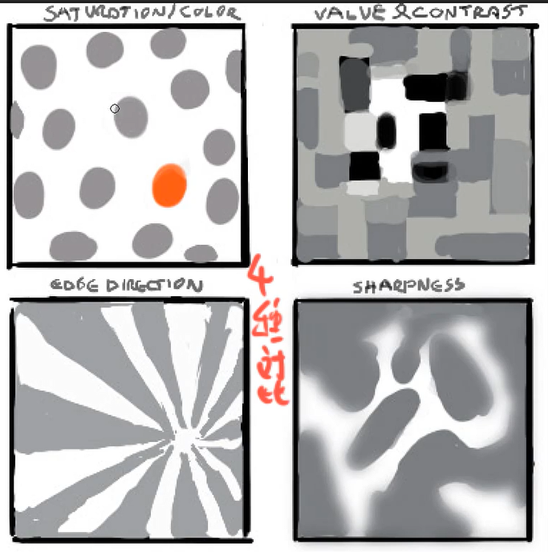

图中为常见的四种突出焦点的方式

第一种灰纯对比（左上）

第二种明度对比（右上）

第三种视觉导引（左下）

第四种虚实对比（右下）（锐利模糊对比）

其他还有：冷暖对比（色相对比）、疏密对比

##### 灰纯对比

大部分地方都是灰的，有一块地方颜色特别鲜艳

第一眼就会看到明度最高的区域

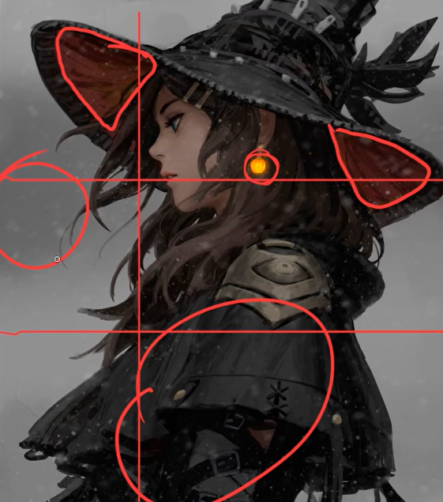

##### 明度对比

##### 视觉导引

在构图时使用的比较多，色彩、配色上用的比较少

##### 虚实对比（锐利模糊对比）

### 基本配色方法

假如一张图大部分都是冷色，图就偏冷。大部分暖色，图就偏暖

在偏暖的图中，加一块冷色，那么冷色就会被强调

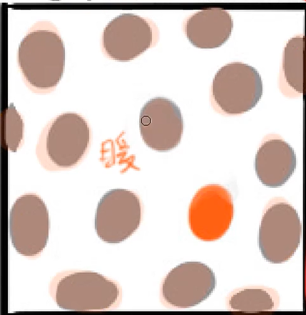

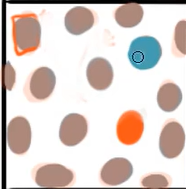

上图中的冷色就比暖色更引人注目，因为这幅图是偏暖的

在画图时，大部分图都使用左半部分的图，而少部分使用右上角的图，或者大部分使用右半部分，少部分左边的颜色

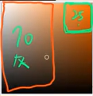

之后再取相反的冷色，画焦点部分

最开始配色时，要取灰一点的颜色（色图左半部分、明度低）

60%是主要颜色（一开始灰的颜色）

30%是纯色（明度提高的主演颜色）

10%是相反色

#### 主色

我们通常说的主色就是70%那块偏灰的颜色，也就是最大面积的颜色

固有色：物体本身的颜色，在正常白光照射下，产生的主要颜色

#### 配色系统的建立

配色方案需要在有限制的条件下能想到

初学者在没有限制时，会因为选择太多，反而没有思路

我们配色的目的，其实就是在控制对比，使得我们的焦点始终处于最显眼的部分

同一张图方案会有形成多种，只要能够凸显焦点的方案，就是好的配色方案

#### 训练找焦点的能力

看图的时候，多与他人交流

#### 工具：剪贴蒙版

就是蒙版工具，当一个图层视为

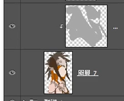

#### 明度感

看图要训练到，看到一个颜色，大概能够看出它的明度是100%以内的哪个大概值

### 光

#### 上色顺序的底层逻辑

明暗交界线

直射光：只有单一光源直射产生的光，有着明显的明暗交界线

漫射光：就是自然光，因为四面八方都有光，而且每个面的光都是多个折射后光线的叠加，导致物体表面的光会比较柔和，明暗交界线不明显

天光：由于地面物体多、遮挡物多，所以一般来说接近地面的光，强度会低一些，从上方照下来的光会强一些，把上方下来的光叫作天光

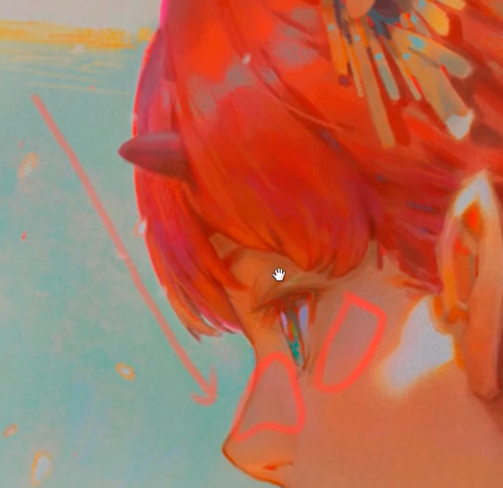

受到天光的影响，顶部的一些颜色会受到影响

#### 两种学习路径

光影的学习有着两种主流路线

影系统（传统美术学习路线）：先找明暗交界线，找影子画在哪里，主要是围绕着影子思考，也就是影系统

光系统（3d建模学习路线）：如果要看到物体的固有色，那么需要将物体放在光照下，那么调整各个方向光照强度，也就是思考光照和物体的光系，叫光系统（想象建模软件中，一个人物在台子上旋转，四周都是可由你调节的聚光灯照射）

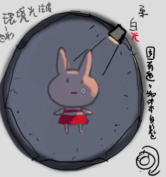

#### 子面透光

透光材料在光照下，会导致反面会存在微弱的光亮（相对于正面）

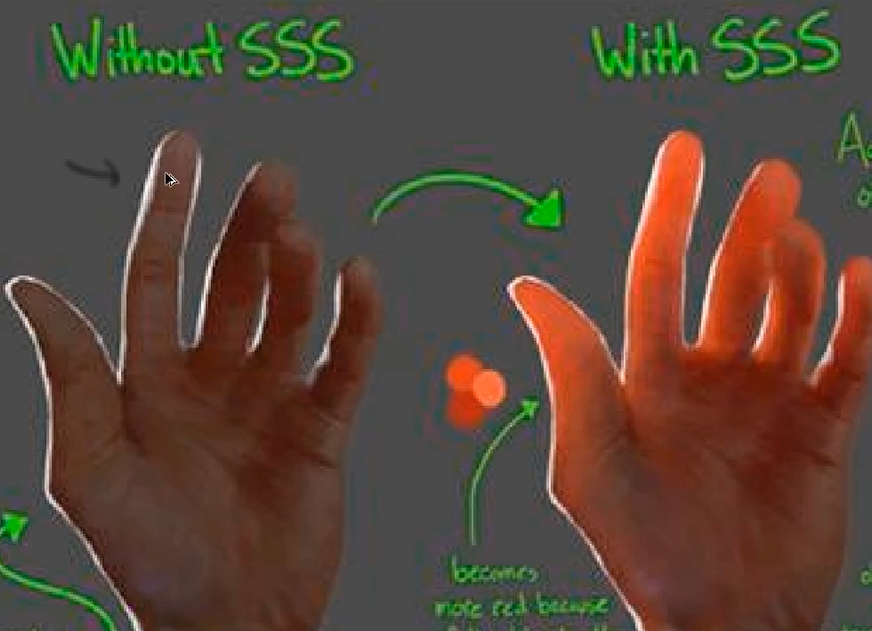

衣服都会透光吗？不一定，但是为了好看，也为了好学，我们就默认储蓄额阶段的大部分物体都有微弱透光

透光不是说一定在物体背面，而是在物体正背面交接旁边、物体转折处，作为一个由明转暗的过渡

#### 工具：加亮图层、减淡图层

当图层变为加亮、减淡图层时，使用有明度颜色的画笔，都会使得底层的图层变亮

#### 大块颜色与小块颜色

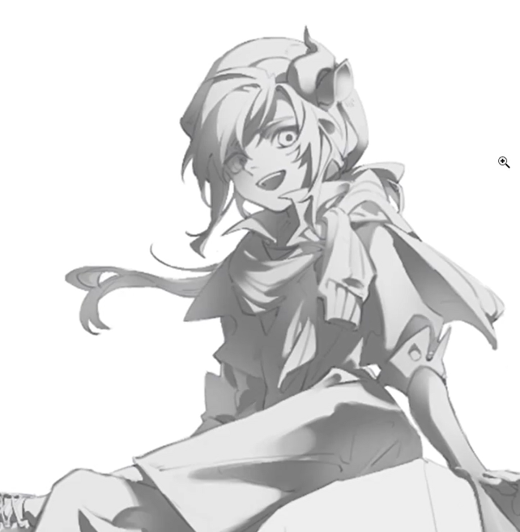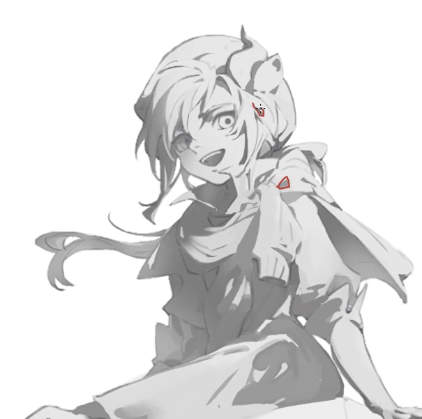

图一是大块颜色的画法，图二是小块颜色的画法

两种画法因人而易，也因为画的风格而灵活转换

小块颜色很考验控制力，需要对物体结构有深刻的理解

#### 工具：柔光图层

当图层变为图层图层时，可以刷亮

#### 工具：RGB滑杠

用来处理天光产生的效果

RGB用来作藏色很厉害

#### 固有色色差

可以使用正片叠底，然后选中我们的固有色，刷几下，过深就用橡皮擦一下

### 塑造与边缘控制

边缘是存在层级的，分层越多，那么越模糊，分级越不明显，而且会导致画法不一样

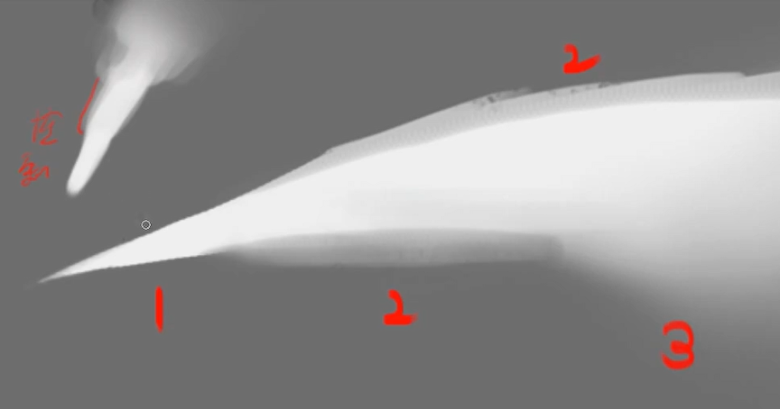

初学者很容易会一直抹边缘，不敢把分级做得明显，导致分级变高，明暗交界线会不明显，导致画面脏脏的

一开始的绘画环境是单一环境，不要管天光、多级分层，反光、透光这些

先学会把明暗交界线找到，层也不要超过2级

在此基础上，再去做透光、天光这些

## 第二讲

正负形、色阶、调子、明暗交界线

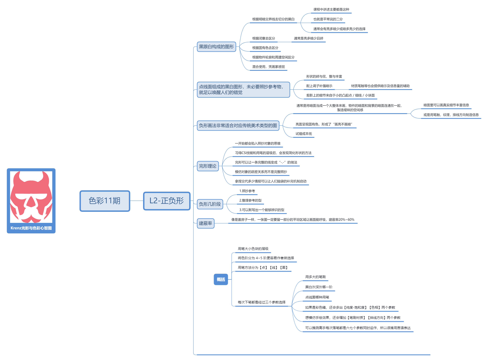

### 正负型

抓型时的那种观察思想，物体轮廓很复杂，我们就可以看包围物体的空间，在负空间中使用简单图形切出物体

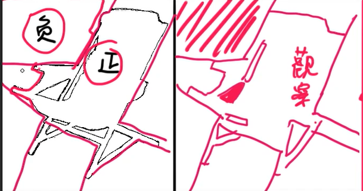

### 负型画法（概括式画法、直接画轮廓）

传统的线稿画法，就是每一块物体的结构都要弄清楚，才能往下画

画的熟练的人，可能不会将每一个结构都画清楚，而是只画轮廓，细节不画，而使用光影来模糊处理，能够骗到外行

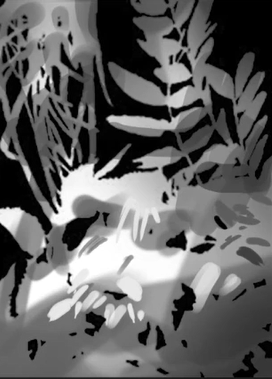

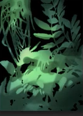

只画轮廓的画法

#### 学习轮廓画法的方法

学习素描主要的几块内容：明暗交界线设计和明暗交界线判断、色阶布置和明度控制、把色阶做成渐变

软件中存在类似于水彩留白胶的功能：临界值

会将明度低于某个值的变为黑、高于某个值的变为白

像抓型一样去画出暗面轮廓

#### 负型画法流程

先把暗色的形状（包括部分交界线、暗面、闭塞这些合成的整块形状）全部画出来

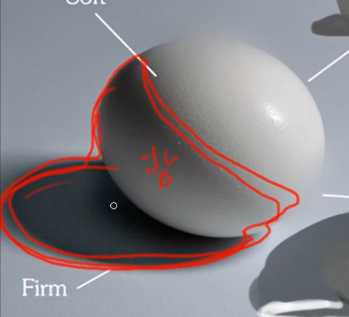

### 色阶和调子

色阶就是明度阶梯

调子是明度渐变

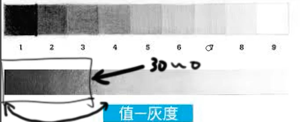

图中上方是色阶，下方是调子

相邻的明暗相差阶数一般就是1阶，不要超过2阶的范围，不然看起来会很奇怪，也就是说调阶不能太多（按百分比来说，相邻的明度就是10%左右）

后期的素描需要对不同物体的色阶范围作区分

皮肤是一块范围，衣服是一块色阶范围，头发又是一块色阶范围

如果不限定范围，整体会灰灰脏脏的，没有对比，不好看，上色的时候会很麻烦

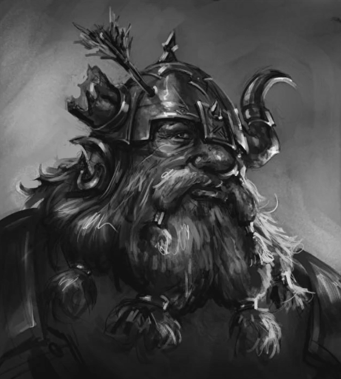

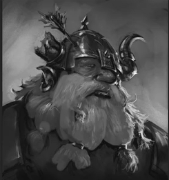

### 三大面五大调

亮面、明暗交界线、暗面、投影、闭塞（分死角和缺光区）

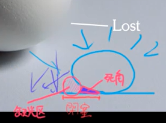

### AO画法（光系统）

AO画法就是光系统，研究3d模型打光的现象来绘画

最难的是第一步，要理解死角的概念，是根据死角结构来画

但是要求特别高，好处很多，是大后期的画法

### 柔和硬朗光影塑造

alt吸色画法能够塑造柔和的光影

使用柔边笔刷不断吸色，能够画出柔和的明暗交界线

橡皮擦画法能够塑造硬朗的光影

橡皮擦擦一下边缘能够画出硬朗的明暗交界线

暗部不需要卡太重，只需要随意点一下，提示读者即可

### 明暗交界线的设计和判断

一开始的时候，需要适当忽略掉细节和凹凸起伏

只需要注意大块的阴影形状

#### 工具：黑白去背

临界值以上白色的部分会变为一个图层，而临界值以下的黑色部分会分为另外一个图层，这样子就得到了两个分离的图层

然后分别对这两个图层建立新的一个剪贴蒙版图层，就可以对色彩进行练习了

## 第三讲

色阶、调子深入

从色阶过渡到调子

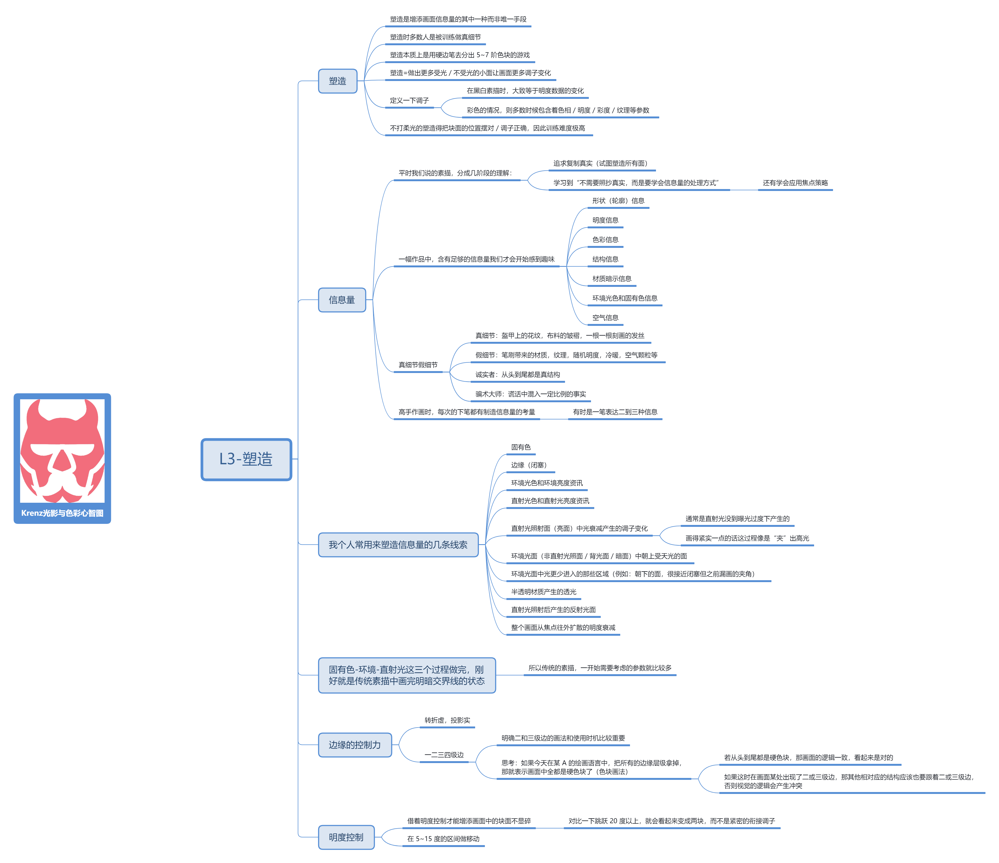

### 色调分离

ps图层中由一个功能是“色调分离”

能够将图片中的色彩按色阶数量分离

能够分离出形状明显的阴影块

### 笔刷分类

笔刷按功能分：作造型、形状的笔刷，作调子的笔刷，纹理笔刷

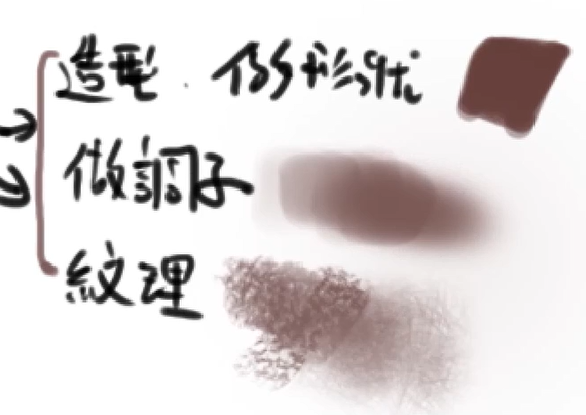

干笔刷：颗粒较浓的笔刷

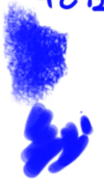

湿笔刷：边缘柔和、能够晕染 的笔刷

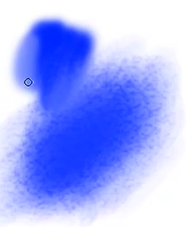

### 光影规律

在手绘时，真实笔触往往会自带一些讯息，导致在画大的明暗分界时，图片看起来会笔点绘丰富一些，使用软件时，我们要先作的是区分出真正的明暗分界，而反光、透光、天光这些小的塑造，是最后丰富画面的阶段才用的技法，初学时一定要先学会忽略这些高级的技法，看画面要先看大的明暗分界，这些信息才是真正有效的，而一些小的塑造在开始绘画时不要去纠结

真细节：大块的明暗分界，绘画时真正把光影区分出来的那些笔触

假细节：绘画时笔刷自带的纹理、手绘排线的效果等

在看图时要适当忽略假细节，注意真细节

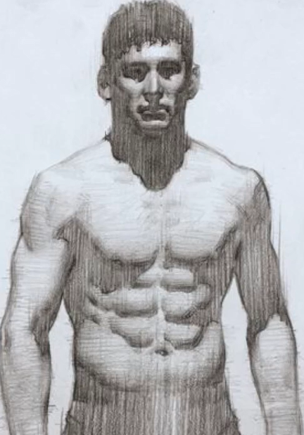

上图中手绘阴影时，排线表达发阴影部分，会自带一些讯息

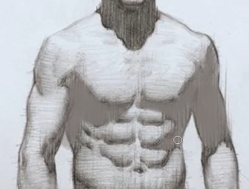

而电绘时往往只能画出这样大块的阴影，两种表达都是正确的，不要被手绘排线的信息带来的

立体感不是因为笔触才产生的，而是因为明暗分的好，才看起来有立体感

#### 线稿是造型的重点，也是光影的阻力

**一开始练习结构的时候要使用线稿，练习调子时尽量不要使用线稿**

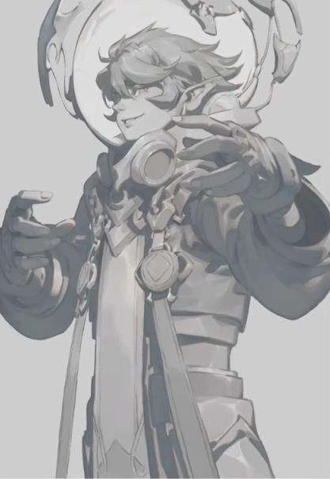

对光影的塑造，会使得物体有立体感，有很多的弱对比，会感觉特别立体，贴近现实

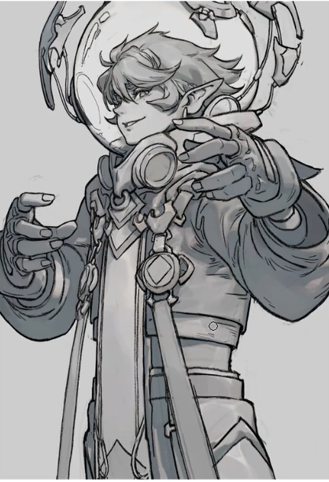

但是一旦打开线稿，就会使得这些弱对比消失，画面变得很平面

如果完全照着线稿涂色，是很难塑造出各种微妙转折，下午发形成各种弱对比

练习光影时，试着把线稿图层可见度开低一些，模糊能看清就好

要做到把线稿关掉还能够看出物体的体积感

当色阶有6-7个时，入脑就会认为存在调子

在做完二分后，需要学会在转折处（明暗交界线）加上一阶

#### 完形理论

人看到一些暗示性的线条，会在大脑中自动补全物体的完整形状

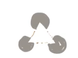

用三个有缺口的圆贴在一起，哪怕中间三角形的线条不完整，脑子也会认为看到了一个三角形

在绘画时，要能够使用暗示性的表达

这是石膏绘画的基础，也是为什么能够做到“没有线稿的线条，也能塑造出体积感”的原因

##### 另一种完形规则

整个明暗交界的线条，不是都要硬朗或者柔和的，我们可以在两边柔和交界线之间加上一段硬朗的线条，也可以在两条硬朗的线条之间夹上一条柔和边，人脑也会自动补全这块阴影形状

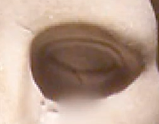

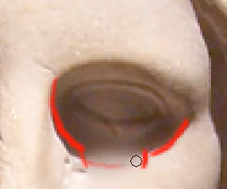

如果我们整条交界线都是硬的，或者都是柔和的，画面光影会显得单调，不好看

#### 练习方法

负形练习、石膏练习

动脑建立系统，首先要记住相关的名词

### 基于结构的光影推理

一定要画出结构线

暗部判断思路：背光→投影

亮部找好高光和突起的位置

灰面则是在画完高光突起后，随便刷一点比交界线明度高的颜色，那么它就是灰面

#### 皱褶推理

初期结构线的推理都是将复杂物体理解为一个个简单物体的堆叠，画出这些简易物体的结构线

### 投影和背光的区分

暗部区分好了之后，背光部分会比投影暗一些，也就是说我们区分阴影和背光部分，需要把背光画的亮一些

原因是因为反光对于背光部分的影响更大，对投影部分的影响较小

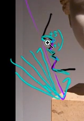

背光和投影的交接处，需要画得更柔和一些，假如明暗交界线的级数是1-2级，那么暗部里，背光和投影的交接起码是3级

投影硬边

背光柔边

### 焦点策略处理

选择一块地方作为焦点，焦点周围的一圈的颜色可以降低明度

### 突起和高光

暗部有投影、背光、闭塞，都是很难注意到的

但是亮部里的突起和高光位置是比较固定的

突起就是物体弧度的顶端

高光则是最亮的地方，一般是正对光源的地方

#### 死角和闭塞

死角和闭塞不是每次都要画的，要根据情况

那么说明时候画死角闭塞，什么时候不画呢？

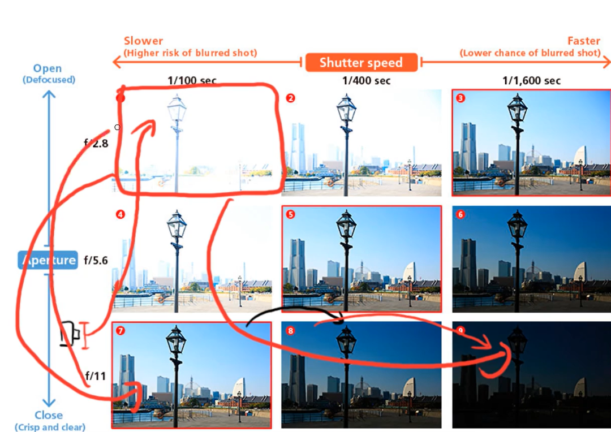

相机照相时，曝光时间不足时，会导致画面偏暗，而曝光时间太长，又会使得画面特别亮

如果我们要展示的细节都在亮面，那么暗面就是一大块阴影，不用区分暗面细节，也不需要画死角、闭塞，像曝光时间很长的照片一样

如果展示的细节在暗部，那么就需要画出闭塞和死角，像曝光时间不足的照片一样

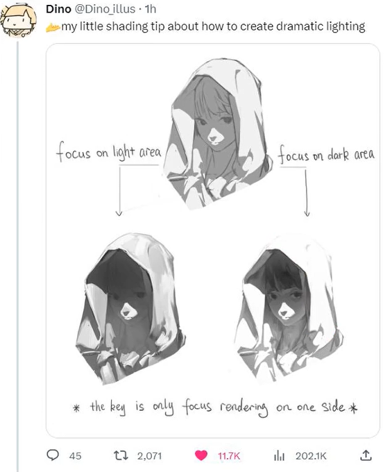

可不可以两个都把握住呢？既把亮部细节画好，又把死角和闭塞画出来

是可以的，但是对于我们把握画面平衡的要求很高，新手时期还是专注于把亮部、暗部选一块搞好吧，另一块就先作模糊处理

## 第四讲

从色彩中看出明度

之前一直都是在黑白灰中判断的

HSB色彩中，明度有100阶

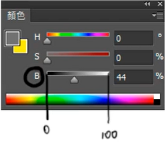

素描中色阶有10阶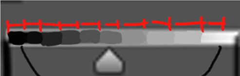

### 脱离线稿

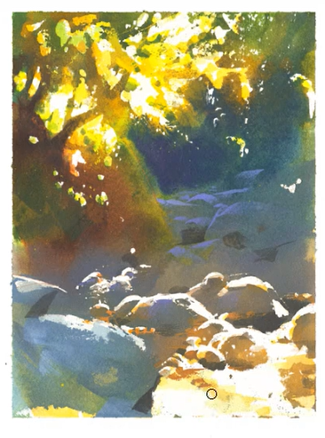

上图中的光影就很难先做线稿，然后在线稿上上色

#### 临摹练习方式

起码练习40-50张

先对图片使用临界值

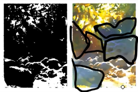

对比原图，找到大块的颜色区域，如图右边

然后判断每个大块的主要颜色（明度、纯度要接近），用色块画出来

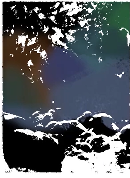

临摹的对象，可以找别人已经画好的图，别人画好的图上是别人已经研究好的色彩规律，初学者会比较容易学到东西

参考：J.C.Leyendecker

有很多颜色搭配是很常见的，当临摹到5-10张图中，有一些经常出现的色彩规律，就要把这些规律记住，包括常见物体色彩的处理、色彩搭配

#### 自然碎形的做法

使用有压感的笔刷，去刷碎型，然后新建正片叠底

在压感碎型的基础上画

#### 边角、线稿处理

不要等到上色完成后才把线稿关闭、调不可见

在上色之前就要将线稿可见度降低

画完之后，如果一些边缘不明显，就使用藏色、混色的技法，用高饱和的颜色去勾勒，而不是留下黑色的线稿边缘

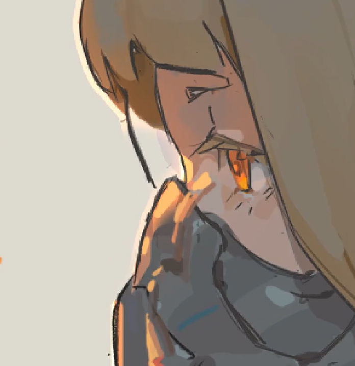

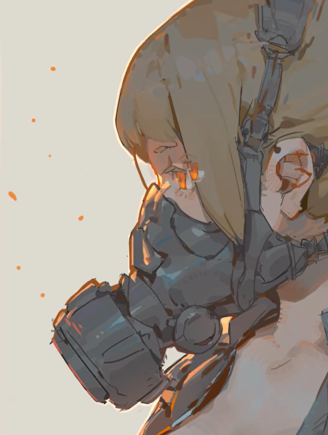

#### 二分速写

#### 实战

平时练习时就记住那些好看的色彩搭配，物体之间光线穿插的处理

创作时就直接套用这些搭配，细节方面再自己扣一下

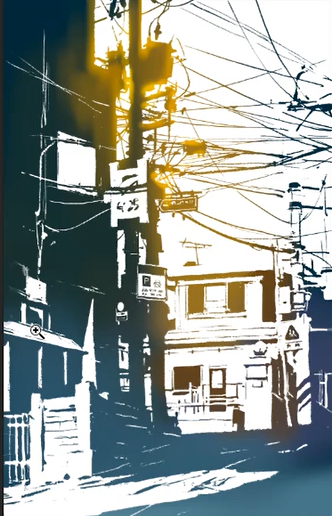

### 藏色、混色的原理

藏色的一个原理就是要选择明度相近的其他颜色去作微妙变化

在色图中往左往下取颜色、往右往上取颜色，就能够得到相近的颜色

色条

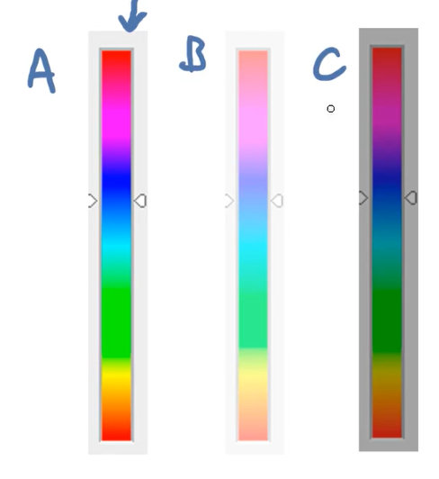

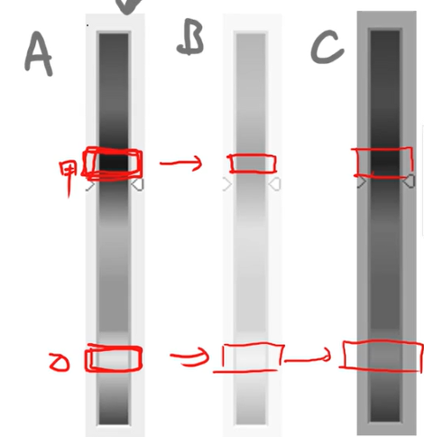

有一部分颜色（蓝色）转为黑白后始终都是深一些，有些（黄色）始终都浅一些

色彩后的灰度值、素描关系、明度都是指，转为黑白灰后的明度

素描关系就是指图片中哪些大块是黑灰、哪些大块是白

纯度的改变会导致转换为黑白灰后的明度改变，大概2-3纯度的变化，会带来1明度的变化

例如60纯度的蓝转为黑白灰是44的明度，80纯度的蓝转为黑白灰是54的明度

#### 藏色、混色的颜色选择

藏色、混色是一种增加画面信息的方法，如果不做混色的话，画面可能会比较单调

使用明度低的颜色、使用相似的颜色

不要让人一眼看出来是两种颜色，不能破坏一开始就确立好的黑白关系

除了色图中左上、右下的颜色选法，使用RGB色彩中选颜色会方便一些

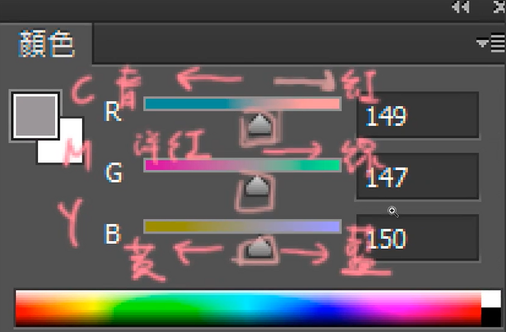

只要三个滑杆左右移动一些，它都是基于现有颜色更改的

也就是说我希望颜色蓝一点点，就把R滑杆往左移动一些，得到的颜色就可以混入原有颜色

使用灰度接近的色彩去混色，换成黑白灰后，明度其实是一样的，并没有破坏素描关系

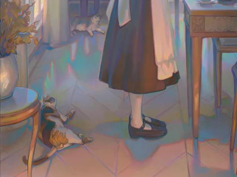

#### 冷暖混色

冷色的地方，就刷一点偏暖的颜色

暖色的地方，就刷一点偏冷的颜色

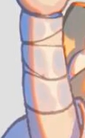
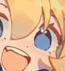

总结：边缘高饱和、大块抹鼻涕

## 第五讲

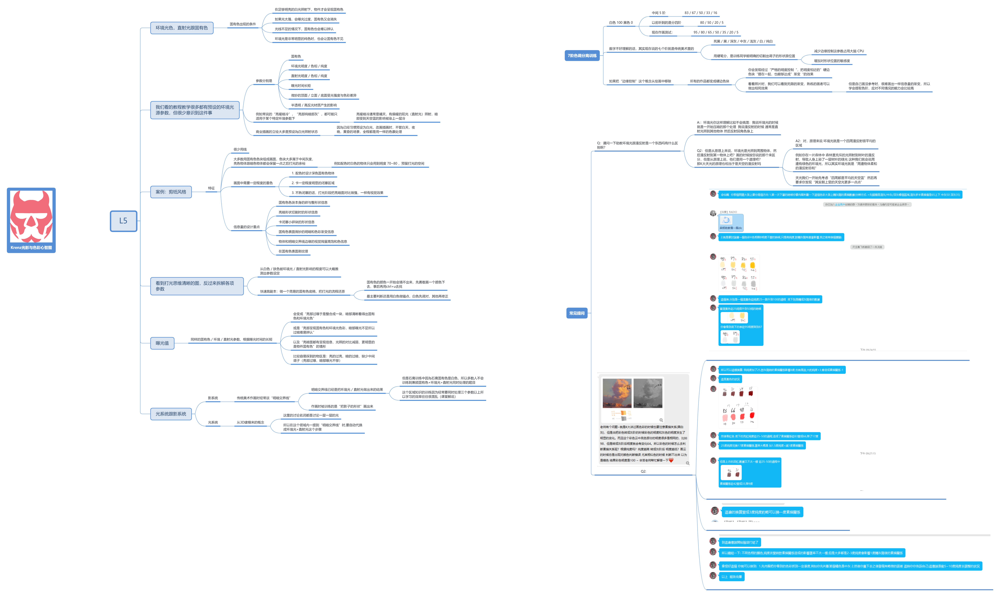

重点：环境光和直射光的场景设置（光系统）

纸片风格、底图处理手法（有线条or无线条）

### 环境光与固有色

当照射的光饱和度很高时，会使得物体的固有色被盖住，使得整个物体染上照射光的颜色，看不出物体的固有色

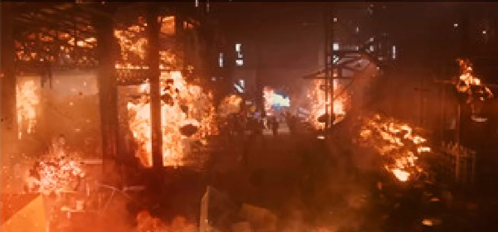

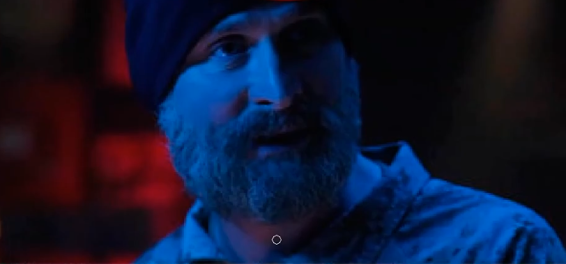

在自然光、白光的照射下才能看出物体的固有色

固有色出现条件：光线亮度适合、环境光没有明显的纯色

硬笔刷

感压笔

每一次做层级都吸两边看两边颜色的数值，然后取这两个颜色的中间值，这样每一次吸色都会思考一下，慢慢地练习次数多了，就能记住很多的颜色数据了，对以后的绘画很有帮助
层级每次明度变化都在3-5%之间，不要一下子就跳10%以上

### 环境光的参数设置

环境光参数分别是：固有色、环境光明度\色相\纯度、直射光明度\色相\纯度、曝光时间长短、半透明\反光材质影响、顶面\\立面\底面受光强度

想象把物体、人物放在一个锅盖下罩着，每次看图分析时，都想想锅盖的颜色是什么样子的

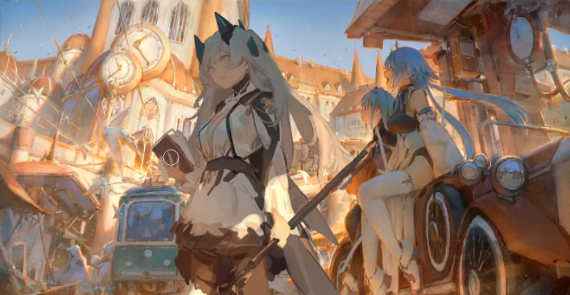

锅盖是黄的，看白色的物体顶面颜色可以分析得出

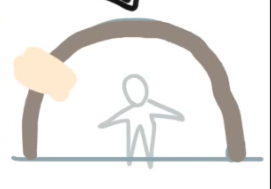

### 环境光参数的影响

偏暖的太阳光直射到物体上，暗部受到天空蓝的影响会被染上一层冷

周围的建筑物体遮挡，导致物体四周的难以受到天空影响，所以一般物体朝上的面都会染上一层淡蓝色，而朝下的面因为地面反光，会导致偏暖，四周的面就正常固有色

特效光，比如角色手上有一团火焰，还在月光、太阳光的照射下，那么有两种思路处理

一是环境光为主，特效（火焰）的光，看成很微弱的光，只影响特效周围的物体

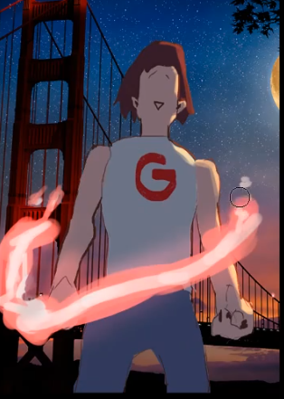

二是将特效也缩减为一个点光源，加上环境光就是两个光源，选一个为主

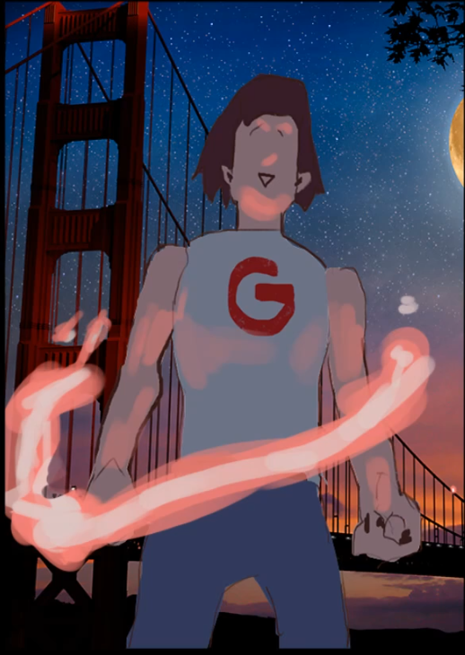

如果有多个光源也是这样的处理思路，选一个为主，其他的光源都只影响光源附近的物体

#### 人物与场景结合

画人物和景物一起的图片时，可以使用透视里的领域展开大法，在“领域”内单独画好人物线稿图，单独画好景物，然后把人物再放回到场景中，分析场景光对人物光影的影响，重新涂色，就能画出与环境结合的人物了

#### 室内光源

如果是室内的光源，就取找窗户，窗户外是直射光，那么就把窗户当作光源分析，天光就是靠窗户光源的影响

### 底图风格与色彩

纸片风格：比较平面的画法，类似绘本插图、儿童风

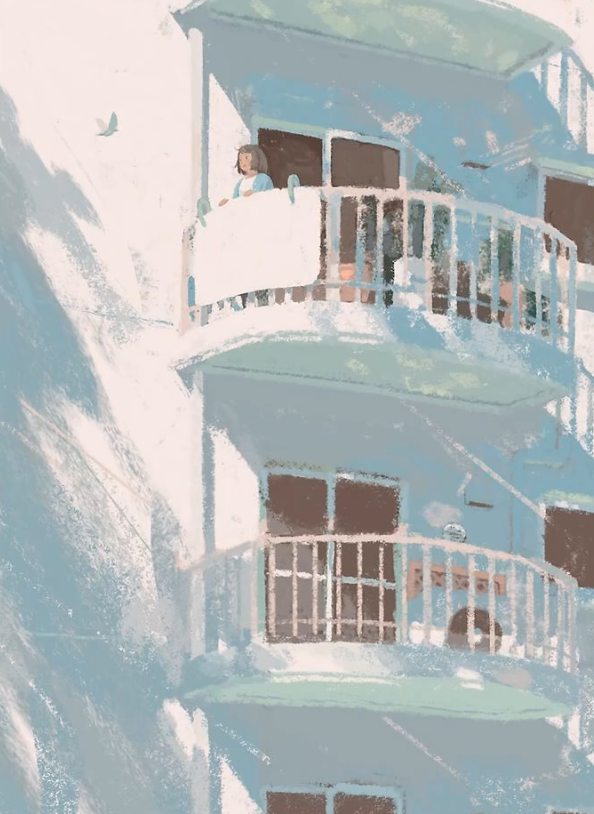

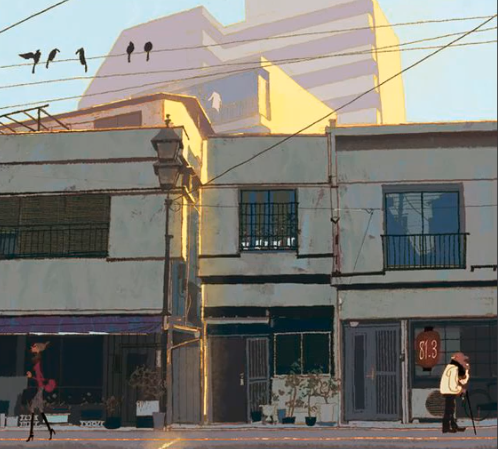

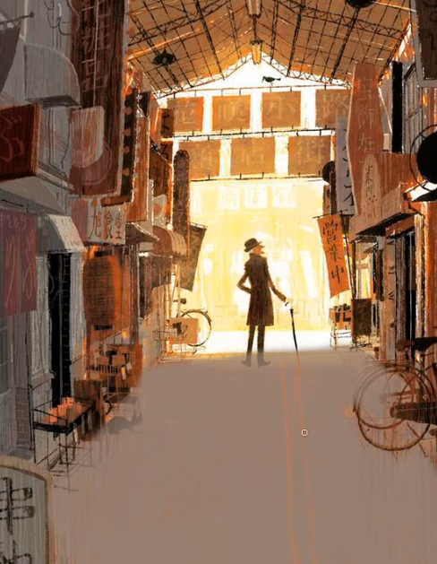

### 光系统

光系统画法基本是：先把线稿压暗，然后找光亮处，画亮光

分析哪些地方需要画亮光就需要对环境光进行分析，也就是之前的对环境光参数和影响的分析

区别于影系统的地方在于，影系统是去找明暗交界线，哪些地方是影子，光系统是去分析光亮，哪些地方色彩是亮的

#### 光系统推导图片色彩

底图（线稿）不需要画得和原图一样好，但是对光照的分析是要一样的

步骤就是将原图亮处都涂上，还原出明暗交界线压暗的原图，然后分析画面的大色块，先临摹出大色块，再然后开始画亮部

分析画面色块最难的地方是找固有色，先凭感觉找一个大概的涂上看看，不对再调整，直到自己满意为止

要注意画面中的白色，以白色作为锚点，从原图中的白色对比你要找的颜色，很快就能找到固有色

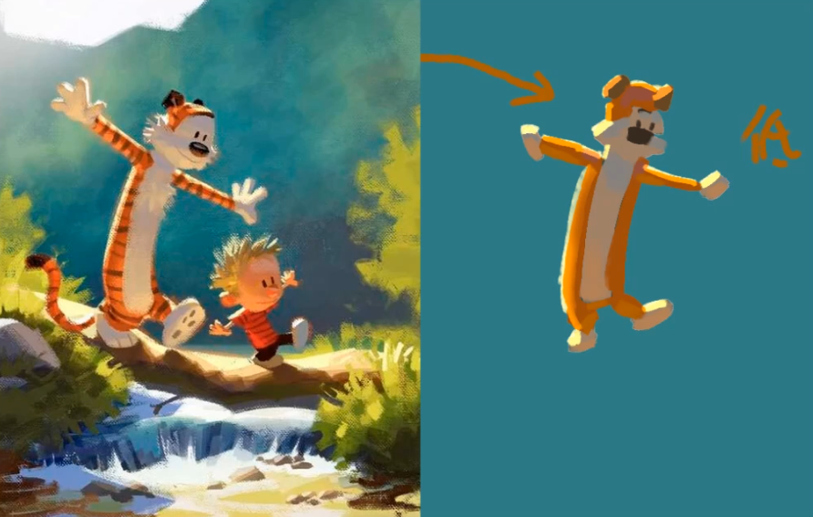

这个可以作为专门的打光练习，也可以作为绘画前的简单参考图，比如要学习一张图的光影，先画出原图的低配版本，分析出原图的光影，而且还能得出配色是哪些，然后正式画图时，就可以直接吸低配版本的颜色作画

#### 日系绘图底图与风格的关系

有一种日系的色块绘图是不用线稿的，具体的物件（头发、衣服）的结构纹理，是使用套索铺色块表现，100%是色彩表现

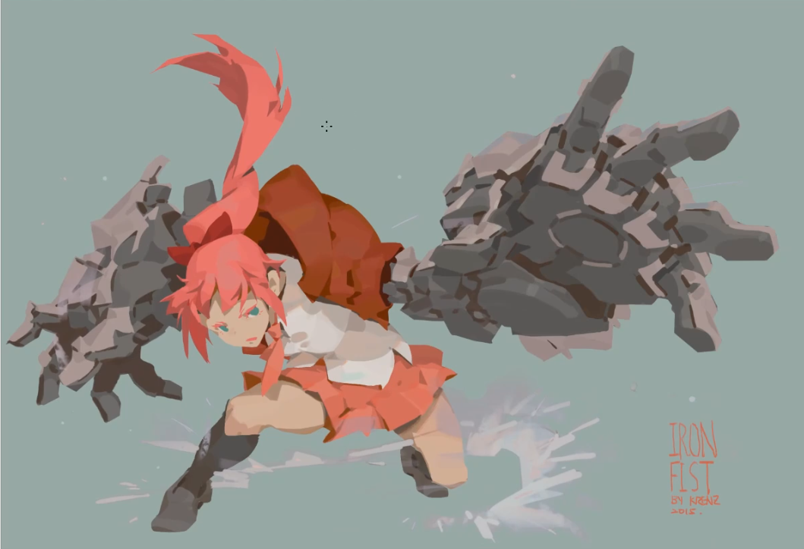

另一种日系的色块绘图，是使用少量的线稿，线稿只在外轮廓上有，内部只有主要结构上会有少量线稿，70%的色彩、30%的线稿

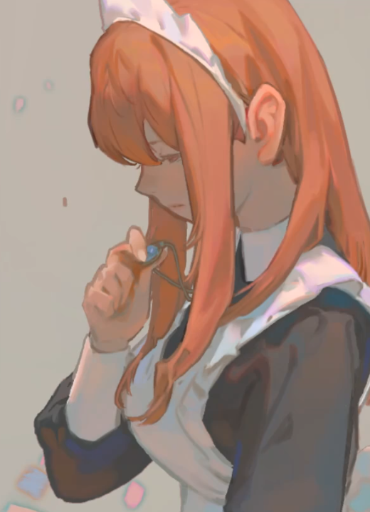

最常见的就是线稿起手，基于线稿绘画的，这样的绘图大部分都是线稿，70%的线稿、30%的色彩

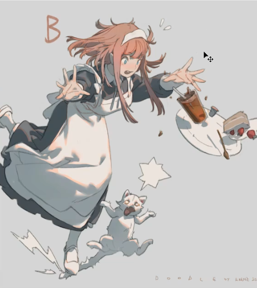

#### AO画法（欧美画法）

AO画法（环境光遮蔽）

研究的对象是：四面八方都是光照情况下，哪些地方光还是照不到，也就是找死角和闭塞，找物体之间的遮挡关系

二次元中的缺光要怎么画呢

首先是有一张白描，也就是初始线稿

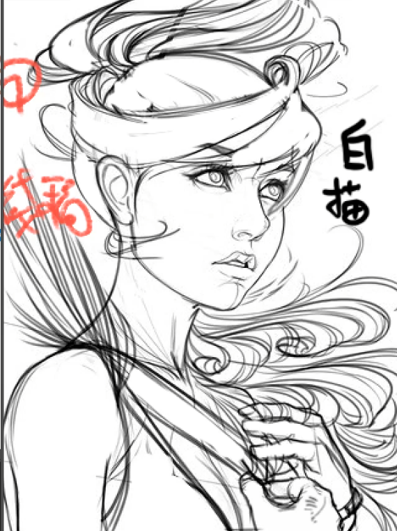

然后开始卡死角，只画死角区域，也就是哪怕四面八方都是光，也照不到的地方，其他地方全部忽略

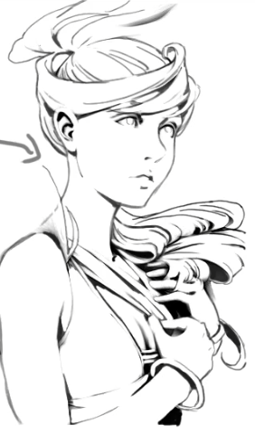

画完死角就开始压暗、打光，后续就转到光系统那一套分析

AO画法对明度控制、边缘控制要求很高

其实就是日系画法中的全色块画法基础上，加上死角，在黑白漫画中很常见这种画法

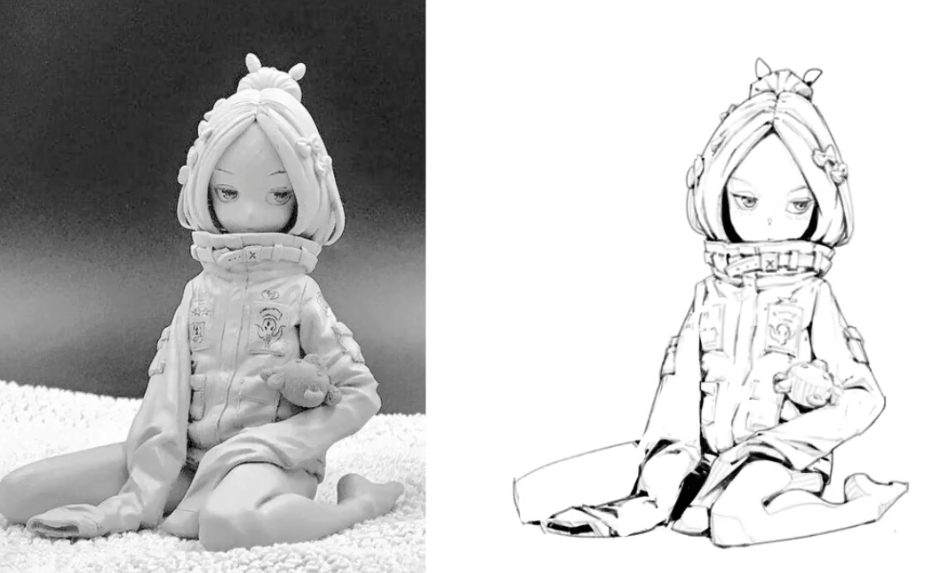

##### AO画法+完形理论

将死角画出来后，可以根据完形理论，把一些线条省略，画面更好看

左图是死角完全画出的状态，右图是适当省略线条的状态

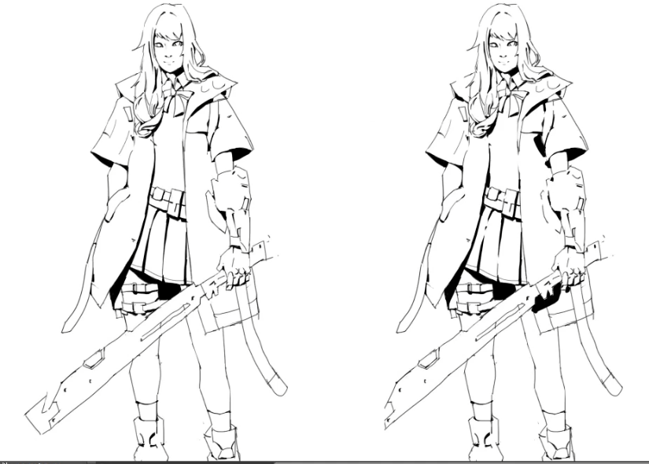

省略线条的规则：

* 线条密集的地方
* 特别长的线条

#### 线稿与风格的关系

四种不同的处理方式

黑线稿会导致上色等级上不去，因为黑色的存在会导致画面对比感不够强烈，对比过很难出来

而且明暗交界线不明显

1.黑线稿，结构全靠线稿支撑，光影效果不好

2.根据固有色重新勾一些线稿，省略一部分线稿

3.完全去掉线稿，只靠光影支撑结构

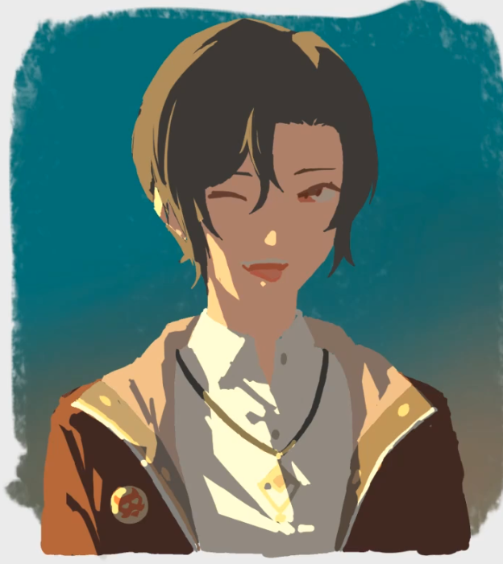

4.去掉线稿，但是画出死角

死角的颜色不一定是纯黑，只要是画面中最深的颜色就行，可以根据周围的固有色改变

为什么黑线稿会破坏光影关系？因为画面中最黑的一般是死角，死角定义了最深的地方，但是若存在线稿，最深的地方反而是线稿，死角看不出来，不会符合现实逻辑，导致画面很突兀

以上几种选择可以创造出不同风格的底图，导致最终成形的画面存在画风区别

#### 光系统亮面处理

光系统总结：暗多亮少、高曝光

缺点：亮面太大画出来不好看

如何利用画亮面大的立绘图？

* 方法一：转影系统，找明暗交界线
* 方法二：压暗后，用橡皮擦把大面积的亮面擦出来，然后去勾勒明暗交界线，最后在亮面作塑造

亮面藏色、混色的做法

* 画高光，高光色块使用其他颜色
* 大面积地方就使用压感笔刷抹一把，与第四讲的做法一样

或者直接不藏色，直接画出来，像画线稿一样，使用其他色彩勾勒一下

如果直射光不是白色，而是黄色、蓝色其他颜色怎么办？

那就把亮面使用直射光的颜色调整一下

## 第六讲

空气

远处场景的处理

水彩画家：约瑟夫

随机形状在电绘时是很难绘画出来的

# 构成

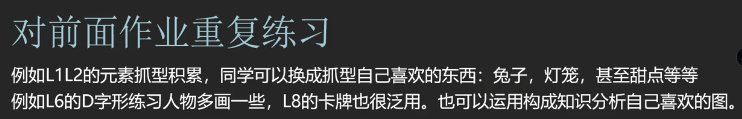

## 第一讲

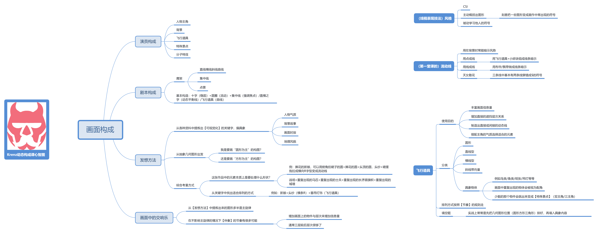

构成是由对比产生的

打型、抓型、轮廓、

用笔方式CSI

速写、动态线、

### 流动的线

流畅的线=容易辨识=动态=风

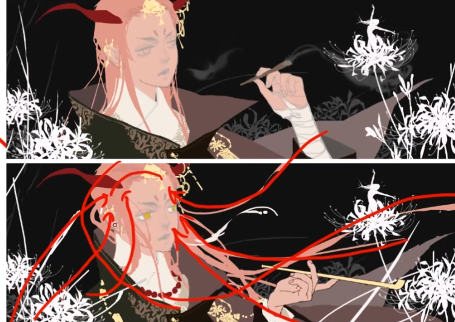

画面中具有明显趋势的线，会让画面变得流畅，感觉画面中有“风”的存在

这也就是人体动态好看的原理

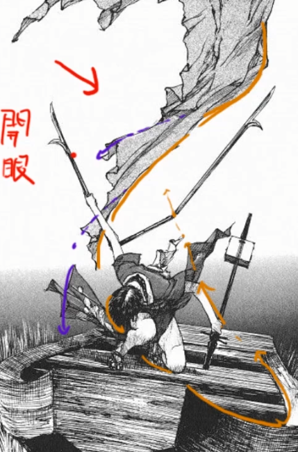

流动的线条还可以通过光影来暗示

### 完形理论（重要）

看到具有趋势的线条，不完全连贯的曲线，人脑会自动补全形状

和色彩中的理论是一样的

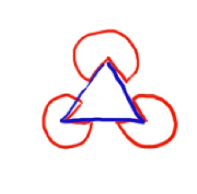

这样的线条使用会使得画面变得有趣

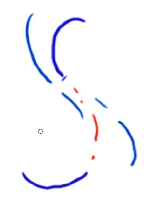

人脑会有以下几种猜想

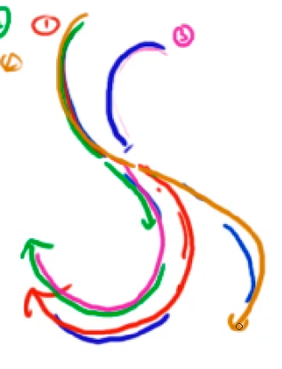

绘制人物时，衣服边缘的轮廓并不是靠实际画出许多微小的起伏实现的，实际的线条其实是CSI那种流畅的线条

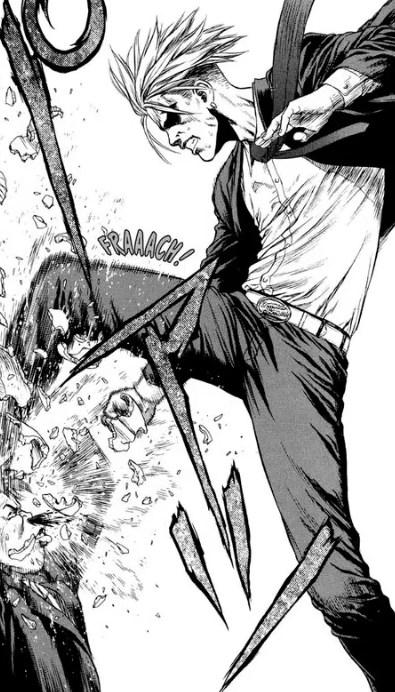

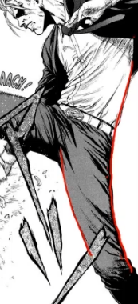

### 流动线条的辨认

辨认出画面的动态线、流动线条，就能看出画面的趋势

画面的节奏

### 流动线的形成方法

主趋势：最明显的第一条线，主干的线段

其他线段就围绕着主线干，形成类似于$的符号

#### 重复物体摆放

人眼会将相似的物体归类为一组，设计好重复物件的摆放可以表现流动线

重复物件要摆得好看，要高低起伏，有错落

* 物体体积变化有大有小
  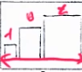
* 大中小不按顺序
  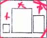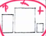
* 上下错落
  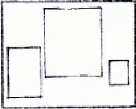
* 前后重叠
  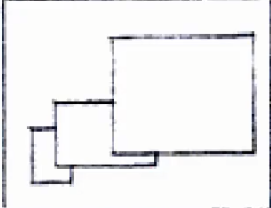
* 有疏有密

如图中的花瓶、座椅、植物都是存在着明显的趋势

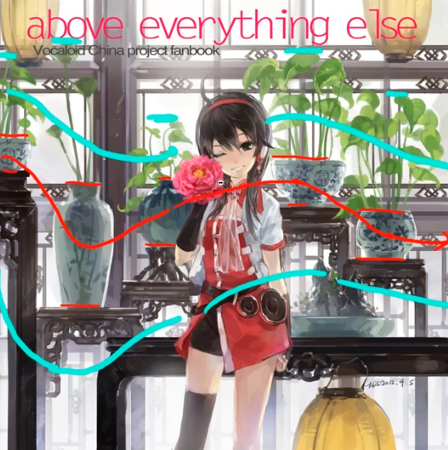

#### 飞行道具（重点）

画面中能够浮在空中的都是飞行道具

图中的鸽子就构成了流动线
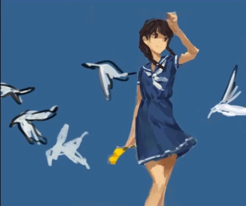

任何物体都能够看出几条动态线

只要可以表现动态，任何东西都可以是飞行道具（哪怕是青蛙）

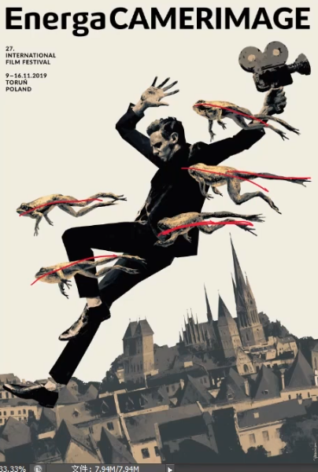

还有水流

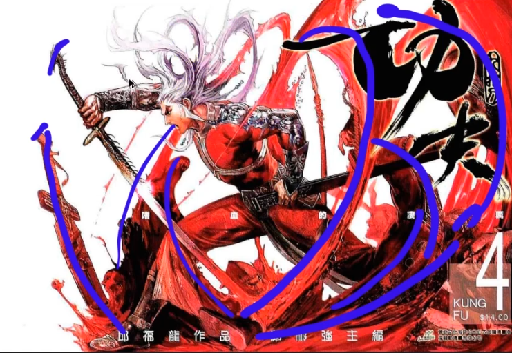

##### 飞行道具的研究方法

要画一个物体，我们找到了参考后，如果只是像抓型一样纯临摹物品，你还是不会画这个物体
要如何通过分析参考，学会画一个物体

比例分析：研究一个物体时，先去分析它的比例关系，只是简单的测量

拆解部件：用CSI切出物体的部件形状，然后重新组合这些部件，就能画出不同角度的物体

观察拆解→CSI切形→重新组合、透视转角度

核心在于CSI线条提取出物体的简化形状，并且记住形状，大脑要记住的是CSI提取后的部件形状，相当于在脑子里构建一个图形过滤器

例如下图漫画就是画一条金鱼的流程

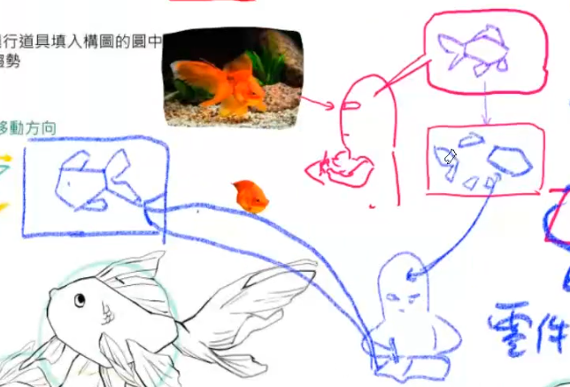

重新画出的物体不好看无所谓，重点在于大型要准确，几何形状要准确

图形要细化会有很多的技巧和手段，但是基本图形不好看，地基没打好，要细化会很麻烦

##### 飞行道具丰富画面讯息

单纯画出立绘后，只有人物立绘会很单调，这个时候就可以想着摆几个飞行道具

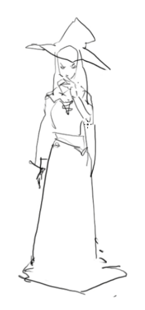

如果想不出画什么，就先用几个球体按重复物体摆放规则，规划一下画面

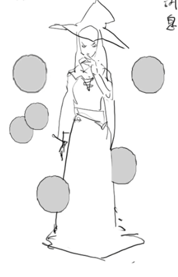

然后想想什么元素的物体适合画面，把球体填充为各种物体

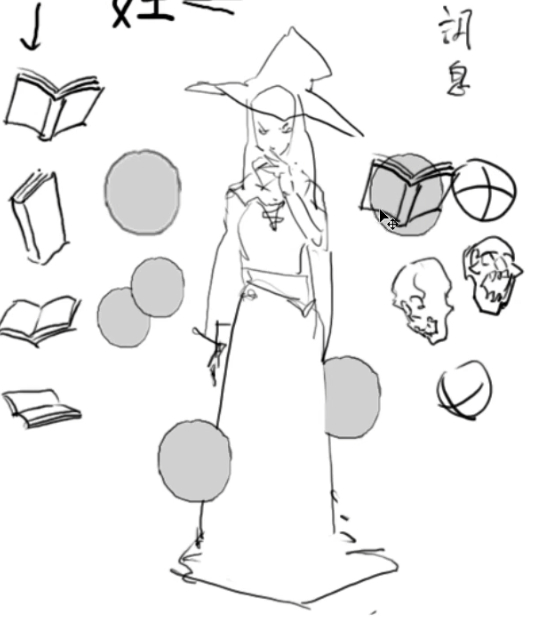

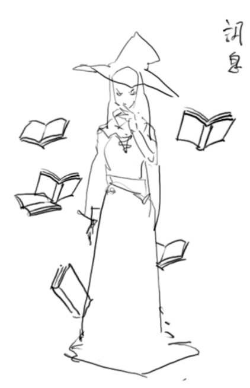

这样的做法让画面多出很多动感，因为物品的摆放本身就给画面带入了几条动态线

而且物品本身具有的线条也能够增加细节

### 用动态线表达画面（练习人体的思路）

先找到基本动态线，这样就知道画面中每个物体的趋势

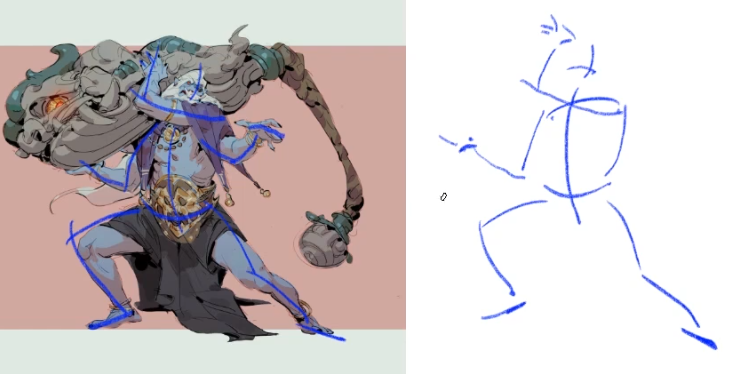

然后根据趋势，在脑海中的零件库中找到对应的趋势、方向的零件，就很自然地融入动态线了

（如何建立零件库→CSI拆解物体→透视l7的16格方块练习）

图中就可以画出动态线对应的小腿块

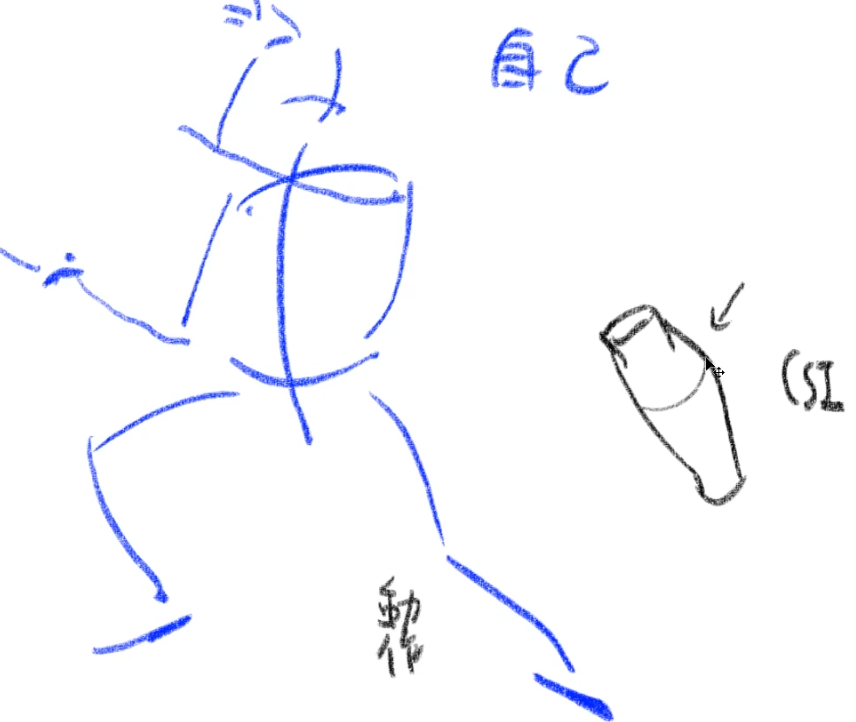

这个小腿块就很自然地贴入动态线里

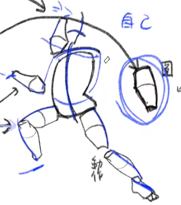

### 鱼尾巴的动态

l1作业中鱼尾的动态线，会在很多地方见到

包括头发、衣服褶皱的趋势和鱼尾巴是一套的，都是s形线段缠绕的样子

### 线稿图形的质量提升方法

#### 描边勾勒外轮廓

就是在抓型训练营里的那个方法

暂时不要考虑使用光影、负型画线稿的方法

#### 画面细节分层次

不同粗细的线条能够勾勒出画面的层次

这也是为什么勾勒外轮廓能够提升画面质量，因为勾勒完一遍外轮廓后，外轮廓会比内部线条粗，自动分出层级

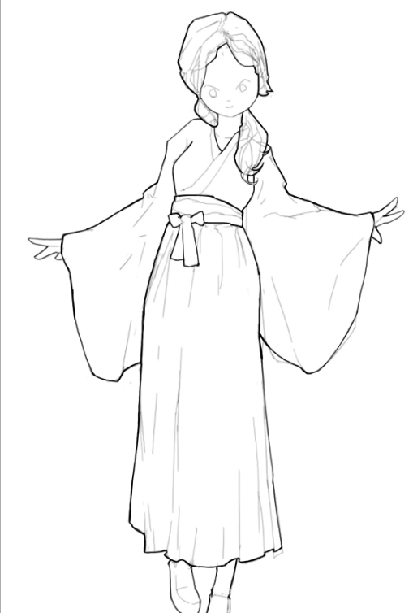

内部细节其实不是大家想的符合透视结构的，不是每一条衣服褶皱都符合实际，只是它的处理、画法使得皱褶像真实皱褶

外轮廓的的处理都是光滑的，细小的转折都是后期才加入的

重点是如何概括人体的轮廓，内部细节现在还不重要，CSI整理出的简单线条是不会区分出画风的

内部细节的画法在l3的笔记中

## 第二讲

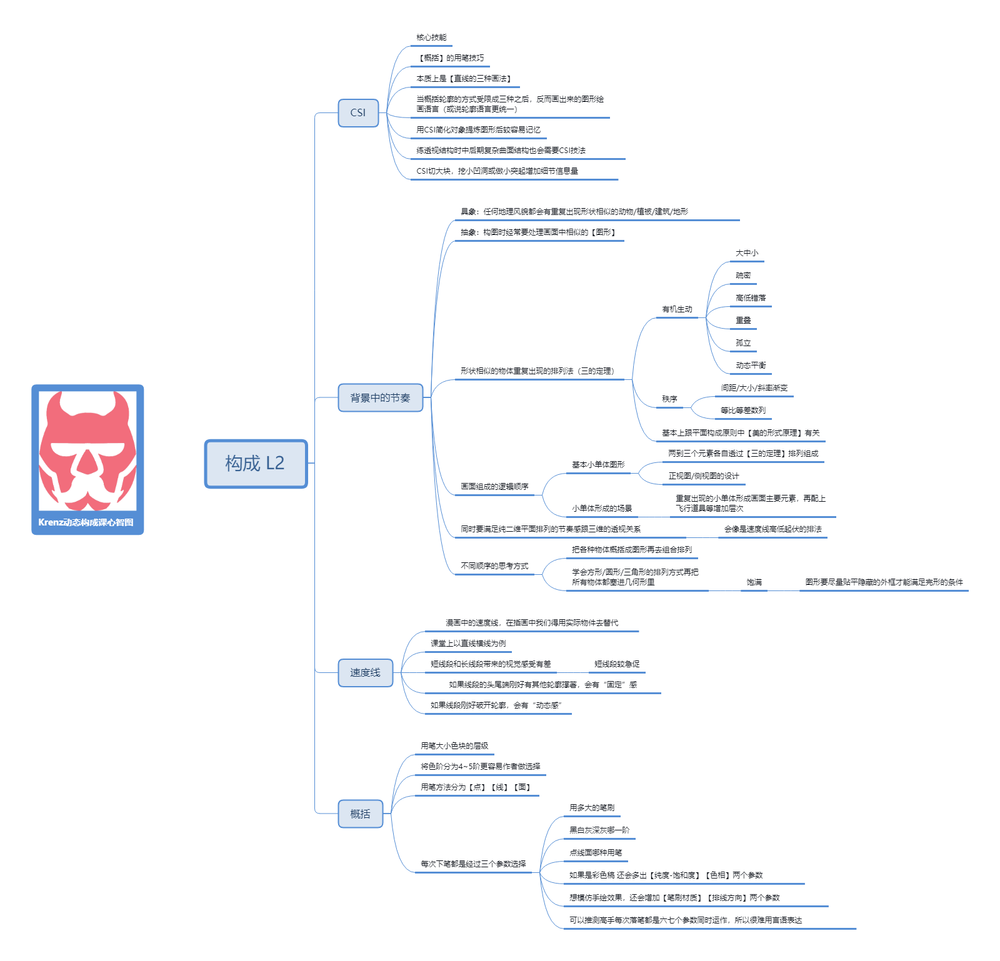

层级：线的层级、三的定理、研究方法（临摹到图形化）

### 型的层级

一级型、二级型、三级型形

抓型训练里的那一套概念

一级型就是物体的轮廓，没有太大的凹凸起伏

二级型就是物体的组成部分

三级型就是细节形状，小饰品、小阴影、物体表面的凹凸起伏、褶皱这些都是三级型

增加三级型会导致讯息量增加，画面更丰富

画面讯息不是越多越好，存在讯息量过载的情况

人一眼会先看平整、平滑的图形，图形需要“整而丰富”，要有一定细节，也要有干净、平滑的轮廓

### 由外向内的画法（CSI的研究方法）

基本思路就是先画出整体的轮廓大型，然后做出二级型，再做出三级型

使用CSI线条将物体图形化

流程如图

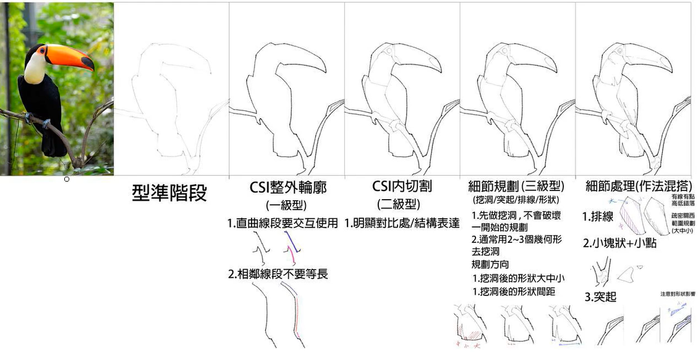

这个流程要记好，最好成为肌肉记忆

画面细节取决于画面中用笔的最小笔触

#### 闭塞、死角

色彩中的概念是一样，这里主要讨论在线稿中的用法、塑造方法

要注意死角闭塞只是阴影里的一部分，阴影里有闭塞死角、背光区，要区分好概念边界

平时练习时要注意观察死角在哪些位置，积累一些练习量之后，才能慢慢地能在线稿中画出死角（两三个月）

### 主角、造型物、稀有道具

画面中最突出的物品、人物，按游戏概念来讲，画面中所有物体都是道具，那么最突出的几个物品就是稀有道具、传说道具、ssr这样的感觉

一般画面会设置3-5个物品

可以设置在画面的左上方和右下方，放在画面中的对称位置，这样怎么切分都很有看点

### 工具：ps描边功能

ps图层效果中有有一个描边的效果

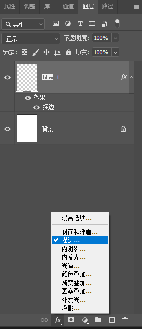

开启这个功能后，每一笔都会使得图形边被描黑

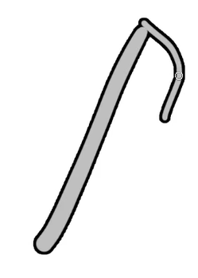

### 背景中的节奏

之前是使用圆圈来暗示流动线，圆圈代表重复出现的物件，也就是使用流动线处理重复出现的物体，摆放好重复物体

背景中的线条、光是可以使用完形理论和动态线形成节奏的

原图

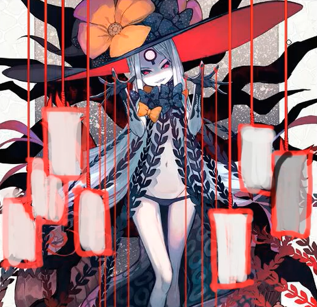

按流动的规律添加一些光在线上，注意观察上方的红线与原图的区别

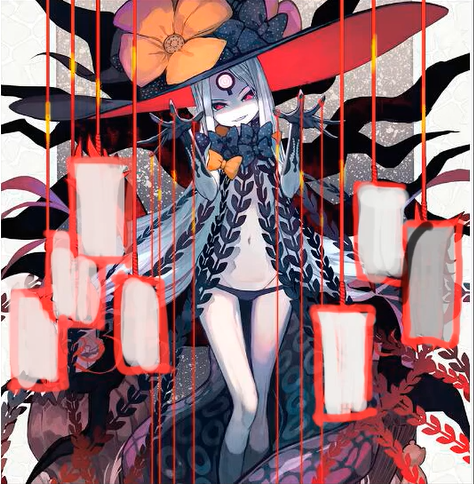

添加花瓣、树枝、衣物等物体按规律遮挡

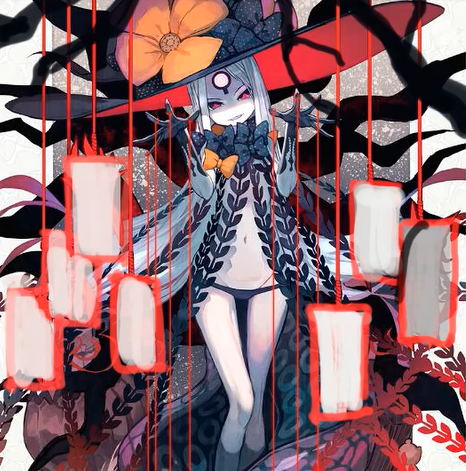

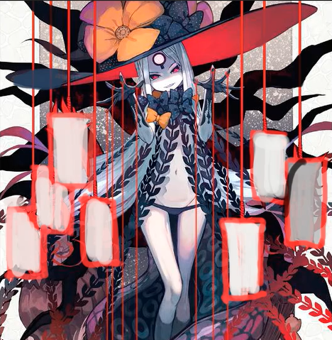

各种处理都是为了让重复物体形成一定的节奏

许多大佬的图中都会存在这样的处理，尤其是建筑中，大多图中都画了很多重复的物体，但是大佬都有着各自的处理方式，知道这个想法后，以后看图要注意分析大佬们的处理方式

注意重复物体的摆放、配角（次要物体）与主角（主要物体）的关系

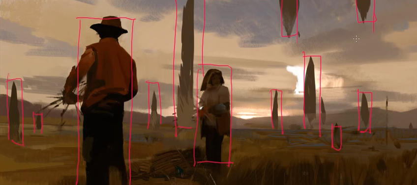

这其实可以融入一些透视的关系在里面，也是一种透视概念的体现

而且画图时，先摆好大大小的圆圈、曲线，然后再填充物体会简单很多

### 概括（色彩速写方法）

看别人做速写时，他们是如何归纳概括看到的图片呢？

重点在于步骤清晰，在画的时候就确定好构成图片所需笔触的边界

用笔就是C、S、I三种

笔刷大小有点、线、面三种

画面物体内容用5种灰度色块填充

把图片缩小，归纳好图片中的色块，然后由大画到小，每画一部分画面的物体都考虑好画这个物体用哪种大小的笔刷、用哪种用笔方法、用哪个灰度颜色来概括

就用笔三种选择，笔刷大小三种选择，画面色块5种选择，每次下笔有3x3x5种选择，只要找到对的那种就好，缩小选择范围会减少我们的思考量

## 第三讲

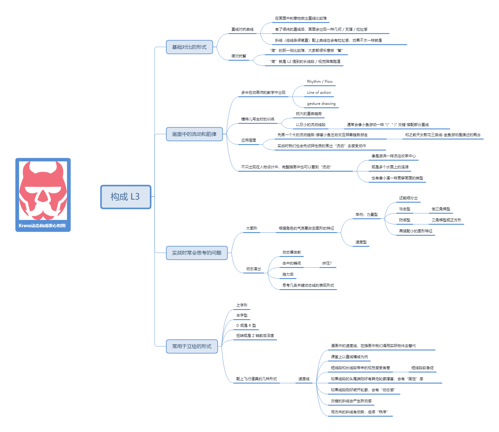

## 人体

### 日系五官

脸部特征概括:三庭五眼

（发际线到眉弓骨，眼睛到鼻子，鼻子到下巴这"三庭"距离大致相等，两眼及两眼之间加上眼睛左右到脸两侧宽度大致为"五个眼睛"的长度）

调控比例需要注意:

1. 脸型（脸蛋的形状）:"转折"在嘴巴处，鼻子可以高一点但不能太矮，大概在下庭的二分之一处，脑袋上半部分比下半部分要
2. 眼距，眼型
3. 中线位置（眼睛位置）

二次元头骨比较大，从眼睛部位画一条中线，发顶到中线距离会比中线到下巴的距离长

一个样例

### 角色表情

2024年1月29日 19:34

常见的表情有喜怒哀乐等，

表情能塑造出角色特有的气质，包括常说高冷、开朗活泼等形象特点可以在绘画时想一下，如果自己是这种表情，该是什么样子的

"公式"表情:头偏左，眼睛看镜头

眼睛看向上下左右等不同的方向都会造成表情的改变

### 头发

头型画的好头发就能画好，头发是在头型的基础上添加的头发不是直的，是贴着脑袋生长的，是弯的

头发片不能过于平均

完美的头发片是顺滑的

画头发要用加法，先画大片，再加细节

先画大块的头发进行分组，然后再细化，理清结构层次，哪一片在前面，哪一片在后面

人体比例及体块

2024年1月30日 20:52

头身比是一个相对的概念，

一般二次元正常头身比是7\~8个头身先学会一种比例，之后再慢慢扩充

二次元手会短一些，轮廓会和现实中的不一样，脖子长0.5个头，胸腔1.5个头，宽2个头，胸腔底部到盆骨大概

0.5个头

手肘在腰的那里，确定手肘就能得到上臂的长度，下臂长度与上臂相同，手掌大概0.5个头长大腿大概2个头左右，小腿比大腿稍微短一些，脚宁愿画小一些也不要画得太大

体块（直接记忆）

男性线条更为硬朗，直线条会用得多，女性更为柔和，造型会更圆一些

女 男

人体需要特别高的熟练度才能画好

肌肉结构

一.脖子

斜方肌

骨架

正面

侧面

背面

> 女性肩部不能太突，不然会比较难看

> 造型大概为方形加三角形的样子
>
> 
>
> 二.肩部
>
> 
>
> 三.手臂正面 侧面
>
> 背面
>
> 
>
> 四、胸腔、腹肌、肋骨
>
> 五、臀部、腿部
>
> 穿插关系很重要
>
> 可以把臀部看作腿部一个大号的三角肌
>
> 
>
> 

> 前期练习就照着图片把肌肉机构描出来，熟练后再进行默写
>
> 

六、手部（动作太多，比较复杂）

先画扁的体块，再将手指切出来，手指关节不要明显

指甲盖没必要画

要画的话，指甲盖不要太明显男性指甲

女性指甲

速写（人体动态）

速写：较短时间内，以简洁、快速的方式捕捉主题的形态、结构和特征的绘画作品。两种手法

1.（蹭线）：偏向打形

2.偏向表达（前期不好画，但是快，人体熟练后可以偏向这种）

造型偏向：

1. 方、硬

2. 圆、弧

> 
>
> （不用刻意去营造这种偏向，哪种舒服画哪种）
>
> 
> 动态：先学会简单角度的动态（仰视俯视、侧面这种）人体正常体态（侧）
>
> 注意正常站姿下人体胸腔部分都是倾斜的，并非直线
>
> 
>
> 
>
> 正常站姿下的腿部

> 正面小腿部分会有向外拐的趋势
>
> 
>
> 背后视角
>
> 
>
> 张开腿时，现实中外拐趋势不会这么夸张

> 体态正确，人就能站稳（关系到重心的问题，可以从视觉上直接判断）观察时，如果觉得角色站不稳，有歪倒趋势，说明重心是歪的
>
> 
>
> 重心歪了，进行姿态调整时，可以想象歪倒的方向，然后想想如果这样倒下去正常人会做出什么姿态来维持平衡，以此调整姿态（受力分析会很游泳）

> 支撑物可以创造出更多的动作
>
> 
>
> 以上这些仅考虑在地面上的姿态如果是在空中，姿态会更加自由

> 有变化才好看，塑造造型时太过对称会不好看，比如腿部两腿都是直的、同一角度就不好看，
>
> 
>
> 

### 日系色彩

> 2024年7月17日 13:51
>
> （先把素描练好再来去研究各种色彩技法，混色、渐变、藏色、彩虹等等这些，不会配色可以直接用黑白灰，除了皮肤，都用黑白灰）
>
> 一、色彩基础色相
>
> 明度
>
> 饱和度（鲜艳度、纯度、浓度）色彩感受：轻、重、冷、暖
>
> 色感：培养色感需要在日常生活中观察
>
> 对比：多个颜色放一起，它看起来冷那就是冷色，看起来暖那就是暖色色彩不能极端，饱和度不要太高

> 二、暗部色（素描）
>
> 暗部尽量要统一，往冷色偏，就大部分是冷的，往暖色偏，就大部分是暖的
>
> 灰色可以用来调和
>
> 很多颜色都是画的过程中堆叠随机画出来的，觉得不错就保留下来
>
> 三、色彩配比固有色区分 亮暗区分
>
> 色相区分
>
> 主色调明确（主色调占很大比例，主色不一定是一种颜色，也可以是多种颜色）主色控制在三种色系（浅红、暗红都属于一种色系）以内
>
> 某些物质、材质必须要用固定配色（如金属、皮革），特殊材质不能乱用色彩
>
> 二分画法
>
> 2024年7月18日 14:14
>
> 通过概括达到立体效果，明暗面加上阴影

> 对结构的理解决定阴影画得准不准确

> 二分作用：

1. 用于塑造（二分作为作画过程的一个环节）

> 
>
> 塑造是指利用阴影（暗部）增加细节表达、增加材质质感

有塑造

2. 用于表达（结果）

> 学会找光源，解剖明暗关系
>
> 看整体，不要看细节
>
> 
>
> 正侧光是最容易理解的光影，先学会画正侧光再去学其他角度的光
>
> 暗部不是沿着线画的，而是去涂一个面，不要总是哪里有线就在哪里画阴影，先画大块的阴影，小部分的阴影是后期塑造的时候再来画的，大块阴影是按结构来找的，重点是结构
>
> 错误示范（衣服褶皱）

有塑造

顶光

> 
>
> 错误示范（头像）

> 练习，每一次练完一个东西的线稿，那就接着把它的二分画出来

# ps常用快捷键

> 2024年1月12日 15:48
>
> 笔：B
>
> 橡皮擦：E裁剪：C套索：L
>
> 新建图层：Ctrl+shift+N图层合并：Ctrl+E
>
> 撤回：Ctrl+Z或Ctrl+Alt+Z抓取：空格
>
> 自由变换：Ctrl+T
>
> 按shift可以画出标准直线
>
> 分区 入门 的第 35 页
>
> 头发的画法
>
> 2023年12月3日 19:03
>
> 一、动态线画法
>
> 确定动态线（头发走势）------\>头发分组（画叶片）

> 走势
>
> 二、分组画法
>
> 
>
> 
> 
>
> 
>
> 

> 增加细节
>
> 

# 色彩基础知识

> 2024年3月1日 16:31
>
> 色相（Hue）：可以理解为我们平常所说的"颜色"
>
> 饱和度（Saturation，明度）：指强度，能决定色彩的鲜艳程度
>
> 色值（Value，纯度）：颜色深浅色环
>
> 暖色：色环上红橙黄一边的颜色会给人热烈、兴奋的感觉冷色：以蓝色为主导的，绿色紫色等，
>
> 相似色搭配：用色环上相邻的颜色搭配
>
> 
>
> 互补色搭配：用色环上相对的颜色搭配
>
> 
>
> 分裂互补配色：用相对颜色的两侧颜色搭配
>
> 三元配色：在色环上选取的颜色呈标准的三角形

> 四元配色：在色环上选举的颜色呈矩形
>
> 
>
> 配色平衡法则：
>
> 1.深浅平衡：利用明度变化
>
> 

> 冷暖平衡：
>
> 画面太冷太暖都会引起不适，过于冰冷的画面可以加入一些暖色点缀，以此平衡画面
>
> 
>
> 互补色平衡：对比明显，突出画面
>
> 
>
> 色彩大小平衡（面积平衡）：可以用于突出主体
>
> 
>
> 有无彩色平衡：彩色指色环上的颜色，无彩色只黑白灰无彩色会看起来很无聊，有彩色会让画面比较鲜活
>
> 无彩色 有彩色
>
> 
>
> 二者结合
>
> 
>
> 花色纯色平衡：花色指有多种颜色组合的模块或者多种图案的部分，就是一个画面不能太花，要有纯色部分
>
> 
>
> 一些配色原则：

1. 如果整幅画面颜色太扎眼了，可以选其中一种颜色降低饱和度
2. 不要过多的使用大量色彩，要保证整幅画面具有可读性，简单易懂
3. 中性颜色（白色，黑色，灰色）可以帮助平衡画面
4. 明亮色彩能带来温馨感和现代感
5. 低饱和度颜色更适合用于商业场合
6. 看从广告，商业产品，绘画作品中学习色彩搭配，还不会就直接上配色网站

# 个人配色积累

> 2024年7月17日 15:55
