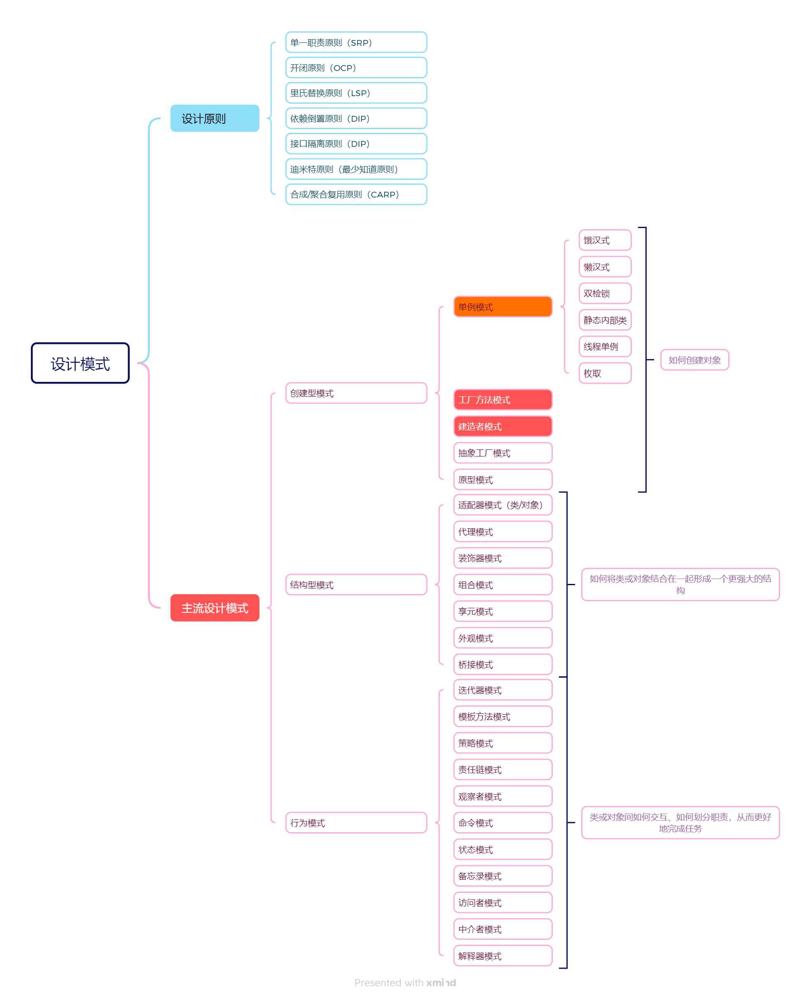
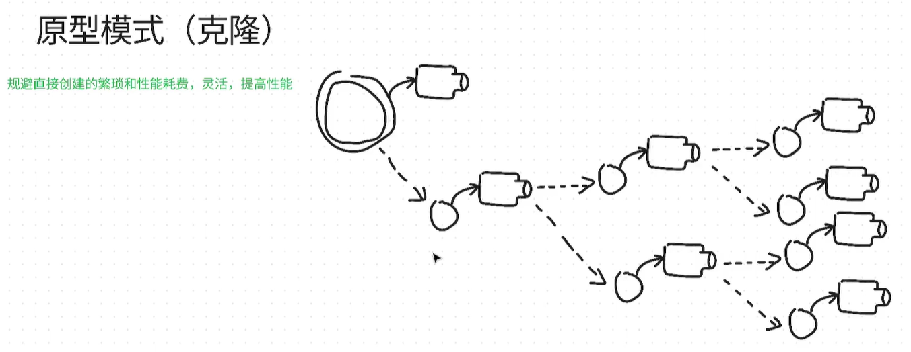
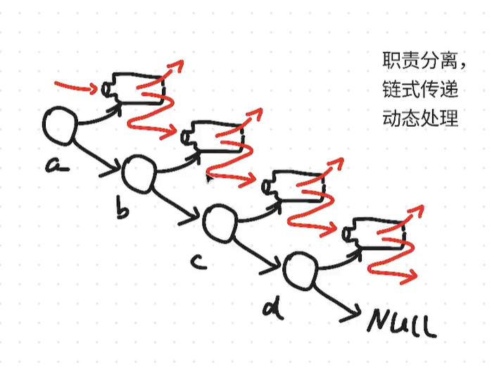
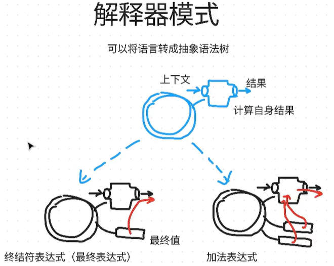
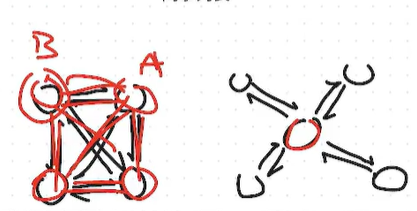

# 设计模式

设计模式就是设计程序时，针对各类问题通用的解决方案，是无数程序员实践总结的编程方法

学设计模式的目的就三个：

* 让代码便于维护和后续开发，避免堆史山
* 扩展写代码的思路
* 和其他人合作时，能够使用术语快速沟通

## 设计原则（7条）

### 单一职责原则（SRP）

一个类只负责一项职责（功能），不要让一个类承担过多的责任。

### 开闭原则（OCP）

软件实体（类、模块、函数等）应该对扩展开放，对修改关闭。

### 里氏替换原则（LSP）

子类对象能够替换父类对象，并且程序功能不受影响。

### 依赖倒置原则（DIP）

高层模块不应该依赖低层模块，二者都应该依赖其抽象；抽象不应该依赖细节，细节应该依赖抽象。

### 接口隔离原则（DIP）

不应该强迫客户依赖它们不使用的接口。即一个接口应该只包含客户需要的方法。

### 迪米特原则（最少知道原则）

一个对象应该对其他对象有尽可能少的了解。

### 合成/聚合复用原则（CARP）

优先使用对象组合（has-a）而不是类继承（is-a）来实现代码复用。

## 设计模式（23种）

### 创建型模式

去分析我们如何获取对象和创建对象，获取和创建的过程如何优化

#### 单例模式

确保一个类只有一个实例，而且自行实例化并向整个系统提供整个实例

如何确保一个类只有一个实例？

* 构造方法不能公开, 不能被外界实例化，必须使用 private修饰
* 这个实例是当前类的类成员变量 用static修饰

向整个系统提供这个实例

* 使用方法向外界提供这个实例

实现

懒汉式：当需要这个实例（类）的时候才会去加载

饿汉式：程序一开始就加载这个实例

适用场景（只需要创建一次的类）

* 配置类
* 日志类
* 管理类
* 共享资源类

#### 工厂方法

“定义一个用于创建对象的接口，让子类决定实例化哪一个类。Factory Method使一个类的实例化延迟到其子类”

实现方式有两种

* 直接在类里写一个创建实例的方法
* 单独写一个工厂类，这个类的所有方法都是为了去创建另外一个类的实例

比如一个塔防游戏，玩家创建了一个炮塔，就是调用工厂方法，通过输入参数的不同，创建不同的实例，例如1就是远程防御塔，2就是近战防御塔这样子

#### 抽象工厂模式

“提供一个创建一系列相关或相互依赖对象的接口，而无需指定它们具体的类。”

二级工厂就是抽象工厂，也就是生产工厂的工厂

比如说，我们需要的是一个零件，零件需要使用机床，那么我们就造一个机床厂，先生产机床，然后机床去生产零件

#### 原型模式

“用原型实例指定创建对象的种类，并且通过拷贝这些原型创建新的对象”

其实就是复制粘贴，创建出一个对象之后，克隆这个对象来生成更多的对象

#### 构造者模式/生成器模式/建造者模式

“将一个复杂对象的构建与它的表示分离，使得同样的构建过程可以创建不同的表示”

分布创建对象，比如要构造一个敌人，先创建血量、攻击力这些基本属性，再创建他的技能

然后一开始创建时就可以给每个部分输入参数，如果没有参数输入，就使用默认值

### 结构型模式

分析对象与对象之间的结构关系，优化这些结构

结构型模式采用继承机制来组合接口或实现

#### 适配器模式

将一个类的接口转换为客户希望的另一个接口，使得原本因接口不兼容而无法共同工作的类，可以一起工作

类比的话就是我们生活中常用的转接头，例如我有一个type-c接口，但是我的插座只有usb的，那么我拿来一个接口转接头就是可以将type-c转换为usb插头，然后插入到usb中

这个转接头就是适配器

##### 类适配器

类1的过去版本代码所使用的，现在已经有了类2，而且以后的版本都将使用类2

那么就需要创建一个能够继承类1，又具有类2部分特性的类2-1来兼容以前的类1，

类2-1的类2的区别就是，它专门针对类1的东西进行了不兼容属性的优化处理，比如类1没有运动这个属性，类2有，其他属性两者一致，那么类2-1除了运动功能会特别处理以外，其他的运行方式和类2一样

##### 对象适配器

实现就是在创建新的一个对象时，要将旧对象传进去

一般来说新对象创建时是没有其他东西的，但是通过传入旧对象创建出来的新对象，是具有一个指向旧对象内容的东西的

#### 桥接模式

“将抽象部分与它的实现部分分离，使得它们都可以独立地变化”

也可以类比为一个游戏玩家拿着一个武器，玩家是一个类，武器是一个类，玩家攻击就是去调用武器的攻击方法，玩家和武器两个类之间存在桥接

#### 组合模式

“将对象组合成树形结构以表示‘部分-整体’的层次结构”

类似树这种数据结构，玩家是一个节点，武器是这个节点的子节点，然后武器这个子节点还有很多个子节点，代表这个武器的组件，这些节点都是类实现的，通过组合不同的武器组件类，玩家就可以diy自己的武器了

#### 装饰器模式

“动态地给一个对象添加一些额外的职责 ”

与python里的@符号作用相似，而且和适配器模式很像

比如要为攻击方法增加一些效果，那么就会新建一个类，这个类与先前的类区别在于攻击这个方法增加了一些对象

如果是适配器模式的话，攻击方法的整个代码都会更改，但是装饰器不会

**可以在一定程度是避免继承的滥用问题**

#### 外观模式

“为子系统的一组接口提供一个一致的界面，Facade模式定义了一个高层接口，这个接口使得这一子系统更任意使用”

现在已经有很多个类之间了，它们之间存在复杂的调用关系，或者说它们耦合在了一起，没法单独控制，写一个封装，不用管它们之间的任何关系，直接用这一层封装来控制它们

#### 享元模式

“运用共享技术有效地支持大量细粒度的对象”

假设你在开发一个文字处理软件，每次显示一个字母都新建一个对象，如果有成千上万个字母，内存消耗会很大。其实，字母的形状是有限的（比如只有26个英文字母），可以让相同的字母对象被多个地方共享，这样就大大减少了对象的数量。

* 关键点
  内部状态：可以被共享的、不随环境变化的数据（如字母的形状）。
* 外部状态：不能被共享、依赖具体场景的数据（如字母在页面上的位置、颜色等）。
* 享元模式通过工厂来管理和复用这些共享对象。

#### 代理模式

“为其他对象提供一种代理以控制这个对象的访问”

你想访问一个对象，但不直接操作它，而是通过一个“代理”来间接访问。代理可以在访问目标对象前后做一些额外的事情，比如权限校验、延迟加载、日志记录等。

代理模式和装饰模式很相似，但代理一般是为了保护限制的功能，而装饰模式是为了能够动态实现某些功

### 行为模式

对象会被用在不同的场景和用途，分析在这些场景和用途下，如何优化

#### 责任链模式

“使得多个对象都有机会处理请求，从而避免请求的发送者和接收者之间的耦合关系。将这些对象连成一条链，并沿着这条链传递该请求，直到一个对象处理它为止。”

职责分离、链式传递、动态处理

就像在公司请假，先找组长批，如果组长批不了就往上找经理，经理批不了再找总监……每个人都可以选择处理请求或把请求传递给下一个人。

放到代码中，我们有处理网络问题的类、处理存储问题的类、处理字符串的类等等，它们的实现职责的方法是通过某种方式连接在一起的，比如现在的责任链就是“先处理网络传输→处理字符串→处理存储”，要完成处理字符串这个任务，会先进到处理网络传输的类中，它处理不了就传递给下一个类，而下一个类刚好能够处理字符串，这样就完成这个任务了

#### 命令模式

 “将请求封装为一个对象，从而使你可用不同的请求对客户进行参数化；对请求排队或记录请求日志，以及支持可撤销的操作”

命令模式就像“遥控器”——你按下按钮（命令），遥控器把这个操作封装起来，具体怎么执行由遥控器背后的设备决定。这样，发出命令的人和执行命令的人解耦了。

#### 解释器模式

“给定一个语言，定义它的文法的一种表示，并定义一个解释器，这个解释器使用该表示来解释语言中的句子”

#### 迭代器模式

“提供一种方法顺序访问一个聚合对象中各个元素，而又不需要暴漏该对象的内部表示”

这种模式广泛运用在各种编程语言里

通俗理解
就像用遥控器一下一下地切换电视频道，不需要知道电视机内部是怎么实现的。迭代器就像这个遥控器，帮你一步步访问集合中的每个元素。

主要优点

* 统一遍历接口，使用者不用关心集合内部实现。
* 支持多种遍历方式（正序、逆序等）。
* 解耦了集合对象和遍历逻辑。

#### 中介者模式

“用一个中介对象来封装一系列的对象交互。中介者使各对象不需要显式地相互引用，从而使其耦合松散，而且可以独立地改变它们之间的交互”

有点像交换机、路由器一类的设备，多台计算机之间通信，不是直接让计算机相连，而是所有计算机都连接到路由器，由路由器去帮它向其他计算机通信

中间的这个节点就是中介者

中介者模式既有一对多的关系，也有一对一、多对一、多对多的关系

#### 备忘录模式

“在不破坏封装性的前提下， 捕获一个对象的内部状态，并在该对象之外保存这个状态。这样以后就可以将该对象恢复到原先保存的状态”

保存的状态就类似于一个快照、游戏存档，需要回溯时就调用相应的存档、快照

备忘录的保存通常使用栈结构来实现

* 撤销操作通常是“后进先出”（LIFO）的：最近保存的状态要最先恢复。
* 用栈来保存每一次的备忘录，每次撤销时弹出栈顶的备忘录即可恢复到上一个状态。这样可以支持多次撤销（多步回退）。

#### 观察者模式

“定义对象间的一种一对多的依赖关系，当一个对象的状态发生改变时，所有依赖于它的对象都得到通知并被自动更新”

就像你关注了某个微信公众号（被观察者），每当公众号有新消息时，所有关注它的用户（观察者）都会收到推送。

只要被观察的对象改变了状态，那么所有观察者都会作出相应行为

#### 状态模式

“允许一个对象在其内部状态改变时改变它的行为。对象看起来似乎修改了它的类”

其实就是状态机编程，状态模式就是状态机在面向对象编程的实现。把每一种状态成一个类，设定一些逻辑来切换状态

#### 策略模式

“定义一系列的算法，把它们一个个封装起来，并且使它们可相互替换。本模式使得算法可独立于它的客户而变化”

比如出行可以选择“骑车”、“打车”、“坐地铁”，每种方式就是一种策略。你只需要告诉出行工具用哪种方式，具体怎么实现不用关心，可以随时切换。

由外部决定内部的切换

#### 模板方法模式

 “定义一个操作中的算法的骨架，而将一些步骤延迟到子类中。模板方法使得子类可以不改变一个算法的结构即可重定义该算法的某些特定步骤”

比如做饭的流程是：准备食材 → 烹饪 → 装盘。这个流程是固定的，但每道菜的具体做法不同。

父类就是做菜的流程，而子类对应做饭的每一个步骤。

#### 访问者模式

“表示一个作用于某对象结构中的各元素的操作，它使你可以在不改变各元素的类的前提下定义作用于这些元素的新操作。”

比如有一组不同类型的员工，要对他们做不同的考核、发奖金等操作。与其在每个员工类里加方法，不如把这些操作封装到“访问者”里，每个访问者负责一种操作，员工只需要接受访问者即可。

## UML

已经快淘汰了，没必要学
